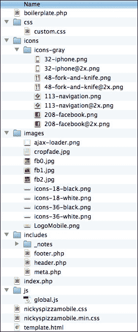
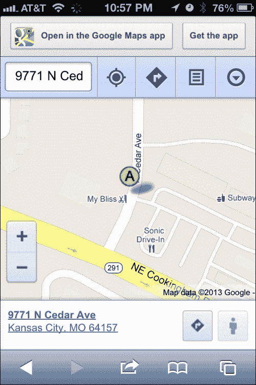
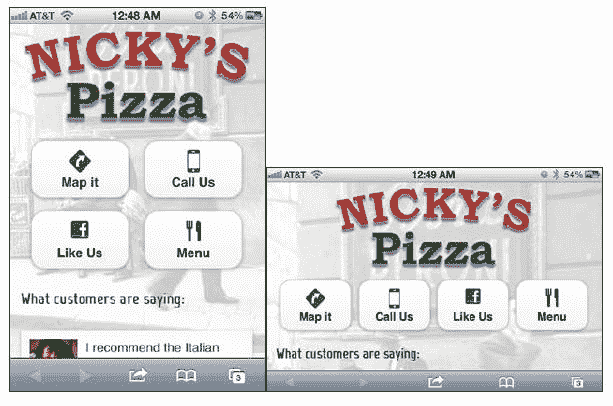

# 二、jQuery Mobile 网站

上一章给了我们一些关于纸张原型的宝贵经验，并为我们的开发奠定了坚实的基础。现在，我们将把这些图纸转化为一个实际的 jQuery Mobile（jQM）站点，该站点响应性强，看起来很独特。

在本章中，我们将介绍：

*   一个新的 jQuery 移动模板
*   思考完整站点链接的新方法
*   将样板分解为可配置的服务器端 PHP 模板
*   使用备用图标集
*   自定义字体
*   仅使用 CSS 的页面卷曲效果
*   性能优化提示
*   移动检测和重定向技术

# 一个新的 jQuery 移动模板

jQuery 移动文档有很多隐藏的宝石。它们是一个很好的起点，但实际上有几种方法可以实现基本模板。有单页模板、多页模板、全局配置模板和动态生成的页面。

因此，让我们从一个新的 jQM 单页样板开始，该样板基于原始单页模板（[http://view.jquerymobile.com/1.3.0/docs/widgets/pages/](http:// http://view.jquerymobile.com/1.3.0/docs/widgets/pages/) ）。当我们进入其他章节时，我们将对其进行改进，使其成为一个包罗万象的模板。以下是我们将为本章创建的基本目录结构以及我们将使用的文件：



现在，这里是基本的 HTML。让我们将其存储在`template.html`：中

### 提示

**下载示例代码**

您可以下载您在[账户购买的所有 Packt 书籍的示例代码文件 http://www.packtpub.com](http://www.packtpub.com) 。如果您在其他地方购买了本书，您可以访问[http://www.packtpub.com/support](http://www.packtpub.com/support) 并注册，将文件直接通过电子邮件发送给您。

```js
<!DOCTYPE html> 
<html>

<head>
    <meta charset="utf-8">
    <meta name="viewport" content="width=device-width, initial-scale=1, maximum-scale=1.0, user-scalable=no">
    <link rel="stylesheet" href="http://code.jquery.com/mobile/1.1.0/jquery.mobile-1.1.0.min.css" />
    <link rel="stylesheet" href="css/custom.css" />
    <script src="http://code.jquery.com/jquery-1.7.1.min.js"></script>
    <script src="js/custom-scripting.js"></script>
    <script src="http://code.jquery.com/mobile/1.1.0/jquery.mobile-1.1.0.min.js"></script>
    <title>Boilerplate</title> 
</head> 
<body>
    <div data-role="page">
        <div data-role="header">
            <h1>Boilerplate</h1>
        </div>
        <div data-role="content"> 
            <p>Page Body content</p>
        </div>
        <div data-role="footer">
            <h4>Footer content</h4>
        </div>
        <a href="{dynamic location}" class="fullSiteLink">View Full Site</a>
    </div>
</body>
</html>
```

## 元视区差异

`meta viewport`标签才是真正让手机……嗯……手机！如果没有它，移动浏览器将假定是一个桌面站点，所有内容都很小，需要收缩和缩放：

```js
<meta name="viewport" content="width=device-width, initial-scale=1, maximum-scale=1.0, user-scalable=no">
```

这个`meta viewport`标签的不同之处在于它实际上阻止了所有的挤压和缩放动作。为什么？因为，现在智能手机的掌握者不仅仅是了解这些事情的技术精英。我个人曾看到人们在尝试点击链接时意外放大。他们不知道自己做了什么，也不知道如何摆脱困境。无论如何，如果您使用 jQuery Mobile，您的用户无论如何都不需要缩放：

```js
<linkrel="stylesheet" href="css/custom.css" />
```

我们需要定制款式。这是没有办法的。即使我们使用 jQuery Mobile ThemeRoller（[http://jquerymobile.com/themeroller/](http://jquerymobile.com/themeroller/) ），总有一些事情需要重写。这就是你所说的：

```js
<script src="js/custom-scripting.js"></script>
```

最初在关于全局配置的章节（[中提到 http://jquerymobile.com/demos/1.1.0/docs/api/globalconfig.html](http://jquerymobile.com/demos/1.1.0/docs/api/globalconfig.html) ），这是您放置全局覆盖的地方，以及您可能想要运行或具有通用性的任何脚本：

```js
<a href="{dynamic location}" class="fullSiteLinmk">View Full Site</a>
```

大多数移动网站遵循“最佳实践”，包括完整站点的链接。它通常位于页脚，通常链接到整个网站的主页。好的，太好了。工作做得对吗？错误的最佳实践最好被称为“行业标准”，因为有更好的方法。

## 超出行业标准的完整站点链接

仅仅包含完整站点链接的行业标准无法支持用户的心理状态。当用户在移动站点上四处浏览时，他们给出了一个非常清晰的指示，表明他们想看什么。在用户从移动站点过渡到完整站点的过程中，支持用户的心智模型需要更多的工作，但打造良好的用户体验始终是一项艰巨的任务。

想象一下。萨利在我们的移动网站上四处寻找，因为她想从我们这里买东西。事实上，她花时间浏览或搜索她想看的产品。然而，由于手机的限制，我们做出了一些有意识的选择，不把所有的信息放在那里。我们只包括市场调查显示人们真正关心的高点。在这一点上，她可能会有点沮丧，因为她点击完整的网站链接，试图获得更多的信息。完整的站点链接是以传统的（懒惰的）方式编码的，并将她带到完整站点的根目录，在那里她现在必须再次查找产品。现在，她必须使用收缩和缩放，这只会加重病情。除非 Sally 非常感兴趣，否则她有多大机会继续在手机上搜索，在经历了如此悲惨的经历后，她又有多大机会重新使用桌面浏览器？

现在，相反，想象一下同样的移动产品页面经过精心设计，将完整的站点链接指向产品页面桌面视图。这正是我们在我工作的地方所做的。每个可能的移动页面都被显式地映射到它的桌面等价物。无缝过渡到与实际客户进行用户测试，并遇到 50%的矛盾和 50%的喜悦。用户方面当然会感到惊讶，因为这确实违反了他们的期望，但没有一个负面反应。如果这不能成功地为重新思考传统上处理完整站点链接的方式提供理由，我不知道该怎么做。保留用户的心智模型。保持上下文的相关性。

当然，你可能会有用户体验专家，他们会使用诸如“一致性”、“最佳实践”、“行业标准”和“违反用户期望”之类的流行语。如果用户测试的证据不能说服他们，请给他们以下理念：

*   **一致性**：这种方法本身是一致的。每个完整站点链接都映射到完整站点上的该页面。
*   **最佳实践**：只有在新的实践出现之前，实践才是最好的，新的实践更好。如果他们更愿意遵循*古老的*最佳实践，那么也许他们应该卖掉汽车，买一辆马车。
*   **行业标准**：行业标准是支撑世界其他国家步履蹒跚前进的支柱，同时努力避免落后于创新者太多。好的往往是伟大的敌人。不要满足于它。
*   **违反用户期望**：如果我们告诉用户我们将向他们发送一个免费的 MP3 播放器，并向他们发送一个 128 GB 的 iPad4，我们是否违反了他们的期望？是的！你觉得他们会介意吗？有些期望值得违背。

让我们考虑一下反面。如果用户真的想转到完整站点的起始页，该怎么办？嗯，他们只有一步之遥，因为他们现在所要做的就是按下主页按钮。因此，我们很有可能为用户节省了几个导航步骤，最坏的情况是，我们会让用户多走一步才能回到起点。

正是这些小细节让一个产品从优秀走向卓越。这当然是一个小细节，但我挑战你花额外的 30 秒每页做这部分工作的权利。

# 全球 JavaScript

由于 jquerymobile 固有的 Ajax 导航和渐进式增强功能，有很多不同的额外事件。让我们考虑我发现最有用的三个独特的 jQueryMobile事件。我们不会立即使用它们，只是要注意它们，并确保阅读评论。最终，我们将创建`/js/global.js`来容纳我们需要的脚本。现在，只需阅读以下脚本：

```js
// JavaScript Document  

$('div[data-role="page"]').live( 'pageinit', 
function(event){          
    /* Triggered on the page being initialized, after
     initialization occurs. We recommend binding to this 
     event instead of DOM ready() because this will work
     regardless of whether the page is loaded directly or 
     if the content is pulled into another page as part of 
     the Ajax navigation system. */ 
});  

$('div[data-role="page"]').live('pagebeforeshow', function(event){   
    /* Triggered on the "toPage" we are transitioning to, 
     before the actual transition animation is kicked off. 
     Callbacks for this event will receive a data object as 
     their 2nd arg. This data object has the following  
     properties on it: */ 
});  

$('div[data-role="page"]').live( 'pageshow', 
function(event){    
    /* Triggered on the "toPage" after the transitionanimation has completed. Callbacks for this event will 
    receive a data object as their 2nd arg. This data 
    object has the following properties on it: */ 
});
```

## 。现场对抗。现场对抗

您可能已经注意到，我们正在使用`.live`方法捕获事件。自 jQuery 1.7 以来，此方法已被弃用。在撰写本文时，我们使用的是 jQuery1.9。然而，即使您查看文档中的事件处理程序示例，它们仍然在多个地方使用`.live`。

`.live`函数用于检查冒泡到文档级别的每个事件，并查看它是否与选择器匹配。如果是，则执行该函数。`.live`之所以如此有用，是因为它非常擅长处理移动和动态注入的元素。毕竟，很难绑定到还不存在的东西上。但是你总是可以指望`.live`来捕捉这些事件。由于过度使用和普遍的低效率，它被弃用，取而代之的是`.on`。因此，以下是我们如何使用以下新方法完成同样的事情：

```js
$('div[data-role="page"]').live( 'pageinit', function(event){
  var $page = $(this);
});
```

将成为

```js
$(document).on('pageinit', function(event){
  var $page = $(event.target);
});
```

如果你想解决每一页的问题，这个方法非常有效。现在让我们考虑一段代码，它可以单独用于单个页面的初始化：

```js
$('#someRandomPage').live( 'pageinit', function(event){
  var $page = $(this);
});
```

将成为

```js
$(document).on('pageinit', '#someRandomPage', function(event){
  var $page = $(event.target);
});
```

差异是微妙的，最终，从性能角度来看，它不会对我们产生任何影响，因为我们正在处理一个框架，该框架旨在让页面事件上升到文档级别。在 jQuery 移动实现中使用`.on`与`.live`相比，您将无法实现性能提升。但是，当您被迫更新时，您可能会遇到升级难题，因为他们最终取消了`.live`。

# 全球 CSS

如果这是您第一次接触响应式 web 设计，那么大部分情况下，您的所有自定义样式都将位于默认部分。其他部分用于覆盖默认样式以调整的其他设备宽度和分辨率。`Horizontal Tweaks`部分用于覆盖横向方向的样式。`iPad`部分适用于 768px 和 1024px 之间的平板电脑分辨率。在`HD and Retina Tweaks`部分，您很可能只覆盖背景图像样式，以替代更高分辨率的图形。我们将很快看到这些例子的实际应用，我们将把我们所使用的应用到`/css/custom.css`中。同时，看看这些结构。

```js
/* CSS Document */  
/* Default Styles   -------------*/  

/* Horizontal Tweaks   ----------*/ 
@media all and (min-width: 480px){   

}  

/* HD and Retina Tweaks ---------*/ 
@media only screen and (-webkit-min-device-pixel-ratio: 1.2),        
only screen and (min--moz-device-pixel-ratio: 1.2),       
only screen and (min-resolution: 240dpi) {   

}   

/* iPad ----------------*/ 
@media only screen and (min-device-width: 768px)
and (max-device-width: 1024px) {      

}

```

# 将 HTML 分解为服务器端模板

通常，我是 Java 爱好者，但我选择 PHP 是因为**LAMP**（**Linux、Apache、MySql、PHP**平台的流行。我们在这里真正要做的就是使用变量和服务器端包含来提供模板的一致性和灵活性。

这里不是实际的生产代码。这只是将最初的 HTML 分解成一个漂亮的 PHP 样板。如果您现在想将其保存到文件中，我可以建议您`/boilerplate.php`：

```js
<?php   
    /* the document title in the <head> */  
    $documentTitle = "jQuery Mobile PHP Boilerplate";       

    /* Left link of the header bar       
     *   
     * NOTE: If you set the $headerLeftLinkText = 'Back'     
     * then it will become a back button, in which case,     
     * no other field for $headerLeft need to be defined.    
     */     
    $headerLeftHref = "/";  
    $headerLeftLinkText = "Home";   
    $headerLeftIcon = "home";       

    /* The text to show up in the header bar */ 
    $headerTitle = "Boilerplate";   

    /* Right link of the heaer bar */   
    $headerRightHref = "tel:8165557438";    
    $headerRightLinkText = "Call";  
    $headerRightIcon = "grid";      

    /* The href to the full-site link */    
    $fullSiteLinkHref = "/";     
?>  
<!DOCTYPE html>  
<html> 
  <head>    
    <?php include "includes/meta.php" ?> 
  </head>  
  <body>
    <div data-role="page">

      <?php include "includes/header.php" ?>

      <div data-role="content">              
        <p>Page Body content</p>         
      </div>      

      <?php include "includes/footer.php" ?>                    
    </div> 
  </body> 
</html> 
```

现在我们将提取大部分标题并将其放入`/includes/meta.php`：

```js
<meta charset="utf-8">
<meta name="viewport" content="width=device-width, initial-scale=1, maximum-scale=1.0, user-scalable=no">
<linkrel="stylesheet" href="http://code.jquery.com/mobile/1.2.0/jquery.mobile-1.2.0.min.css" />
<linkrel="stylesheet" href="css/custom.css" />
<scriptsrc="http://code.jquery.com/jquery-1.8.2.min.js"></script>
<!-- from https://raw.github.com/carhartl/jquery-cookie/master/jquery.cookie.js-->
<scriptsrc="js/jquery.cookie.js"></script>
<scriptsrc="js/global.js"></script>
<scriptsrc="http://code.jquery.com/mobile/1.2.0/jquery.mobile-1.2.0.min.js"></script>src="http://code.jquery.com/mobile/1.1.0/jquery.mobile-1.1.0.min.js"></script>

<title><?=$documentTitle?></title>
```

### 注

注意`js/jquery.cookie.js`中的 cookies 插件。您需要从[下载此文件 https://github.com/carhartl/jquery-cookie](https://github.com/carhartl/jquery-cookie) 。稍后我们将在移动检测中使用它。

现在，让我们将页面标题设置为动态，并将内容放入`/includes/header.php`：

```js
<div data-role="header">	
<?PHP if(strtoupper ($headerLeftLinkText) == "BACK"){?>	<a data-icon="arrow-l" href="javascript://"                 
data-rel="back"><?=$headerLeftLinkText?></a>		
<?PHP } else if($headerLeftHref != ""){ ?>
<a<?PHP if($headerLeftIcon != ""){ ?>	
data-icon="<?=$headerLeftIcon ?>" 			
<?PHP } ?>href="<?=$headerLeftHref?>"><?=$headerLeftLinkText?></a>
<?PHP } ?>

<h1><?=$headerTitle ?></h1>

<?PHP if($headerRightHref != ""){ ?>
<a<?PHP if($headerRightIcon != ""){ ?>	
data-icon="<?=$headerRightIcon ?>" 
data-iconpos="right" 			
<? } ?>
href="<?=$headerRightHref?>"><?=$headerRightLinkText?></a>
<?PHP } ?>	
</div><!-- /header -->
```

接下来，我们将页脚内容提取到`/includes/footer.php`中：

```js
<div data-role="footer">		
<insert 2 spaces>
<h4>Footer content</h4>	
</div><!-- /footer -->
<p class="fullSite">
<a class="fullSiteLink" href="<?=$fullSiteLinkHref?>">View Full Site</a>
</p>
<p class="copyright">&copy; 2012</p>
```

页眉和页脚 PHP 文件是设置和忽略文件。我们所要做的就是在主页上填写几个变量，`meta.php`、`header.php`和`footer.php`将处理其余的变量。`headers.php`的编码方式是，如果您的`$headerLeftLinkText`设置为`Back`字样，无论大小写如何，它都会将收割台的左侧按钮变为后退按钮。

# 我们需要什么来创建我们的网站

我们有一个可行的样板。我们有一位顾客。让我们开始工作并编写我们在[第 1 章](01.html "Chapter 1. Prototyping jQuery Mobile")中绘制的代码，*原型化 jQuery Mobile*。在本章中，我们将仅停留在第一个屏幕上，因为这是我们需要教授技能的全部内容。


以下是我们需要考虑的：

*   徽标：我们将简单地从桌面视图中包含徽标。
*   按钮：有几种方法可以实现这些。乍一看，我们可能会考虑使用标准的`data-role="button"`链接。我们可以利用`ui-grid`（[http://jquerymobile.com/demos/1.2.0/docs/content/content-grids.html](http://jquerymobile.com/demos/1.2.0/docs/content/content-grids.html) 添加格式。如果我们只打算优化垂直放置的手机，那将是一个很好的方法。然而，我们将在这里跳出框框思考，创建一个响应性强的菜单，它将在不同的分辨率下做出良好的反应。
*   图标：这些不是标准的 jQuery移动图标。网上有无数的图标集，我们可以使用，但让我们用**Glyp****hish**[吧 http://glyphish.com/](http://glyphish.com/) 。他们制作高质量的图标，包括多种尺寸、视网膜显示优化和原始 Adobe Illustrator 文件，以防您想要调整它们。这是一个极好的价值。
*   客户推荐：这看起来非常适合带有图像的列表视图。我们将从他们的 Facebook 页面中提取此内容。

## 获取字形并定义自定义图标

Glypish 有一个许可证，允许通过署名免费使用。自由集（[http://www.glyphish.com/download/](http://www.glyphish.com/download/) ）只有一个尺寸和 200 个图标，“Pro”集有多个尺寸、400 个图标和无限许可证。只要 25 美元，这是一个不需要动脑筋的问题。

创建带有图标的按钮非常简单。您只需使用`data-icon`属性。以下代码将生成一个按钮，如下图所示：

```js
<a href="index.html" data-role="button" 
data-icon="delete">Delete</a>
```


您可能还没有意识到 jquerymobile 实际上是如何做到这一点的。您为`data-icon`写入的值将成为按钮上的类名。如果您有一个属性`data-icon="directions"`，那么 jQM 应用的类就是`ui-icon-directions`。当然，您需要像这样在您自己的定制 CSS 文件中手工制作这个。我们将把这个和其他类似的内容放到**`css/custom.css`中。**

```js
.ui-icon-directions{   
    background-image: 
    url(../icons/icons-gray/113-navigation.png);   
    height:28px;    
    width:28px;   
    background-size:28px 28px;   
    margin-left: -14px !important;  
}
```

你需要做的另一件事是去掉典型图标周围的彩色磁盘。我们还需要删除边框半径，否则图标将被切断，以适应`ui-icon`样式中定义的圆形半径形状。**为此，我们将向每个链接添加`glyphishIcon`类，以便通过这种方式进行自定义。我们还需要将此定义添加到我们的`custom.css`**中****

```js
.glyphishIcon .ui-icon{   
    -moz-border-radius: 0px;   
    -webkit-border-radius: 0px;   
border-radius: 0px;    
background-color:transparent; 
}
```

最后，首页上四个按钮的代码如下所示：

```js
<div class="homeMenu">
<a class="glyphishIcon" href=" https://maps.google.com/maps?q=9771+N+Cedar+Ave,+Kansas+City,+MO+64157&hl=en&sll=39.20525,-94.526954&sspn=0.014499,0.033002&hnear=9771+N+Cedar+Ave,+Kansas+City,+Missouri+64157&t=m&z=17&iwloc=A" data-role="button" data-icon="directions" data-inline="true" data-iconpos="top">Map it</a>
<a class="glyphishIcon" href="tel:+18167816500" data-role="button" data-inline="true" data-icon="iphone" data-iconpos="top">Call Us</a>
<a class="glyphishIcon" href="https://touch.facebook.com/nickyspizzanickyspizza" data-role="button" data-icon="facebook" data-iconpos="top" data-inline="true">Like Us</a>
<a class="glyphishIcon" href="menu.php" data-role="button" data-inline="true" rel="external" data-icon="utensils" data-iconpos="top">Menu</a>
</div>
```

将在屏幕上呈现，如下图所示：


# 链接到电话、电子邮件和地图

移动浏览器具有明显的可用性优势。如果我们想链接到一个电子邮件地址，本地电子邮件客户端将立即弹出。以下代码是一个示例：

```js
<a href="mailto:shane@roughlybrilliant.com" >email me</a>
```

我们可以对电话号码做同样的事情，每个设备都会立即弹出一个选项来拨打该号码。这是台式机上无与伦比的功能，因为大多数都没有电话。下面是前面代码中的`href`元素：

```js
href="tel:+18167816500"
```

地图是手机的另一个特色，因为几乎所有的智能手机都内置了 GPS 软件。这是地图链接的`href`元素。这只是谷歌地图的标准链接：

```js
href="https://maps.google.com/maps?q=9771+N+Cedar+Ave,+Kansas+City,+MO+64157"
```

对于 iOS 5 和 Android，操作系统将拦截该点击并在本机地图应用程序中调出位置。iOS 版本 6 改变了这种模式，但我们仍然可以链接到 Google Maps 链接，用户将显示 web 视图，并提示在 Google Maps for iOS 中打开它，如以下屏幕截图所示：



对于 iOS 和 Android 以外的平台，用户只需进入谷歌地图网站即可。这很好，因为谷歌在使该网站可用于任何设备（包括非智能手机）方面做得非常出色。

当然，我们可以到此为止，称之为足够好，但我们可以做更多的工作，通过将苹果用户发送到原生的苹果地图应用程序，为他们提供更好的体验。此代码将创建一个具有可配置属性的对象，用于配置和将来的调整。它通过版本嗅探来查看操作系统的主要版本是否大于 5。如果是这样，它将吸收谷歌地图的链接。

有两种方式可以转换这些链接。首先，它将在超链接上查找`data-appleMapsUrl`属性并使用它。如果链接上没有，它将检查`forceAppleMapsConversionIfNoAlt`配置选项，查看您是否已将切换器对象配置为直接转换 Google Maps 链接。

一旦系统意识到该手机需要切换，它会将该事实存储到`localStorage`中，这样就不必再次进行版本检查。它将简单地检查`localStorage`中的`true`值。

以下是位于`/js/global.js`中的代码：

```js
var conditionalAppleMapsSwitcher = {
  appleMapsAltAttribute:"data-appleMapsUrl",
  forceAppleMapsConversionIfNoAlt:true,
  iPhoneAgent:"iPhone OS ",
  iPadAgent:"iPad; CPU OS ",
  process: function(){
    try{
      var agent = navigator.userAgent;
      if(window.localStorage && localStorage.getItem("replaceWithAppleMaps")){
        if(localStorage.getItem("replaceWithAppleMaps") == "true"){
          this.assimilateMapLinks();
        }
      }else{
        var iOSAgent = null;
        if(agent.indexOf(this.iPhoneAgent) > 0){
          iOSAgent = this.iPhoneAgent
        }
        else if(agent.indexOf(this.iPadAgent) > 0){  
          iOSAgent = this.iPadAgent
        }
        if(iOSAgent){
          var endOfAgentStringIndex = (agent.indexOf(iOSAgent)+iOSAgent.length);
          var version = agent.substr(endOfAgentStringIndex, agent.indexOf(" " , endOfAgentStringIndex));
          var majorVersion = Number(version.substr(0, version.indexOf("_")));
          if(majorVersion > 5){
            localStorage.setItem("replaceWithAppleMaps", "true");
            this.assimilateMapLinks();
          }
        }
      }
    }catch(e){}
  },
  assimilateMapLinks:function(){
    try{
      var switcher = this;
      $("a[href^='http://maps.google.com']").each(function(index, element) {
        var $link = $(element);
        if($link.attr(switcher.appleMapsAltAttribute)){
          $link.attr("href", $link.attr(switcher.appleMapsAltAttribute));
        }else if(switcher.forceAppleMapsConversionIfNoAlt){
          $link.attr("href", $link.attr("href").replace(/maps\.google\.com\/maps/,"maps.apple.com/"));
        }
      });
    }catch(e){}
  }
```

}有了这段代码，现在很容易从我们的`/js/global.js`在`pageinit`上调用它：

```js
$(document).on("pageinit", function(){        conditionalAppleMapsSwitcher.process();        
});
```

这种方法对用户来说是完全无缝的。无论他们使用的是什么系统，他们在尝试接触客户业务时都将拥有最无摩擦的体验。

## 自定义字体

自定义字体出现在他们的整个网站上（因此也是他们品牌的一部分）。这些字体在手机上也同样适用。iOS、Android 和最新黑莓等平台完全支持`@font-face`CSS。旧版本的黑莓和 Windows Phone 可能支持也可能不支持`@font-face`，具体取决于用户的型号。对于不支持`@font-face`的任何人，他们将只显示您在`font-family`规则中指定的标准 web 字体。有许多不同的 web 字体提供商：

*   **谷歌网页****字体**[http://www.google.com/webfonts/](http://www.google.com/webfonts/)
*   **类型套件**[https://typekit.com/](https://typekit.com/) ）
*   **字体****松鼠**[http://www.fontsquirrel.com/](http://www.fontsquirrel.com/)
*   **Fonts.com****网络字体**[http://www.fonts.com/web-fonts](http://www.fonts.com/web-fonts)

对于我们的项目，我们将使用谷歌网页字体。我们需要将这些行包含在我们想要使用它们的每一页的`<head>`中。因为我们可能会在任何地方使用它们，所以让我们把这些行包括在我们的文件`/includes/meta.php`中。

```js
<link href='http://fonts.googleapis.com/css?family=Marvel' rel='stylesheet' type='text/css'>
```

一旦我们在`<head>`中链接了字体，我们需要在`/css/custom.css`文件中的字体系列规则中指定它们的用法，如下所示：

```js
h1,h2,h3,.cardo{font-family: Marvel, sans-serif;}
```

现在，对于任何支持它的浏览器（现在是最流行的浏览器），他们将看到如下内容：


### 注

**警告一句**：网页字体并不完全是轻量级的。惊奇漫画的重量为 20KB。不是很大，但不是很小。您不希望包含太多这样的内容。

## 列表项的页面卷曲阴影效果

我们将在无序列表中列出客户证明。我们可以使用图像列表视图，但我们希望每个项目之间有一定的间距以及页面卷曲效果。那么，让我们设计一个常规无序列表。只要有可能，我们应该避免重写标准 jQuery 移动代码。这只是自找麻烦。无论何时重写构建为框架的内容（如 jquerymobile），您都有可能在下一版本中完全破坏您所做的重写和自定义调整。

此定制的代码将在本章稍后的最终 CSS 中显示和标记。关键是，我们将使用 CSS3 来实现这一点。大多数移动浏览器完全支持 CSS3，包括变换、过渡、动画、阴影、渐变和圆角。古老的平台，如 Windows Phone 7 和 BlackBerry 5，都基于 Internet Explorer 7 或更早版本，并不完全支持 CSS3。在这些情况下，他们不会看到奇怪的页面卷曲，而是看到一个白色框，其中包含图像和文本。虽然不理想，但这是一个完全合理的退路。

## 优化：为什么要先考虑

我相信优化非常重要，你需要在一开始就知道并意识到它。您将要做一些很棒的工作，我不希望您或您的利益相关者认为它不那么棒，或者速度慢，或者其他任何事情，因为您不知道如何让您的系统发挥最大的性能。用你的作品给人们留下深刻印象永远都不为时尚早。移动是一个非常无情的环境，本节中的一些技巧将比任何“最佳编码实践”产生更大的影响。

从性能角度看，没有什么比 HTTP 请求更糟糕的了。这就是为什么 CSS 精灵是个好主意。我们发出的每一个请求都会减慢速度，因为 TCP/IP 协议假定每个请求的可用带宽都从接近零开始。因此，我们不仅有通信的延迟时间来开始从服务器中提取资产，而且在以尽可能快的速度传输资产之前还需要一段爬升时间。4G 不可能，为了把我们从这些事实中解救出来。当然，一旦开始，他们的转会率是很高的，但真正开始转会过程所需的滞后时间是致命的。我们还必须考虑用户多久发现自己很少或没有酒吧的接待。这在建筑物中尤其如此。因此，以下是一些优化移动站点的提示：

*   **通过合并尽可能多的资产来减少 HTTP 请求。**当**SPDY 协议**[生效时 http://www.chromium.org/spdy/spdy-whitepaper/](http://www.chromium.org/spdy/spdy-whitepaper/) 最终获得了牵引力，它将解决我们的问题，但是，就目前和可预见的未来而言，这是最让我们慢下来的。这也是为什么我不会建议用户使用像**Require.js**（[这样的工具 http://requirejs.org/](http://requirejs.org/) ）以块的形式动态加载该页面所需的任何内容。不要偷懒。了解您的页面需要什么，并尽可能多地进行组合。
*   **在服务器上打开 gzip 压缩。**很可能任何给定的服务器都启用了 gzip 压缩，但您应该检查一下。这将使基于文本的资源（HTML、CSS、JS）在传输时缩减 70%。它实际上比缩小代码更重要。欲了解更多信息，请查看[https://developers.google.com/speed/articles/gzip](https://developers.google.com/speed/articles/gzip) 。
*   **缩小。**缩小是一个过程，通过这个过程，一段完全可读的代码将被去除所有有用的空白、格式和注释。所有推送到浏览器的都是代码。有些甚至将变量和函数名更改为一个或两个字母的替换。对于长期的、高度稳定的代码来说，这实际上只是一个好主意。像 jQuery 这样一开始就倾向于大型化的库肯定会受益。但是，对于您自己的代码，最好让它保持可读性，以便在必要时可以调试。只需将 HTML 页面保持在 25KB 以下（未压缩），JS 和 CSS 文件保持在 1MB 以下（也未压缩）。雅虎进行的一项研究表明，在所有平台上，这似乎是设备允许在访问之间缓存的最低公分母（[http://www.yuiblog.com/blog/2010/07/12/mobile-browser-cache-limits-revisited/](http://www.yuiblog.com/blog/2010/07/12/mobile-browser-cache-limits-revisited/) ）。
*   **Caching and Microcaching**. If you're on Apache like most of the rest of the web ([http://news.netcraft.com/archives/2012/01/03/january-2012-web-server-survey.html](http://news.netcraft.com/archives/2012/01/03/january-2012-web-server-survey.html)), you can easily setup caching using an `htaccess` file. If you specify a caching time of one month for a type of asset, then browsers will attempt to hold those assets in cache for one month without even checking to see if there is anything new on the server. Be careful here. You don't want to set long cache times for anything you might want to be able to change quickly. However, things like JavaScript libraries and images that don't change can certainly be cached without any ill effects.

    为了防止流量泛滥，您可以使用`htaccess`缓存规则，使用如下代码使页面持续一分钟：

    ```js
    # 1 MIN 
    <filesMatch "\.(html|htm|php)$">
      Header set Cache-Control "max-age=60, private, proxy-revalidate" 
    </filesMatch>
    ```

    您可以在[上了解有关使用 htaccess 进行缓存的更多信息 http://www.askapache.com/htaccess/speed-up-sites-with-htaccess-caching.html](http://www.askapache.com/htaccess/speed-up-sites-with-htaccess-caching.html) 。

*   **Do NOT use images if it can be done in CSS3.** The CSS3 standard started back in 1999\. The W3C started working on its first draft for the CSS4 recommendation back in 2009\. It's time to move the web forward and leave legacy browsers to the ash heap of history. If someone is using a browser that doesn't support CSS gradients, let them default back to the solid background color they so richly deserve. If their browser doesn't support rounded corners in CSS, then they'll just have to make do with square corners.

    如果潜在客户希望你超越网络标准，支持古老的技术或坚持像素完美的设计，解雇客户或向他们收取足够的额外费用，使其值得你花时间。像素完美的设计在台式机上已经足够硬了。移动是一个狂野、狂野的西部，每个人都在以不同的方式实施他们的解决方案，你永远无法实现像素完美的解决方案。（[http://dowebsitesneedtolookexactlythesameineverybrowser.com/](http://dowebsitesneedtolookexactlythesameineverybrowser.com/) ）

    尽可能使用 CSS3 代替图像，以节省重量和 HTTP 请求。大多数现代智能手机现在都支持它（iOS、Android、BlackBerry 6+、Windows Phone 8+）。到 2013 年和 2014 年，几乎所有早期的智能手机都将被取代。

## 最终产品

我们现在有了制作第一页的所有需求、知识和资产。我们将此代码命名为`index.php`作为第一页。示例的源文件夹中提供了所有图像。

以下是`index.php`的最终代码：

```js
<?php 
 $documentTitle = "Nicky's Pizza";

 $headerLeftHref = "/";
 $headerLeftLinkText = "Home";
 $headerLeftIcon = "home";

 $headerTitle = "Boilerplate";

 $headerRightHref = "tel:8165077438";
 $headerRightLinkText = "Call";
 $headerRightIcon = "grid";

 $fullSiteLinkHref = "/";

?>
<!DOCTYPE html>
<html>
<head>
 <?php include("includes/meta.php"); ?> 
</head>

<body>
<div data-role="page">
    <div data-role="content">

     <div class="logoContainer"></div>

        <div class="homeMenu">
            <a class="glyphishIcon" href="http://maps.google.com/maps?q=9771+N+Cedar+Ave,+Kansas+City,+MO+64157&hl=en&sll=39.20525,-94.526954&sspn=0.014499,0.033002&hnear=9771+N+Cedar+Ave,+Kansas+City,+Missouri+64157&t=m&z=17&iwloc=A" data-role="button" data-icon="directions" data-inline="true" data-iconpos="top">Map it</a>
            <a class="glyphishIcon" href="tel:+18167816500" data-role="button" data-inline="true" data-icon="iphone" data-iconpos="top">Call Us</a>
            <a class="glyphishIcon" href="https://touch.facebook.com/nickyspizzanickyspizza" data-role="button" data-icon="facebook" data-iconpos="top" data-inline="true">Like Us</a>
            <a class="glyphishIcon" href="menu.php" data-role="button" data-inline="true" rel="external" data-icon="utensils" data-iconpos="top">Menu</a>
        </div>

        <h3>What customers are saying:</h3>
        <div class="testimonials">
            <ul class="curl">
                <li>I recommend the Italian Sausage Sandwich. Awesome!! Will be back soon!</li>
                <li>LOVED your veggie pizza friday night and the kids devoured the cheese with jalapenos!!! salad was fresh and yummy with your house dressing!!</li>
                <li>The Clarkes love Nicky's pizza! So happy you are here in liberty.</li>
            </ul>
        </div>

    </div>

    <?php include("includes/footer.php"); ?>
</div>

</body>
</html>
```

## 定制 CSS

`/css/custom.css`中的代码包含了我们为定制外观所做的一切。它包括自定义图标、页面卷曲和自定义字体的定义。参考的任何图像均由客户提供，并在最终来源中提供。

请特别注意这里的评论，因为我已经阐明了每个部分的目的，以及它如何在*响应性网页设计*中发挥作用：

```js
@charset "UTF-8";   

/*************************************************/
/* define the places we'll use custom fonts */
/*************************************************/

h1,h2,h3,.cardo{font-family: Marvel, sans-serif;} 
.logoContainer{
    font-family: Marvel, sans-serif; 
    text-align:center;margin:auto;
} 
.makersMark{
    margin:1.5em auto;
    font-family: Marvel, sans-serif; 
    text-align:center;
} 
.testimonials{margin:0 auto;} 

/*************************************************/
/*  define the background for the site */
/*************************************************/

.ui-content{ 
    background-image:url(img/cropfade.jpg);
    background-repeat:no-repeat; 
    background-size: 100%;
}

/*************************************************/
/*  override the listview descriptions to allow them */
/*  to wrap instead of simply cutting off with an */
/*  ellipsis */
/*************************************************/

.ui-li-desc{white-space:normal;} 

/*************************************************/
/*  define our custom menu on the front page  */
/*************************************************/

.homeMenu{ text-align:center;} 
.homeMenu .ui-btn{ min-width:120px;  margin:.5em;}  
.glyphishIcon .ui-icon{
    -moz-border-radius: 0px;
    -webkit-border-radius: 0px;
    border-radius: 0px;
    background-color:transparent; 
}
/*************************************************/
/* define custom icons for our four menu buttons  */
/*************************************************/

.ui-icon-directions{
    background-image: url(../icons/icons-gray/113-navigation.png);  
    height:28px;
    width:28px;
    background-size:28px 28px;
    margin-left: -14px !important;
  }
.ui-icon-iphone{
    background-image: url(../icons/icons-gray/32-iphone.png);
    height:28px;
    width:16px;
    background-size:16px 28px;
    margin-left: -8px !important;
  }
.ui-icon-facebook{
    background-image: url(../icons/icons-gray/208-facebook.png);
    height:28px;
    width:22px;
    background-size:22px 22px;
    margin-left: -11px !important;
}
.ui-icon-utensils{
    background-image: url(../icons/icons-gray/48-fork-and-knife.png);
    height:28px;
    width:18px;
    background-size:18px 26px;
    margin-left: -9px !important;  
}  

/*************************************************/
/* define how to show people's Facebook images
/*************************************************/

li img.facebook{padding:0 10px 10px 0;} 

/*************************************************/
/* define the look of the footer content */
/*************************************************/
.fullSite{text-align:center;} 
.copyright{
    text-align:center;font-family: Marvel, sans-serif; 
    marign-top:2em;
} 		

/*************************************************/
/* define how the layout and images will change for */
/* phones in landscape mode.  RESPONSIVE WEB DESGIN */
/*************************************************/

/* Horizontal ----------*/ 
@media all and (min-width: 480px){

  /*************************************************/
  /* reflow the main menu buttons to display as */
  /* four in a row and give some appropriate margin */
  /*************************************************/
.homeMenu .ui-btn{ min-width:100px;  margin:.2em;} 
}  

/*************************************************/
/* define how we'll override the image URLs for */
/* devices with high resolutions. */
/* RESPONSIVE WEB DESIGN */
/*************************************************/
@media only screen and (-webkit-min-device-pixel-ratio: 1.5),    
only screen and (min--moz-device-pixel-ratio: 1.5),    
only screen and (min-resolution: 240dpi) { 	
.ui-icon-directions{ 
   background-image: url(../icons/icons-gray/113-navigation@2x.png);
  }
.ui-icon-iphone{
   background-image: url(../icons/icons-gray/32-iphone@2x.png);
  }
.ui-icon-facebook{
   background-image: url(../icons/icons-gray/208-facebook@2x.png);
  }
.ui-icon-utensils{
   background-image: url(../icons/icons-gray/48-fork-and-knife@2x.png);
  } 
}  

/*************************************************/
/* define the reflow, sizes, spacing for the menu */
/* buttons for iPad.  RESPONSIVE WEB DESIGN
/*************************************************/
/* iPad size -----------*/ 
@media only screen and (min-device-width: 768px) 
and (max-device-width: 1024px) {     
    .homeMenu .ui-btn{ min-width:120px;  margin:.7em; } 
}

/*************************************************/
/* begin page curl CSS */   
/*************************************************/
ul.curl {
    position: relative;
    z-index: 1;  
    list-style: none;   
    margin: 0;
    padding: 0;
  }
ul.curl li {   
    position: relative;
    float: left;
    padding: 10px;
    border: 1px solid #efefef;
    margin: 10px 0;
    background: #fff;   
    -webkit-box-shadow: 0 1px 4px rgba(0, 0, 0, 0.27), 0 0 40px rgba(0, 0, 0, 0.06) inset;   
    -moz-box-shadow: 0 1px 4px rgba(0, 0, 0, 0.27), 0 0 40px rgba(0, 0, 0, 0.06) inset;    
    box-shadow: 0 1px 4px rgba(0, 0, 0, 0.27), 0 0 40px rgba(0, 0, 0, 0.06) inset;    text-align:left;   
}
ul.curlli:before,
ul.curlli:after {   
    content: '';   
    z-index: -1;   
    position: absolute;   
    left: 10px; 	
    bottom: 10px;   
    width: 70%; 	
    max-width: 300px;  
    max-height: 100px;   
    height: 55%;   
    -webkit-box-shadow: 0 8px 16px rgba(0, 0, 0, 0.3);   
    -moz-box-shadow: 0 8px 16px rgba(0, 0, 0, 0.3);   
    box-shadow: 0 8px 16px rgba(0, 0, 0, 0.3);   
    -webkit-transform: skew(-15deg) rotate(-6deg); 	
    -moz-transform: skew(-15deg) rotate(-6deg); 	
    -ms-transform: skew(-15deg) rotate(-6deg);   
    -o-transform: skew(-15deg) rotate(-6deg);   
    transform: skew(-15deg) rotate(-6deg); 
}  
ul.curlli:after {   
    left: auto;
    right: 10px;
    -webkit-transform: skew(15deg) rotate(6deg);
    -moz-transform: skew(15deg) rotate(6deg);
    -ms-transform: skew(15deg) rotate(6deg);
    -o-transform: skew(15deg) rotate(6deg);   
    transform: skew(15deg) rotate(6deg); } 
/*************************************************/
/* end page curl CSS */ 
/*************************************************/
```

# 生成的第一页

让我们来看看我们工作的最终成果。左侧是纵向视图中的渲染页面，右侧是横向视图：



从两个方向测试你的设计是很重要的。如果有人晚一点来打扰你的工作，而只是转动手机，这会让你很尴尬。


以下是它在 iPad 上的外观。由于 iPad 有足够的分辨率和足够大的屏幕来查看普通的桌面站点，尤其是在以横向模式查看时，因此业界对 iPad 是否算是移动设备存在一些争议。提倡桌面视图的人忘记了一个非常重要的事实。iPad 和所有其他平板电脑，如 KindleFire、NookColor 和谷歌 Nexus 设备，仍然是触摸界面。虽然完整的站点仍然是完全可读的，但交互点可能仍然是很小的目标。如果是触摸式界面，jQuery Mobile 将为您的客户提供更好的服务。

# 让用户访问我们的移动站点

现在我们已经有了一个移动站点的良好开端，用户是如何做到这一点的？`yourdomain.mobi`？`m.yourdomain.com`？事实是，用户不会去移动网站。他们通常做两件事中的一件：用谷歌搜索网站，或在主域名中输入地址栏，这与他们在桌面网站上使用的行为相同。因此，我们必须正确地检测移动用户并为其提供适当的界面。

关于如何做到这一点，业内有很多争论。大多数专家似乎都同意，您不想涉足检测特定平台的业务，这种做法被称为用户代理嗅探。起初，这似乎不是一个坏主意。毕竟，实际上只有四大平台：iOS、Android、Windows Phone 和黑莓。尽管如此，随着未来新平台的开发或成为主导，这种方法可能很快成为一场噩梦。真正的问题是，我们为什么要关心他们在哪个平台上？我们真正关心的是设备性能。

## 使用 JavaScript 进行检测和重定向

当然，这不会影响移动市场上的每一个人。即使在美国，智能手机的普及率也只有 50%。（[http://blog.nielsen.com/nielsenwire/online_mobile/smartphones-account-for-half-of-all-mobile-phones-dominate-new-phone-purchases-in-the-us/](http://blog.nielsen.com/nielsenwire/online_mobile/smartphones-account-for-half-of-all-mobile-phones-dominate-new-phone-purchases-in-the-us/) 但这有关系吗。

如果这种方法最多只能达到 50%的市场份额，那么它真的是一个合适的解决方案吗？是的，但这怎么可能呢？以下两个原因最能说明这一点：

*   没有智能手机的人通常没有数据计划。网上冲浪在经济上变得令人望而却步。大多数没有智能手机和数据计划的人都无法联系到你。
*   拥有黑莓 5 或更早版本等老式智能手机的人可能有一个数据计划。然而，这些设备的浏览器名不副实，用户也知道这一点。他们*可能*会登陆你的网站，但可能性不大，而且他们的存在正在迅速下降。

在大多数情况下，任何可能用智能手机访问你网站的人都会做出完美的反应。这些例外情况不值得一提。

如果该设备支持媒体查询并具有触摸界面，那么它非常适合我们的移动站点。当然，这条规则的唯一例外是 WindowsPhone7 上的 Internet Explorer。所以，我们会给他们一点让步。首先，我们需要下载 jQuery 的 cookie 插件。如果您还没有，请从[获取 https://github.com/carhartl/jquery-cookie](https://github.com/carhartl/jquery-cookie) 并将其放入`/js/`文件夹中。此代码将放置在您要执行移动重定向的任何文件夹中。

```js
<script type="text/javascript">	
  //First, we check the cookies to see if the user has
  //clicked on the full site link.  If so, we don't want
//to send them to mobile again.  After that, we check for     
  //capabilities or if it's IE Mobile
if("true" != $.cookie("fullSiteClicked") &&
      ('querySelector' in document &&
       'localStorage' in window&&
'addEventListener' in window &&
('ontouchstart' in window || 
window.DocumentTouch && document instanceOf DocumentTouch
)
)     
|| navigator.userAgent.indexOf('IEMobile') > 0
)
{                
location.replace(YOUR MOBILE URL);   
}  
</script>
```

我们还可以定制每页的移动目的地。将此技术与我们先前创建的动态完整站点链接相结合，将在用户想要切换时在移动视图和桌面视图之间实现无缝转换。我们现在只有一个问题。我们需要设置一个 cookie，这样，如果他们点击完整的站点链接，他们就不会被直接推回到手机上。让我们把这个放到`/js/global.js`中：

```js
$("[data-role='page']").live('pageinit', function (event, ui) { 
    $("a.fullSiteLink").click(function(){     
    $.cookie("fullSiteClicked","true", {path: "/", expires: 3600});   
    }); 
}); 
```

最好在为移动设备编写的任何 cookie 上设置过期时间。在台式电脑上，人们倾向于关闭浏览器。在手机上，人们单击 home 按钮，该按钮可能会关闭浏览器的会话，也可能不会关闭浏览器的会话。在 Android 上，浏览器永远不会关闭，除非用户明确关闭。

## 在服务器上检测

如果您只需要让所有移动用户访问您的移动站点，则需要使用**WURFL**（[等工具在服务器上进行检测 http://wurfl.sourceforge.net/](http://wurfl.sourceforge.net/) ）。它是最终由社区维护的无线设备描述符数据库。本质上，这是用户代理嗅探，但社区对数据库进行了良好的维护。该工具将能够告诉您访问您的每个设备的所有有用信息。链接[http://www.scientiamobile.com/wurflCapability/tree](http://www.scientiamobile.com/wurflCapability/tree) 将为您提供 WURFL 功能的完整列表。我们将在后面的一章中详细讨论这个问题。

# 总结

在本章中，我们介绍了很多基础知识，现在我们拥有了所有的技能和工具，可以将一个外观非常普通的移动站点变成一个独特的站点。我们知道如何使它看起来独特，如何主持它，如何让用户在那里，以及如何给他们一个更实用的降落伞，如果他们不高兴。我们已经比刚刚起步的普通开发人员领先了几步，这只是第二章。在下一章中，我们将开始研究大企业通常关心的更深入的主题，如验证、分析等。******