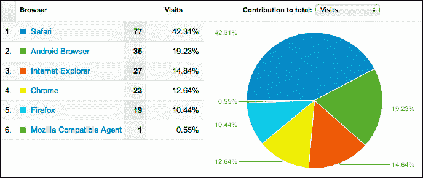
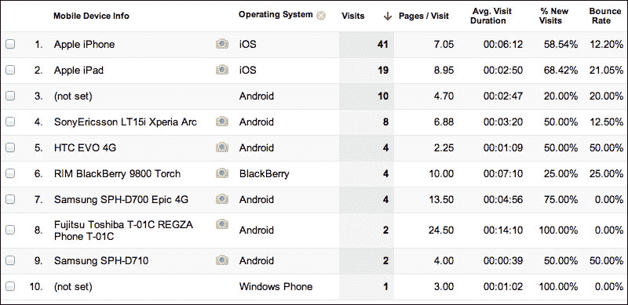
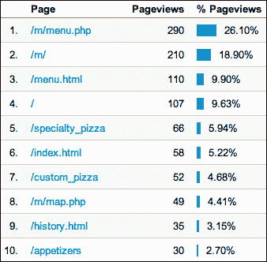
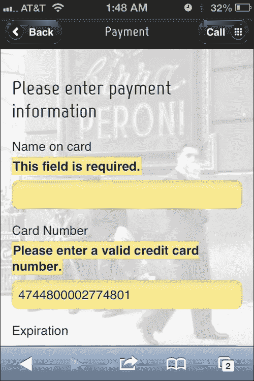

# 第 3 章分析、长表单和前端验证

是成长的时候了。业务正在好转，没有什么比大规模表单、指标和定制体验更能说明大业务了。

在本章中，我们将介绍：

*   谷歌静态地图
*   谷歌分析
*   长页和多页表单
*   集成 jQuery 验证

# 谷歌静态地图

在最后一章中，我们彻底研究了如何直接动态链接到 iOS 和 Android 的本地 GPS 系统。现在，让我们考虑另一种方法。客户希望有机会向用户展示街道地址、地图，并给他们另一个电话送货的机会。在这种情况下，仅仅链接到本地 GPS 系统是不够的。如果用户点击地址或地图，我们仍然可以触发，但作为中间的一步，我们可以从 Google（[注入一个静态地图 https://developers.google.com/maps/documentation/staticmaps/](https://developers.google.com/maps/documentation/staticmaps/) 。

它是否像直接打开应用程序来启动一个又一个转弯方向一样灵巧？没有，但它的速度快得多，可能是用户所需要的全部。他们可能会立即认出这个位置，并决定，是的，实际上，他们宁愿打电话。请记住，始终从用户的角度处理问题。这并不总是我们能做的最酷的事情。

让我们来看看客户认可的图纸：


让我们看看这个页面的代码，我们将把它放到`/map.php`中：

```js
<?php 
  $documentTitle = "Map | Nicky's Pizza";

  $fullSiteLinkHref = "/";

  $mapsAddress = "https://maps.google.com/maps?q=9771+N+Cedar+Ave,+Kansas+City,+MO+64157&hl=en&sll=39.20525,-94.526954&sspn=0.014499,0.033002&hnear=9771+N+Cedar+Ave,+Kansas+City,+Missouri+64157&t=m&z=17&iwloc=A";
  $staticMapUrl = "https://maps.googleapis.com/maps/api/staticmap?center=39.269109,-94.45281&amp;zoom=15&amp;size=288x200&amp;markers=color:0xd64044%7Clabel:N%7C39.269109,-94.45281&amp;sensor=true;"
?>
<!DOCTYPE html>
<html>
<head>
  <?php include("includes/meta.php"); ?>
</head>

<body>
<div data-role="page">
  <div data-role="content">
    <div class="logoContainer"></div>
    <p>
      <a href="<?=$mapsAddress ?>">
        <address class="vcard">
          <div class="adr">
            <div class="street-address">9771 N Cedar Ave</div>
            <span class="locality">Kansas City</span>, 
            <span class="region">MO</span>, 
            <span class="postal-code">64157</span> 
            <div class="country-name">U.S.A.</div>
          </div>
        </address>
      </a>
    </p>
    <p><a href="<?= $mapsAddress ?>">" width="288" height="200" /></a></p>
    <p><a href="tel:+18167816500" data-role="button">Call for delivery</a></p>
  </div>
  <?php include("includes/footer.php"); ?>
</div>
</body>
</html>
```

注意微格式（[的使用 http://microformats.org/](http://microformats.org/) 用于标记地址。这是不必要的，但自 2007 年以来它是相当标准的，而且它是一种让您的信息更具语义价值的好方法。这意味着不仅人们可以阅读，甚至计算机也可以阅读并理解它。如果您想了解有关微格式的更多信息，可以阅读《粉碎》杂志的这篇文章：[http://coding.smashingmagazine.com/2007/05/04/microformats-what-they-are-and-how-to-use-them/](http://coding.smashingmagazine.com/2007/05/04/microformats-what-they-are-and-how-to-use-them/)

## 添加谷歌分析

每个网站都应该有分析。如果不是，很难说有多少人访问了你的网站，我们是否通过转换渠道吸引了人们，或者是什么页面导致人们离开了我们的网站。

让我们增强全局 JavaScript（`/js/global.js`文件）以自动记录显示的每个页面。这是一个非常重要的区别。在桌面世界中，每个分析命中都基于文档就绪事件。这对**jQuery Mobile****jQM**不起作用，因为基于Ajax 的导航系统中的第一个页面是唯一触发页面加载事件的页面。在 jQM 中，我们需要使用以下代码在`pageshow`事件上触发此事件：

```js
/**********************************************/
/* Declare the analytics variables as global */
/**********************************************/
var _gaq = _gaq || [];

/**********************************************/
/* Initialize tracking when the page is loaded*/
/**********************************************/
$(document).ready(function(e) { 
(function() { 
var ga = document.createElement('script'); 
ga.type = 'text/javascript'; 

//Call in the Google Analytics scripts asynchronously.
ga.async = true;
ga.src = ('https:' == document.location.protocol ? 
'https://ssl' :
'http://www') 
+'.google-analytics.com/ga.js'; 
var s = document.getElementsByTagName('script')[0]; 
s.parentNode.insertBefore(ga, s); })(); 
});

/**********************************************/
/* On every pageshow, register each page view in GA */
/**********************************************/
$("[data-role='page']").live('pageshow', function (event, ui)
{

//wrap 3rd party code you don't control in try/catch
try {
_gaq.push(['_setAccount', 'YOUR ANALYTICS ID']);
if ($.mobile.activePage.attr("data-url")) { 
_gaq.push(['_trackPageview', 
//Pull the page to track from the data-url attribute 
//of the active page.
$.mobile.activePage.attr("data-url")]);
} else { 
_gaq.push(['_trackPageview']); 
} 
} 
 //if there is an error, let's dump it to the console
catch(err) {console.log(err);}
}); 

```

通过使用异步调用拉入 Google Analytics，我们允许用户继续进行跟踪，即使跟踪不起作用或需要一段时间才能加载。通常，对 JavaScript 文件的调用将暂停所有进一步的资产加载和 JavaScript 执行，直到请求的脚本完全加载并执行为止。我们真的不想因为一些广告网络或分析跟踪需要一段时间才能做出响应，而让我们精心设计、快速且功能强大的页面被搁置。

我们从当前页面的`data-url`属性中拉取要跟踪的位置，因为您无法可靠地使用`document.location`功能进行页面点击跟踪。jQM 基于 Ajax 的导航会导致跟踪中出现一些非常奇怪的 url。jQM 团队正在对此进行研究，但需要一段时间才能在所有设备上实现所需的技术。相反，只需从 jQM 页面的`data-url`属性中拉取 URL 进行跟踪。如果您动态创建页面，您还可以将页面的自定义名称放在此处进行跟踪。如果使用多页模板，则每个页面的 ID 都将作为页面视图进行跟踪。

我们确实还没有做太多的分析工作，但让我们看看我们已经可以开始收集的一些见解。以下只是技术故障的一个示例：



下图显示了同一视图的完整报告，进一步细分以显示哪些设备最受欢迎：



请注意上一张图片中的**反弹率**列在整个平台上。如果其中一个明显高于另一个，这可能表明我们需要更仔细地查看该设备上的站点。



制作一个移动网站不仅仅是让它在移动浏览器上看起来漂亮。一个定制良好的移动网站的最佳指标是人们能够快速进入并找到他们需要的东西。这让顶级内容报告成为我们的新好友。

不出所料，大多数来到网站的人都在点击菜单，如上图中的报告所示。然而，菜单只是一个起点。菜单中他们最感兴趣的是什么？特色比萨。正是这种洞察力可以引导您成功地进行首次重新设计。也许，我们应该考虑在主页上突出特色，节省用户时间。

底线是，如果没有好的分析，你就不知道你是否在构建正确的东西。现在设计的这个网站让他们点击两下，看看他们最关心的是什么，或者是什么？

到目前为止，我们只跟踪了页面浏览量。但是，在手机世界里，这并不是全部。那些拨打电话号码但不启动页面查看的链接呢？那些与 Facebook 或谷歌地图等地图软件无关的链接呢？这些当然算是进一步的互动，但如果所有这些类型的点击都有数字，那就太好了。我们已经在以不同的方式跟踪页面浏览量，让我们继续。

当然，我们希望跟踪自定义事件，而不必为每个要跟踪的事件编写 JavaScript。让我们把我们的链接做成这样：

```js
<a href="tel:+18167816500" data-pageview="call">Call Us</a>
```

然后，让我们使用以下代码向`pageinit`处理程序添加更多内容：

```js
$(document).on('pageinit', function (event, ui) { 
$page = $(event.target);

$page.find("[data-pageview]").click(function(){ 
var $eventTarget = $(this); 
if($eventTarget.attr("data-pageview") == "href"){ 
_gaq.push(['_trackPageview', 
$eventTarget.attr("href")]); 
}else{
_gaq.push(['_trackPageview', 
$eventTarget.attr("data-pageview")]); 
} 
});
```

通过分析跟踪还可以做很多事情，比如定制事件跟踪、电子商务活动跟踪、目标跟踪等等。现在，您已经了解了如何将 Google Analytics 与 jQuery Mobile 相结合的基本知识，您可以继续探索更多的跟踪，正如智慧所指示的那样，请查看此处：[https://developers.google.com/analytics/devguides/collection/gajs/](https://developers.google.com/analytics/devguides/collection/gajs/) 。

# 长且多页的表格

在台式机上，长表单是很正常的。我们都见过注册页面和电子商务订购流程。形式越长，就越倾向于将它们分解成更小、更符合逻辑的部分。这通常通过两种方式完成：

*   把它作为一个完整的页面，但要注入足够的空白和分组，这样看起来就不会那么吓人了
*   可以将表单物理拆分为多个页面，也可以使用显示/隐藏技术来完成相同的任务

这两种方法在任务完成方面都没有太大区别。无论哪种方式，这两种方法在移动通信的限制下都是特别不利的策略。我们能为增加成功做的最好的事情是：

*   完全删除所有可选字段
*   尽可能减少所需字段的数量（注意）
*   使用合理的默认值预填充图元
*   立即验证字段，而不是等到结束
*   提前通知用户任务可能需要多长时间

即使这样做，有时表单也会很长。如果您遇到这种情况，下面是一种使用 jquerymobile 获取长表单并将其拆分为多个页面的有用方法。以下是来自`ordercheckout.php`的代码：

```js
<body>
 <form action="/m/processOrder.php" method="post">
  <div data-role="page" id="delivery">
    <?php $headerTitle = "Deliver To"; ?>
    <?php include("includes/header.php"); ?>
    <div data-role="content">
    <h2>Where will we be delivering?</h2>

      <!—-form elements go here -->   

      <p>
        <div class="ui-grid-a">
          <div class="ui-block-a"><a data-role="button" href="index.php">Cancel</a></div>
          <div class="ui-block-b"><a data-role="button" href="#payment">Continue</a></div>
        </div>
      </p>

    </div>
    <?php include("includes/footer.php"); ?>
  </div>

  <div data-role="page" id="payment">
    <?php $headerTitle = "Payment"; ?>
    <?php include("includes/header.php"); ?>
    <div data-role="content">
      <h2>Please enter payment information</h2>

        <!-—form elements go here -->              

      <p>
        <div class="ui-grid-a">
          <div class="ui-block-a"><a data-role="button" data-theme="d" href="index.php">Cancel</a></div>
          <div class="ui-block-b"><input type="submit"data-theme="b" value="Submit"/></div>
        </div>
      </p>

    </div>
      <?php include("includes/footer.php"); ?>
  </div>

 </form>
<body>
```

首先要注意的是这里的 body 和 form 标记位于所有 jQuery 移动页面之外。记住，所有这些都只是一个大数据对象模型（DOM）。UI 中所有疯狂的渐进式增强和页面切换都不会改变这一点。这个页面的核心是一个庞大的表单，我们将使用它一次性提交整个订单流程。

# 集成 jQuery 验证

尽可能多地在客户端验证用户体验一直很重要。HTML5 通过对输入类型提供更大的控制，在这方面走了很长的路。尽管 HTML5 输入类型很好，但我们还需要更多。输入 queryvalidate。（[http://bassistance.de/jquery-plugins/jquery-plugin-validation/](http://bassistance.de/jquery-plugins/jquery-plugin-validation/)

Validate 插件是 jQuery 社区的主要功能，但是有一些东西可以帮助我们的移动实现。让我们从自动向任何具有类为`validateMe`的表单的页面添加验证开始。

```js
$("form.validateMe").each(function(index, element) { 
var $form = $(this); 
var v = $form.validate({
errorPlacement: function(error, element) {
vardataErrorAt = element.attr("data-error-at");
    if (dataErrorAt) 
        $(dataErrorAt).html(error); 
    else
      error.insertBefore(element); 
    } 
  }); 
});
```

由于一个页面可能包含多个表单，现在让我们通过使用以下命令将其挂接到每个请求验证的表单来处理它：

```js
$("form.validateMe").each
```

默认情况下，`ValidateMe`在无效字段后放置错误。这在 mobile 中是不行的，因为错误会显示在表单元素下面。在黑莓和一些安卓系统上，表单元素不一定垂直居中于键盘和字段本身之间的空间。如果用户把它搞砸了，反馈就不会立即而明显。这就是为什么我们使用以下代码行对错误位置进行两次更改：

```js
errorPlacement:
```

在任何给定的元素上，我们都可以使用标准 jQuery 选择器指定错误的位置，如下面的代码行所示。也许我们永远不会使用它，但它很方便。

```js
element.attr("data-error-at");
```

如果没有在元素级别指定错误位置，我们将在元素本身之前插入错误，如下面的代码行所示。标签文本和表单元素之间将显示错误语言。这样，键盘将永远不会掩盖反馈。

```js
error.insertBefore(element);
```

在单一表单、多页环境中，我们希望能够在继续下一页之前一次验证一个 jQM 页。我们需要做的第一件事是给出另一种处理`required`函数的方法，，因为我们显然不是在一次验证整个表单。

这可以在全局脚本中的任何函数之外声明：

```js
$.validator.addMethod("pageRequired", function(value, element) {  	
var $element = $(element);
  if ($element.closest("."+$.mobile.subPageUrlKey).hasClass($.mobile.activePageClass)){  
    return !this.optional(element);
}
  return "dependency-mismatch";
}, $.validator.messages.required);
```

像这样添加额外的`validator`方法非常方便。我们可以为任何事情声明我们自己的验证方法。

以下是其他验证选项，供您快速参考：

*   `required`
*   `remote`
*   `email`
*   `url`
*   `date`
*   `dateISO`
*   `number`
*   `digits`
*   `creditcard`
*   `equalTo`
*   `accept`
*   `maxlength`
*   `minlength`
*   `rangelength`
*   `range`
*   `max`
*   `min`

欲了解更多鼓舞人心的演示，请查看[http://bassistance.de/jquery-plugins/jquery-plugin-validation/ 请考虑捐款给这个项目。它让我们的生活变得更好。](http://bassistance.de/jquery-plugins/jquery-plugin-validation/)



既然我们已经将 jQuery 验证正确地集成到我们的多页表单中，那么我们需要使我们的错误看起来像是正确的错误。我们可以使用一些非常简单的东西，比如文本上的红色，但我更喜欢保持 jquerymobile 的风格。他们的默认主题集有一个`data-theme="e"`，只是请求用于错误状态。将我们的错误类添加到它们的`ui-bar-e,`定义中似乎是个好主意，但不要这样做。在本书的编写过程中，jQuery Mobile 被修补了三次，如果我们采用这种方法，每次升级都会引起摩擦。相反，我们只需将`ui-bar-e`的定义复制到我们的自定义样式表中，如下代码所示：

```js
label.error,input.error{
border:1px solid #f7c942;
background:#fadb4e;
color:#333;
text-shadow:0 1px 0 #fff;
background-image:-webkit-gradient(linear,lefttop,leftbottom,from(#fceda7),to(#fbef7e));
background-image:-webkit-linear-gradient(#fceda7,#fbef7e);
background-image:-moz-linear-gradient(#fceda7,#fbef7e);
background-image:-ms-linear-gradient(#fceda7,#fbef7e);
background-image:-o-linear-gradient(#fceda7,#fbef7e);
background-image:linear-gradient(#fceda7,#fbef7e)} 
```

我们几乎准备好用我们的花式表格了。现在，我们只需要在从一页移动到另一页之前对其进行验证。我们不必担心 submit 链接，因为这自然会触发验证，但让我们使用以下代码向 continue 链接添加一个类：

```js
<a data-role="button" data-theme="b" href="#payment"class="validateContinue">Continue</a>
```

然后，在我们的全局脚本中，让我们使用以下代码将此函数添加到`pageinit`处理程序中：

```js
$page.find(".validateContinue").click(function(){ 
  if($(this).closest("form").data("validator").form()){ 
    return true; 
  }else{
    event.stopPropagation();
    event.preventDefault();
    return false; 
  } 
}); 
```

如果用户在这个过程中间刷新，会发生什么？字段将为空，但我们已进入下一页。页面底部的一个小脚本（如以下代码所示）应该可以处理该问题：

```js
//page refresh mitigation 
$(document).on("pagebeforeshow", function(){ 
  if(document.location.hash != ""){
    var $firstRequiredInput = 
$("input.pageRequired").first(); 
    if($firstRequiredInput.val() == ""){
      var redirectPage = 
$firstRequiredInput.closest("[data-role='page']"); 
      $.mobile.changePage(redirectPage);
    }
  }
});
```

现在我们已经有了基本的概念，并且克服了一些小的缺陷，让我们看看`ordercheckout.php`文件的完整代码：

```js
<!DOCTYPE html>
<html>
<?php 
  $documentTitle = "Check Out | Nicky's Pizza";

  $headerLeftHref = "";
  $headerLeftLinkText = "Back";
  $headerLeftIcon = "";

  $headerRightHref = "tel:8165077438";
  $headerRightLinkText = "Call";
  $headerRightIcon = "grid";

  $fullSiteLinkHref = "/";

?>
<head>
  <?php include("includes/meta.php"); ?>
  <style type="text/css">
    #ordernameContainer{display:none;}
  </style>
</head>

<body>
  <form action="thankyou.php" method="post" class="validateMe">
```

这是我们多页表单的第一页。请记住，这些页面将同时提交。在用户进入下一页之前，我们将使用以下代码验证每个页面：

```js
div data-role="page" id="delivery">
  <?php $headerTitle = "Deliver To"; ?>
  <?php include("includes/header.php"); ?>
  <div data-role="content">
    <h2>Where will we be delivering?</h2>

    <p>
      <label for="streetAddress">Street Address</label>
      <input type="text" name="streetAddress" id="streetAddress" class="pageRequired" />
    </p>

    <p>
      <label for="streetAddress2">Address Line 2 | Apt#</label>
      <input type="text" name="streetAddress2" id="streetAddress2" />
    </p>

    <p>
      <label for="zip">Zip Code</label>
      <input type="number" name="zip" id="zip" maxlength="5" class="pageRequired zip" />
    </p>

    <p>
      <label for="phone">Phone Number</label>
      <input type="tel" name="phone" id="phone" maxlength="10" class="number pageRequired" />
    </p>

    <p>
      <div class="ui-grid-a">
        <div class="ui-block-a"><a data-role="button" data-icon="delete" data-iconpos="left" data-theme="d" href="javascript://">Cancel</a></div>
        <div class="ui-block-b"><a data-role="button" data-icon="arrow-r" data-iconpos="right" data-theme="b" href="#payment" class="validateContinue">Continue</a></div>
      </div>
    </p>

  </div>
  <?php include("includes/footer.php"); ?>
</div>
```

这是付款信息收集表的第二页。注意信用卡的有效性。我们所要做的就是添加类`"creditcard"`以使框架检查卡号是否使用 Luhn 算法（[进行验证 http://en.wikipedia.org/wiki/Luhn_algorithm](http://en.wikipedia.org/wiki/Luhn_algorithm) ）。

```js
<div data-role="page" id="payment">
  <?php $headerTitle = "Payment"; ?>
  <?php include("includes/header.php"); ?>
  <div data-role="content">
    <h2>Please enter payment information</h2>

    <p>
      <label for="nameOnCard">Name on card</label>
      <input type="text" name="nameOnCard" id="nameOnCard" class="pageRequired" />
    </p>

    <p>
      <label for="cardNumber">Card Number</label>
      <input type="tel" name="cardNumber" id="cardNumber" class="pageRequired creditcard" />
    </p>

    <p>
      <label for="expiration">Expiration</label>
      <input class="pageRequired number" type="tel" name="expiration" id="expiration" maxlength="4" size="4" placeholder="MMYY" />
    </p>

    <p>
      <label for="cvv">CVV2 (on the back of your card)</label>
      <input class="pageRequired number" type="number" name="cvv" id="cvv" minlength="3" maxlength="4" />
    </p>

    <p>
      <input type="checkbox" value="true" name="savePayment" id="savePayment" /><label for="savePayment">Save payment info for easier ordering?</label>
      <input type="checkbox" value="true" name="saveOrder" id="saveOrder" onchange="showHideOrderNameContainer()" /><label for="saveOrder">Save this order to your favorites?</label>
    </p>

    <p id="ordernameContainer">
      <label for="ordername">Give your order a name</label>
      <input type="text" name="ordername" id="ordername" placeholder="example: the usual" />
    </p>

    <p>
      <div class="ui-grid-a">
        <div class="ui-block-a"><a data-role="button" data-icon="delete" data-iconpos="left" data-theme="d" href="javascript://">Cancel</a></div>
        <div class="ui-block-b"><input type="submit" data-icon="arrow-r" data-iconpos="right" data-theme="b" value="Submit" /></div>
      </div>
    </p>

  </div>
  <?php include("includes/footer.php"); ?>
</div>

</form>
```

这些是我们在本章前面提到的脚本：

```js
 <script type="text/javascript">
  function showHideOrderNameContainer(){
   if($("#saveOrder").attr("checked")){
    $("#ordernameContainer").show();
   }else{
    $("#ordernameContainer").hide();
   }
  }

  //page refresh mitigation
  $("[data-role='page']").live("pagebeforeshow", function(){
   if(document.location.hash != ""){
    var $firstRequiredInput = $("input.pageRequired").first();
    if($firstRequiredInput.val() == ""){
     var redirectPage = $firstRequiredInput.closest("[data-role='page']");
     $.mobile.changePage(redirectPage);
    }
   }

  });
 </script>
</body>
</html>
```

下面是集成 jQuery 验证后的`meta.php`文件：

```js
<meta charset="utf-8">
<meta name="viewport" content="width=device-width, initial-scale=1, maximum-scale=1.0, user-scalable=no">
<link href='http://fonts.googleapis.com/css?family=Marvel'rel='stylesheet' type='text/css'>
<linkrel="stylesheet" href="http://code.jquery.com/mobile/1.2.0/jquery.mobile-1.2.0.min.css"/>
<link rel="stylesheet" href="css/custom.css" />
<script src="http://code.jquery.com/jquery-1.8.2.min.js"></script>
<script src="js/jquery.cookie.js"></script>
<script src="js/jquery.validate.min.js"></script>
<script src="js/global.js"></script>
<script src="http://code.jquery.com/mobile/1.2.0/jquery.mobile-1.2.0.min.js"></script>
<title><?=$documentTitle?></title>
```

在三章之后，这里是可以想象的主 JavaScript 文件（`global.js`。它基本上是我在每个项目中使用的一个，只有一些小的变化：

```js
var _gaq = _gaq || []; 
var GAID = 'UA-XXXXXXXX-X'; 

/*******************************************************/
/* Load Google Analytics only once the page is fully loaded.
/*******************************************************/
$(document).ready(function(e) { 
(function() { 
var ga = document.createElement('script'); 
ga.type = 'text/javascript'; 
ga.async = true; 
ga.src = ('https:' == document.location.protocol ? 
'https://ssl' : 'http://www') +'.google-analytics.com/ga.js'; 
var s = document.getElementsByTagName('script')[0]; 
s.parentNode.insertBefore(ga, s); 
})();
});

/*******************************************************/
/* Upon jQM page initialization, place hooks on links with 
/* data-pageview attributes to track more with GA.
/* Also, hook onto the full-site links to make them cookie
/* the user upon click. 
/*******************************************************/
$(document).on('pageinit', function (event, ui) { 
$page = $(event.target); 

$page.find("[data-pageview]").click(function(){ 
var $eventTarget = $(this); 
if($eventTarget.attr("data-pageview") == "href"){ 
_gaq.push(['_trackPageview', 
$eventTarget.attr("href")]); 
}else{ 
_gaq.push(['_trackPageview', 
$eventTarget.attr("data-pageview")]); 
} 
}); 

$page.find("a.fullSiteLink").click(function(){ 
$.cookie("fullSiteClicked","true", {
path: "/", 
expires:3600
}); 
}); 

/*******************************************************/
/* Find any form with the class of validateMe and hook in
/* jQuery Validate.  Also, override the error placement.
/*******************************************************/
//Any form that might need validation 
$("form.validateMe").each(function(index, element) { 
var $form = $(this);
var v = $form.validate({
errorPlacement: function(error, element) { 
var dataErrorAt = element.attr("data-error-at"); if (dataErrorAt) 
$(dataErrorAt).html(error); 
else
error.insertBefore(element);
      }
});     
});  

/*******************************************************/
/* Hook in the validateContinue buttons.
/*******************************************************/
$page.find(".validateContinue").click(function(){ 
if($(this).closest("form").data("validator").form()){ return true;
}else{
event.stopPropagation(); 
event.preventDefault();
return false;
}
}); 
});   

/*******************************************************/
/* Every time a page shows, register it in GA.
/*******************************************************/

$(document).on('pageshow', function (event, ui) { 
try {
_gaq.push(['_setAccount', GAID]);
if ($.mobile.activePage.attr("data-url")) { 
_gaq.push(['_trackPageview', 
$.mobile.activePage.attr("data-url")]);
} else {
_gaq.push(['_trackPageview']);
    }
} catch(err) {}  
});  

/*******************************************************/
/*  Add the custom validator class to allow for validation 
/*  on multi-page forms.
/*******************************************************/
$.validator.addMethod("pageRequired", function(value, element) {
var $element = $(element);
if( $element.closest("."+$.mobile.subPageUrlKey)
.hasClass($.mobile.activePageClass)) 
{  
return !this.optional(element);  
} 
return "dependency-mismatch";  
}, $.validator.messages.required); 
```

# 使用谷歌分析进行电子商务跟踪

到目前为止，我们跟踪的只是页面浏览量。当然这很有用，但大多数经理和所有者都喜欢他们的报告。在感谢页面上，我们应该包括一些简单的电子商务跟踪。同样，由于 jquerymobile 基于 Ajax 的导航系统，我们需要稍微调整一下默认示例，使其与 jQM 完美配合。

以下是感谢页面（`thankyou.php`的完整代码，其中电子商务跟踪设置为仅在页面显示后运行：

```js
<!DOCTYPE html>
<html>
<?php 
  $documentTitle = "Menu | Nicky's Pizza";

  $headerLeftHref = "index.php";
  $headerLeftLinkText = "Home";
  $headerLeftIcon = "home";

  $headerRightHref = "tel:8165077438";
  $headerRightLinkText = "Call";
  $headerRightIcon = "grid";

  $fullSiteLinkHref = "/index.php";
?>
<head>
  <?php include("includes/meta.php"); ?>
</head>

<body>
<div data-role="page" id="orderthankyou">
  <?php 
    $headerTitle = "Thank you"; 
    include("includes/header.php"); 
  ?>
  <div data-role="content" >
    <h2>Thank you for your order. </h2>
    <p>In a few minutes, you should receive an email confirming your order with an estimated delivery time.</p>

    <script type="text/javascript">
      $("#orderthankyou").live('pageshow', function(){
        _gaq.push(['_addTrans',
          '1234',                      // order ID - required
          'Mobile Checkout',  // affiliation or store name
          '21.99',                    // total - required
          '1.29',                     // tax
          ' ',                          // shipping
          'Kansas City',       // city
          'MO',              // state or province
          'USA'              // country
          ]);
        _gaq.push(['_trackTrans']); //submits transaction to the Analytics servers
      });
    </script>
  </div>
  <?php include("includes/footer.php"); ?>
</div>

</body>
</html>

```

# 总结

形式并不是什么新鲜事。从互联网诞生之日起，我们就拥有了它们。它们并不迷人，但它们可以优雅、高效、反应迅速。jquerymobile 让您在基于触摸的界面中实现有效的表单方面走了很长的路。现在，通过多页表单和客户端验证，您可以更进一步。当这两种技术结合在一起时，不要低估它们的威力。当客户机能够完成几乎所有他们需要的事情，而不必返回服务器时，体验就会自动得到改善。将观看用户如何浏览您的网站、他们最喜欢的内容以及他们的影响点的功能结合起来，将有助于您获得更引人注目的体验。请记住，当你考虑分析时，重要的不是绝对数字。这都是关于趋势的；完成这些基础知识后，让我们来了解一些更有趣的技术。在下一章中，我们将开始研究地理定位和更多。