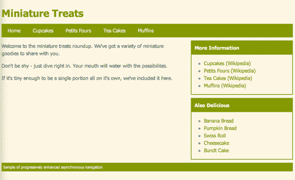
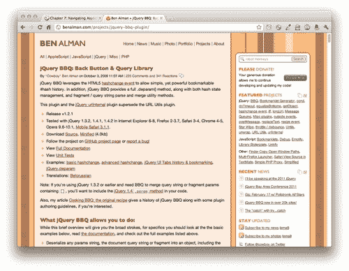
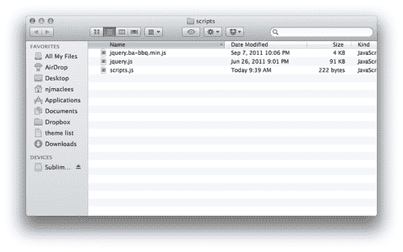
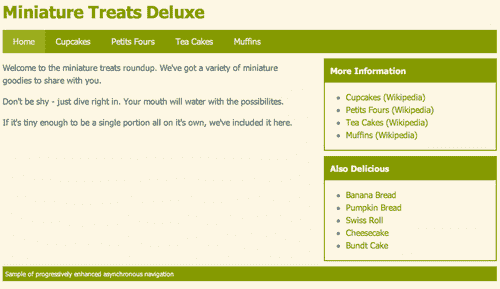
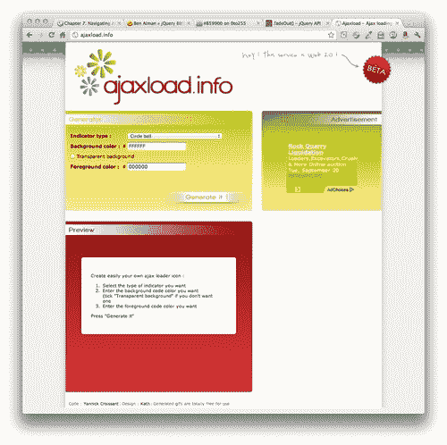

# 第七章异步导航

> 网站通常是这样设置的，即网站的所有页面共享一个共同的页眉和页脚，只有在页眉和页脚之间的内容会随着页面的变化而变化。有时，在主内容区域的左侧和/或右侧也有一个或多个侧栏，它们在整个站点中保持不变。为什么让我们的网站访问者在浏览我们的网站时一遍又一遍地重新下载相同的页眉、页脚和侧边栏内容？

在本章中，我们将介绍以下主题：

*   设置网站以异步导航
*   增强异步导航，使其更加用户友好

# 简单异步导航

在 Web 的早期，解决重复相同内容下载问题的一个方法是框架。如果您对 web 开发太陌生而记不住，frames 提供了一种将单个页面视图分解为多个不同 HTML 文件的方法—在站点中导航时需要重新加载一个或多个框架，而其他框架保持不变。框架帮助网站更快地加载，使网站更易于维护，但最终，它们产生的问题比解决的问题还要多。框架网站很容易被破坏，搜索引擎很难索引，经常会破坏后退和前进按钮，使网站访问者很难或不可能为页面添加书签、共享链接或打印内容。由于所有这些问题，框架的使用已经不受欢迎。

最近，单页应用程序开始变得越来越流行。如果您登录到您的 Twitter 帐户并开始四处点击，您会注意到整个页面很少刷新，大多数交互都发生在一个页面内。如果访问任何 Gawker 媒体站点，您都会注意到在初始页面加载后，在浏览站点时，整个页面不会再次刷新。让我们来看看我们如何通过逐步增强的方式在我们自己的站点上实现这种类型的交互，以确保我们的站点仍然没有 JavaScript 工作，并且可以很容易地被搜索引擎索引。

# 行动时间-建立一个简单的网站

我们将首先构建一个小而简单的网站，只需几个页面。它们将共享相同的页眉、导航、侧栏和页脚。它们都有一个主内容区，每个页面的唯一内容将显示在这里。

1.  Get started by setting up an `index.html` file with all the associated files and folders as we did in [Chapter 1](01.html "Chapter 1. Designer, Meet jQuery"), *Designer, Meet jQuery*. The body of the `index.html` file will contain our header, navigation, sidebar, and footer:

    ```js
    <div id="ajax-header">
    <h1>Miniature Treats</h1>
    <ul id="ajax-nav">
    <li><a href ="index.html">Home</a></li>
    <li><a href ="cupcakes.html">Cupcakes</a></li>
    <li><a href ="petitfours.html">Petits Fours</a></li>
    <li><a href ="teacakes.html">Tea Cakes</a></li>
    <li><a href ="muffins.html">Muffins</a></li>
    </ul>
    </div>
    <div id="main-col">
    <div id="main-col-wrap">
    <p>Welcome to the miniature treats roundup. We've got a variety of miniature goodies to share with you.</p>
    <p>Don't be shy - just dive right in. Your mouth will water with the possibilites.</p>
    <p>If it's tiny enough to be a single portion all on it's own, we've included it here.</p>
    </div>
    </div>
    <div id="side-col">
    <div class="widget">
    <h4>More Information</h4>
    <ul>
    <li><a href="http://en.wikipedia.org/wiki/Cupcakes">Cupcakes (Wikipedia)</a></li>
    <li><a href="http://en.wikipedia.org/wiki/Petit_fours">Petits Fours (Wikipedia)</a></li>
    <li><a href="http://en.wikipedia.org/wiki/Tea_cake">Tea Cakes (Wikipedia)</a></li>
    <li><a href="http://en.wikipedia.org/wiki/Muffins">Muffins (Wikipedia)</a></li>
    </ul>
    </div>
    <div class="widget">
    <h4>Also Delicious</h4>
    <ul>
    <li><a href="http://en.wikipedia.org/wiki/Banana_bread">Banana Bread</a></li>
    <li><a href="http://en.wikipedia.org/wiki/Pumpkin_bread">Pumpkin Bread</a></li>
    <li><a href="http://en.wikipedia.org/wiki/Swiss_roll">Swiss Roll</a></li>
    <li><a href="http://en.wikipedia.org/wiki/Cheesecake">Cheesecake</a></li>
    <li><a href="http://en.wikipedia.org/wiki/Bundt_cake">Bundt Cake</a></li>
    </ul>
    </div>
    </div>
    <div id="ajax-foot">
    <p>Sample of progressively enhanced asynchronous navigation</p>
    </div>

    ```

    您会注意到一个您可能没有想到的额外的`<div>`：在 id 为 main col 的`<div>`内部，我添加了一个 id 为 main col wrap 的`<div>`标记。这不是用于布局或 CSS 目的，而是在创建 JavaScript 以异步加载内容后使用。

2.  Next, we'll write some CSS to create a simple layout. Open your `styles.css` file and add the following styles:

    ```js
    #ajax-header { margin: 40px 0 0 0; }
    #ajax-header h1 { color:#859900;margin:0 0 10px 0;padding:0; }
    #ajax-nav { background:#859900;margin:0;padding:0;overflow:hidden;zoom:1; }
    #ajax-nav li { list-style-type:none;margin:0;padding:10px 20px;display:block;float:left; }
    #ajax-nav a,
    #ajax-nav a:link,
    #ajax-nav a:visited { color: #eee8d5; }
    #ajax-nav a:hover,
    #ajax-nav a:active { color: #fff; }
    #main-col { float:left;width:60%; }
    #side-col { float:right;width:35%; }
    .widget { border:2px solid #859900;margin:10px 0; }
    .widget h4 { margin:0 0 10px 0;padding:10px;background:#859900;color:#FDF6E3; }
    .float-right { float:right;margin:0 0 10px 10px; }
    .float-left { float:left;margin:0 10px 10px 0; }
    .source { font-size:12px; }
    #ajax-foot { clear:both;margin:10px 0 40px 0;padding:5px;background:#859900;color:#f3f6e3; }
    #ajax-foot p { margin:0;padding:0;font-size:12px;}

    ```

    最终页面将类似于以下屏幕截图：

    

    如果你觉得很有启发性，可以随意写一些额外的 CSS 来设计你的页面，让它看起来更华丽一些。

3.  接下来，我们将创建该站点的其他页面，即纸杯蛋糕、小点心、茶蛋糕和松饼的页面。HTML 将与主页完全相同，除了`<div>`中的内容 `id`为 `main-col-wrap`之外。以下是我的纸杯蛋糕页面内容示例：

    ```js
    <div id="main-col-wrap">
    <h2>Cupcakes</h2>
    <p>A cupcake is a small cake designed to serve one person, frequently baked in a small, thin paper or aluminum cup. As with larger cakes, frosting and other cake decorations, such as sprinkles, are common on cupcakes.</p>
    <p>Although their origin is unknown, recipes for cupcakes have been printed since at least the late 18th century.</p>
    <p>The first mention of the cupcake can be traced as far back as 1796, when a recipe notation of "a cake to be baked in small cups" was written in <em>American Cookery</em> by Amelia Simms. The earliest documentation of the term <em>cupcake</em> was in "Seventy-five Receipts for Pastry, Cakes, and Sweetmeats" in 1828 in Eliza Leslie's <em>Receipts</em> cookbook.</p>
    <p class="source">Text source: <a href="http://en.wikipedia.org/wiki/Cupcakes">Wikipedia</a><br/>Image source: <a href="http://flickr.com/people/10506540@N07">Steven Depolo</a> via <a href="http://commons.wikimedia.org/wiki/File:Blue_cupcakes_for_graduation,_closeup_-_Tiffany,_May_2008.jpg">Wikimedia Commons</a></p>
    </div>

    ```

除此之外，我的页面的其余部分与我们之前创建的主页完全相同。继续以类似的方式为松饼、茶蛋糕和小点心创建页面，这样您就有了一个五页的网站，其中包含共享的页眉、导航、侧边栏和页脚。

不要忘记，站点的每个页面都应该在标题部分包含一个指向 `styles.css`文件的链接，并在文档底部包含一个指向 jQuery 和 `scripts.js`文件的链接，就在关闭`</body>`标记之前。

## 刚才发生了什么事？

我们用 HTML 建立了一个简单的五页网站。我们网站的每个页面都共享相同的页眉、导航、侧边栏和页脚。然后我们设置一些简单的 CSS 来设计我们的页面。唯一的暗示是，这里会发生一些奇特的事情，这是一个额外的`<div>`环绕在我们的主要内容区域——页面的区域，包含不同页面的不同内容。

# 行动时间-添加 Ajax 魔术

如果你在浏览器中点击这个小而简单的站点，你会看到我们一次又一次地重新加载相同的页眉、导航、边栏和页脚。只有页面主内容区域中的内容在页面之间发生变化。让我们使用 jQuery 的魔力来解决这个问题。

1.  提醒您，除非您的页面由服务器提供服务，否则这些 Ajax 功能将无法工作。要查看此代码的运行情况，您必须将页面上载到服务器或在自己的计算机上创建服务器。首先，我们将打开 `scripts.js`文件，开始编写代码。我们将像通常一样开始使用 document ready 语句，如下所示：

    ```js
    $(document).ready(function(){
    // Our code will go here
    });

    ```

2.  我们需要选择导航中的所有链接。这将类似于此：

    ```js
    $(document).ready(function(){
    $('#ajax-nav a')
    });

    ```

3.  当站点访问者单击这些链接时，浏览器会加载请求的页面进行响应。这是我们想要覆盖的行为，因此我们将绑定一个函数到覆盖链接点击行为的链接，如下所示：

    ```js
    $(document).ready(function(){
    $('#ajax-nav a').bind('click', function(){
    // Our clicky code goes here
    });
    });

    ```

4.  The first thing we need to do when a site visitor clicks a link is cancel the default behavior. We can do that by telling the function to return `false:`

    ```js
    $(document).ready(function(){
    $('#ajax-nav a').bind('click', function(){
    return false;
    });
    });

    ```

    现在，如果您在浏览器中重新加载简单站点，您将看到单击主导航中的链接没有任何作用。您请求的页面不再加载到浏览器中。我们已经为自己的代码做好了准备。

5.  If we're going to fetch a page from the server, we need to know which page we're fetching. We need to know which URL we need to call. Luckily, our links already contain this information in their `href` attributes. For example, by looking at the HTML for our cupcakes link:

    ```js
    <a href ="cupcakes.html">Cupcakes</a>

    ```

    我们可以看到，我们需要请求获取纸杯蛋糕信息的页面是 `cupcakes.html.`

    我们将使用 jQuery 获取刚刚单击的链接的 `href`属性：

    ```js
    $(document).ready(function(){
    $('#ajax-nav a').bind('click', function(){
    var url = $(this).attr('href');
    return false;
    });
    });

    ```

    现在我们有一个名为 `url`的变量，它包含被点击链接的 `href`属性。记住，变量只是容器。如果我们的网站访问者刚刚点击了纸杯蛋糕链接，`url`变量将包含`cupcakes.html`。如果站点访问者刚刚点击了 muffins 链接，则 url 变量包含`muffins.html`。每次站点访问者单击主导航中的任何链接时，都会调用此函数-`$(this)`将始终引用刚刚单击的链接。

6.  既然我们知道服务器上的哪个页面包含站点访问者请求的信息，我们该如何处理它？幸运的是，jQuery 为我们提供了 `load()`方法，使得从服务器加载内容到我们的页面非常容易。我们将在页面上选择要加载内容的元素，然后为该元素调用 `load()`方法。在本例中，我们将选择带有 `id`的 `main-col`的`<div>`标记，因为这是内容的容器，内容会随着页面的变化而变化：

    ```js
    $(document).ready(function(){
    $('#ajax-nav a').bind('click', function(){
    var url = $(this).attr('href');
    $('#main-col').load();
    return false;
    });
    });

    ```

7.  If you reload the page in the browser and click on links in the main navigation, you'll see that nothing happens. No errors are reported by the browser so what's the problem?

    还记得在[第一章](01.html "Chapter 1. Designer, Meet jQuery")*设计师中吃熏肉的狗玛姬吗，遇见 jQuery*玛姬有这样一种吃法：

    ```js
    Maggie.eat();

    ```

    但是，记住，她不能只吃东西，她必须吃点东西。因此我们将 `bacon`传递给玛姬的 `eat()`方法如下：

    ```js
    Maggie.eat('bacon');

    ```

    `load`方法类似。我们不能只装东西，我们必须装东西。在这种情况下，我们知道需要在 URL 变量中包含的 URL 处加载什么内容：

    ```js
    $(document).ready(function(){
    $('#ajax-nav a').bind('click', function(){
    var url = $(this).attr('href');
    $('#main-col').load(url);
    return false;
    });
    });

    ```

    现在，如果您刷新浏览器并尝试单击主导航中的 cupcakes 链接，您将看到 cupcakes 页面的内容确实已加载到我们的`#main-col`div 中。但是，这与我们的想法并不完全一致，因为它正在加载整个页面：

    

8.  We don't want to get the whole page. We just need the content inside the `#main-col` div. That's where that extra wrapper element,`<div>` with an `id` of `main-col-wrap` comes in. We can tell jQuery to only load that`<div>` and its content into `#main-col <div>` as follows:

    ```js
    $(document).ready(function(){
    $('#ajax-nav a').bind('click', function(){
    var url = $(this).attr('href');
    $('#main-col').load(url + ' #main-col-wrap');
    return false;
    });
    });

    ```

    这有时被称为 jQuery 的**部分加载方法**，因为我们并没有将所获取内容的全部内容加载到页面中，而只是加载我们关心的部分。如果您在浏览器中刷新页面，然后单击主导航，您将看到内容加载与我们预期的一样，并且只有页面的主内容区域刷新。重新加载主内容区域时，页眉、导航、侧边栏和页脚仍保留在页面上。

## 刚才发生了什么事？

我们使用 jQuery 强大的基于 CSS 的选择器来选择主导航中的所有链接。我们将链接的点击行为识别为我们需要覆盖的行为，以获得我们想要的结果。我们将 click 函数绑定到每次调用链接时都会运行的链接。我们取消了链接在浏览器窗口中加载新页面的默认行为。接下来，我们检查了链接以获取包含在 `href`属性中的 URL。我们在页面上选择了要加载新内容的容器，并使用 jQuery 的 `load()`方法调用我们需要的内容。我们将选择器与 URL 一起传递给 `load()`方法，以便 jQuery 知道我们只希望加载所选元素中的内容，而不是整个页面。

我们把我们的简单网站变成了一个单页应用程序。我们使用了渐进式增强，这样没有启用 JavaScript 的网站访问者就可以毫无问题地使用我们的网站。搜索引擎也将能够索引我们网站的内容。我们只用几行 JavaScript 就完成了这一切——多亏了 jQuery！

# 豪华异步导航

你会对自己使用一个普通的站点并用几行代码将其转换为一个单页应用程序感到非常满意，但让我们面对它：我们简单的异步导航有一点不尽如人意，肯定需要一些改进。

也许最明显的是，我们破坏了浏览器中的后退和前进按钮。我们不能再使用它们在站点页面之间导航。我们还剥夺了网站访问者为网站页面添加书签或共享链接的能力。我们也不会给我们的网站访问者任何反馈，在他们点击了我们的主导航中的链接后，会发生任何事情。由于我们的网页短而简单，它们通常应该加载得很快，但众所周知，互联网在速度方面是不可预测的。有时，加载我们的内容可能需要半秒钟、一整秒钟或更长的时间，而我们的网站访问者并不知道他们的浏览器正在努力为他们获取新内容，只是看起来什么都没有发生。

我们还可以添加一些其他漂亮的功能，使整个过程变得更漂亮、更快，因此，让我们开始学习异步导航的高级版本。

# 行动时间-楼宇豪华异步导航

为了给异步导航添加一些缺失的功能，我们将使用 Ben Alman 优秀的 jQuery BBQ 插件。尽管这个名字可能会让你感到饥饿，但在本例中，BBQ 代表后退按钮和查询。我们将继续使用上一个示例中创建的文件。

1.  First, we'll need to get a copy of the BBQ plugin to work with. Head over to [http://benalman.com/projects/jquery-bbq-plugin/](http://benalman.com/projects/jquery-bbq-plugin/) to get the download file and the documentation and examples for the jQuery BBQ plugin.

    

    像往常一样，我们将下载插件的缩小版本，并将其放入 jQuery 和我们的 `scripts.js`文件旁边的`scripts`文件夹中。

    

2.  接下来，打开迷你网站的每个 HTML 页面，在 jQuery 之后和 `scripts.js:`

    ```js
    <script type="text/javascript" src="scripts/jquery.js"></script>
    <script type="text/javascript" src="scripts/jquery.ba-bbq.min.js"></script>
    <script type="text/javascript" src="scripts/scripts.js"></script>
    </body>
    </html>

    ```

    之前添加烧烤插件

现在，我们准备开始构建异步导航的高级版本。

## 刚才发生了什么事？

我们下载了 jQueryBBQ 插件并将其附加到我们的每个页面。到目前为止，这并没有对我们的网站产生任何影响-我们已经附加了 BBQ 插件，但我们没有使用它做任何事情。接下来，我们将了解如何使用 BBQ 插件。

# 行动时间-使用烧烤插件

我们的首要任务是让这些返回和前进按钮正常工作，并允许我们的网站访问者添加书签和共享指向各个页面的链接。这就是为什么我们加入了 jQuery 烧烤插件。

1.  我们将要编写一些新的 JavaScript，因此请删除前面在 `scripts.js`中编写的代码，并将其替换为一个简单的 document ready 语句，如下所示：

    ```js
    $(document).ready(function(){
    // Our deluxe ajaxy code goes here
    });

    ```

2.  Next, we're going to select each of the links in our main navigation and replace the URLs with hash links so that the browser thinks they are internal to our HTML page.

    ```js
    $(document).ready(function(){
    $('#ajax-nav a').each(function(){
    $(this).attr('href', '#' + $(this).attr('href'));
    });
    });

    ```

    我们选择主导航中的所有链接，然后循环浏览所有链接，在 URL 前面添加一个#字符。例如，`cupcakes.html`链接现在是`#cupcakes.html`。如果在浏览器中刷新页面，您将看到单击链接不会更改页面上的任何内容，但会更新浏览器位置栏中 URL 中的哈希值。

    

3.  接下来，我们将把一个函数绑定到窗口的 `hashchange`事件。现代浏览器提供了一个名为 `hashchange`的事件，每当 URL 的哈希值发生变化时就会触发，就像单击主导航链接时一样。较旧的浏览器不支持 `hashchange`事件，但这就是 jQuery BBQ 插件的用武之地。它在大多数浏览器中提供了对伪 `hashchange`事件的支持，因此我们只需编写一次代码，而不必担心浏览器之间的差异。下面是我们如何将函数绑定到 `hashchange`事件：

    ```js
    $(document).ready(function(){
    $('#ajax-nav a').each(function(){
    $(this).attr('href', '#' + $(this).attr('href'));
    });
    $(window).bind('hashchange', function(e) {
    // our function goes here
    });
    });

    ```

4.  The function we write will now be called each time the window's hash changes, which we know is going to happen each time the site visitor clicks on a link in our main navigation. Now we can write the code to tell the browser what to do when this happens.

    ```js
    $(document).ready(function(){
    $('#ajax-nav a').each(function(){
    $(this).attr('href', '#' + $(this).attr('href'));
    });
    $(window).bind('hashchange', function(e) {
    var url = e.fragment;
    $('#main-col').load(url + ' #main-col-wrap');
    });
    });

    ```

    首先，我们正在设置一个名为 `url`的变量，并将其设置为 `e.fragment.`，jQueryBBQ 插件提供了 `fragment`属性。它等于不带哈希符号的 URL 的哈希。因此，如果窗口的哈希值更改为 `#cupcakes.html, e.fragment`将等于`cupcakes.html.`

    下一行代码与我们的基本 Ajax 导航示例相同。我将在页面上选择要加载内容的容器，然后调用 `load()`方法。我将为页面中要加载到浏览器的 URL 部分传递 URL 和 jQuery 选择器。

    如果您现在在浏览器中刷新页面，您将看到我们的主导航再次异步工作。单击链接仅加载页面的主要内容区域，而其余内容保持不变。有一个重要的区别，但是如果单击后退和前进按钮，它们会工作。点击“纸杯蛋糕”页面后，您可以单击“上一步”按钮返回主页。

5.  There's just one thing left to do to get our navigation optimized and that's to make sure that our site visitors can bookmark and share links to our pages. If you click on the cupcakes page, copy the URL from the browser's location bar, and open either a new browser window or a new tab and paste in the URL, you'll see that you get the site's home page rather than the cupcake page. If you look at the URL, the `#cupcakes.html` hash is there, we just have to tell our code to look for it. The simplest way to do that is to fire the window's `hashchange` event as soon as the page loads in the browser. Here's how we do that:

    ```js
    $(document).ready(function(){
    $('#ajax-nav a').each(function(){
    $(this).attr('href', '#' + $(this).attr('href'));
    });
    $(window).bind('hashchange', function(e) {
    var url = e.fragment;
    $('#main-col').load(url + ' #main-col-wrap');
    });
    $(window).trigger('hashchange');
    });

    ```

    现在，您可以在一个新窗口中打开“纸杯蛋糕”链接，您将看到“纸杯蛋糕”页面加载，正如它应该的那样。我们的 `hashchange`函数会在页面加载后立即启动，从而加载正确的内容。

## 刚才发生了什么事？

我们使用 jQuery 循环浏览每个导航链接，并用内部链接或散列链接替换它们。为什么不在 HTML 中这样做呢？因为我们想确保我们的页面继续为禁用 JavaScript 的用户工作。

然后，我们使用 jQuery BBQ 插件来更改异步导航，以启用书签和链接共享以及浏览器中的后退和前进按钮。这使得我们的网站可以像一个单页应用程序一样运行，而不会破坏网站访问者的预期体验。

# 行动时间-在导航中突出显示当前页面

我们已经将异步导航做得比简单的示例好得多，但我认为我们可以继续做下去，让它做得更好。接下来，我们将在导航中突出显示当前正在查看的页面，以便我们的网站访问者能够轻松查看他们所在的页面。



1.  First up, let's open up `styles.css` again and write a `.current` CSS class for the navigation:

    ```js
    #ajax-nav li.current{ background:#a3bb00; }

    ```

    我已经将导航栏设置为绿色，因此我将把 `.current`类设置为稍微浅一点的绿色，以便当前项在菜单中突出显示。你可以仿效我的榜样，或者创造你自己的风格，任何适合你口味的都可以。

2.  现在我们只需要将 `.current`类应用于当前的导航项。我们将在前面编写的 `hashchange`事件函数中添加几行。我们将首先检查窗口位置中是否有哈希：

    ```js
    $(document).ready(function(){
    $('#ajax-nav a').each(function(){
    $(this).attr('href', '#' + $(this).attr('href'));
    });
    $(window).bind('hashchange', function(e) {
    var url = e.fragment;
    $('#main-col').load(url + ' #main-col-wrap');
    if (url) {
    // The code if there is a hash
    } else {
    // The code if there is not a hash
    }
    });
    $(window).trigger('hashchange');
    });

    ```

3.  Now, if there is a hash, then we want to find the link in my main navigation that corresponds to the hash, find its parent container, and add the current class. That sounds like a lot, but I can do that in one line:

    ```js
    $(window).bind('hashchange', function(e) {
    var url = e.fragment;
    $('#main-col').load(url + ' #main-col-wrap');
    $('#ajax-nav li.current').removeClass('current');
    if (url) {
    $('#ajax-nav a[href="#' + url + '"]').parents('li').addClass('current');
    } else {
    // The code if there is not a hash
    }
    });

    ```

    我使用 jQuery 强大的属性选择器来选择`href`属性等于窗口散列的链接。然后我用 `parents()`方法找到链接的父母。我将`li`传递给 `parents()`方法，告诉 jQuery 我只对一个父对象感兴趣，即包含我链接的 `<li>`。然后我使用`addClass()`方法将当前类添加到当前链接。

4.  如果没有散列，那么我想突出显示主页，它是我们主导航的第一个页面。我将选择第一个`<li>`并添加当前类，如下代码所示：

    ```js
    $(window).bind('hashchange', function(e) {
    var url = e.fragment;
    $('#main-col').load(url + ' #main-col-wrap');
    $('#ajax-nav li.current').removeClass('current');
    if (url) {
    $('#ajax-nav a[href="#' + url + '"]').parents('li').addClass('current');
    } else {
    $('#ajax-nav li:first-child').addClass('current');
    }
    });

    ```

5.  现在，如果您在浏览器中刷新页面并单击页面，您将看到当前页面高亮显示，但是当您在网站中移动时，越来越多的导航被高亮显示-在添加新的高亮显示之前，我们不会删除旧的高亮显示。我们将添加此行以删除当前突出显示，然后再添加新的：

    ```js
    $(window).bind('hashchange', function(e) {
    var url = e.fragment;
    $('#main-col').load(url + ' #main-col-wrap');
    $('#ajax-nav li.current').removeClass('current');
    if (url) {
    $('#ajax-nav a[href="#' + url + '"]').parents('li').addClass('current');
    } else {
    $('#ajax-nav li:first-child').addClass('current');
    }
    });

    ```

在浏览器中刷新页面，您将看到高亮显示现在正常工作，仅高亮显示当前页面。

## 刚才发生了什么事？

我们在 `hashchange`函数中添加了几行代码，以便在导航中为当前页面添加突出显示。这将有助于网站访问者确定自己在网站上的位置，并进一步加强其当前位置。

# 动作时间-添加加载动画

接下来，我们要向站点访问者显示，只要他们单击导航中的链接，就会发生一些事情。请记住，如果服务器的响应很慢，那么站点访问者就看不到正在发生任何事情。尽管浏览器正在努力获取新页面的内容，但没有迹象表明网站访问者正在发生任何事情。让我们添加一个小动画，以使我们的页面上发生了一些事情。

加载动画可以采取许多不同的形式：旋转雏菊、动画进度条、闪烁的圆点——任何能够传达正在进行的操作的东西都将有助于使您的网站更快速，对您的网站访问者更具响应力。


1.  First, head over to [http://ajaxload.info](http://ajaxload.info) to create and download a loading animation of your choice.

    

2.  在**生成器**框中选择类型、背景色和前景色，然后点击**生成！**按钮。
3.  您将在**预览**框中看到您的按钮预览，以及下载按钮的链接。点击**下载！**链接下载刚创建的加载动画副本。
4.  下载按钮后，将其与网站上使用的其他图像一起放入 `images`文件夹。
5.  Now, let's think through the modifications we have to make to our page. We want to fade out the content that is currently shown in the `#main-col` div and show our loading animation in its place until the server sends back the content for our new page. As soon as we get that content back, we want to hide the loading animation and display the content.

    当我们准备好向网站访问者显示加载动画时，我们希望它立即可见。如果我们不得不去从服务器上获取图像，那么这将毫无用处。实际的页面内容可能会在图像之前返回。因此，我们必须预加载图像。使用 jQuery，这非常简单。文档加载到浏览器后，我们将创建一个新的图像元素，如以下代码所示：

    ```js
    $(document).ready(function(){
    var loadingImage = $('');
    $('#ajax-nav a').each(function(){
    ...

    ```

    仅创建此元素就足以将图像预加载到浏览器的缓存中。现在，当我们准备好显示图像时，它将立即可用，无需等待。

6.  接下来，我们必须编写一些 CSS 来处理加载图像的显示方式。我们将把它包装在一个简单的段落标记中，在该标记中添加一点填充，并将图像居中：

    ```js
    #loading { padding:20px;text-align:center;display:none; }

    ```

7.  Note that we're also setting the `display` to `none`—that way we won't have the image showing up until we're ready for it. We only want our animation to appear if the URL has a hash, so inside our `if/else` statement, we'll append the loading animation to the `#main-col` div:

    ```js
    ...
    if (url) {
    $('#main-col').append('<p id="loading"></p>')
    $('#loading').append(loadingImage);
    $('#ajax-nav a[href="#' + url + '"]').parents('li').addClass('current');
    } else {
    ...

    ```

    我们在文档中添加了一个段落，其中的 `id`为 `loading`，我们在该段落中添加了预加载的加载图像。记住，即使它在那里，它仍然不可见，因为我们用 CSS 隐藏了它。

8.  接下来，我们将淡出页面上当前显示的内容。如果我们的内容很快从服务器返回，我们希望确保我们不会碍事，所以我们会告诉动画尽快完成：

    ```js
    ...
    if (url) {
    $('#main-col').append('<p id="loading"></p>')
    $('#loading').append(loadingImage);
    $('#ajax-nav a[href="#' + url + '"]').parents('li').addClass('current');
    $('#main-col-wrap').fadeOut('fast');
    } else {
    ...

    ```

9.  Finally, we want to show our loading animation, but we don't want it to appear until after the content has faded out. To make sure it doesn't show up before then, we'll add it as a callback function to the `fadeOut()` method. A callback function is a function that's called after the animation completes. Here's how we add a callback function to the `fadeOut()` method:

    ```js
    ...
    if (url) {
    $('#main-col').append('<p id="loading"></p>')
    $('#loading').append(loadingImage);
    $('#ajax-nav a[href="#' + url + '"]').parents('li').addClass('current');
    $('#main-col-wrap').fadeOut('fast', function(){
    $('#loading').show();
    });
    } else {
    ...

    ```

    现在，当站点访问者单击链接时，位置栏中的哈希将更新。这将触发我们的代码，以淡出页面的当前内容，显示加载动画，然后在服务器返回新页面内容后立即用新页面内容替换加载动画。如果你真的很幸运，你的网站访问者甚至没有机会看到加载的动画，因为你的服务器会很快返回新的页面内容。然而，如果一路上任何地方都出现了减速，你的网站访问者会得到一个明确的信息，说明发生了什么事情，他们不会感到奇怪，或者觉得你的网站速度慢，没有反应。

## 刚才发生了什么事？

我们添加了一些动画效果，以向站点访问者显示，如果服务器对新页面内容的响应延迟了几分之一秒以上，就会发生一些事情。网站访问者将立即看到内容淡出，并在服务器响应新页面内容之前加载动画。

如果您正在使用 WAMP 或 MAMP 从本地计算机查看页面，新内容很可能会很快返回，您将没有机会看到加载的动画。但是，如果您将页面上传到服务器并通过 Internet 访问它们，则几乎可以保证在浏览器获取新内容时，您至少会在几分之一秒内看到加载的动画。

# 总结

在本章中，我们学习了如何建立一个简单的网站，然后对其进行了增强，使其表现得像一个单页应用程序，而不会破坏搜索引擎或禁用 JavaScript 的网站访问者。首先，我们建立了一个简单的版本，它可能适合在一些简单的情况下使用。然后，我们看了一下如何设置豪华版，该版本允许添加书签和共享链接，使用后退和前进按钮，在导航中突出显示当前页面，以及平滑过渡动画，以向网站访问者显示浏览器在努力工作。由于 jQuery 和 jQueryBBQ 插件，所有这些都相对简单明了。

接下来，我们将看看如何将内容加载到灯箱中。