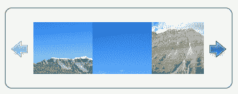
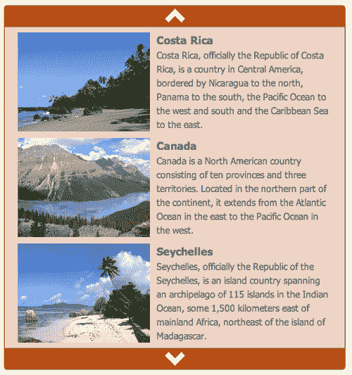
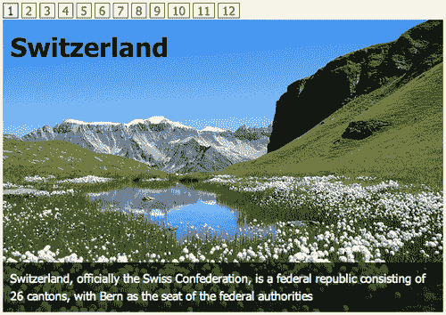
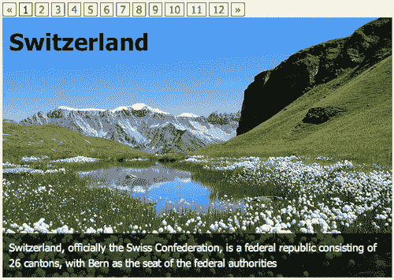
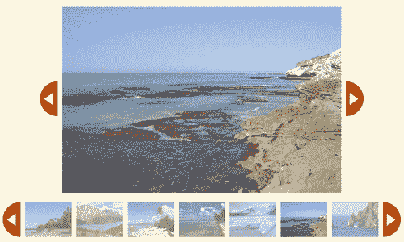

# 第 10 章。以旋转木马和滑块为特色的内容

> 除了幻灯片，我们还可以在幻灯片和旋转木马中显示图像和文本。一次可以看到一张或多张幻灯片，幻灯片之间的过渡使用滑动动画。旋转木马是创建特色内容滑块或在小空间中提供许多图像的理想选择。我们将了解 Jan Sorgalla 提供的灵活且可定制的 jCarousel 插件，以及如何使用它创建几种不同类型的旋转木马和滑块解决方案。

在本章中，我们将学习以下主题：

*   使用 jCarousel 插件创建基本的水平滑块
*   创建垂直新闻报价器
*   使用外部控件创建特色内容滑块
*   将幻灯片与缩略图旋转木马相结合

# 基础 jCarousel

让我们首先看看如何创建一个基本的图像缩略图水平旋转木马。jCarousel 插件包含两种不同的皮肤，因此设置基本的旋转木马既快捷又简单。

以下屏幕截图是使用该插件附带的 tango 蒙皮的基本旋转木马示例：


旋转木马中有十几个缩略图。单击其中一个侧箭头可向左或向右滑动旋转木马以显示下一组。

# 行动时间-创建基本旋转木马

按照以下步骤设置图像的基本 jCarousel：

1.  As usual, we'll get started with our HTML. Set up a basic HTML document and associated files and folders just like we did in [Chapter 1](01.html "Chapter 1. Designer, Meet jQuery"), *Designer, Meet jQuery*. In the body of the HTML document, create an unordered list of images. The carousel works best when the images are of uniform size. I've made my images 200 pixels wide by 150 pixels tall. Here's what my HTML looks like:

    ```js
    <ul id="thumb-carousel">
    <li></li>
    <li></li>
    <li></li>
    <li></li>
    <li></li>
    <li></li>
    <li></li>
    <li></li>
    <li></li>
    <li></li>
    <li></li>
    <li></li>
    </ul>

    ```

    您可以看到，我为无序列表分配了一个`id`的`thumb-carousel`，HTML 非常简单明了：只是一个图像列表。

2.  Next, we'll need to download the jCarousel plugin. The plugin is available for download from GitHub here: [https://github.com/jsor/jcarousel](http://https://github.com/jsor/jcarousel).

    

    要下载插件，只需点击**ZIP**按钮。

3.  Next, unzip the folder and have a look inside.

    

    在里面，我们将找到一个名为 examples 的文件夹，其中包含许多 jCarousel 插件的实例。有一个`index.html`文件包含插件的文档。`skins`文件夹包含插件附带的两个皮肤以及这些皮肤所需的图像。最后，一个 `lib`文件夹包含 jQuery 和两个 jCarousel 插件副本，一个缩小了，一个没有缩小。

4.  我们将使用 `tango`皮肤和插件的缩小版。将 `jquery.jcarousel.min.js`复制到您自己的 `scripts`文件夹中，并将整个 `tango`文件夹复制到您自己的 `styles`文件夹中。
5.  接下来，我们需要将 CSS 和 JavaScript 附加到 HTML 文件中。在文档的`<head>`部分，在您自己的 `styles.css`文件

    ```js
    <link rel="stylesheet" href="styles/tango/skin.css"/>
    <link rel="stylesheet" href="styles/styles.css"/>

    ```

    之前附上 tango skin 的 CSS 文件
6.  在文档的底部，就在结束`</body>`标记之前，在 jQuery 之后和您自己的 `scripts.js:`

    ```js
    <script src="scripts/jquery.js"></script>
    <script src="scripts/jquery.jcarousel.min.js"></script>
    <script src="scripts/scripts.js"></script>

    ```

    之前附上 jCarousel 插件文件
7.  jCarousel 滑块的 tango 外观取决于列表包装器上的 `jcarousel-skin-tango`类。将列表包装在一个 `div`标签中，并给 `div`相应的类：

    ```js
    <div class="jcarousel-skin-tango">
    <ul id="thumb-carousel">
    ...
    </ul>
    </div>

    ```

8.  The next thing we'll do is set up our own JavaScript. Open your `scripts.js` file. Call the `ready` method on the document, select the image list, and call the `jcarousel()` method:

    ```js
    $(document).ready(function(){
    $('#thumb-carousel').jcarousel();
    });

    ```

    通常，通过这种方式调用 `jcarousel()`方法将加载带有所有默认设置的转盘。在浏览器中刷新页面，您将看到以下内容：

    

    这不完全是我们所想的，但单击右侧的下一个箭头将推进旋转木马。让我们来看看在一些地方设置了一些自定义设置，这样我们就可以按照预期的方式查看完整的图像。

9.  tango 皮肤的 CSS 假设我们的图像宽 75 像素，高 75 像素，但旋转木马的情况并非如此。我们将在 `styles.css`中添加几行 CSS，以调整图像的大小。首先，我们将指定单个项目的宽度和高度：

    ```js
    .jcarousel-skin-tango .jcarousel-item { width:200px;height:150px;}

    ```

10.  We'll also have to adjust the overall size of the carousel's container and clip container:

    ```js
    .jcarousel-skin-tango .jcarousel-clip-horizontal { width:830px;height:150px;}
    .jcarousel-skin-tango .jcarousel-container-horizontal { width:830px; }

    ```

    你可能想知道 830 像素宽的测量是从哪里来的。每个项目有 200 像素宽，每个图像之间有 10 个像素。

    200 + 10 + 200 + 10 + 200 + 10 + 200 = 830

    图像的总宽度和它们之间的间隙为 830 像素。

11.  Next, we'll need to bump the next and previous buttons down a bit since our carousel is taller than the default and the buttons appear too high:

    ```js
    .jcarousel-skin-tango .jcarousel-prev-horizontal,
    .jcarousel-skin-tango .jcarousel-next-horizontal { top:75px; }

    ```

    现在旋转木马看起来正是我们想要的：

    

12.  Finally, we'll make a few adjustments to the settings for the jCarousel plugin itself. Like many other plugins, we can make customizations by passing a set of key/value pairs to the `jcarousel()` method inside a pair of curly braces. First, let's change the `scroll` value to `4` so that four items will scroll each time we press the next or previous button. Go back to your `scripts.js` file and add the new key/value pair to your script as follows:

    ```js
    $('#thumb-carousel').jcarousel({
    scroll: 4
    });

    ```

    接下来，旋转木马当前在开始或结束时达到硬停止。相反，我们将使旋转木马自动换行如果站点访问者正在查看旋转木马中的最后一个项目并按下“下一步”按钮，则旋转木马将自动换行到开头。反之亦然，如果在查看第一个项目时单击“上一步”按钮。我们将为 `wrap`键添加一个 `'both'`值，以便旋转木马在任意一端缠绕：

    ```js
    $('#thumb-carousel').jcarousel({
    scroll: 4,
    wrap: 'both'
    });

    ```

    在浏览器中刷新页面，并使用“下一步”或“上一步”按钮或两者的任意组合在旋转木马中翻页。这就是使用 jCarousel 插件创建简单旋转木马的全部内容。

## 刚才发生了什么事？

我们使用 jCarousel 插件创建了一个基本的动画图像缩略图旋转木马。我们使用了插件附带的一个默认皮肤，并使用 CSS 对内容的大小进行了调整。一些简单的定制被传递到旋转木马，以确保它按照我们想要的方式工作。

# 动画新闻播报器

水平图像旋转木马很不错，但它的用途非常有限。幸运的是，jCarousel 插件足够灵活，可以用于各种不同的目的。在本节中，我们将学习如何创建动画新闻摘要。

# 行动的时间到了——创建一个动画新闻播报器

按照以下步骤设置垂直新闻列表：

1.  First, up, we'll set up a basic HTML file and associated files and folders like we did in [Chapter 1](01.html "Chapter 1. Designer, Meet jQuery"), *Designer, Meet jQuery*. In the body of the HTML document, create an unordered list of news items. Each news item will have an image and a div that contains a headline and an excerpt:

    ```js
    <ul id="news-carousel">
    <li>
    
    <div class="info">
    <h4>Switzerland</h4>
    <p>Switzerland, officially the Swiss Confederation, is a federal republic consisting of 26 cantons, with Bern as the seat of the federal authorities</p>
    </div>
    </li>
    <li>
    
    <div class="info">
    <h4>Costa Rica</h4>
    <p>Costa Rica, officially the Republic of Costa Rica, is a country in Central America, bordered by Nicaragua to the north, Panama to the south, the Pacific Ocean to the west and south and the Caribbean Sea to the east.</p>
    </div>
    </li>
    ...
    </ul>

    ```

    我在列表中总共创建了 12 个项目，每个项目都具有相同的结构。请记住，转盘中的每个项目必须具有相同的宽度和高度。

2.  Next up, we'll open our `styles.css` file and add a few lines of CSS to get each news item styled the way we'd like, with the image on the left and the headline and excerpt on the right:

    ```js
    #news-carousel li { overflow:hidden;zoom:1;list-style-type:none; }
    #news-carousel li img { float:left; }
    #news-carousel li .info { margin-left:210px; }
    #news-carousel h4 { margin:0;padding:0; }
    #news-carousel p { margin:0;padding:0;font-size:14px; }

    ```

    您可以随意添加一些附加的 CSS 来设置列表的样式，以适合您自己的口味。如果您在浏览器中打开页面，此时，您可以看到类似于以下屏幕截图的内容：

    

3.  就像在我们的简单旋转木马示例中一样，我们将在文档的`<head>`部分附加 tango skin CSS，并在文档的底部附加 jCarousel 插件脚本，在 jQuery 和我们自己的 `scripts.js`文件之间。
4.  接下来，打开您的 `scripts.js`文件。我们将编写 documentready 语句，选择 news ticker 并调用 `jcarousel()`方法，就像我们在前面的示例中所做的那样。

    ```js
    $(document).ready(function(){
    $('#news-carousel').jcarousel();
    });

    ```

5.  我们将向 `jcarousel()`方法传递一些定制选项，以调整旋转木马，使其按我们希望的方式工作。首先，它应该是垂直的，而不是水平的，所以将 `true`作为 `vertical`键的值传递给

    ```js
    $('#news-carousel').jcarousel({
    vertical:true
    });

    ```

6.  我们还希望一次只滚动一个项目：

    ```js
    $('#news-carousel').jcarousel({
    vertical:true,
    scroll:1
    });

    ```

7.  而且，我们希望新闻项目列表如下所示无休止地循环：

    ```js
    $('#news-carousel').jcarousel({
    vertical:true,
    scroll:1,
    wrap:'circular'
    });

    ```

8.  我们希望旋转木马能够以真实新闻的方式自动浏览新闻故事。我们将每三秒推进一次旋转木马：

    ```js
    $('#news-carousel').jcarousel({
    vertical:true,
    scroll:1,
    wrap:'circular',
    auto: 3
    });

    ```

9.  最后但并非最不重要的一点是，我们将把动画放慢一点，这样当我们的网站访问者在动画被触发的时候，我们的站点访问者就不会那么紧张了。600 毫秒应该足够慢：

    ```js
    $('#news-carousel').jcarousel({
    vertical:true,
    scroll:1,
    wrap:'circular',
    auto: 3,
    animation: 600
    });

    ```

10.  Now that we've got jCarousel configured just the way we'd like, all that's left to do is customize the appearance of the carousel. We're currently using the default tango skin, which is still assuming our individual items are 75 pixels wide by 75 pixels tall. Open your `styles.css` file and we'll get started by adjusting the necessary widths and heights as follows:

    ```js
    .jcarousel-skin-tango .jcarousel-item { width:475px;height:150px; }
    .jcarousel-skin-tango .jcarousel-clip-vertical { width:475px;height:470px; }
    .jcarousel-skin-tango .jcarousel-container-vertical { height:470px;width:475px; }

    ```

    我们已经将单个项目的大小设置为 475 像素宽乘以 150 像素高。然后调整容器和剪辑容器的大小以显示三个项目。作为提醒，由于我们旋转木马中的每个项目都有 150 像素高，项目之间有 10 像素的空间，因此我们可以按如下方式计算容器的高度：

    150+10+150+10+150=470 像素

    我们在计算中使用的是高度而不是宽度，因为我们的旋转木马现在是垂直的而不是水平的。

11.  接下来，我们将稍微调整 tango 样式，以适合我的网站设计。我将首先用橙色方案替换容器的淡蓝色方案，并将圆角调整为稍微不圆：

    ```js
    .jcarousel-skin-tango .jcarousel-container { -moz-border-radius: 5px;-webkit-border-radius:5px;border-radius:5px;border-color:#CB4B16;background:#f9d4c5; }

    ```

12.  Now, let's replace the small blue arrows of the tango skin with a long orange bar that spans the full width of our carousel. I've created my own arrow graphic that I'll show in the middle of each button:

    ```js
    .jcarousel-skin-tango .jcarousel-prev-vertical,
    .jcarousel-skin-tango .jcarousel-next-vertical { left:0;right:0;width:auto; }
    .jcarousel-skin-tango .jcarousel-prev-vertical { top:0;background:#cb4b16 url(images/arrows.png) 50% 0 no-repeat; }
    .jcarousel-skin-tango .jcarousel-prev-vertical:hover,
    .jcarousel-skin-tango .jcarousel-prev-vertical:focus { background-color:#e6581d;background-position:50% 0; }
    .jcarousel-skin-tango .jcarousel-next-vertical { background:#cb4b16 url(images/arrows.png) 50% -32px no-repeat;bottom:0; }
    .jcarousel-skin-tango .jcarousel-next-vertical:hover,
    .jcarousel-skin-tango .jcarousel-next-vertical:focus { background-color:#e6581d;background-position:50% -32px; }

    ```

    现在，如果在浏览器中刷新页面，您将看到旋转木马重新设计了一点，具有不同的配色方案和外观：

    

    将鼠标移到顶部或底部栏上会使颜色变浅一点，单击一个栏会使旋转木马在该方向前进一个项目。

## 刚才发生了什么事？

在本例中，我们使用 jCarousel 插件创建了一个垂直的新闻标签。我们的新闻播报器每三秒自动播报一条新闻。我们放慢了动画的速度，以便为我们的网站访问者提供更流畅的阅读体验。我们还了解了如何定制 tango skin 的 CSS，以定制旋转木马的配色方案和外观，以符合我们网站的设计。接下来，我们将了解如何向旋转木马添加一些外部控件。

## 拥有一个英雄——设计你自己的旋转木马

现在，您已经了解了如何定制 jCarousel 插件的外观和行为，请设计您自己的旋转木马。它可以是水平或垂直的，包含文本、图像或两者的组合。尝试一下 jCarousel 插件提供给您的设置——您会发现它们都列出来了，并在插件的文档中进行了解释。

# 特色内容滑块

除了一次显示多个项目的旋转木马之外，jCarousel 还可以用于构建一次只显示一个项目的内容滑块。还可以构建外部控件，为旋转木马添加一些附加功能。让我们来看看如何创建一个带有外部分页控件的单幻灯片特色内容滑块。

# 行动时间-创建特色内容滑块

我们将像往常一样开始设置我们的基本 HTML 文件以及相关的文件和文件夹，就像我们在[第 1 章](01.html "Chapter 1. Designer, Meet jQuery")中所做的一样，*设计器，与 jQuery*会面。

1.  In the body of the HTML document, the HTML markup for our featured content slider will be very similar to the HTML we set up for a news ticker. The only difference is that I'm replacing the images with larger images since I want images to be the main focus of the slider. I'm using images that are 600 pixels wide by 400 pixels tall. The following is a sample of the HTML:

    ```js
    <div class="jcarousel-skin-slider">
    <ul id="featured-carousel">
    <li>
    <a href="#"></a>
    <div class="info">
    <h4>Switzerland</h4>
    <p>Switzerland, officially the Swiss Confederation, is a federal republic consisting of 26 cantons, with Bern as the seat of the federal authorities</p>
    </div>
    </li>
    <li>
    <a href="#"></a>
    <div class="info">
    <h4>Costa Rica</h4>
    <p>Costa Rica, officially the Republic of Costa Rica, is a country in Central America, bordered by Nicaragua to the north, Panama to the south, the Pacific Ocean to the west and south and the Caribbean Sea to the east.</p>
    </div>
    </li>
    ...
    </ul>
    </div>

    ```

    我的清单上一共有 12 项，每项都按照你在这里看到的方式标记。请注意，我已将我的列表包装在一个带有类`jcarousel-skin-slider`的 `div`中。我们将使用这个类来使用 CSS 设置列表的样式。

2.  Next up, we'll style our list of items. We'll overlay the headline and paragraph of text on the photo, the header along the top, and the paragraph of text along the bottom. The following is the CSS we can use to accomplish that:

    ```js
    #featured-carousel li { overflow:hidden;list-style-type:none;position:relative;width:600px;height:400px; }
    #featured-carousel h4 { position:absolute;top:0;left:0;right:0;padding:10px;margin:0;color:#000;font-size:36px;text-shadow:#fff 0 0 1px; }
    #featured-carousel p { position:absolute;bottom:0;left:0;right:0;padding:10px;margin:0;color:#fff;background:#000;background:rgba(0,0,0,0.7); }

    ```

    现在，我的列表中的每个项目看起来都类似于以下屏幕截图：

    

    我想提请大家注意我在这里使用的几个方便的 CSS 技巧。首先，请注意，我在标题中添加了一个小的白色`text-shadow`，并将标题文本变为黑色。为了防止此文本恰好覆盖图像的一个暗区域，文本周围微妙的白色轮廓将帮助文本脱颖而出。然后，请注意，我为文本的短段落添加了两个背景值。第一种颜色是纯黑色，第二种颜色是透明黑色，用`rgba`值表示。第一个值适用于 IE9 之前的 Internet Explorer 版本。这些浏览器将显示纯黑色背景。较新且功能更强大的浏览器将使用第二个值`rgba`值在文本后面显示一个略微透明的黑色背景，允许图像显示一点，同时使文本更具可读性。

3.  现在，我们将 jCarousel JavaScript 附加在页面底部，jQuery 和 `scripts.js`文件之间，就像我们在本章其他示例中所做的那样。

    ```js
    <script src="scripts/jquery.js"></script>
    <script src="scripts/jquery.jcarousel.min.js"></script>
    <script src="scripts/scripts.js"></script>

    ```

4.  Now we're going to write a bit of CSS to customize the appearance of our content slider. Open your `styles.css` file and add the following styles:

    ```js
    .jcarousel-skin-slider .jcarousel-container-horizontal { width: 600px; }
    .jcarousel-skin-slider .jcarousel-clip { overflow: hidden; }
    .jcarousel-skin-slider .jcarousel-clip-horizontal { width:600px;height:425px; }
    .jcarousel-skin-slider .jcarousel-item { width:600px;height:400px; }

    ```

    是的，就是这样。就几行。我们将单个项目、容器和剪辑容器的宽度设置为 600 像素，与一幅图像的宽度相同。单个项目的高度也设置为 400 像素，但我们将剪辑容器的高度设置为 425 像素，以便为我们提供 25 像素以添加一些外部控件，我们将在一分钟内查看这些控件。

5.  现在，打开你的 `scripts.js`文件。我们要做的第一件事是选择列表并将其存储在变量中。这是因为我们将多次使用该列表，并且我们不希望 jQuery 每次都必须查询 DOM 来查找我们的列表。

    ```js
    var slider = $('#featured-carousel');

    ```

6.  接下来，我们将设置 document ready 语句并调用滑块上的 `jcarousel()`方法，然后告诉它我们希望一次滚动一个窗格：

    ```js
    var slider = $('#featured-carousel');
    $(document).ready(function(){
    slider.jcarousel({
    scroll: 1
    });
    });

    ```

7.  We're going to be adding our own external controls, so we'll need to remove the ones that the `jcarousel()` method creates on its own. Here's how we can do that:

    ```js
    $(document).ready(function(){
    slider.jcarousel({
    scroll: 1,
    buttonNextHTML: null,
    buttonPrevHTML: null	
    });
    });

    ```

    提供了`buttonNextHTML`和`buttonPrevHTML`键，以便您可以为这些按钮指定自己的 HTML 标记。在本例中，我们将`null`作为两个键的值传递，这将阻止创建它们。

    现在我们已经完成了设置滑块的基本步骤。如果您在浏览器中查看页面，您将看到第一张幻灯片。我们还没有提供一种导航到其他幻灯片的方法，所以让我们下一步开始。

    

## 分页控件

我们已经设置了一个基本的滑块，一次显示一个项目，但毫无疑问，您已经注意到除了第一个幻灯片之外，没有其他方法可以查看任何幻灯片。我们删除了 jCarousel 的默认“下一步”和“上一步”按钮，但还没有提供任何替代选项。让我们添加一些分页控件，以便我们的网站访问者可以访问他们喜欢的任何幻灯片。

# 操作时间-添加分页控件

接下来，我们要设置创建下一个按钮、上一个按钮和分页按钮的函数，并使它们工作。

1.  The jCarousel plugin provides a key called `initCallback` that will allow us to pass in the name of a function that should be called when the carousel is created. Let's get started by creating an empty function and calling it:

    ```js
    var slider = $('#featured-carousel');
    function carouselInit(carousel) {
    // Our function goes here
    }
    $(document).ready(function(){
    slider.jcarousel({
    scroll: 1,
    buttonNextHTML: null,
    buttonPrevHTML: null,
    initCallback: carouselInit	
    });
    });

    ```

    无论我们在 `carouselInit()`函数中写入什么操作，它都将在转盘初始化或设置时执行。由于任何页码和上一页和下一页按钮只有在启用 JavaScript 时才起作用，因此我们希望使用 JavaScript 动态创建这些按钮，而不是在 HTML 中对它们进行编码。让我们来看看如何创建一个页面链接列表到滑块中的每个幻灯片。

2.  我们将从获取滑块中的所有幻灯片开始。请记住，我们的滑块是一个无序列表，滑块中的每个幻灯片都是列表中的单个列表项。由于我们已经保存了对滑块本身的引用，我们可以按如下方式获取其中的所有幻灯片：

    ```js
    function carouselInit(carousel) {
    var slides = slider.find('li');
    }

    ```

3.  稍后我们将使用这些幻灯片创建页码。同时，我们需要一个位置来放置页码，所以让我们在滑块之前创建两个容器，以便分页显示在滑块的正上方。下面是我们如何在滑块前面插入两个嵌套的`<div>`标记：

    ```js
    function carouselInit(carousel) {
    var slides = slider.find('li');
    slider.before('<span id="page-controls"><span id="pages"></span></span>');
    }

    ```

4.  接下来，我们需要在代码中多次引用这两个新创建的容器，因此我们将在变量中存储对它们的引用，如以下代码所示：

    ```js
    function carouselInit(carousel) {
    var slides = slider.find('li');
    slider.before('<span id="page-controls"><span id="pages"></span></span>');
    var controls = $('#page-controls');
    var pages = $('#pages');
    }

    ```

5.  Now, we're going to get fancy and create a page number for each slide in the slider. The following is the code we'll add:

    ```js
    function carouselInit(carousel) {
    var slides = slider.find('li');
    slider.before('<span id="page-controls"><span id="pages"></span></span>');
    var controls = $('#page-controls');
    var pages = $('#pages');
    for (i=1; i<=slides.length; i++) {
    pages.append('<a href="#">' + i + '</a>');
    }
    }

    ```

    我们从`i = 1`开始，因为第一页的页码是 1。然后我们检查`i`是否小于或等于幻灯片数量（`slides.length`是幻灯片数量）。如果`i`小于或等于幻灯片的数量，我们将 i 增加一个数字，基本上我们将向`i`添加 1，`i++`是 JavaScript 表示`i = i+1`的快捷方式。

    每次通过循环，我们都将向我们创建的页面容器添加一个链接。这是一个围绕页码的链接，我代表我们的页码。

    如果此时在浏览器中刷新页面，您将看到幻灯片上方链接的数字 1 到 12。它们没有样式，单击它们不会做任何事情，因为我们还没有设置，这是我们下一步要做的。

    

6.  Next, we want to style the links so that they look the way we'd like. Open up your `styles.css` file and add these few lines to the CSS:

    ```js
    #page-controls { line-height:25px;height:25px; }
    #page-controls a { margin:0 4px 0 0;padding:0 5px;border:1px solid #859900; }
    #page-controls a:hover { border-color: #D33682; }
    #page-controls a.current { color:#333;border-color:#333; }

    ```

    这将滑块控件行的高度设置为之前允许的 25 像素。然后，我们在每个链接周围放置一个绿色边框，当链接悬停在上面时，它将变成粉红色边框。我们调整了边距和填充，以得到一行间隔很好的方框。最后，我们为我们的链接添加了一个`.current`类，允许我们用深灰色标记当前选择的链接。

    

7.  好的，我们已经在文档中添加了页码，所以我们所要做的就是让它们正常工作。我们将为这些链接绑定一个 click 函数，因为我们希望当我们的站点访问者单击这些链接时会发生一些事情。我们将按如下方式开始：

    ```js
    function carouselInit(carousel) {
    var slides = slider.find('li');
    slider.before('<span id="page-controls"><span id="pages"></span></span>');
    var controls = $('#page-controls');
    var pages = $('#pages');
    for (i=1; i<=slides.length; i++) {
    pages.append('<a href="#">' + i + '</a>');
    }
    pages.find('a').bind('click', function(){
    //click code will go here
    });
    }

    ```

8.  在我们的函数中要做的第一件事是取消单击的默认操作，这样当链接被单击时，浏览器就不会尝试做自己的事情。

    ```js
    function carouselInit(carousel) {
    var slides = slider.find('li');
    slider.before('<span id="page-controls"><span id="pages"></span></span>');
    var controls = $('#page-controls');
    var pages = $('#pages');
    for (i=1; i<=slides.length; i++) {
    pages.append('<a href="#">' + i + '</a>');
    }
    pages.find('a').bind('click', function(){
    return false;
    });
    }

    ```

9.  The jCarousel plugin offers us a nice way to scroll to a particular slide in the slider. It looks as follows:

    ```js
    carousel.scroll($.jcarousel.intval(number));

    ```

    靠近末尾的`number`是我们要滚动到的幻灯片中要经过的地方。例如，如果我们想滚动到第六张幻灯片，我们会说：

    ```js
    carousel.scroll($.jcarousel.intval(6));

    ```

    在我们的例子中，我们想要滚动到的数字幻灯片是链接中的页码。例如，如果我单击以下链接：

    ```js
    <a href="#">3</a>

    ```

    这意味着我想滚动到滑块中的第三张幻灯片。我可以使用 jQuery 的`text()`方法得到这个数字，如下所示：

    ```js
    pages.find('a').bind('click', function(){
    carousel.scroll($.jcarousel.intval($(this).text()));
    return false;
    });

    ```

    如果我点击第四个链接，`$(this).text()`将等于 4；在第七个环节，它将等于 7，依此类推。

    在浏览器中刷新页面，您将看到单击带编号的链接会将滑块滚动到该幻灯片。

10.  Clicking on the page numbers, you probably noticed that the current page number isn't highlighted in the pagination. We already wrote the CSS to highlight a link that has the `current` class—now we just have to be sure we're adding that class to the current link. Here's how we'll do that.

    ```js
    pages.find('a').bind('click', function(){
    carousel.scroll($.jcarousel.intval($(this).text()));
    $(this).addClass('current');
    return false;
    });

    ```

    现在，如果您在浏览器中刷新页面，您将看到单击页码会将`current`类 CSS 应用于链接，并将其高亮显示。但是，单击第二个页码会在上一个链接的基础上突出显示该链接。我们必须确保我们正在从旧链接中删除该类。添加以下行以处理该问题：

    ```js
    pages.find('a').bind('click', function(){
    carousel.scroll($.jcarousel.intval($(this).text()));
    $(this).siblings('.current').removeClass('current');
    $(this).addClass('current');
    return false;
    });

    ```

    此行将检查所有链接的同级，以查找可能具有当前类的链接。如果找到任何类，它将删除该类。

11.  Now, we just have to make sure the first link is highlighted when the carousel is initialized. The easiest way to do that is to simply click the first link in the pagination when the carousel is created, as follows:

    ```js
    pages.find('a').bind('click', function(){
    carousel.scroll($.jcarousel.intval($(this).text()));
    $(this).siblings('.current').removeClass('current');
    $(this).addClass('current');
    return false;
    }).filter(':first').click();

    ```

    请记住，jQuery 允许我们链接方法，即使我们在`bind()`方法中编写了一个完整的函数，我们仍然可以将下一个方法链接到它的末尾。我们调用`filter()`方法将链接列表缩小到第一个，然后调用`click()`方法启动我们刚刚绑定到链接的单击功能。

    现在，如果您在浏览器中刷新页面，您将看到第一个链接用当前的 CSS 类高亮显示。

    

## 下一步和上一步按钮

现在我们已经设置好了滑动条，页码也正常工作了，但我们还希望有简单的“下一页”和“上一页”按钮，以便一次一张地浏览幻灯片。我们将在分页控件的任一端添加这些控件。

# 动作时间-添加下一步和上一步按钮

现在只剩下添加下一个和上一个按钮。

1.  We'll add the previous button at the beginning of the pagination, and the next button at the end. Here's how we can use jQuery to insert those links in our document:

    ```js
    function carouselInit(carousel) {
    var slides = slider.find('li');
    slider.before('<span id="page-controls"><span id="pages"></span></span>');
    var controls = $('#page-controls');
    var pages = $('#pages');
    for (i=1; i<=slides.length; i++) {
    pages.append('<a href="#">' + i + '</a>');
    }
    pages.find('a').bind('click', function(){
    carousel.scroll($.jcarousel.intval($(this).text()));
    $(this).siblings('.current').removeClass('current');
    $(this).addClass('current');
    return false;
    }).filter(':first').click();
    controls.prepend('<a href="#" id="prev">&laquo;</a>');
    controls.append('<a href="#" id="next">&raquo;</a>');
    }

    ```

    我使用了`prepend()`方法在页码前插入上一个按钮，`append()`方法在页码后插入下一个按钮。

    如果在浏览器中刷新页面，您将看到“下一步”和“上一步”按钮以及分页按钮一起显示。

    

    然而，点击它们不会导致任何事情发生，我们必须连接这些按钮，使它们工作。让我们从“下一步”按钮开始。

2.  Just like with the pagination buttons, we need to bind a click event. Again, the jCarousel plugin provides a nice way for us to advance to the next slide.

    ```js
    function carouselInit(carousel) {
    var slides = slider.find('li');
    slider.before('<span id="page-controls"><span id="pages"></span></span>');
    var controls = $('#page-controls');
    var pages = $('#pages');
    for (i=1; i<=slides.length; i++) {
    pages.append('<a href="#">' + i + '</a>');
    }
    pages.find('a').bind('click', function(){
    carousel.scroll($.jcarousel.intval($(this).text()));
    $(this).siblings('.current').removeClass('current');
    $(this).addClass('current');
    return false;
    }).filter(':first').click();
    controls.prepend('<a href="#" id="prev">&laquo;</a>');
    controls.append('<a href="#" id="next">&raquo;</a>');
    $('#next').bind('click', function() {
    carousel.next();
    return false;
    });
    }

    ```

    我们正在选择 next 按钮并绑定一个 click 事件。我们正在取消浏览器的默认操作，以便在单击链接时浏览器不会尝试执行任何操作。然后，我们所要做的就是调用 `carousel.next()`，jCarousel 将为我们处理下一张幻灯片。

    在浏览器中刷新页面，您将看到单击“下一步”按钮将滑块向前移动一个幻灯片。

    但是，您还会注意到，分页中当前突出显示的页面没有更新。让我们来看看我们怎样才能做到这一点。

3.  We'll get started by finding the currently highlighted page number as follows:

    ```js
    $('#next').bind('click', function() {
    carousel.next();
    var current = pages.find('.current');
    return false;
    });

    ```

    在这里，我们只是在我们的页码内查找带有`current`类的页面。

4.  Next, we'll remove the `current` class, move to the next page number link, and add the `current` class to that one as follows:

    ```js
    current.removeClass('current').next().addClass('current');

    ```

    啊，但不要那么快，我们只想在有下一个链接的情况下这样做。如果没有，那么我们什么都不想做。如果我们检查`current.next().` `length`，我们可以知道是否有下一个链接。因此，我们只需将这段代码封装在一个`if`语句中，如下代码所示：

    ```js
    if ( current.next().length ) { current.removeClass('current').next().addClass('current'); }

    ```

    现在，如果在浏览器中刷新页面，您将看到“下一步”按钮按预期工作。当我们到达最后一页时，它什么也没做，正如我们所期望的那样。

5.  Now we'll repeat that whole process with the previous button the function is very similar. The following is what it will look like:

    ```js
    $('#prev').bind('click', function(){
    carousel.prev();
    var current = pages.find('.current');
    if ( current.prev().length ) { current.removeClass('current').prev().addClass('current'); }
    return false;
    });

    ```

    下面是我们完整的`carouselInit()`函数的样子：

    ```js
    function carouselInit(carousel) {
    var slides = slider.find('li');
    slider.before('<span id="page-controls"><span id="pages"></span></span>');
    var controls = $('#page-controls');
    var pages = $('#pages');
    for (i=1; i<=slides.length; i++) {
    pages.append('<a href="#">' + i + '</a>');
    }
    pages.find('a').bind('click', function(){
    carousel.scroll($.jcarousel.intval($(this).text()));
    $(this).siblings('.current').removeClass('current');
    $(this).addClass('current');
    return false;
    }).filter(':first').click();
    controls.prepend('<a href="#" id="prev">&laquo;</a>');
    controls.append('<a href="#" id="next">&raquo;</a>');
    $('#prev').bind('click', function(){
    carousel.prev();
    var current = pages.find('.current');
    if ( current.prev().length ) { current.removeClass('current').prev().addClass('current'); }
    return false;
    });
    $('#next').bind('click', function() {
    carousel.next();
    var current = pages.find('.current');
    if ( current.next().length ) { current.removeClass('current').next().addClass('current'); }
    return false;
    });
    }

    ```

    现在，如果在浏览器中刷新页面，您将看到“下一步”和“上一步”按钮以及页码都按预期工作。您可以使用这些外部控件导航到滑块中的任何幻灯片。

    

## 刚才发生了什么事？

我们将 jCarousel 设置为一次显示一张幻灯片。我们确保 jCarousel 没有创建自己的下一个和上一个按钮。我们使用 jQuery 将下一步、上一步和分页按钮添加到文档中，然后使用 jCarousel 的有用方法从这些外部控件控制旋转木马。我们确保当前显示的幻灯片在分页中突出显示，以便于我们的网站访问者查看他们在幻灯片中的位置。

# 旋转木马幻灯片放映

现在我们已经学习了如何设置控制旋转木马的外部控件，让我们换一种方式来设置旋转木马以控制幻灯片放映。在本节中，我们将创建一个简单的交叉淡入淡出幻灯片，它由缩略图的旋转木马控制。下面是我们将要创建的示例：



单击旋转木马内的任何缩略图，将在幻灯片区域加载该图像的大版本。我还在幻灯片附近提供了“下一步”和“上一步”按钮，允许站点访问者在幻灯片中一次前进一张照片，而无需单击单个缩略图。让我们来看看如何把这些放在一起。

# 行动时间-创建缩略图幻灯片

设置旋转木马缩略图幻灯片将是我们用 jCarousel 做过的最棘手的事情。但别担心，我们会一步一步来。

1.  I bet you can guess how we're going to get started, can't you? That's right, by setting up our simple HTML file and associated files and folders, just as we did in [Chapter 1](01.html "Chapter 1. Designer, Meet jQuery"), *Designer, Meet jQuery*. In this case, we want just a simple list of thumbnails that are linked to the full-size version of the image. And we're going to wrap that up in a`<div>` for styling purposes. Here's what my list looks like:

    ```js
    <div class="jcarousel-skin-slideshow">
    <ul id="thumb-carousel">
    <li><a href="images/600/Switzerland.jpg"></a></li>
    <li><a href="images/600/CostaRica.jpg"></a></li>
    <li><a href="images/600/Canada.jpg"></a></li>
    ...
    </ul>
    </div>

    ```

    我的清单上一共有 12 个项目，它们的标记都是一样的。

2.  Next, we'll write the CSS for the carousel. It's a custom design, so we won't be including one of the stylesheets provided with jCarousel. Open up your `styles.css` file and add the following CSS:

    ```js
    .jcarousel-skin-slideshow .jcarousel-container { }
    .jcarousel-skin-slideshow .jcarousel-container-horizontal { width:760px;padding:0 48px; }
    .jcarousel-skin-slideshow .jcarousel-clip { overflow:hidden; }
    .jcarousel-skin-slideshow .jcarousel-clip-horizontal { width:760px;height:75px; }
    .jcarousel-skin-slideshow .jcarousel-item { width:100px;height:75px; }
    .jcarousel-skin-slideshow .jcarousel-item-horizontal { margin-left:0;margin-right:10px; }
    .jcarousel-skin-slideshow .jcarousel-item-placeholder { background:#fff;color:#000; }
    .jcarousel-skin-slideshow .jcarousel-next-horizontal { position:absolute;top:0;right:0;width:38px;height:75px;cursor:pointer;background:transparent url(images/arrow-right.png) no-repeat 0 0; }
    .jcarousel-skin-slideshow .jcarousel-next-horizontal:hover,
    .jcarousel-skin-slideshow .jcarousel-next-horizontal:focus { background-position:0 -75px; }
    .jcarousel-skin-slideshow .jcarousel-next-horizontal:active { background-position: 0 -75px; }
    .jcarousel-skin-slideshow .jcarousel-prev-horizontal { position:absolute;top:0;left:0;width:38px;height:75px;cursor:pointer;background:transparent url(images/arrow-left.png) no-repeat 0 0; }
    .jcarousel-skin-slideshow .jcarousel-prev-horizontal:hover,
    .jcarousel-skin-slideshow .jcarousel-prev-horizontal:focus { background-position: 0 -75px; }
    .jcarousel-skin-slideshow .jcarousel-prev-horizontal:active { background-position: 0 -75px; }

    ```

    我已经创建了一个图像精灵，其中包含我的下一个和上一个按钮的图像，这就是用作这些按钮背景图像的内容。剩下的部分应该看起来很熟悉，为单个项目和旋转木马本身设置合适的尺寸。

3.  现在，我们将把 jCarousel 插件附在文档底部，在 jQuery 和您的 `scripts.js`文件

    ```js
    <script src="scripts/jquery.js"></script>
    <script src="scripts/jquery.jcarousel.min.js"></script>
    <script src="scripts/scripts.js"></script>

    ```

    之间
4.  Open up your `scripts.js` file and we'll get the JavaScript started by getting our thumbnail carousel up and running. Inside a document ready statement, select the carousel and call the `jcarousel()` method as follows:

    ```js
    $(document).ready(function(){
    $('#thumb-carousel').jcarousel({
    scroll: 6,
    wrap: 'circular'
    });
    });

    ```

    我们已经为`wrap`键指定了一个`'circular'`值，这意味着旋转木马既没有开始，也没有结束。当站点访问者滚动浏览时，旋转木马将不断环绕。

连续包装很好-我们的网站访问者将能够单击前进或后退旋转木马按钮，无论它们在哪里，这感觉比禁用按钮更友好。然而，连续滚动会使我们的网站访问者更难跟踪他们在旋转木马中的位置。因此，我们将滚动设置为 `6`，即使我们的旋转木马能够显示七幅图像。

假设我们的网站访问者正在观看我们的旋转木马，在旋转木马的第一个插槽中有一张美丽海滩场景的照片。网站访问者点击“上一步”按钮，美丽的海滩场景滑到旋转木马的最后一个位置。在一个新的位置看到同样的图像有助于传达刚刚发生的事情，并确保我们的网站访问者不会错过任何东西。


## 刚才发生了什么事？

我们遵循了与前面 jCarousel 示例类似的步骤。设置我们的 HTML，为旋转木马编写一些 CSS 样式，然后使用 jQuery 选择拇指列表并调用 `jCarousel()`方法。现在，让我们更进一步，在旋转木马中添加幻灯片。

## 幻灯片放映

现在，我们已经按照我们想要的方式设置了简单的旋转木马并设计了样式，让我们开始添加 crossfade 幻灯片放映功能。

# 行动时间-添加幻灯片

jCarousel 插件已经为我们设置了旋转木马，但我们希望获得更多乐趣，并添加一个幻灯片区域。

1.  我们在这里是独立的，所以我们将创建一个单独的函数来创建幻灯片区域。然后我们将在 documentready 语句中调用新函数：

    ```js
    function slideshowInit() {
    // Slideshow setup goes here
    }
    $(document).ready(function(){
    slideshowInit();
    $('#thumb-carousel').jcarousel({
    scroll: 6,
    wrap: 'circular'
    });
    });

    ```

2.  首先，我们将在缩略图列表周围包装一个容器以创建幻灯片区域。我们发现自己已经需要再次引用缩略图列表，所以让我们将对它的引用存储在一个变量中，并更新对 `jcarousel()`方法的调用，如下所示：

    ```js
    var thumbs = $('#thumb-carousel');
    function slideshowInit() {
    // Slideshow setup goes here
    }
    $(document).ready(function(){
    slideshowInit();
    thumbs.jcarousel({
    scroll: 6,
    wrap: 'circular'
    });
    });

    ```

3.  接下来，在 `slideshowInit()`函数中，我们将调用 jQuery 的 `wrap()`方法将列表包装为`<div>`。

    ```js
    function slideshowInit() {
    thumbs.wrap('<div id="stage-wrap"></div>');
    }

    ```

4.  接下来，我们需要创建一个真实的舞台，在那里全尺寸的图像将被展示。我们还需要创建下一个和上一个按钮。我们将使用 `prepend()`方法，以便在 thumbs 列表之前将这些元素插入 `stage-wrap div`。

    ```js
    function slideshowInit() {
    thumbs.wrap('<div id="stage-wrap"></div>');
    $('#stage-wrap').prepend('<div id="slideshow-next"></div><div id="slideshow-prev"></div><div id="stage"></div>');
    }

    ```

5.  Now, we'll pop back into our `styles.css` file and add some styles for these new elements as follows:

    ```js
    #stage-wrap { position:relative;width:856px; }
    #stage { width:600px;height:400px;padding:0 0 20px 0;position:relative;text-align:center;margin:0 128px; }
    #stage img { position:absolute;top:0;left:50%;margin-left:-300px; }
    #slideshow-next { position:absolute;right:80px;top:160px;width:38px;height:75px;cursor:pointer;background:transparent url(images/arrow-right.png) no-repeat 0 0; }
    #slideshow-next:hover,
    #slideshow-next:active { background-position:0 -75px; }
    #slideshow-prev { position:absolute;left:80px;top:160px;width:38px;height:75px;cursor:pointer;background:transparent url(images/arrow-left.png) no-repeat 0 0; }
    #slideshow-prev:hover,
    #slideshow-prev:active { background-position:0 -75px; }

    ```

    我们所有的全尺寸图像都是相同大小的 600x400，因此我们可以将其设置为舞台的宽度和高度，并相应地定位下一个和上一个图像按钮。如果您现在在浏览器中查看页面，您应该会看到为舞台留下的一个大空白区域，以及舞台两侧的“下一个”和“上一个”图像按钮，所有这些按钮都位于缩略图转盘上方。

    

6.  We've got a carousel, we've got an empty stage, and we've got next and previous buttons on either side of our stage. Next, we'll populate the stage with an image slideshow. We'll get started by setting up a variable to refer to the stage and setting the `opacity` of the stage to `0` as shown in the following code:

    ```js
    function slideshowInit() {
    thumbs.wrap('<div id="stage-wrap"></div>');
    $('#stage-wrap').prepend('<div id="slideshow-next"></div><div id="slideshow-prev"></div><div id="stage"></div>');
    var stage = $('#stage');
    stage.css('opacity',0);
    }

    ```

    我们将舞台隐藏起来，这样我们就可以将图像加载到其中，而不会让网站访问者看到加载的图像。这让我们可以控制幻灯片在创建时的显示方式。我们要让舞台隐形，直到有东西看。

7.  Next, we'll need to get all the links to the full-size images and get ready to find the URL for each full-size image as follows:

    ```js
    function slideshowInit() {
    thumbs.wrap('<div id="stage-wrap"></div>');
    $('#stage-wrap').prepend('<div id="slideshow-next"></div><div id="slideshow-prev"></div><div id="stage"></div>');
    var stage = $('#stage');
    stage.css('opacity',0);
    var imageLinks = thumbs.find('a');
    var src;
    }

    ```

    指向全尺寸图像的链接包含在缩略图列表中，我们可以使用`thumbs`变量来参考该列表。我们只是找到该列表中的所有链接，并将它们存储在一个名为`imageLinks`的变量中。接下来，我们将设置一个名为`src`的空容器，用于存储图像的 url。不过现在，我们要让那个容器空着。我们一会儿就把它加满。

8.  We've got 12 links to full-size images. For each link, we need to create a new image on the stage. We'll use jQuery's `each()` method to loop through each link and create an image.

    ```js
    function slideshowInit() {
    thumbs.wrap('<div id="stage-wrap"></div>');
    $('#stage-wrap').prepend('<div id="slideshow-next"></div><div id="slideshow-prev"></div><div id="stage"></div>');
    var stage = $('#stage');
    stage.css('opacity',0);
    var imageLinks = thumbs.find('a');
    var src;
    imageLinks.each(function(i) {
    // We'll create our images here
    });
    }

    ```

    这是 jQuery 的方式*对每个链接说，做这个事情。*

9.  Next, we'll create an image for each of the links. First up, we know that the `src` attribute of the image is going to equal the `href` attribute of the link. In other words, a link as follows:

    ```js
    <a href="images/600/Switzerland.jpg">Switzerland</a>

    ```

    将用于创建图像，如下所示：

    ```js
    

    ```

    因此，我们要做的第一件事是获取前面创建的空 `src`变量，并将图像的 URL 存储在其中：

    ```js
    imageLinks.each(function(i) {
    src = $(this).attr('href');
    });

    ```

    接下来，我们将创建一个具有此 `src`属性的图像。我将把新创建的图像存储在一个名为`img:`的变量中

    ```js
    imageLinks.each(function(i) {
    src = $(this).attr('href');
    var img = $('', {
    src: src,
    css: {
    display: 'none'
    }
    });
    });

    ```

    我们已将图像的显示设置为“无”，以隐藏以这种方式创建的所有图像。我们已经将图像的 `src`属性设置为保存图像 URL 的 `src`变量。

10.  Now that the image is created, we'll add it to the stage.

    ```js
    imageLinks.each(function(i) {
    src = $(this).attr('href');
    var img = $('', {
    src: src,
    css: {
    display: 'none'
    }
    });
    img.appendTo(stage);
    });

    ```

    jQuery 的`appendTo()`方法允许我们将图像附加到舞台上。

11.  现在舞台上满是图像，让我们继续，让它再次可见。

    ```js
    function slideshowInit() {
    thumbs.wrap('<div id="stage-wrap"></div>');
    $('#stage-wrap').prepend('<div id="slideshow-next"></div><div id="slideshow-prev"></div><div id="stage"></div>');
    var stage = $('#stage');
    stage.css('opacity',0);
    var imageLinks = thumbs.find('a');
    var src;
    imageLinks.each(function(i) {
    src = $(this).attr('href');
    var img = $('', {
    src: src,
    css: {
    display: 'none'
    }
    });
    img.appendTo(stage);
    });
    stage.css('opacity',1);
    }

    ```

12.  Next, we want to show the appropriate image in the stage when one of the thumbnail links in the carousel is clicked. If you click the thumbnails now, you'll see that it opens the full-size image in the browser, but we want the image to show in the stage instead. We just need a way to reference a particular image in the stage from an image in the carousel. There are several different ways we could go about that there's nearly always multiple ways to get something done. In this case, we're going to take advantage of jQuery's `data()` method to store an index number in each thumbnail link. I'll then use that index to find and show the appropriate image.

    基本上，我们将对列表中的链接进行编号。您可能认为它们的编号为 1 到 12，但请记住 JavaScript 计数从 0 开始，因此缩略图的编号为 0 到 11。单击缩略图时，我们将获得该缩略图的索引号，在舞台上找到具有相同索引的图像并显示它。因此，如果我们的网站访问者点击缩略图 6，我们会在舞台上找到 6 号图像并显示出来。

    首先，我们必须将索引号分配给缩略图。在 document ready 语句中，添加一个小函数来循环遍历每个缩略图，并添加一个索引号，如下所示：

    ```js
    $(document).ready(function(){
    thumbs.find('a').each(function(index){
    $(this).data('index', (index));
    });
    slideshowInit();
    thumbs.jcarousel({
    scroll: 6,
    wrap: 'circular',
    initCallback: nextPrev
    });
    });

    ```

13.  现在所有缩略图链接都已编号，我们可以编写一个函数，在舞台上找到合适的图像，并在单击缩略图时显示。在 `slideshowInit()`函数内部，我们将把函数绑定到点击事件：

    ```js
    function slideshowInit() {
    thumbs.wrap('<div id="stage-wrap"></div>');
    $('#stage-wrap').prepend('<div id="slideshow-next"></div><div id="slideshow-prev"></div><div id="stage"></div>');
    var stage = $('#stage');
    stage.css('opacity',0);
    var imageLinks = thumbs.find('a');
    var src;
    imageLinks.each(function(i) {
    src = $(this).attr('href');
    var img = $('', {
    src: src,
    css: {
    display: 'none'
    }
    });
    img.appendTo(stage);
    });
    stage.css('opacity',1);
    imageLinks.bind('click', function(){
    // Function to find and show an image goes here
    });
    }

    ```

14.  在新函数中要做的第一件事是取消浏览器的默认行为。我们不希望链接在浏览器中打开图像，因此将返回 false。

    ```js
    imageLinks.bind('click', function(){
    return false;
    })

    ```

15.  接下来，我们需要获取存储在链接中的号码。我们将再次使用 `data()`方法查找编号：

    ```js
    imageLinks.bind('click', function(){
    var index = $(this).data('index');
    return false;
    })

    ```

16.  Now, we need to search in the stage for the image with that index number. I'm going to store the image in a variable called `nextImage` since it will be the next image to show.

    ```js
    imageLinks.bind('click', function(){
    var index = $(this).data('index');
    var nextImage = stage.find('img:eq(' + index + ')');
    })

    ```

    jQuery 允许我们使用`:eq`选择器通过其索引号查找元素。例如，`$('img:eq(1)')`选择器将选择图像列表中的第二个图像。（记住，JavaScript 计数从 0 开始，而不是从 1 开始。）在这种情况下，我知道我想要哪个数字图像，因为它是刚刚单击的链接中存储的数字。

17.  现在我们有了下一张图片，我们需要展示它。我们将淡入并添加一个 `active`类。

    ```js
    imageLinks.bind('click', function(){
    var index = $(this).data('index');
    var nextImage = stage.find('img:eq(' + index + ')');
    nextImage.fadeIn().addClass('active');
    return false;
    })

    ```

18.  But don't forget that there's already another image visible. We need to find that one and fade it out. Since we're adding a class of `active` when the image is shown, we can easily find the currently displayed image by looking for the one with the class of `active:`

    ```js
    imageLinks.bind('click', function(){
    var index = $(this).data('index');
    var nextImage = stage.find('img:eq(' + index + ')');
    stage.find('img.active').fadeOut().removeClass('.active');
    nextImage.fadeIn().addClass('active');
    return false;
    })

    ```

    别忘了，我们必须确保删除`active`类，这样一次只有一个图像被标记为活动。

如果现在在浏览器中刷新页面，您将看到单击旋转木马中的一个缩略图链接会在幻灯片中加载相应的图像。一个图像淡出，而下一个图像淡入，以一种非常平滑的方式。接下来，我们将使“下一个”和“上一个”按钮正常工作，以便我们可以使用它们轻松地从一个图像切换到下一个图像。

## 刚才发生了什么事？

呸！我希望你仍然和我在一起，因为这是一种非常棒的方式，可以向你的网站访问者展示图片的幻灯片。我希望您开始看到，有时候插件只是一个开始——您可以发挥创意，发明自己的功能，在默认插件行为的基础上分层。

## 下一步和上一步按钮

我们确实取得了一些不错的进展。单击缩略图将加载幻灯片中图像的全尺寸版本，我们可以使用旋转木马控件在缩略图中滚动并查看所有缩略图。现在，让我们开始使用下一个和上一个图像按钮。

# 行动时间-激活下一个和上一个按钮

接下来，我们将使图像周围的“下一个”和“上一个”按钮正常工作，以便站点访问者可以轻松地浏览所有图像。

1.  Just like when we hooked up external controls to the carousel in the last example, we'll get started by setting up a callback function for the carousel. We'll call the function `nextPrev` and set it up as follows:

    ```js
    function nextPrev(carousel) {
    }
    thumbs.jcarousel({
    scroll: 6,
    wrap: 'circular',
    initCallback: nextPrev
    });

    ```

    现在，当转盘初始化时，`nextPrev`函数将被调用。

2.  在 `nextPrev()`函数中，我们将选择 previous 按钮并将一个函数绑定到 click 事件：

    ```js
    function nextPrev(carousel) {
    $('#slideshow-prev').bind('click', function() {
    //Click code will go here
    });
    }

    ```

3.  When a site visitor clicks the previous button, we want to show the previous image in the slideshow. As usual with JavaScript, there's more than one way to go about that. Since we've already got a nice slide switch set up to happen when one of the thumbnails in the carousel is clicked, let's just go ahead and re-use that.

    当我们的网站访问者单击“上一步”按钮时，我们将在旋转木马中找到上一个缩略图并单击它。这将启动图像转换，并允许我们重新使用我们已经编写的代码。

    因此，我们的首要任务是找到当前选定的缩略图。但是，我们并没有使查找当前缩略图变得容易。让我们回到`slideshowInit()`函数中，添加一行代码，将类添加到当前缩略图中：

    ```js
    function slideshowInit() {
    thumbs.wrap('<div id="stage-wrap"></div>');
    $('#stage-wrap').prepend('<div id="slideshow-next"></div><div id="slideshow-prev"></div><div id="stage"></div>');
    var stage = $('#stage');
    stage.css('opacity',0);
    var imageLinks = thumbs.find('a');
    var src;
    imageLinks.each(function(i) {
    src = $(this).attr('href');
    var img = $('', {
    src: src,
    css: {
    display: 'none'
    }
    });
    img.appendTo(stage);
    });
    stage.css('opacity',1);
    imageLinks.bind('click', function(){
    var index = $(this).data('index');
    $(this).parents('li').addClass('current').siblings('.current').removeClass('current');
    var nextImage = stage.find('img:eq(' + index + ')');
    stage.find('img.active').fadeOut().removeClass('.active');
    nextImage.fadeIn().addClass('active');
    return false;
    })
    }

    ```

    在这里，我们向包含点击缩略图的`<li>`标记添加一个`current`类。然后我们检查所有的兄弟姐妹，如果`current`类存在于其他地方，则将其删除。这确保在任何给定时间，转盘中只有一个项目具有`current`类。

4.  现在，如果你能和我开个玩笑的话，我们将附带讨论一下 CSS。由于我们正在向当前缩略图添加一个类，因此我们可以利用该类来实现 CSS 目的，从而使当前缩略图的样式与其他缩略图不同。让我们降低缩略图的不透明度，并使当前缩略图 100%不透明，以使其突出。打开 `styles.css`并为此添加以下样式：

    ```js
    #thumb-carousel img { opacity:.5; }
    #thumb-carousel .current img { opacity:1; }

    ```

5.  回到 JavaScript！现在我们有了一个简单的方法来选择当前的缩略图，我们只需要找到一个带有 `current`类的缩略图。在 `prevNext()`功能中，我们可以通过以下方式获取当前链接：

    ```js
    function nextPrev(carousel) {
    $('#slideshow-prev').bind('click', function() {
    var currentSlide = thumbs.find('li.current');
    });
    }

    ```

6.  Since this is the function attached to the previous button, we'll need to find the previous thumbnail in the list. I'll use jQuery's `prev()` method to find the previous thumbnail in the carousel:

    ```js
    currentSlide.prev();

    ```

    但是，如果当前幻灯片是第一张，则没有上一张幻灯片可供查看。在这种情况下，如果站点访问者在第一张幻灯片上并单击“上一张”按钮，我希望他们转到列表中的最后一张幻灯片，以便它无缝地继续。因此，我将首先检查是否有上一张幻灯片，如下所示：

    ```js
    function nextPrev(carousel) {
    $('#slideshow-prev').bind('click', function() {
    var currentSlide = thumbs.find('li.current');
    var prevSlide = currentSlide.prev().length ? currentSlide.prev() : thumbs.find('li:last');
    });
    }

    ```

    这里有几件事要解释。首先，这一行从 JavaScript 翻译成英语，上面写着*这一行前面有缩略图吗？如果有，那就是我们要去的地方。如果没有，那么我们将转到最后一个缩略图。*

    ```js
    var prevSlide;
    if (currentSlide.prev().length) {
    prevSlide = currentSlide.prev();
    } else {
    prevSlide = thumbs.find('li:last');
    }

    ```

    下面是三元运算符的工作原理：

    ```js
    condition to check ? value if true : value if false

    ```

    它从我们正在检查的条件开始，然后是 a？。然后，如果该条件为真，则得到值，后跟 a:，如果该条件为假，则得到值。

7.  Now that we've found the previous slide, all that's left to do is click the link inside as follows:

    ```js
    function nextPrev(carousel) {
    $('#slideshow-prev').bind('click', function() {
    var currentSlide = thumbs.find('li.current');
    var prevSlide = currentSlide.prev().length? currentSlide.prev() : thumbs.find('li:last');
    prevSlide.find('a').click();
    });
    }

    ```

    这将启动我们编写的在浏览器中更改幻灯片的功能。如果此时在浏览器中重新加载页面，并单击“上一步”按钮几次，您将看到图像会像我们预期的那样切换。

    然而，旋转木马并没有什么进展。它只是坐在那里。此时，当前选定的缩略图将立即消失在视野之外。如果单击“上一步”按钮一次，然后滚动旋转木马，我最终可以看到高亮显示的缩略图。理想情况下，转盘将自我更新，以确保当前缩略图始终可见。

8.  The jCarousel plugin makes it easy for us to scroll to any slide in the carousel. We only have to know which one we want to show. A part of the jCarousel's setup script also assigns a `jcarouselindex` attribute to each list item in the carousel. We can get that number and use it for scrolling purposes. First, let's figure out what `jcarouselindex` of the `prevSlide` is, since that's where we want to scroll.

    ```js
    function nextPrev(carousel) {
    $('#slideshow-prev').bind('click', function() {
    var currentSlide = thumbs.find('li.current');
    var prevSlide = currentSlide.prev().length? currentSlide.prev() : thumbs.find('li:last');
    var index = parseInt(prevSlide.attr('jcarouselindex'));
    prevSlide.find('a').click();
    });
    }

    ```

    我使用`parseInt()`来确保我得到的是一个数字而不是字符串。如果我拿回一个字符串，它会弄乱旋转木马中的滚动。

    现在，左边要做的就是滚动到右边的缩略图：

    ```js
    function nextPrev(carousel) {
    $('#slideshow-prev').bind('click', function() {
    var currentSlide = thumbs.find('li.current');
    var prevSlide = currentSlide.prev().length? currentSlide.prev() : thumbs.find('li:last');
    var index = parseInt(prevSlide.attr('jcarouselindex'));
    prevSlide.find('a').click();
    carousel.scroll(index);
    });
    }

    ```

    现在，如果在浏览器中刷新页面，您将看到单击“上一步”按钮更新旋转木马。旋转木马将滚动，以便当前高亮显示的幻灯片是旋转木马中的第一张幻灯片。但是，如果我决定让当前高亮显示的幻灯片出现在中间呢？容易的我有七张幻灯片。如果突出显示的幻灯片位于中间，则意味着在它之前将有三个幻灯片（三个幻灯片之后）。我所要做的就是告诉传送带在突出显示的幻灯片之前将幻灯片设置为三张，即第一张幻灯片可见，如下所示：

    ```js
    function nextPrev(carousel) {
    $('#slideshow-prev').bind('click', function() {
    var currentSlide = thumbs.find('li.current');
    var prevSlide = currentSlide.prev().length? currentSlide.prev() : thumbs.find('li:last');
    var index = parseInt(prevSlide.attr('jcarouselindex')) - 3;
    prevSlide.find('a').click();
    carousel.scroll(index);
    });
    }

    ```

    现在，例如，当我点击前一个按钮，如果下一个幻灯片是幻灯片 5，幻灯片 2 将首先在旋转木马中显示，这意味着幻灯片号码 5 将在转盘的中间。在浏览器中刷新页面并尝试一下。很好，对吗？

9.  All that's left to do is get the next button working as well as the previous one. The function is almost identical with a few tweaks made.

    ```js
    function nextPrev(carousel) {
    $('#slideshow-prev').bind('click', function() {
    var currentSlide = thumbs.find('li.current');
    var prevSlide = currentSlide.prev().length? currentSlide.prev() : thumbs.find('li:last');
    var index = parseInt(prevSlide.attr('jcarouselindex')) - 3;
    prevSlide.find('a').click();
    carousel.scroll(index);
    });
    $('#slideshow-next').bind('click', function() {
    var currentSlide = thumbs.find('li.current');
    var nextSlide = currentSlide.next().length ? currentSlide.next() : thumbs.find('li:first');
    var index = parseInt(nextSlide.attr('jcarouselindex')) - 3;
    nextSlide.find('a').click();
    carousel.scroll(index);
    });
    }

    ```

    我使用`next()`方法而不是`prev()`方法来获取下一张幻灯片，而不是上一张。除此之外，功能是相同的。

现在，如果你在浏览器中刷新页面，你会看到下一个和前一个图像按钮都在工作——它们显示幻灯片中的正确图像并滚动转盘，以便当前图像在转盘中间被突出显示。

## 刚才发生了什么事？

我们将一些外部旋转木马控件与幻灯片相结合，以创建一个强大的幻灯片/旋转木马组合。幻灯片放映可以通过旋转木马进行控制-单击旋转木马中的缩略图将在幻灯片放映阶段加载图像的全尺寸版本。点击阶段中的下一个按钮和前一个按钮将更新旋转木马，滚动它以使当前突出显示的缩略图出现在旋转木马的可查看区域的中间。

我们从一些基本的 HTML 开始，为旋转木马编写了一个自定义 CSS 外观，并调用了 `jcarousel()`方法来让旋转木马工作。接下来，我们编写了一个函数来动态创建幻灯片放映阶段和按钮。最后，我们通过一些奇特的 jQuery 步法使这一切工作起来。

# 总结

我们研究了在各种情况下使用 jCarousel 插件，我们创建了一个简单的水平缩略图旋转木马、一个垂直的新闻标签、一个带有外部控件的特色内容滑块，最后是一个旋转木马/幻灯片组合，它真正展示了 jCarousel 插件的功能。现在，您已经在工具箱中添加了另一个功能强大的工具——jCarousel 插件灵活、功能强大，并且可以定制为在各种不同的情况下工作。

接下来，我们将看看如何创建一个交互式数据网格。