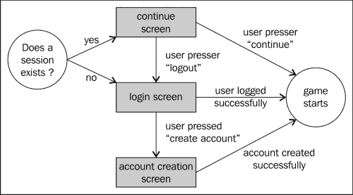
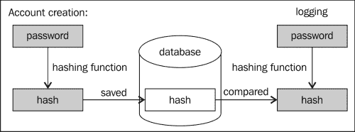

# 七、制作多人游戏

单人游戏很有趣，正如我们已经看到的，可以使用 JavaScript 制作各种各样的游戏。然而，让你的游戏在网络浏览器中运行，有一个巨大的诱惑使它成为多人游戏。这正是我们在本章中要做的，也是多人游戏中比 MMORPG 更好的例子！

我们将从[第五章](05.html "Chapter 5. Putting Things into Perspective")*透视*中选取我们的小型单人 RPG，并将其转化为一个全新的 MMORPG:*阿皮吉世界*。

然而，我们将使用 PHP+MySQL 技术来实现游戏的服务器端，这是第一个警告。原因是它是目前最常见的技术。如果你有某种主机，它很可能是开箱即用的。

这不一定是最佳解决方案，原因有很多。在编写一个服务器端使用不简化为静态页面服务的游戏时，您必须非常仔细地考虑扩展：

*   有多少用户可以在您的系统上同时玩游戏？
*   当玩家数量超过这个限制时，你会怎么做？
*   为了让服务器运行，您准备支付多少费用？
*   你想为球员提供什么样的服务质量？

这些问题的答案应该决定您将选择什么技术和基础架构。这本书的目的不是要详细说明这一点；我们将要实现的解决方案应该可以扩展到几十个玩家，没有任何问题，但是无论您选择什么软件解决方案或托管，您将在这里学习的技术都可以应用！

在本章中，我们将介绍以下主题：

*   多人游戏规范
*   管理玩家的帐户
*   同步玩家的状态
*   管理敌人的服务器端

# 阿尔皮吉世界

我们将基于之前的 RPG 创建的游戏将具有以下功能：

*   玩家可以创建一个帐户并使用它登录游戏
*   当他们回到游戏中时，他们的化身将重新出现在他们离开时的位置
*   每个玩家都可以看到同时在玩的所有其他玩家
*   其他玩家的名字将出现在他们的头像上方
*   敌人的状态由服务器端管理：如果有人杀死一个怪物，其他所有玩家也会被杀死

这个游戏将有一些与它所基于的游戏相同的限制。怪物不会反击，也不会移动。

# 管理玩家账号

让我们从基础开始：让玩家创建一个帐户并登录游戏。为了在服务器端存储信息，我们将使用数据库（MySQL）。我们将使用的表结构非常简单，因为没有太多可存储的内容。玩家的帐户将存储在一个表中，我们将创造性地称之为`players`。

此表将包含以下行：

*   NAME：这是一个包含播放器名称的字符串。它将是唯一的，因此没有两个玩家可以有相同的名字。
*   PW：这是一个保存玩家密码的字符串。它是散列的（在下一节，*在数据库*中搜索元素中有更多内容）。
*   X:这是一个可以保持玩家 X 坐标的双精度。
*   Y:这是一个保持玩家 Y 坐标的双精度球。
*   DIR：这是一个整数，我们将使用它来存储玩家面对的方向。
*   状态：这是一个整数，用于保存玩家的状态：站立、行走或战斗。
*   LASTUPDATE：这是一个时间戳，用于保存服务器上次听到播放机消息的时间。

提供了一个 SQL 脚本，用于在文件`create_tables.sql`中创建游戏所需的所有表。

为了创建允许创建帐户或登录游戏的用户界面，我们将使用一系列与游戏屏幕重叠的div。任何时候都只能看到其中一个。下图显示了可能的用户交互和相应的屏幕：



这些屏幕中的每一个都将是一个`div`，其中包含一些输入字段和/或按钮。例如，允许玩家创建帐户的屏幕为：

```js
<div id="create" class="screen">
   <h1>Create an account</h1>
   <div class="input"><span>name:</span><input id="create-name" type="text" /></div>
   <div class="input"><span>pw:</span><input id="create-pw" type="text" /></div>
   <a class="button left" id="create-cancel" href="#">cancel</a>
   <a class="button right" id="create-create" href="#">create</a>
</div>
```

它将使用CSS 进行样式设置，交互部分将使用 jQuery 编写。对于该屏幕，代码如下所示：

```js
$("#create-cancel").click(function(e){
   $("#create").css("display","none");
   $("#login").css("display","block");
   e.preventDefault();
});
$("#create-create").click(function(e){
   // interact with the server
   e.preventDefault();
});
```

用于将 JavaScript 代码连接到 HTML 代码的链接 ID 已突出显示。没什么太花哨的，但它确实管用。

在前面的代码中，有意省略了有趣的部分，即与服务器的实际交互。我们的客户端（运行在浏览器中的游戏）和服务器之间的所有交互都将使用 JSON 和我们在上一章中提到的`$.getJSON`函数完成（这是`$.ajax`的缩写）。

为了向服务器传输信息，我们将使用`$.getJSON`函数的第二个参数。为了向客户端传输信息，服务器将生成一个 JSON 文件。

我们将使用服务器端文件创建一个名为`createUser.php`的帐户，因此`$.getJSON`调用将如下所示：

```js
$.getJSON(
   "createUser.php",
   {
 name: $("#create-name").val(),
 pw: $("#create-pw").val()
 },
   handleCreateUserJson
)
```

正如我们已经提到的，我们提交用户选择的名称和密码，方法是将它们包装在对象文本中，并将其作为第二个参数传递给函数调用。如前所述，第三个参数是一个函数，它将在服务器返回 JSON 文件后处理该文件。

## 在数据库中搜索元素

这是我们第一次需要生成一个 JSON 文件。这件事很琐碎；它应该告诉客户帐户创建是否成功，如果成功，还应该告诉客户有关玩家的信息。

我们选择将其编写为以下代码段，但真正取决于您以最有意义的方式创建 JSON 文件。如果您不熟悉 JSON文件应该遵循的确切语法，请快速阅读[http://www.json.org/](http://www.json.org/) 。

```js
{
   "success" : true,
   "x" : 510, 
   "y" : 360, 
   "dir" : 0
}
```

很容易实现读取此 JSON 文件并做出相应反应的函数。如果操作成功，我们将启动游戏，如果出现问题，我们将显示错误消息。下面的代码就是这样做的：

```js
var handleCreateUserJson = function(json,status){
   if (json.success){
      name = $("#create-name").val();
      initialPlayerPos.x   = json.x;
      initialPlayerPos.y   = json.y
      initialPlayerPos.dir = json.dir;
      $("#create").css("display","none");
      gf.startGame(initialize);
   } else {
      alert("Name already taken!");
   }
}
```

这非常简单，因为大多数复杂的东西都在服务器上运行。让我们看看那里要做什么。首先，我们必须检索客户端发送的参数。当我们使用`$.getJSON`时，对 JSON 文件的请求是`GET`请求。这意味着我们将使用 PHP 的`$_GET`超全局变量来访问它们。当将合理的信息传递给服务器时，您可能希望使用`POST`请求（尽管这本身并不能阻止有足够动机的人仍然访问参数）。`$_GET`是一个保存客户端发送的所有参数的变量，因此在我们的例子中，我们可以写：

```js
$name = $_GET['name'];
$pw    = $_GET['pw'];
```

我们将将用户选择的名称和密码存储到变量中。现在，我们必须探测数据库，以检查是否尚未定义具有此名称的用户。要在 PHP 中运行 SQL 查询，我们将使用 mysqli（[http://php.net/manual/en/book.mysqli.php](http://php.net/manual/en/book.mysqli.php) ：

```js
// 1) contect to the DB server
$link = mysqli_connect('localhost', 'username', 'password'); 

// Select the DB
mysqli_select_db($link, 'rpg');

// query the DB
$result = mysqli_query($link, 'SELECT * FROM players WHERE name = "'.$name.'"');
```

### 注

请注意，前面的代码不用于生产，因为我们直接将用户提供的参数插入数据库查询，这会产生 SQL 注入的巨大风险！最好的做法是在将所有字符串注入 SQL 查询之前总是对其进行转义。一个简单的方法是使用`mysqli_escape`（[http://www.php.net/manual/en/mysqli.real-escape-string.php](http://www.php.net/manual/en/mysqli.real-escape-string.php) 。

我们将不深入讨论编写 SQL 查询的细节。它们很容易阅读，对于像这样的基本查询来说，也很容易编写。如果您想了解更多有关 SQL 的信息，可以搜索 Web 或阅读有关该主题的众多书籍中的一本。

获得查询结果后，我们需要检查查询是否返回了元素，以查看名称是否已存在于数据库中。这只需通过以下方式完成：

```js
$obj = mysqli_fetch_object($result);
```

现在，如果`$obj`为零，我们可以创建新帐户。

## 在数据库中创建新播放器

在查看将在数据库中创建播放器的查询之前，让我们先谈谈密码。您永远不应该在数据库中存储原始密码，因为历史表明数据库经常遭到黑客攻击。建议的解决方案是在存储密码之前对其进行哈希运算。然后，您可以简单地将提交密码的哈希版本与存储在数据库中的密码进行比较。



这就是我们在这里使用 PHP 的`hash`函数所要做的。然后，我们将简单地将用户名和散列连同播放器的起始位置一起插入数据库。

由于这也是一个查询，因此我们使用与查找同名帐户是否已存在完全相同的函数：

```js
$hash = hash('md5', $pw);
$query = 'INSERT INTO players (name, x, y, dir, pw, state) VALUES("'.$name.'", 510, 360, 0, "'.$hash.'", 0)';
mysqli_query($link, $query);
```

我们传递给`hash`函数的第一个参数在前面的代码中突出显示。这是散列方法，我们这里使用的`'md5'`不推荐用于生产，因为它现在被认为太容易破坏。如果您想了解更多关于可用方法的信息，请查看[中的函数文档 http://www.php.net/manual/en/function.hash.php](http://www.php.net/manual/en/function.hash.php) 。

现在我们可以生成客户端将接收的 JSON。这是通过使用 PHP 的`json_encode`函数（[实现的 http://php.net/manual/en/function.json-encode.php](http://php.net/manual/en/function.json-encode.php) ）。此函数获取一个对象并将其转换为 JSON 格式的字符串。

```js
$json['success'] = true;
$json['x'] = 510;
$json['y'] = 360;
$json['dir'] = 0;

echo json_encode($json);
```

现在，让您全面了解客户机文件的外观。完整代码复制如下：

```js
<?php
   session_start();

   include 'dbconnect.php';

    // JSON Object 
    $json = array('success'=>false);

   $name = $_GET['name'];
   $pw    = $_GET['pw'];

   if(isset($name) && isset($pw)) {
      $hash = hash('md5', $pw);
      $query = 'SELECT * FROM players WHERE name = "'.$name.'"';
      $result = mysqli_query($link, $query);
      $obj = mysqli_fetch_object($result);
      if(!$obj){
         $query = 'INSERT INTO players (name, x, y, dir, pw, state) VALUES("'.$name.'", 510, 360, 0, "'.$hash.'", 0)';
         $result = mysqli_query($link, $query);

         $_SESSION['name'] = $name;
         $_SESSION['pw'] = $pw;

            $json['success'] = true;
            $json['x'] = 510;
            $json['y'] = 360;
            $json['dir'] = 0;
      }
   }

    echo json_encode($json);

   // Close DB's connection
   mysqli_close($link);
?>
```

在这里，您可以看到我们包含了一个名为`dbconnect.php`的文件，它允许我们在此文件中只写入一次数据库配置，并从需要连接到它的每个文件中使用它。这与我们将在服务器端实现的所有其他功能使用的基本功能相同。

## 保持玩家连接

然而，在这个实现中有一件事我们还没有解释。如果查看突出显示的代码，您将看到用户名存储在会话中。

这将允许服务器继续知道玩家的名字，而无需在每次请求时提交。它还允许用户在会话仍然有效的情况下返回，无需再次提供用户名和密码即可继续玩游戏。

如果您查看本章开头的用户交互流程图，您将看到一个屏幕建议用户继续播放。只有当服务器仍然有一个有效的会话可供他/她使用时，我们才会显示它。为了检查这一点，我们将创建另一个名为`session.php`的 PHP 文件，如下所示：

```js
<?php
   session_start();

   // MySQL connection
   include 'dbconnect.php';

    // JSON Object 
    $json = array('connected'=>'false');

   if(isset($_SESSION['name'])) {
      $query = 'SELECT * FROM players WHERE name = "'.$_SESSION['name'].'"';
      $result = mysqli_query($link, $query);
      $obj = mysqli_fetch_object($result);
      if($obj){
          $json['name'] = $_SESSION['name'];
            $json['x'] = floatval($obj->x);
            $json['y'] = floatval($obj->y);
            $json['dir'] = intval($obj->dir);
      } else {
         session_destroy();   
      }

        mysqli_free_result($result);
   }

    echo json_encode($json);

    mysqli_close($link);
?>
```

然后我们只需检查会话中是否存在`name`。然而，如果是的话，我们还需要做一件事；也就是说，从数据库中检索播放器。这将给我们它的最后一个坐标，再次检查用户名和密码是否匹配。

我们不在会话本身中保存坐标，因为我们希望玩家能够使用许多不同的机器或浏览器（尽管不是同时）连接到同一个帐户。

一旦数据库执行了一个请求，我们就可以使用`mysql_result`读取结果。此函数接受三个参数：

1.  查询结果，由`mysql_query`生成。
2.  我们要读取的结果的索引。这是必需的，因为查询可以返回多个结果（例如，如果我们搜索`players`表中的所有帐户）。
3.  要读取的字段的名称。

一旦我们有了这些信息，我们就可以通过将其格式化为 JSON 文件将其发送给客户机。

在客户端，我们将在游戏开始时调用此函数以选择要显示的屏幕（继续屏幕或登录屏幕）。这是通过一个`$.getJSON`呼叫像往常一样完成的。

```js
$.getJSON(
   "session.php",
   function(json){
      if(json.connected){
         name = json.name;
         initialPlayerPos.x   = json.x;
         initialPlayerPos.y   = json.y
         initialPlayerPos.dir = json.dir;
         $("#session-name").html(name);
         $("#session").show(0);
      } else {
         $("#login").show(0);
      }
   }
);
```

这与我们以前所做的非常相似。

## 让用户登录游戏

这与我们检查现有会话的方式几乎完全相同。在服务器端，我们需要发出一个请求来证明用户名和密码是否匹配，并获得玩家的位置。

在客户端，如果密码错误，我们需要显示警告，如果一切顺利，则启动游戏。

我们为此使用的 JSON 如下所示：

```js
{ 
   "success" : true , 
   "x" : 154,
   "y" : 1043,
   "dir" :0
}; 
```

如果用户名和密码不匹配，则成功为 false。否则，JSON 将如前面所示。我们不会向您展示服务器端和客户端代码，因为它们与我们已经看到的非常相似。

# 保持玩家同步

根据我们到目前为止所看到的，我们可以登录到游戏中，但仅此而已；我们现在需要的是一种方法，让服务器了解玩家的移动，并向客户端提供所有其他玩家的位置。下图显示了客户端和服务器将如何交互：


我们将在一个 JSON 调用中完成这两件事。我们将使用它将玩家的当前位置传递给服务器，就像我们之前为用户名和密码所做的一样。作为回报，服务器将生成一个包含所有其他玩家列表的 JSON 文件。

```js
{ 
   "players" : [
      {"name": "Alice", "x": 23, "y": 112, "dir": 0, "state": 0},
      {"name": "Bob", "x": 1004, "y": 50, "dir": 2, "state": 1}
   ]
};
```

让我们首先看看服务器端。在这里，我们需要编写两个查询：第一个用于检索所有玩家的列表，第二个用于更新当前玩家的状态。

## 找回所有其他玩家

这仅仅意味着在`players`表中查找除当前玩家之外的所有条目。然而，有一件事我们必须小心：我们只想显示当前正在玩游戏的玩家。

由于很多事情都可能发生在网络上，我们无法确定玩家是否能够在断开连接之前注销，因此我们选择使用时间戳。每次玩家更新其位置时，我们都会将时间戳设置为当前时间。

这样，通过比较这个时间戳和当前时间，我们可以知道哪些玩家不再在线。我们武断地决定，如果我们在 10 分钟内没有收到玩家的消息，玩家将被视为离线。相应的 MySQL 查询将是：

```js
$query = 'SELECT * FROM players WHERE lastupdate > TIMESTAMPADD(MINUTE, -10, NOW()) AND name <> "'.$_GET['name'].'"';
```

这里，我们测试名称是否与当前播放器不同（`<>`在 SQL 中表示“不等于”）。

读取结果并将其打印到服务器响应的代码如下：

```js
$result = mysqli_query($link, $query);

while ($obj = mysqli_fetch_object($result)) {
    array_push($json['players'], array('name'=>$obj->name, 'x'=>floatval($obj->x), 'y'=>floatval($obj->y), 'dir'=>intval($obj->dir), 'state'=>floatval($obj->state)));
}

mysqli_free_result($result);
```

这与我们从数据库中只检索当前用户时非常类似，因此您应该已经熟悉此代码。

## 更新当前玩家位置

要更新数据库中保存玩家信息的条目，我们可以使用以下查询：

```js
mysqli_query($link, 'UPDATE players SET x='.$x.', y ='.$y.', dir = '.$dir.', state = '.$state.', lastupdate = NOW() WHERE name="'.$name.'"');
```

因为我们不希望从这个查询中得到任何结果，所以我们不需要将它存储在任何地方。

## 客户端代码

现在我们需要编写将当前玩家位置发送到服务器的代码。这并不太复杂，因为它只是将参数传递给`$.getJSON`调用。但是，我们需要将播放器的方向和状态编码为整数（因为我们决定以这种方式将它们存储在数据库中）。

为此，我们将使用两种新方法扩展播放器的对象：

```js
this.getState = function(){
    switch (state){
        case "idle":
            return 0;
        case "walk":
            return 1;
        case "strike":
            return 2;
        default:
            return 0;
    }
};

this.getOrientation = function(){
    switch (orientation){
        case "down":
            return 0;
        case "up":
            return 1;
        case "left":
            return 2;
        default:
            return 3; 
    }
}; 
```

然后，我们将在调用`getJSON`时简单地调用：

```js
$.getJSON(
   "update.php",
   {
      name: name, 
      x: gf.x(player.div), 
      y: gf.y(player.div),
      dir: player.getOrientation(),
      state: player.getState()
   },
   updateOthers
);
```

回调函数可能是本章中最复杂的部分。检查返回的所有玩家名单。如果创建了一个新玩家，我们需要将他/她添加到地图中。如果玩家移动，我们需要更新他/她的位置，如果玩家退出游戏，我们需要移除他/她。

这正是以下代码所做的：

```js
function(json,status){      
   // Here we need to update the position of all the other players
   var existingOthers = {};
   var players = json.players
   for (var i = 0; i < players.length; i++){
       var other = players[i];
       existingOthers["other_"+other.name] = true;
       var avatar, weapon;
       var div = $("#other_"+other.name);
       var created = false;
       if(div.size() > 0){
          avatar = $("#other_"+other.name+"_avatar");
          weapon = $("#other_"+other.name+"_weapon");
          // update
          gf.x(div, other.x);
          gf.y(div, other.y);
          div.css("z-index",other.y + 160);
       } else {
          var created = true;
          // create other players
          div = gf.addGroup($("#others"), "other_"+other.name, {
             x:      other.x,
             y:      other.y
          })
          others.push( div );
          div.css("z-index",other.y + 160);
          avatar = gf.addSprite(div, "other_"+other.name+"_avatar", {
             x:      (192-128)/2,
                y:      (192-128)/2,
                width:  128,
                height: 128
          });
          weapon = gf.addSprite(div, "other_"+other.name+"_weapon", {
                width:  192,
                height: 192
            });
          div.append("<div style='font-family: \"Press Start 2P\"; background: rgba(0,0,0,0.5); padding: 5px; color: #FFF; width: 192px; position: absolute;'>"+other.name+"</div>");
          div.data("state", {dir: other.dir, state: other.state});
       }

       // set the correct animation
       if(created || other.state !== div.data("state").state || other.dir !== div.data("state").dir){
          div.data("state", {dir: other.dir, state: other.state}); 

          gf.transform(avatar, {flipH: false});
          gf.transform(weapon, {flipH: false});
          var pAnim =  playerAnim.stand;
          var wAnim =  weaponAnim.stand;
          if(other.state === 1){
             pAnim = playerAnim.walk;
            wAnim = weaponAnim.walk;
          } else if (other.state === 2){
             pAnim = playerAnim.strike;
            wAnim = weaponAnim.strike;
          }
          if(other.dir === 0){
             gf.setAnimation(avatar, pAnim.down, true);
             gf.setAnimation(weapon, wAnim.down, true);
          } else if (other.dir === 1){
             gf.setAnimation(avatar, pAnim.up, true);
             gf.setAnimation(weapon, wAnim.up, true);
          } else {
             gf.setAnimation(avatar, pAnim.side, true);
            gf.setAnimation(weapon, wAnim.side, true);
            if(other.dir === 2){
               gf.transform(avatar, {flipH: true});
               gf.transform(weapon, {flipH: true});
            }
          }
       }

   }
   // remove gone others
   for (var i = others.length-1; i >= 0; i--){
      var other = others[i];
      if(!existingOthers[other.attr("id")]){
         other.fadeOut(2000, function(){
                $(this).remove();
            });
            others.splice(i,1);
      }
   }

   setTimeout(updateFunction,100);
}
```

第一部分是更新位置或创建其他玩家。第二部分是根据播放器方向和状态设置正确的动画。

然后我们浏览所有玩家的名单，如果其中一些不在更新的玩家名单上，我们会将他们从游戏中删除。

最后，我们设置了在 100 毫秒内再次调用调用`$.getJSON`函数的超时时间。您选择的频率将是服务器使用率和游戏流动性之间的权衡，因此您可能需要根据您的游戏需要微调此值。

# 照顾怪物

现在游戏开始变得有趣起来。然而，有一件小事遗漏了。如果一个玩家杀死了一个怪物，它只会为他而死，而不会为所有其他玩家而死。在一些非常特殊的情况下，这可能很好，但大多数情况下，这不是我们想要的。

解决方案是实现照顾敌人和服务器端的逻辑。这意味着我们需要另一个数据库表来容纳我们所有的敌人。此表需要包含以下信息：

*   敌人的 ID，以唯一地识别它
*   敌人的类型——骷髅、食人魔等等，用来定义玩家对敌人的看法
*   敌人的 x 和 y 坐标
*   它的生命允许玩家杀死它
*   它对作战系统的防御
*   它的产卵率决定怪物被杀死后何时再次产卵

然后，我们将定期向客户发送这些敌人的位置和财产。由于我们已经有了一个页面，可以定期汇总以获得其他玩家的位置，我们可以简单地增强它以返回敌人的状态。

这仅仅意味着 JSON 文件现在将如下所示（突出显示新部分）：

```js
{ 
   "players" : [
      {"name": "Alice", "x": 23, "y": 112, "dir": 0, "state": 0},
      {"name": "Bob", "x": 1004, "y": 50, "dir": 2, "state": 1}
   ],
   "enemies" : [
 {"name": "enemy1", "type" : "ogre", "x": 2014, "y": 200},
 {"name": "enemy2", "type" : "skeleton", "x": 220, "y": 560}
 ]
};
```

我们需要另一个查询来找到数据库中所有仍然活着的敌人：

```js
SELECT * FROM enemies WHERE life <> 0
```

编写 JSON 并对其进行解析以创建或更新敌人的代码与其他玩家的代码完全相同，因此我们不会在这里复制它，但如果您愿意，可以查看完整的源代码。

## 实施服务器端作战

为了实现与那些服务器端敌人的战斗，我们仍然可以使用客户端的代码并将结果发送到服务器。这有一些严重的缺点，因为很容易欺骗系统并修改客户端，使其只发送敌人已被击败的信息，而不进行真正的战斗。第二，它使处理一个敌人和许多玩家之间的战斗变得非常困难。

我们将改为在服务器端实现 it，如下图所示：


用于客户端执行的代码如下：

```js
this.detectInteraction = function(npcs, enemies, console){
    if(state == "strike" && !interacted){
        // ... interaction with NPCs here ...
        for (var i = 0; i < enemies.length; i++){
            if(gf.spriteCollide(this.hitzone, enemies[i].div)){
                var enemyRoll = enemies[i].object.defend();
                var playerRoll = Math.round(Math.random() * 6) + 5;

                if(enemyRoll <= playerRoll){
                    var dead = enemies[i].object.kill(playerRoll);
                    console.html("You hit the enemy "+playerRoll+"pt");
                    if (dead) {
                        console.html("You killed the enemy!");
                        enemies[i].div.fadeOut(2000, function(){
                            $(this).remove();
                        });
                        enemies.splice(i,1);
                    }
                } else {
                    console.html("The enemy countered your attack");
                }
                interacted = true;
                return;
            }
        }
    }
```

我们将现在只需要一个 JSON 调用：

```js
this.detectInteraction = function(npcs, enemies, console){
    if(state == "strike" && !interacted){
        // ... interaction with NPCs here ...
        for (var i = 0; i < enemies.length; i++){
            if(gf.spriteCollide(this.hitzone, enemies[i])){
                $.getJSON("fight.php",
 { name : enemies[i].attr("id") },
 function(json){
 if (json.hit){
 if (json.success){
 if(json.killed){
 console.html("You killed the enemy!");
 } else {
 console.html("You hit the enemy "+json.damage+"pt");
 }
 } else {
 console.html("The enemy countered your attack");
 }
 }
 })
                interacted = true;
                return;
            }
        }
    }
};
```

在这里，您可以看到 JSON 包含两个标志来提供有关战斗的信息。第一个是`hit`；如果战斗真的发生了，那是真的。这是必要的，因为敌人有可能在客户不知情的情况下已经死亡。然后，`success`表示攻击成功，如果敌人成功自卫，则为`false`，否则为`true`。

战斗的完整逻辑将在服务器端的`fight.php`文件中实现，但与客户端的情况完全相同：

```js
$query = 'SELECT * FROM enemies WHERE life <> 0 AND name = "'.$name.'"';
$result = mysqli_query($link, $query);
$obj = mysqli_fetch_object($result);
if ($obj) {

    $playerRoll = rand ( 5 , 11 );
 $enemyRoll  = rand ( $obj->defense, $obj->defense + 6);

    $json['hit'] = true;

    if ($playerRoll > $enemyRoll){
        $json['success'] = true;

        if($playerRoll > $obj->life){
            $json['killed'] = true;

            // update DB
            mysqli_query($link, 'UPDATE enemies SET life = 0 WHERE name = "'.$name.'"');
        } else {
            $json['killed'] = false;
            $json['damage'] = intval($playerRoll);

            // update DB
            mysqli_query($link, 'UPDATE enemies SET life = '.($obj->life - $playerRoll).' WHERE name = "'.$name.'"');
        }
    }
}
```

突出显示的部分表示从客户端取出并放入服务器的代码。这就是你真正需要的战斗。

一旦敌人死亡，你可能需要周期性地让它重生。最明显的方法是使用服务器端脚本，该脚本通过使用`cron`命令定期执行。或者，你可以欺骗并使用我们创建的任何其他文件来复活敌人；例如，每次玩家登录时。

# 总结

我们在这里创建的游戏是迄今为止我们在本书中所写的最复杂的游戏。当然，通过添加 PvP 战斗、聊天系统等，它可以得到很大的增强，但是本章已经介绍了让您实现这些功能的所有基础知识！

但是，异步调用一组文件并不是一个非常优雅的解决方案，如果您的目标是最近的浏览器，那么您可能需要看看 WebSocket API，它允许您在浏览器和服务器之间建立和维护双向通信通道。

保持与服务器的永久连接的另一种方法是使用长轮询方法。

在下一章中，我们将修改我们的平台，与 Facebook 和 Twitter 集成，并保留高分列表！