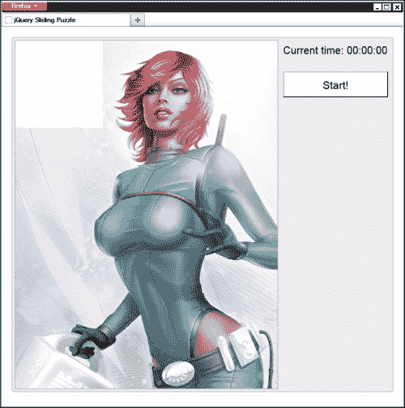
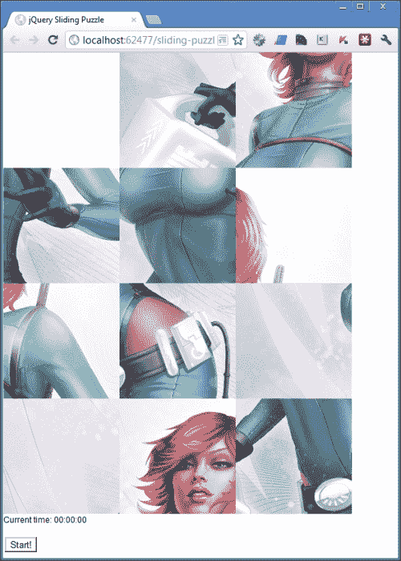

# 第一章滑动拼图

在我们的第一个项目中，我们将在一个有趣而轻松的环境中看到各种各样的技术。考虑一下这本书的其余部分是温和的热身。

我们将看到如何使用 jQuery UI 使元素可拖动，以及如何配置可拖动元素的行为。我们还将研究其他主题，包括排序算法和使用localStorage API 的客户端存储。

# 任务简报

在这个项目中，我们将构建一个简单但有趣的益智游戏，其中一张图片被搅乱，并且必须通过在棋盘上滑动不同的部分来解读回原始图片——这是一个基于网络的现代游戏，取材于去年的一款经典游戏。

典型地，板上有一个空白空间，而块只能移动到这个空白空间，所以我们需要建立一个跟踪空白空间的系统，并且只允许直接与它相邻的部分被拖动。

为了给玩家一个激励，我们还可以跟踪玩家解决谜题所需的时间，以便记录玩家的最佳时间。以下是显示此项目最终结果的屏幕截图：



## 为什么太棒了？

游戏很有趣，它们可以让人们回到你的网站，尤其是年轻观众。基于非 flash 浏览器的游戏正在以一种巨大的方式蓬勃发展，但在顶级玩家中投入行动可能会有一个陡峭的学习曲线。

像这样一款简单的基于拖拽的游戏是让你轻松进入游戏市场的完美方式，而不必直接跳到游戏的最深处，让你可以通过一些简单的游戏开发概念来磨练你的技能。

这也是一个很好的方法来学习如何构建一个精确的、引人入胜的、适合其预期用途和直观使用的可拖动界面。我们还可以看看一些更先进的可拖动概念，如防撞和精确定位。我们还将学习如何与 localStorage API 交互，以便在会话之间存储和检索数据。

## 你的热门目标

本项目将分解为以下任务，我们将按顺序完成这些任务，以产生工作最终结果：

*   设置底层 HTML
*   创建代码包装器并定义变量
*   将图像分割成碎片
*   洗牌
*   使拼图块可拖动
*   启动和停止计时器
*   确定谜题是否已解决
*   记住最好的时刻并添加一些最终样式

## 任务清单

除了jQuery，我们在本项目中也将使用 jQueryUI，所以现在是抓取这些库并将它们放置到位的时候了。我们还可以花点时间设置项目文件夹，在那里我们可以存储我们将在本书中创建的所有文件。

在名为`jquery-hotshots`的地方创建一个新文件夹。在此文件夹中创建三个新文件夹，分别为`js`、`css`和`img`。我们创建的所有 HTML 页面将进入根`jquery-hotshots`文件夹，而我们使用的其他文件将根据其类型分布在子文件夹中。

对于本书中涵盖的项目，我们将使用 jQuery 最新版本的本地副本，在撰写本文时，它是全新的 1.9.0。从[下载缩小版的副本 http://code.jquery.com/jquery-1.9.0.min.js](http://code.jquery.com/jquery-1.9.0.min.js) 并保存在`js`文件夹中。

### 提示

使用 Google 的**内容交付网络**（**CDN**）加载 jQuery 并链接到文件而不指定协议被认为是最佳实践。使用 CDN 意味着文件更有可能位于访问者的浏览器缓存中，从而使库的加载速度更快。

还建议在 CDN 因某种原因无法访问时提供备用方案。如果找不到CDN 版本，我们可以很容易地使用优秀的**yepnope**加载脚本的本地版本。参见 yepnope网站[http://yepnopejs.com/](http://yepnopejs.com/) ，了解更多关于此和其他资源加载提示和技巧的信息。

要下载我们需要的 jQuery UI 组件，请访问下载生成器[http://jqueryui.com/](http://jqueryui.com/) 。我们将在以后的项目中使用各种其他组件，因此为了简单起见，我们可以使用**稳定**按钮下载完整的库。撰写本文时的当前版本为 1.10.0。

下载构建后，您需要从存档中的`js`目录中获取`jquery-ui-x.x.x.custom.min.js file`（其中`x.x.x`是版本号）的副本，并将其粘贴到您的`js`文件夹中。

### 提示

最近版本的 jQueryUI，以及一些使用Themeroller 生成的更流行的预构建主题，也可以通过谷歌的 CDN 获得。

# 制定底层 HTML

首先，我们需要构建包含滑动拼图的页面。最初的页面将是一个外壳，其中大部分只有几个容器；组成拼图各个部分的可拖动元素都可以在需要时动态创建。

## 准备起飞

在本书中，我们将为所有不同的项目使用一个标准的起点，因此我们现在将简要介绍一下这一点，以避免在每个项目中显示它：

```js
<!DOCTYPE html>

<html lang="en">
    <head>
        <meta charset="utf-8" />
        <title></title>
        <link rel="stylesheet" href="css/common.css" />
    </head>
    <body>
        <script src="js/jquery-1.9.0.min.js"></script>
    </body>
</html>
```

### 提示

**下载示例代码**

您可以下载您在[账户购买的所有 Packt 书籍的示例代码文件 http://www.packtpub.com](http://www.packtpub.com) 。如果您在其他地方购买了本书，您可以访问[http://www.packtpub.com/support](http://www.packtpub.com/support) 并注册，将文件直接通过电子邮件发送给您。

我们所涵盖的每个项目都将包含在一个页面中，该页面的开头与完全相同。现在在本地项目文件夹中保存上一个文件的副本，并将其命名为`template.html`。在每个项目开始时，我会说“将模板文件的副本另存为`project-name.html`”。这就是我要参考的文件。

因此，在本例中，在主项目目录（`jquery-hotshots`）中保存一份上一个 HTML 的副本（或`template.html`，如果您愿意），并将其命名为`sliding-puzzle.html`。

我们还将使用每个项目将使用的基本样式的通用样式表。它包含 HTML5 重置、clearfix 和其他实用程序，以及一些基本的排版装置和项目间一致性的主题。虽然我不会在这里详细说明，但您可以查看本书附带下载中的`common.css`源文件以了解更多信息。

每个项目还需要自己的样式表。在适用的情况下，将涵盖这些内容，并在需要时根据每个项目进行讨论。我们现在可以创建将在该项目中使用的自定义样式表。

创建一个新文件并将其命名为`sliding-puzzle.css`，然后将其保存在`css`文件夹中。我们可以使用以下代码在页面的`<head>`中链接到此文件：

```js
<link rel="stylesheet" href="css/sliding-puzzle.css" />
```

这应该直接出现在`common.css`样式表引用之后。

我们还可以链接到我们将在此项目中使用的脚本文件。首先，我们下载并复制到`js`文件夹中的 jQuery UI 文件可以使用以下代码链接到：

```js
<script src="js/jquery-ui-1.10.0.custom.min.js"></script>
```

请记住，始终在 jQuery 脚本本身之后的下一行添加 jQuery UI 脚本。

最后，我们可以添加用于此项目的脚本文件。创建新文件并将其另存为`js`文件夹中的`sliding-puzzle.js`。我们可以在 jQuery UI 引用之后直接添加以下`<script>`元素链接到它：

```js
<script src="js/sliding-puzzle.js"></script>
```

## 启动推进器

在根项目文件夹中将模板文件的副本保存为`sliding-puzzle.html`，然后将以下标记添加到`<body>`元素（在 jQuery`<script>`元素之前）：

```js
<div id="puzzle" class="clearfix">
    <figure>
        
    </figure>
    <div id="ui">
        <p id="time">Current time: <span>00:00:00</span></p>
        <button id="start">Start!</button>
    </div>
</div>
```

## 目标完成-小型任务汇报

这个简单的 HTML 就是开始时所需要的全部内容。由于这是一本关于 JavaScript 的书，除非对手头的项目绝对重要，否则我不会详细介绍 HTML。在这种情况下，大多数元素本身并不重要。

主要的是，我们有一系列具有`id`属性的容器，使选择它们变得快速而简单。唯一真正重要的元素是``、，它显示了我们将要变成拼图的原始图像。

### 注

本例中使用的令人敬畏的图像是由才华横溢的*伊蒙·奥多诺霍*先生创建的。更多关于他的优秀作品的例子可参见[http://eamonart.com/](http://eamonart.com/) 。本项目中使用的图像可在[找到 http://eamonart.cimg/PINUPSLINKS/Space%20Girl%20Vera.html](http://eamonart.cimg/PINUPSLINKS/Space%20Girl%20Vera.html) 。

# 创建代码包装器并定义变量

我们的所有代码都需要包含在一个包装器函数中，该函数在页面完成加载后执行。

## 准备起飞

我们将在项目的这一部分完成的步骤如下：

*   为我们的代码添加一个包装函数，该函数将在页面加载完成后立即执行
*   定义我们将在整个脚本中使用的变量

## 启动推进器

第一步是为我们的代码创建一个包装函数，该函数将在页面加载后立即执行。将以下代码添加到名为`sliding-puzzle.js`的新脚本文件中，该文件应保存在我们之前创建的`js`目录中：

```js
$(function () {

    //all our code will be in here...

});
```

我们在野外看到的大多数 jQuery 代码都驻留在这样的包装器中。使用`$(function(){});`是 jQuery 的`document.ready`函数的快捷方式，一旦加载了页面的 DOM，就会触发该函数。

### 提示

**使用美元**

如果我们与其他开发人员共享代码，我们通常不会在全局范围内使用`$`，因为页面上可能有其他库也在使用它。最佳做法是在自动调用的匿名函数或立即调用的函数表达式（如果愿意）中为`$`字符别名。这可以使用语法`(function($) { … }(jQuery));`来完成。

接下来，我们可以在脚本文件顶部附近设置一些变量。这样，我们就不会有太多的值，以后可能需要在整个文件中进行更改。组织是编写可维护代码的关键之一，我们应该始终努力使代码以及意图尽可能清晰。

接下来，在我们刚刚定义的函数中添加以下代码，替换前面代码示例中显示的注释：

```js
var numberOfPieces = 12,
    aspect = "3:4",
    aspectW = parseInt(aspect.split(":")[0]),
    aspectH = parseInt(aspect.split(":")[1]),
    container = $("#puzzle"),
    imgContainer = container.find("figure"),
    img = imgContainer.find("img"),
    path = img.attr("src"),
    piece = $("<div/>"),
    pieceW = Math.floor(img.width() / aspectW),
    pieceH = Math.floor(img.height() / aspectH),
    idCounter = 0,
    positions = [],
    empty = {
        top: 0, 
        left: 0,
        bottom: pieceH, 
        right: pieceW
    },
    previous = {},
    timer,
    currentTime = {},
    timerDisplay = container.find("#time").find("span");
```

这些并不是我们将要使用的所有变量，只是其中的大部分。该列表还包括我们需要在回调函数中使用的所有变量，这样我们就不会遇到范围问题。

## 目标完成-小型任务汇报

我们首先定义的变量是简单（原始）值和我们将在整个代码中使用的对象或数组以及缓存的 jQuery 元素的组合。为了在使用 jQuery 时获得最佳性能，最好从页面中选择元素并将它们存储在变量中，而不是从页面中重复选择它们。

虽然我们的变量中没有一个被直接分配给 Apple T0T，因此实际上不是全局的，因为我们将它们定义在最外层函数的顶部，它们在我们的代码中是可见的，我们可以将它们视为全局的。这为我们提供了全局的可视性，而实际上不会弄乱全局名称空间。

### 注

最佳做法是将变量定义在其作用域的函数顶部，因为存在一种称为**提升**的现象，在这种现象中，定义在函数内部深处的变量，例如`for`循环中的变量，在某些情况下被“提升”到函数顶部，可能导致难以追踪的错误。

尽可能在函数顶部定义变量是避免这种情况发生的一种简单方法，在编写 jQuery 或 JavaScript 时被认为是一种良好的做法。

大多数变量都非常简单。我们存储我们想要使用的拼图块的数量和正在使用的图像的纵横比。重要的是，工件的数量可以被比率的`width`和`height`分量平分。

我们使用 JavaScript 的`split()`函数和将冒号指定为要拆分的字符，将纵横比拆分为其组成部分。我们还使用 JavaScript`parseInt()`函数来确保在`aspectW`和`aspectH`变量中使用实际数字而不是字符串。

接下来的三个变量都是从页面中选择的不同元素，我们需要对它们进行操作。下面是我们使用 jQuery 创建的新元素。

接下来我们根据原始图像的`width`和`height`以及纵横比，计算拼图的`width`和`height`每一块需要调整到的大小，并初始化一个计数器变量，我们将使用该变量为每一块拼图添加一个唯一的、有序的`id`属性。我们还添加了一个名为`positions`的空数组，我们将使用它来存储每个新片段的`top`和`left`位置。

我们需要一种方法来跟踪空的空间，因为棋子在棋盘上移动，所以我们创建一个名为“YouthT0}”的对象，并给出它的 T1，T，2，3，和 T4 属性，这样我们就可以准确地知道空格在任何特定时刻的空间在哪里。我们还希望跟踪任何给定工件的先前位置，因此我们创建一个名为`previous`的空对象，在需要时用属性填充该对象。

其余三个变量都与跟踪解决难题所需的时间有关。我们定义了，但没有初始化`timer`变量，我们将使用该变量在脚本中存储对基于 JavaScript`setInterval()`的计时器的引用。我们还创建了一个名为`currentTime`的空对象，我们将在需要时再次填充该对象，并缓存对元素的引用，我们将使用该元素显示当前时间。

# 将图像分割成碎片

我们的下一个任务是将图像分割成指定数量的正方形，以表示拼图的各个部分。为此，我们将创建一系列较小的元素，每个元素显示图像的不同部分，并且可以单独操作。

## 准备起飞

完成此任务所需的单个步骤是创建指定数量的拼图块，并为每个拼图块指定唯一的背景位置和位置，以便重新创建图像。

## 启动推进器

我们现在想要生成组成拼图的不同部分。我们可以使用下面的代码来实现这一点，这些代码应该直接添加到我们刚才在`sliding-puzzle.js`中定义的变量之后：

```js
for (var x = 0, y = aspectH; x < y; x++) {
    for (var a = 0, b = aspectW; a < b; a++) {
        var top = pieceH * x,
            left = pieceW * a;

        piece.clone()
             .attr("id", idCounter++)
             .css({
                 width: pieceW,
                 height: pieceH,
                 position: "absolute",
                 top: top,
                 left: left,
                 backgroundImage: ["url(", path, ")"].join(""),
                 backgroundPosition: [
                     "-", pieceW * a, "px ", 
                     "-", pieceH * x, "px"
                 ].join("")
        }).appendTo(imgContainer);

        positions.push({ top: top, left: left });
    }
}
```

## 目标完成-小型任务汇报

我们使用一组嵌套的`for`循环以网格模式创建新的拼图块。第一个循环将根据需要运行任意多的行；对于 3:4 纵横比图像（如本例中使用的图像），我们将需要四行正方形。内部循环将根据需要运行任意多的列，在本例中为三列。

在内部循环中，我们首先创建两个新变量`top`和`left`。我们需要在几个地方使用这些值，因此创建它们一次并在每次需要时重用它们是有意义的。

`top`位置等于工件的`height`乘以外环计数器变量的当前值（`x`），而`left`位置等于工件的`width`乘以内环计数器变量的当前值（`a`）。这些变量用于使拼图块在网格中排列。

然后，我们使用 jQuery 的`clone()`方法复制存储的`<div>`元素，并使用`attr()`方法使用我们在项目第一部分初始化的`idCounter`变量设置唯一的`id`属性。请注意，我们在直接在`attr()`方法中设置变量的同时增加变量。

我们可以在方法内部增加变量，就像我们在这里所做的那样，或者在方法外部增加变量；在性能或其他方面没有真正的区别。我只是觉得就地更新更简洁。

接下来我们使用`css()`方法在新元素上设置`style`属性。我们设置拼图块的`width`和`height`并使用`top`和`left`变量对其进行定位，同时设置其`backgroundImage`和`backgroundPosition`样式属性。

### 注

当与 jQuery 的`css()`方法结合使用对象时，通常使用连字符词定义的任何样式属性，例如`background-image`，都应该使用驼峰大小写。

`backgroundImage`属性可以使用我们的`path`变量和样式的其他字符串组件进行设置，但是`backgroundPosition`属性需要为每个拼图块单独计算。

`backgroundPosition`样式属性的水平分量等于工件的`width`乘以内环的反变量值（`a`），而垂直分量等于工件的`height`乘以外环的反变量值（`x`）。

创建新元素后，我们可以使用 JavaScript 的`push()`方法将其位置添加到`positions`数组中，并传入一个包含元素的`top`和`left`位置属性的对象供以后使用。

## 机密情报

我们没有使用标准字符串连接来构造`backgroundImage`和`backgroundPosition`字符串，而是将值放入数组文本中，然后使用JavaScript 的`join()`方法连接数组。通过将空字符串指定为用于连接字符串的值，我们可以确保不会向字符串中添加其他字符。

加入子字符串的数组以形成单个字符串要比在子字符串上使用`+`操作符构建字符串快得多，而且由于我们在循环中重复工作，我们应该尽可能优化循环中的代码。

# 洗牌拼图

在这一步中，我们需要随机洗牌，使其成为一个谜题，以便访客能够解读它们。我们也可以删除原始图像，因为它不再需要，并删除第一块，以创建一个空的空间，以便其他部分可以移动。

## 准备起飞

我们将在本任务中介绍的步骤包括：

*   从页面中删除原始图像
*   移除拼图的第一块
*   删除位置数组中的第一项
*   随机洗牌

## 启动推进器

完成第一步只需要以下代码行，应该直接添加到我们在上一个任务中添加到`sliding-puzzle.js`的外部`for`环路的闭合卷曲括号之后：

```js
img.remove();
```

第二步同样简单；可以在前一行代码后直接添加以下内容：

```js
container.find("#0").remove();
```

我们还可以在下一步中使用一行代码。在前一行代码后直接添加以下内容：

```js
positions.shift();
```

洗牌会稍微复杂一些；您会记得，从项目的第一部分开始，当我们添加底层 HTML 时，其中一个元素是一个开始按钮。我们将使用此按钮触发洗牌。在我们刚刚添加的前两行之后直接添加以下代码（确保它们仍在外部函数包装器中）：

```js
$("#start").on("click", function (e) {
    var pieces = imgContainer.children();

    function shuffle(array) {
        var i = array.length;

        if (i === 0) { 
            return false;
        }
        while (--i) {
            var j = Math.floor(Math.random() * (i + 1)),
                tempi = array[i],
                tempj = array[j];

                array[i] = tempj;
                array[j] = tempi;
        }
    }

    shuffle(pieces);

    $.each(pieces, function (i) {
        pieces.eq(i).css(positions[i]);
    });

    pieces.appendTo(imgContainer);

    empty.top = 0;
    empty.left = 0;

    container.find("#ui").find("p").not("#time").remove();

});
```

## 目标完成-小型任务汇报

jQuery 的`remove()`方法用于从页面中删除原始图像元素，我们在脚本开头声明变量时已经选择了该元素。我们使用相同的方法移除第一个拼图块，我们应该在块被洗牌之前进行*，以避免移除关键块，例如一张脸。与本例中使用的图像一样，主要关注项目不在左上角的图像是有益的。*

由于我们已经从电路板上移除了第一块，我们也应该移除`positions`阵列中的第一块。当我们检查拼图是否已解译时，我们将使用此数组，因为第一个位置不会有一块，所以不需要存储其位置。我们使用 JavaScript 的`unshift()`方法来实现这一点，它只需删除调用它的数组中的第一项。

### 使用 on（）向按钮添加事件处理程序

我们通过选择按钮并调用 jQuery`on()`方法，为按钮添加了一个点击事件处理程序。在本例中，`on()`方法采用两个参数（尽管在需要事件委托时可以采用三个参数）。

第一个参数是要侦听的事件，第二个参数是每次检测到事件时要执行的处理程序函数。我们正在收听本案中的`click`事件。

### 提示

**包罗万象的 on（）方法**

jQuery 的`on()`方法在 1.7 版中引入，取代了目前不推荐使用的`bind()`、`live()`、和`delegate()`方法。现在推荐使用`on()`在 jQuery 中附加事件处理程序。

在 handler 函数中，我们首先定义一个变量来存储`<figure>`元素的子元素。尽管我们需要再次从页面中选择片段，但我们仍然可以使用缓存的`imgContainer`变量来避免创建新的 jQuery 对象。

### 洗牌

接下来，我们定义一个名为`shuffle()`的函数，该函数接受要洗牌的数组作为参数。此函数执行**Fisher-Yates**洗牌，这是用于创建给定值集的随机顺序的既定模式。

在函数中，我们首先获取传入的数组的长度，如果数组为空，则返回`false`（退出函数）。然后我们使用一个`while`循环遍历数组。JavaScript 中的`while`循环与`for`循环类似，但在括号中指定的条件具有 truthy 值（或其计算结果为 true）时执行，而不是执行指定的次数。使用一个预递减循环条件来避免在所有项都被洗牌后循环的不必要迭代。

### 注

在 JavaScript 中，以及`true`或`false`布尔值，其他类型的变量可以称为`truthy`或`falsey`。以下值均被视为错误：

*   布尔值`false`
*   编号`0`
*   空字符串
*   `null`
*   `undefined`
*   `NaN`

所有其他值都被认为是真实的。这使得非布尔值可以用作条件。falsey 和 false 这两个术语之间的相似性可能导致混淆；请记住，false 是一个实际值，Falsy 是值的一个方面，除 false 之外的值也有。

有关此主题的更多信息，请参见[http://james.padolsey.com/javascript/truthy-falsey/](http://james.padolsey.com/javascript/truthy-falsey/) 。

在循环中，除了第一个项目，数组中的每个项目都将执行一次，我们希望从数组中随机选取一个项目，并将其在数组中的位置与另一个项目交换。为了生成一个随机数作为交换项的索引，我们首先使用 JavaScript 的`Math.random()`函数生成一个随机数，并将随机数（介于`0`和`1`之间）乘以数组的长度加上`1`。这将给我们一个随机数，介于`0`和数组长度之间。

然后，我们将带有当前索引的项与随机生成的索引处的项一起从数组中拉出，并交换它们。这看起来可能很复杂，但这几乎被普遍认为是随机洗牌数组中项目的最有效方法。它以最少的处理量为我们提供了最随机的结果。

一旦定义了函数，我们就调用它，将`pieces`数组作为要洗牌的数组传入。

### 注

有关 Fisher-Yates shuffle 的JavaScript 实现的更多信息，请参阅[http://sedition.com/perl/javascript-fy.html](http://sedition.com/perl/javascript-fy.html) 。

### 定位工件

一旦元素数组被洗牌，我们将使用 jQuery 的`each()`方法对其进行迭代。这个方法被传递给数组进行迭代，在本例中，这个数组就是我们刚刚洗牌的`pieces`数组。第二个参数是一个迭代器函数，将为数组中的每个项调用该函数。

在这个函数中，我们使用`positions`数组将被洗牌的元素放在页面的正确位置。如果我们不这样做，元素将被洗牌，但仍然会出现在页面上的相同位置，因为它们的`absolute`位置。我们可以使用我们在创建新元素时更新的`positions`数组来获得每个被洗牌元素的正确`top`和`left`位置。

迭代元素集合并设置它们的位置后，我们使用jQuery 的`appendTo()`方法将它们追加回页面。同样，我们可以指定我们的`imgContainer`变量作为`appendTo()`的参数，以避免再次从页面中选择容器。

### 定位空位

最后，我们应该确保的空白空间肯定在`0`顶部和`0`左侧，即电路板的左上方正方形。如果按钮被点击，一些片段被移动，然后按钮再次被点击，我们必须确保空白区域位于正确的位置。我们通过将`empty`对象的`top`和`left`属性设置为`0`来实现这一点。

我们还可以删除 UI 区域中可能显示的任何以前的消息（我们将在本项目结束时介绍添加这些消息）。但是我们不想删除计时器，所以我们使用 jQuery 的`not()`方法将该元素从选择中过滤出来，该方法接受一个选择器，该选择器丢弃匹配元素，因此不会从页面中删除。

此时，我们应该能够在浏览器中运行页面，并通过单击**开始来洗牌！**按钮：



# 使拼图块可拖动

现在是时候启动 jQueryUI，让拼图的各个部分都可以拖动了。

jQuery UI是一套 jQuery 插件，用于构建交互式和高效的用户界面。它稳定、成熟，被公认为是官方的，尽管不是 jQuery 的唯一 UI 库。

## 准备起飞

在本任务中，我们将介绍以下步骤：

*   使用 jQueryUI 的可拖动组件使拼图块可拖动
*   配置拖拽功能，以便只能移动紧靠空白空间的碎片
*   配置拖拽功能，使碎片只能移动到空白空间

## 启动推进器

首先，我们将使片段可拖动，并设置组件公开的一些配置选项。此代码应直接添加到`sliding-puzzle.js`上一个任务中添加的代码之后：

```js
pieces.draggable({
    containment: "parent",
    grid: [pieceW, pieceH],
    start: function (e, ui) {

    },
    drag: function (e, ui) {

    },
    stop: function (e, ui) {

    }
});
```

本任务中接下来的几个步骤将看到前面代码示例中的`start`、`drag`和`stop`回调函数中添加了其他代码。

我们还需要配置可拖动性，以便只能将碎片移动到空空间中，而不能彼此重叠，并且只能移动与空空间直接相邻的碎片。

接下来，将以下代码添加到刚才添加的`start`回调函数中：

```js
var current = getPosition(ui.helper);

if (current.left === empty.left) {
    ui.helper.draggable("option", "axis", "y");
} else if (current.top === empty.top) {
    ui.helper.draggable("option", "axis", "x");
} else {
    ui.helper.trigger("mouseup");
    return false;
}

if (current.bottom < empty.top || 
    current.top > empty.bottom ||
    current.left > empty.right || 
    current.right < empty.left) {
        ui.helper.trigger("mouseup");
        return false;
    }

    previous.top = current.top;
    previous.left = current.left;
```

接下来，在`drag`回调函数中添加以下代码：

```js
var current = getPosition(ui.helper);

ui.helper.draggable("option", "revert", false);

if (current.top === empty.top && current.left === empty.left) {
    ui.helper.trigger("mouseup");
    return false;
}

if (current.top > empty.bottom ||
    current.bottom < empty.top || 
    current.left > empty.right || 
    current.right < empty.left) {
        ui.helper.trigger("mouseup")
                 .css({ 
                     top: previous.top, 
                     left: previous.left 
                 });
        return false;
}
```

最后，我们应该在`stop`回调函数中添加以下代码：

```js
var current = getPosition(ui.helper);

if (current.top === empty.top && current.left === empty.left) {

    empty.top = previous.top;
    empty.left = previous.left;
    empty.bottom = previous.top + pieceH;
    empty.right = previous.left + pieceW;
}
```

在每个回调中，我们都使用了一个 helper 函数，该函数返回当前可拖动对象的确切位置。我们也应该在`draggable()`方法之后增加这个功能：

```js
function getPosition(el) {
    return {
        top: parseInt(el.css("top")),
        bottom: parseInt(el.css("top")) + pieceH,
        left: parseInt(el.css("left")),
        right: parseInt(el.css("left")) + pieceW
    }
}
```

## 目标完成-小型任务汇报

在上一个任务中，我们编写了很多代码，所以让我们将其分解，看看我们做了什么。我们首先使用 jQueryUIDragable 组件使这些片段可拖动。为此，我们调用了`draggable()`方法，传入一个对象文本，该文本设置了可拖动组件公开的各种选项。

首先，我们将`containment`选项设置为`parent`，这将停止将任何片段从其所在的`<figure>`元素中拖出。我们还设置了`grid`选项，该选项允许我们指定要拖动的工件应捕捉到的点的网格。我们将数组设置为该选项的值。

此数组中的第一项设置栅格上的水平点，第二项设置栅格上的垂直点。设置这些选项可使碎片的移动更真实、更具触感。

我们设置的下一个也是最后三个选项实际上是回调函数，它们在拖动的生命周期中的不同点被调用。我们使用`start`、`drag`和`stop`回调。

### 当拖动开始时

在可拖动设备上发生`mousedown`事件后，将在拖动交互开始时调用一次`start`回调。当`mouseup`事件注册后，`stop`回调将在拖动交互的最后调用一次。当拖动一个片段时，`drag`回调几乎会连续触发，因为拖动元素移动的每个像素都会调用该回调。

我们先来看看`start`回调。调用每个回调时，jQuery UI 会向其传递两个参数。第一个是事件对象，我们在这个项目中不需要它，而第二个是包含关于当前可拖动对象的有用属性的对象。

在函数的开头，我们首先得到开始拖动的工件的确切位置。当我们调用`getPosition()`函数时，我们传入`ui`对象的`helper`属性，这是一个 jQuery 包装的对已开始拖动的底层 DOM 元素的引用。

一旦我们得到了元素的位置，我们首先通过比较当前对象（由`getPosition()`返回的对象）的`left`属性和`empty`对象的`left`属性来检查元素是否与空空间在同一行中。

如果两个属性相等，我们将可拖动的`axis`选项设置为`y`，这样它只能水平移动。可以使用`option`方法在任何 jQuery UI 小部件或组件中设置配置选项。

如果它不在同一行中，我们通过比较`current`和`empty`对象的`top`属性来检查它是否在同一列中。如果这两个属性相等，则我们将`axis`选项设置为`x`，以便工件只能垂直移动。

如果这两个条件都不成立，则工件不能与空空间相邻，因此我们使用 jQuery 的`trigger()`方法手动触发`mouseup`事件来停止拖动，并从函数返回`false`，以便我们的`stop`处理程序不会被触发。

我们需要确保只有与空白空间在同一行或同一列中的正方形才可以拖动，但我们还需要确保不能拖动与空白空间不直接相邻的任何块。

要停止拖动任何与空白空间不相邻的碎片，我们只需检查：

*   当前块的*底部*比空空间的*顶部*小*比*
*   当前工件的*顶部*大于空空间的*底部*
*   当前块的*左*大于空块的*右*
*   当前块的*右侧*比空空间的*左侧*小*个*

如果这些条件中的任何一个为真，我们再次通过手动触发`mouseup`事件来停止拖动，并通过返回`false`停止正在调用的拖动表上的任何其他事件处理程序（但仅限于当前拖动交互）。

如果此时回调函数还没有返回，我们就知道我们正在处理一个与空空间相邻的可拖动对象，从而构成一个有效的拖动对象。因此，我们通过设置在项目开始时初始化的`previous`对象的`top`和`left`属性，将其当前位置存储在拖动开始时，以备以后使用。

### 提示

**ui.helper 的位置**

传递给回调函数的`ui`对象实际上包含一个名为`position`的对象，可用于获取当前可拖动对象的位置。但是，由于我们使用的是`grid`选项，因此此对象中包含的值可能不适合我们的需要。

### 拖动过程中

接下来我们可以通过`drag`回调进行，每次当前可拖动的位置发生变化时都会调用该回调。这将在`mousedown`事件期间发生。

首先，我们需要知道被拖动的块在哪里，所以我们再次调用`getPosition()`辅助函数。

然后我们要检查被拖动的工件是否在空白处。如果是，我们可以像以前一样停止拖动-手动触发`mouseup`事件并返回`false`。

在拖动过程中，只有有效的片段才可以拖动，因为我们已经过滤掉了与空空间不直接相邻的所有片段。但是，我们仍然需要检查被拖动的工件是否没有被从空白处拖走。我们这样做的方式与我们在`start`回调中过滤出与空空间不相邻的片段的方式相同。

### 当阻力结束时

`stop`回调是三个回调中最简单的一个。我们得到被拖动的工件的位置，如果它确实在空的空间中，我们移动空的空间，使它处于拖动开始时被拖动工件所在的位置。记住，我们将此信息存储在一个名为`previous`的对象中。

# 启动和停止定时器

在这一点上，我们的游戏是完全功能的并且可以解读谜题；然而，为了让它更有趣，我们应该通过加入计时器引入竞争力的元素。

## 准备起飞

在本任务中，我们需要完成以下步骤：

*   点击**启动**按钮时，检查计时器是否尚未运行
*   从`0`开始计时
*   每秒钟增加一次计时器
*   更新页面上的显示，以便玩家可以看到当前游戏到目前为止花费了多长时间

## 启动推进器

当点击**开始**按钮时，为了检查计时器是否已经在运行，我们应该直接在页面中添加洗牌片段的位置之后，并在调用`draggable()`之前添加以下代码：

```js
pieces.appendTo(imgContainer).draggable("destroy");

if (timer) {
 clearInterval(timer);
 timerDisplay.text("00:00:00");
}

timer = setInterval(updateTime, 1000);
currentTime.seconds = 0;
currentTime.minutes = 0;
currentTime.hours = 0;

pieces.draggable({
```

接下来，我们可以添加增加计时器和更新显示的函数。此代码应直接位于我们在前面代码中更新`currentTime.hours`的位置之后：

```js
function updateTime() {

    if (currentTime.hours === 23 && currentTime.minutes === 59 &&
currentTime.seconds === 59) {
        clearInterval(timer);          
    } else if (currentTime.minutes === 59 && currentTime.seconds === 59) {

        currentTime.hours++;
        currentTime.minutes = 0;
        currentTime.seconds = 0;
    } else if (currentTime.seconds === 59) {
        currentTime.minutes++;
        currentTime.seconds = 0;
    } else {
        currentTime.seconds++;
    }

    newHours = (currentTime.hours <= 9) ? "0" + currentTime.hours :

    currentTime.hours;
    newMins = (currentTime.minutes <= 9) ? "0" + currentTime.minutes :

    currentTime.minutes;
    newSecs = (currentTime.seconds <= 9) ? "0" + currentTime.seconds : 

    currentTime.seconds;

    timerDisplay.text([
        newHours, ":", newMins, ":", newSecs
    ].join(""));

}
```

## 目标完成-小型任务汇报

在这个任务中，我们要做的第一件事就是检查计时器是否已经在运行。计时器将存储在我们的一个“全局”变量中，因此我们可以轻松地检查它。我们使用一个`if`语句来检查`timer`是否包含 truthy 值（请参阅前面关于 JavaScript 的 truthy 和 false 值的信息）。

如果是，我们知道计时器已经在运行，所以我们使用 JavaScript 的`clearInterval()`函数取消计时器，将`timer`变量作为计时器传递给清除。如果计时器已经运行，我们也可以重置计时器显示。我们从页面中选择了 timer display 元素，并在项目开始时最初声明变量时将其缓存。

接下来，我们使用 JavaScript 的`setInterval()`方法启动计时器，并将其分配给我们的`timer`变量。当计时器开始时，此变量将包含计时器的 ID，而不是计时器的值，这是`clearInterval()`知道清除哪个计时器的方式。

`setInterval()`函数接受在指定间隔后执行的函数作为第一个参数，间隔作为第二个参数。我们指定`1000`毫秒作为间隔，它等于 1 秒，因此作为第一个参数传递的函数将每秒调用一次，直到计时器被清除。

一旦计时器启动，我们还可以重置存储在对象中的值，我们将使用该值跟踪计时器`currentTime`对象。我们将该对象的`seconds`、`minutes`和`hours`属性设置为`0`。我们需要一个对象来跟踪时间，因为`timer`变量本身只包含计时器的 ID。

接下来我们添加了`updateTime()`函数，它将由我们的间隔每秒调用一次。我们在这个函数中所做的就是更新`currentTime`对象的相关属性，并更新显示。我们使用`if`条件来检查计时器的哪些部分需要更新。

我们首先检查计时器是否未达到 24 小时。我希望没有人会真的花那么长时间玩游戏，但是如果浏览器因为某种原因而处于打开状态，那么我们不希望时间显示显示为 24 小时 1 分钟，因为在这一点上，我们真的应该更新显示为 1 天、0 小时和 1 分钟。但是我们不为天数而烦恼，所以我们只是停止计时。

如果计时器未达到此时间长度，则检查当前分钟数是否等于`59`，当前秒数是否等于`59`。如果需要，我们需要将`currentTime.hours`增加`1`，并将`currentTime.minutes`和`currentTime.seconds`属性重置回`0`。

如果该检查失败，我们将检查秒数是否等于`59`。如果有，我们增加`currentTime.minutes`属性，然后将`currentTime.seconds`重置回`0`。如果第二次测试也失败，我们知道我们所要做的就是增加`currentTime.seconds`。

接下来我们需要检查是否需要用前导`0`填充任何时间分量。我们可以使用另一个`if else`条件来实现这一点，但是 JavaScript 三元结构更简洁，所以我们使用它。

首先，我们测试`currentTime.hours`是否等于或小于`9`，如果是，我们将`0`添加到值的开头。我们对`currentTime.minutes`和`currentTime.seconds`也这样做。

最后，我们构建用于更新计时器显示的字符串。我们不再使用枯燥而缓慢的字符串连接，而是再次使用由显示器的各个部分组成的令人敬畏的数组，然后加入该数组。

结果字符串被设置为包含在`timerDisplay`变量中的`<span>`元素的值，页面上的元素使用 jQuery 的`text()`方法更新。

此时，我们可以单击按钮来洗牌拼图块，并观察计时器开始增加。

# 确定谜题是否已解决

在这项任务中，我们将重点确定这些碎片是否被放回了正确的位置，解读并解决谜题。

## 准备起飞

本任务将包括以下步骤：

*   检查工件的顺序，看它们是否与工件的起始顺序相匹配
*   停止计时器
*   显示祝贺信息

## 启动推进器

首先，我们需要决定什么时候检查拼图是否已经完成。进行检查的一个好地方是拖动的`stop`事件。

首先直接在`stop()`回调顶部已有的`current`变量后添加以下新变量：

```js
var current = getPosition(ui.helper),
 correctPieces = 0;

```

不要忘记在第一个变量后添加一个尾随逗号，如前面的代码示例所示。接下来直接在`if`语句后面添加以下代码：

```js
$.each(positions, function (i) {
    var currentPiece = $("#" + (i + 1)),
        currentPosition = getPosition(currentPiece);

    if (positions[i].top === currentPosition.top && positions[i].left === currentPosition.left) {

        correctPieces++;
    }
});

if (correctPieces === positions.length) {
    clearInterval(timer);
    $("<p/>", {
        text: "Congratulations, you solved the puzzle!"
    }).appendTo("#ui");
}
```

## 目标完成-小型任务汇报

首先，我们定义了一个名为`correctPieces`的新变量，并将其值设置为`0`。然后，我们使用 jQuery 的`each()`方法来迭代我们在代码中填充的`positions`数组，这是在我们最初洗牌片段时填充的。

此时我们需要做的是从拼图中取出每一块，并检查每一块的顺序是否正确。但是，我们不能仅仅使用 jQuery 的`children()`方法或`find()`从页面中选择元素，因为 jQuery 不会按照在 DOM 中找到元素的顺序返回元素，特别是因为我们已经将它们拖到了父容器周围。

我们需要做的是通过`id`属性选择每个元素，并检查其`style`属性中的`top`和`left`CSS 属性。`positions`数组的长度与片段数相同，因此我们可以迭代该数组，并使用 jQuery 自动传递给迭代器函数的索引参数。

在迭代器中，我们首先选择当前元素。每个棋子的`id`属性将从`1`开始，而不是`0`，因为我们已经从拼图中删除了第一个棋子，所以我们在选择每个棋子时将`1`添加到索引值中。我们还使用现有的`getPosition()`函数获取当前元素的位置，传递我们刚刚选择的元素。

接下来，我们将当前片段的`top`和`left`属性与`positions`数组中的等效项进行比较，如果`top`和`left`属性匹配，则增加`correctPieces`变量。

一旦对页面中的每一块和 positions 数组中的每一项进行了比较，并且`each()`方法完成了迭代，我们就可以检查`correctPieces`变量的值是否等于`positions`数组的长度。如果是的话，我们知道每一块都在正确的位置。

我们可以在这一点上停止计时器，方法与之前相同–使用`clearInterval()`函数，然后创建祝贺消息，并将其附加到元素中`id`为`ui`。

# 记住最美好的时光并添加一些最终造型

这项游戏现在可以玩了。我们可以洗牌，只允许按照规则拖动，游戏将在谜题解决后检测。使用一个简单的计时器，我们可以告诉玩家他们花了多长时间来解决这个问题，但是接下来呢？球员应该做什么，只要记住他/她的最佳得分？

当然，我们现在需要一种方法来节省球员的最佳时间。如果他们超过存储的最佳时间，我们可以显示额外的消息，这也会很方便。我们将使用 JavaScript 本地存储 API 来存储最佳时间。

我们还可以添加一点额外的样式来完成游戏的外观，并更好地布置不同的元素。

## 准备起飞

我们将在本任务中介绍的步骤如下：

*   检查是否已保存最佳时间
*   检查当前最佳时间是否优于保存的最佳时间
*   当当前最佳时间优于它时更新保存的最佳时间
*   超过保存的最佳时间时显示附加消息
*   用 CSS 整理游戏的演示文稿

## 启动推进器

我们在这个任务中需要做的所有事情都可以在`if`语句中完成，该语句将在片段按正确顺序返回后执行。在上一个任务中显示祝贺消息的位置后，直接添加以下代码：

```js
var totalSeconds = (currentTime.hours * 60 * 60) + (currentTime.minutes * 60) + currentTime.seconds;

if (localStorage.getItem("puzzleBestTime")) {

    var bestTime = localStorage.getItem("puzzleBestTime");

    if (totalSeconds < bestTime) {

        localStorage.setItem("puzzleBestTime", totalSeconds);

        $("<p/>", {
            text: "You got a new best time!"
        }).appendTo("#ui");
    }
} else {
    localStorage.setItem("puzzleBestTime", totalSeconds);

    $("<p/>", {
        text: "You got a new best time!"
    }).appendTo("#ui");
}
```

我们已经创建了用于此的样式表–`sliding-puzzle.css`，因此我们只需要将以下选择器和样式规则添加到此文件：

```js
#puzzle { 
    width:730px; padding:5px; margin:auto; 
    border:1px solid #aaa; border-radius:5px; 
    background-color:#eee; 
}
#puzzle figure { 
    width:510px; height:676px; border:1px solid #aaa; 
    position:relative; float:left; background-color:#fff; 
}
#ui { padding:10px 0 0 10px; float:left; }
#ui button { margin-bottom: 2em; }
#ui p { font-size:1.7em; }
#start { width:204px; height:50px; font-size:1.75em; }
```

## 目标完成-小型任务汇报

首先我们将当前时间转换为秒，这样我们就只有一个值可以使用和存储。使用用于更新页面上可见计时器的`currentTime`对象的`hours`、`minutes`和`seconds`属性计算秒数。

`hours`属性乘以`60`转换为分钟，然后再乘以`60`转换为秒。将`minutes`属性乘以`60`一次，然后将这两个值加到`seconds`属性中剩余的秒数中，得到最终的总数，我们将其存储在`totalSeconds`变量中。

接下来，我们检查 localStorage 以查看是否存在名为`puzzleBestTime`的密钥。如果是，我们将保存在`localStorage`中的值存储在`bestTime`变量中。如果我们的`totalSeconds`变量的值小于`bestTime`变量，我们将获得一个新的高分，我们将其保存在 localStorage 中，并使用`puzzleBestTime`名称来覆盖旧的最佳时间。然后，我们显示第二条祝贺信息，表示我们取得了新的高分。

如果 localStorage 不包含具有此名称的密钥，则这必须是第一次在此浏览器中玩游戏，因此我们设置密钥的名称并将`currentTime`变量的值存储为新的最佳时间，然后再次显示第二条祝贺消息。

我们添加的 CSS 中没有什么真正重要的东西；这只是一个小的光造型整理的各种元素，我们已经使用和目前的游戏在一个干净的风格。

## 机密情报

localStorage API 是属于 HTML5 通用术语范围内的更稳定的 JavaScript API 之一，并且受到所有常用浏览器的所有最新版本的广泛支持。

我们可能仍然需要支持的旧浏览器，如 IE7 或 Firefox2，不支持本地存储。幸运的是，有大量的多边形填充和变通方法可以在这些传统浏览器中添加基本级别的支持。

参见[https://github.com/Modernizr/Modernizr/wiki/HTML5-Cross-Browser-Polyfills](https://github.com/Modernizr/Modernizr/wiki/HTML5-Cross-Browser-Polyfills) 适用于为传统浏览器添加对现代 API 支持的各种多边形填充和修补程序。

# 任务完成

在这个项目的过程中，我们使用了广泛的 jQuery 和普通 JavaScript 来创建这个简单的游戏。我们还研究了使用 jQueryUI 的可拖动组件以及 localStorage API。

我们讨论了很多代码，所以让我们简要回顾一下我们所做的工作。

我们首先在`document.ready`函数开始时声明了我们在整个项目中使用的大部分变量。这样做很有用，这样变量就可以在我们的代码中使用，而不会使它们在作用域中成为全局变量。出于性能原因，最好缓存 jQuery 对象，这样就可以频繁地操作它们，而不必一直从页面中选择它们。

然后，我们看到了如何使用嵌套的`for`循环和一些简单的数学运算，轻松地将一个已知纵横比的图像分割成若干大小相等的块，并在网格中排列。我们还看到，使用子字符串数组来创建字符串而不是使用字符串串联是一种非常简单的优化，当需要构造长字符串时，可以帮助加快应用程序的速度。

然后，我们了解了如何使用公认的随机化算法（Fisher-Yates shuffle）将各个片段随机排列成随机顺序。我们实际上根本没有使用 jQuery 来实现这一点，但不要忘记，生成洗牌的代码是在使用 jQuery 的`on()`方法添加的事件处理程序中执行的。

接下来，我们看了如何使用 jQueryUI 使拼图片段可拖动。我们研究了组件公开的一些可配置选项，以及如何对拖动片段时生成的不同事件做出反应。具体来说，我们使用了`start`、`drag`和`stop`回调来强制执行游戏规则，即哪些棋子可以移动，以及在游戏过程中如何移动。

在这之后，我们研究了如何使用标准的 JavaScript 计时器来跟踪解决这个难题所花的时间，以及如何保持页面上的可见计时器的更新，以便玩家可以看到自开始以来经过的时间。

检测谜题何时解决也是代码的一项关键能力。我们在这里遇到的主要障碍是，没有按照屏幕上可见的顺序从页面中选择片段，但通过使用片段的编号`id`属性选择片段，然后手动检查它们的 CSS 位置，这很容易克服。

最后，我们看了如何记录玩家解决谜题的最佳时间。本地存储显然是这里的选择，检查分数是否已经存储，然后将当前时间与存储的时间进行比较，以查看记录是否被打破，这是一小步。

# 你准备好了吗？热门挑战

我们还可以在简单的游戏中添加更多的功能。为什么不更新游戏，让玩家可以选择不同的技能等级？

我们需要做的就是提供某种界面，让访问者选择技能等级，然后想出一种使游戏更难的方法。

如果我们假设游戏的当前格式是最简单的技能等级，那么一个非常简单的方法就是增加原始图像分割成的块数。自己动手做吧。你们当中那些对数学有深刻理解的人可能会意识到我们的游戏还有另一个缺陷——一些碎片的随机组合根本无法解决。存储或计算所有可解的可能组合可能超出实际范围，但还有另一种选择。

我们可以通过编程方式在棋盘上移动棋子，而不是随机洗牌，然后将它们的位置写入棋盘。根据游戏规则洗牌的拼图，玩家被绑定在一起，每次都会产生一个可解的拼图。