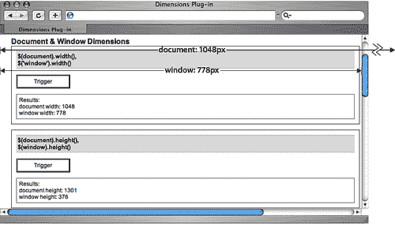
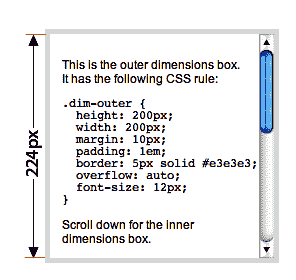
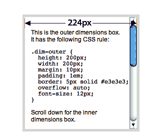
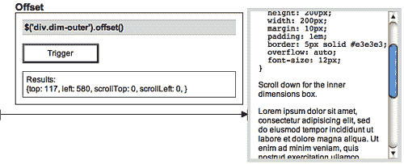
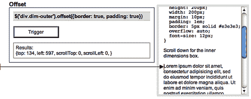
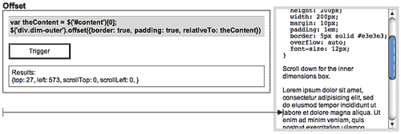
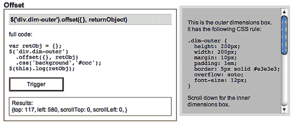

# 第 10 章插件尺寸

> 我们所信仰的符号
> 
> 有时会翻个底朝天
> 
> 重塑每个维度
> 
> 我们对这件事很有把握
> 
> -德沃，
> 
> “朴实的事实”

Paul Bakaus 和 Brandon Aaron 合著的**Dimensions**插件有助于缩小 CSS 框模型与开发人员需要精确测量文档中元素的高度和宽度之间的差距。它还以像素精度测量元素的顶部和左侧偏移，无论它们在页面上的何处。在本章中，我们将探讨此插件的各种方法并讨论它们的选项。

# 尺寸方法

除了确定浏览器窗口或文档的尺寸外，以下尺寸方法还构成了一组强大的工具，用于识别元素的高度和宽度，无论我们是否要考虑元素的填充和边框尺寸。

对于下面的每个示例，我们将使用相同的基本 HTML：

```js
<body>
  <div id="container">
<!-- CODE CONTINUES -->    
    <div id="content">
      <div class="dim-outer">
        <p>This is the outer dimensions box. It has the following CSS rule:</p>
<pre><code>.dim-outer {
  height: 200px;
  width: 200px;
  margin: 10px;
  padding: 1em;
  border: 5px solid #e3e3e3;
  overflow: auto;
  font-size: 12px;
}</code></pre>
        <p>Scroll down for the inner dimensions box.</p>
        <p>Lorem ipsum dolor sit amet, consectetur adipisicing elit,sed do eiusmod tempor incididunt ut labore et dolore magna aliqua. Ut enim ad minim veniam, quis nostrud exercitation ullamco laboris nisi ut aliquip ex ea commodo consequat. Duis aute irure dolor in reprehenderit in voluptate velit esse cillum dolore eu fugiat nulla pariatur. Excepteur sint occaecat cupidatat non proident, sunt in culpa qui officia deserunt mollit anim id est laborum.</p>
        <div class="dim-inner"> This is the inner dimensions box.
        </div>
      </div> 

<!-- CODE CONTINUES -->

    </div>
  </div> 
</body>
```

## .高度（）

<colgroup><col style="text-align: left"></colgroup> 
| 获取`document`或`window`对象的高度。

```js
.height()

```

 |

### 参数

没有一个

### 返回值

以像素为单位表示高度的整数。

### 讨论

`.height`方法仅在应用于元素时使用同名的 jQuery 核心方法。Dimensions 将`.height()`的使用扩展到浏览器`window`和`document`。

`$(window).height()`返回浏览器窗口的像素高度。如果有水平滚动条，则不包括在高度计算中。

`$(document).height()`返回文档的像素高度。如果文档的高度大于可视区域，此时会出现垂直滚动条-`$(document).height()`计算总高度，包括可见部分和隐藏部分。

下图说明了`$(document).height()`和`$(window).height()`之间的区别：


有关在页面上使用元素的`.height`方法的信息，请参见[第 4 章](04.html "Chapter 4. DOM Manipulation Methods")。

## .宽度（）

<colgroup><col style="text-align: left"></colgroup> 
| 获取`document`或`window`对象的宽度。

```js
.width()

```

 |

### 参数

没有一个

### 返回值

以像素为单位表示宽度的整数。

### 说明

`.width`方法与`.height()`方法一样，在应用于元素时，只使用同名的 jQuery 核心方法。但是，维度扩展了`.width()`，因此我们可以将其应用于`document`和浏览器`window`。

`$(document).width()`仅返回文档的像素宽度。如果有垂直滚动条，`$(document).width()`不包括在计算中。如果文档的宽度大于可查看区域，在这种情况下，会出现一个水平滚动条-`$(document).width()`计算总高度，包括页面的可见部分和隐藏部分。

`$(window).width()`返回浏览器的像素宽度。如果有垂直滚动条，则不包括在宽度计算中。

下图说明了`$(document).width()`和`$(window).width()`之间的区别：



有关在页面上使用元素的`.width`方法的信息，请参见[第 4 章](04.html "Chapter 4. DOM Manipulation Methods")。

## .内高（）

<colgroup><col style="text-align: left"></colgroup> 
| 获取匹配元素集中第一个元素的计算内部高度。

```js
.innerHeight()

```

 |

### 参数

没有一个

### 返回值

表示元素内部高度的整数，以像素为单位。

### 说明

`.innerHeight`方法与基本`.height()`方法的不同之处在于，它除了计算元素本身外，还计算顶部和底部填充物的高度。但是，计算中不包括边框或边距。

如果与`document`或`window, .innerHeight()`一起使用，则调用维度`.height`方法返回值。

给定一个高度为`200px`、字体大小为`12px`、上下填充为`1em, .innerHeight()`的元素返回`224`（像素），如下图所示：



## .innerWidth（）

<colgroup><col style="text-align: left"></colgroup> 
| 获取匹配元素集中第一个元素的计算内部宽度。

```js
.innerWidth()

```

 |

### 参数

没有一个

### 返回值

表示元素内部宽度的整数，以像素为单位。

### 说明

`.innerWidth`方法与基本`.width()`方法的不同之处在于，它除了计算元素本身外，还计算左右填充的宽度。但是，计算中不包括边框或边距。

如果与`document`或`window, .innerWidth()`一起使用，则调用维度`.width`方法返回值。

给定一个宽度为`200px`、字体大小为`12px`、左右填充为`1em, .innerWidth()`的元素返回`224`（像素），如下图所示：



## .outerHeight（）

<colgroup><col style="text-align: left"></colgroup> 
| 获取匹配元素集中第一个元素的计算外部高度。

```js
.outerHeight()

```

 |

### 参数

没有一个

### 返回值

表示元素外部高度的整数，以像素为单位。

### 讨论

`.outerHeight`方法与基本`.height()`方法的不同之处在于，它除了计算元素本身外，还计算顶部和底部填充以及顶部和底部边界的高度。但是，与`.height()`和`.innerHeight()`一样，计算中不包括元素的边距。

如果与`document`或`window, .outerHeight()`一起使用，则调用维度`.height`方法返回值。


## .外层宽度（）

<colgroup><col style="text-align: left"></colgroup> 
| 获取匹配元素集中第一个元素的计算外部宽度。

```js
.outerWidth()

```

 |

### 参数

没有一个

### 返回值

表示元素外部宽度的整数，以像素为单位。

### 说明

`.outerWidth`方法与基本`.width()`的不同之处在于，它除了计算元素本身外，还计算左右填充和左右边界的宽度。然而，与`.width()`和`.innerWidth()`一样，计算中不包括元素的边距。

如果与`document`或`window, .outerWidth()`一起使用，则调用维度`.width`方法返回值。


# 定位方法

以下方法有助于确定元素相对于已定位的祖先、文档正文或文档的可视区域的确切位置。

在*Size Methods*一节中，我们将对以下每个示例使用相同的基本 HTML：

```js
<body>
  <div id="container">
<!-- CODE CONTINUES -->    
    <div id="content">
      <div class="dim-outer">
        <p>This is the outer dimensions box. It has the following CSS rule:</p>
<pre><code>.dim-outer {
  height: 200px;
  width: 200px;
  margin: 10px;
  padding: 1em;
  border: 5px solid #e3e3e3;
  overflow: auto;
  font-size: 12px;
}</code></pre>
        <p>Scroll down for the inner dimensions box.</p>
        <p>Lorem ipsum dolor sit amet, consectetur adipisicing elit, sed do eiusmod tempor incididunt ut labore et dolore magna aliqua. Ut enim ad minim veniam, quis nostrud exercitation ullamco laboris nisi ut aliquip ex ea commodo consequat. Duis aute irure dolor in reprehenderit in voluptate velit esse cillum dolore eu fugiat nulla pariatur. Excepteur sint occaecat cupidatat non proident, sunt in culpa qui officia deserunt mollit anim id est laborum.</p><div class="dim-inner"> This is the inner dimensions box.
        </div>
      </div> 

<!-- CODE CONTINUES -->

    </div>
  </div> 
</body>
```

## .scrollTop（）

<colgroup><col style="text-align: left"></colgroup> 
| 获取窗口或文档中可滚动元素向下滚动的像素数。

```js
.scrollTop()

```

 |

### 参数

没有一个

### 返回值

以像素为单位表示垂直滚动条位置的整数。

### 讨论

`.scrollTop`方法能够返回浏览器窗口或文档中某个元素的垂直滚动位置。例如，给定`<div class="dim-outer">`向下滚动 96 像素后（如下图所示），`$('div.dim-outer').scrollTop()`返回`96`：


## .scrollTop（值）

<colgroup><col style="text-align: left"></colgroup> 
| 设置窗口中要向下滚动的像素数或文档中匹配的可滚动元素集。

```js
.scrollTop(value)

```

 |

### 参数

*   `value`：表示像素数的整数。

### 返回值

jQuery 对象，用于链接目的。

### 说明

通过将数值传递给`.scrollTop`方法，我们可以上下移动浏览器窗口或文档中可滚动元素的滚动位置。在下图中，`<div class="dim-outer">`的滚动位置已设置为`$('div.dim‑outer').scrollTop(200)`：


## .scrollLeft（）

<colgroup><col style="text-align: left"></colgroup> 
| 获取窗口或文档中可滚动元素从左向右滚动的像素数。

```js
.scrollLeft()
```

 |

### 参数

没有一个

### 返回值

以像素为单位表示水平滚动条位置的整数。

### 说明

`.scrollLeft`方法能够返回浏览器窗口或文档中某个元素的水平滚动位置。例如，浏览器窗口向右滚动 24 像素后，`$(window).scrollLeft()`的返回值为`24`：


## .向左滚动（数值）

<colgroup><col style="text-align: left"></colgroup> 
| 设置窗口中要从左向右滚动的像素数或文档中匹配的可滚动元素集。

```js
.scrollLeft(value)
```

 |

### 参数

*   `value`：表示像素数的整数。

### 返回值

jQuery 对象，用于链接目的。

### 讨论

通过将数值传递给`.scrollLeft`方法，我们可以向左或向右移动浏览器窗口或文档中可滚动元素的滚动位置。在下图中，浏览器窗口的滚动位置已设置为`$(window).scrollLeft(50)`


## .offset（）

<colgroup><col style="text-align: left"></colgroup> 
| 获取匹配元素集中第一个元素的顶部和左侧坐标。还获取匹配元素的`scrollTop`和`scrollLeft`偏移量。

```js
.offset([options])
.offset(options, returnObject)

```

 |

### 参数（第一版）

*   `options`（可选）：用于配置偏移计算方式的设置映射。可以包含以下项目：
    *   `margin`（可选）：一个布尔值，指示是否在计算中包含元素的边距。默认为`true`。
    *   `border`（可选）：一个布尔值，指示是否在计算中包含元素的边界。默认为`false`。
    *   `padding`（可选）：一个布尔值，指示是否在计算中包含元素的填充。默认为`false`。
    *   `scroll`（可选）：一个布尔值，指示是否在计算中包括所有祖先元素的滚动偏移。默认为`true`。
    *   `lite`（可选）：一个布尔值，指示是否使用 OffsetSite 而不是 offset。默认为`false`。
*   `relativeTo`（可选）：一个 HTML 元素，表示匹配元素将相对偏移的祖先元素。默认为`document.body`。

### 参数（第二版）

*   `options`：用于配置偏移计算方式的设置映射。
    *   `margin`（可选）：一个布尔值，指示是否在计算中包含元素的边距。默认为`true`。
    *   `border`（可选）：一个布尔值，指示是否在计算中包含元素的边界。默认为`false`。
    *   `padding`（可选）：一个布尔值，指示是否在计算中包含元素的填充。默认为`false`。
    *   `scroll`（可选）：一个布尔值，指示是否在计算中包括所有祖先元素的滚动偏移。默认为`true`。
    *   `lite`（可选）：表示是否使用`offsetLite`而不是`offset`的布尔值。默认为`false`。
    *   `relativeTo`（可选）：一个 HTML 元素，表示匹配元素将相对偏移的祖先元素。默认为`document.body`。
    *   `returnObject`：存储返回值的对象。使用该方法的第二个版本时，链不会断开，结果将指定给该对象。

### 返回值（第一版）

一个对象，包含`top, left`的值，以及可选的`scrollTop`和`scrollLeft`的值。

### 返回值（第二版）

jQuery 对象，用于链接目的。

### 说明

`.offset`方法允许我们定位页面上任何元素的`top`和`left`位置，无论其`position`是`static`还是`relative, absolute`或`fixed`，也不管滚动条的位置如何。`.offset()`提供了用于分解边距、边框、填充和滚动到计算中的选项，提供了极大的灵活性和准确性。

以下一系列图像演示了由`.offset()`返回的不同值，具体取决于选项的设置方式。

**违约**

在第一个示例中，使用了填充（false）、边框（false）和边距（true）的默认设置。结果：

```js
{top: 117, left: 580, scrollTop: 0, scrollLeft: 0}

```



请注意，由于边距的默认值为`true`，因此从窗口左边缘到匹配元素的距离一直延伸到（但不包括）元素的边界。

**含边框**

在第二个示例中，边框选项设置为`true`。由于`<div class="dim-outer">`周围有一个 5 像素的边框，`top`和`left`值各增加 5 像素：

```js
{top: 122, left: 585, scrollTop: 0, scrollLeft: 0}

```


**包括边框和衬垫**

下一个示例将边框和填充选项都设置为`true`（请记住，默认情况下边距选项的值为`true`。结果是边界增加了 5 个像素，填充增加了 12 个像素（1em）：

```js
{top: 134, left: 597, scrollTop: 0, scrollLeft: 0}

```



**寻找相对于祖先的位置**

使用`relativeTo`选项，我们可以找到元素与其任何一个定位祖先之间的偏移距离。在下一个例子中，我们将得到`<div class="dim-outer">`和`<div id="content">`之间的偏移量。由于该`content <div>`本身由于容器的 24 像素左边距而偏离窗口的左侧，因此`left`的值现在比上一示例的值小 24 像素

```js
{top: 27, left: 573, scrollTop: 0, scrollLeft: 0}

```



这里值得注意的是，由于`relativeTo`设置需要一个 DOM 元素，因此在将 jQuery 对象用于`relativeTo`参数之前，我们使用简写的`[0]`符号将其转换为 DOM 元素。

`27`的`top`值来自浮动的`<div class="dim-outer">`元素的边距（`12`）、边框（`5`）和填充（`10`之和。如果`<div id="content">`应用了任何顶部填充，则该填充也将添加到总顶部偏移中。

**返回滚动偏移量**

`scroll`选项的默认值为`true`，当匹配元素位于`overflow`属性设置为`auto`或`scroll`的一个或多个元素内时，该选项特别有用。它将所有祖先元素的总滚动偏移量添加到总偏移量中，并将两个属性添加到返回的对象`scrollTop`和`scrollLeft`。在以下示例中可以观察到其有用性，该示例显示了当`<div class="dim-outer">`向下滚动 79 个像素时`<div class="dim-inner">`的偏移量：

```js
{top: 509, left: 597, scrollTop: 79, scrollLeft: 0}

```


**保持可链接性**

如果我们希望传入一个返回对象以继续链接方法，那么我们仍然必须包含选项映射。为了在传入返回对象时保持这些选项的默认值不变，我们可以简单地使用空映射。例如，`$('div.dim-outer').offset({}, returnObject)`获得与`$('div.dim-outer').offset()`相同的值，但将其存储在`returnObject`中供以后使用。

假设我们希望在将`<div class="dim-outer">`的背景色同时更改为灰色（#cccc）的同时获得其偏移量和滚动值。代码如下所示：

```js
var retObj = {};
$('div.dim-outer')
  .offset({}, retObj)
  .css('background','#ccc');
$(this).log(retObj);
```

我们首先为返回对象（retObj）声明一个变量。然后我们将`.offset`和`.css`方法链接到选择器。最后，我们对`.offset()—in`返回的对象做了一些事情。在本例中，使用我们的日志插件记录结果。改变`<div>'s`背景色，`.offset()`值记录如下：

```js
{top: 117, left: 580, scrollTop: 0, scrollLeft: 0}

```



## .职位（）

<colgroup><col style="text-align: left"></colgroup> 
| 获取匹配元素集中第一个元素相对于其最近的相对、绝对或固定位置祖先的位置。

```js
.position()
.position(returnObject)

```

 |

### 参数（第一版）

没有一个

### 参数（第二版）

*   `returnObject`：存储返回值的对象。使用该方法的第二个版本时，链不会断开，结果将指定给该对象。

### 返回值（第一版）

包含`top`和`left`值的对象。

### 返回值（第二版）

jQuery 对象，用于链接目的。

### 说明

`.position`方法是以下`.offset()`变化的简写：

```js
.offset({
  margin: false, 
  scroll: false, 
  relativeTo: offsetParent
  }, 
  returnObject);
```

在这里，只有元素的顶部和左侧位置（没有任何填充、边框或边距）相对于其最近定位的祖先确定。有关这些选项的详细信息，请参见`.offset()`的说明。

对于`relativeTo`，`.position()`方法使用在维度代码中设置的变量`offsetParent`。实际上，这段代码从元素的直接父元素开始，向上爬升 DOM，在第一个位置为`relative, absolute`或`fixed`的元素处停止。然后，相对于最近定位的图元计算初始图元的偏移位置。

考虑下面的 HTML：

```js
<div id="outer">
  <div id="middle" style="position: relative">
    <div id="inner">
      <p>Use .position() for this paragraph</p>
    </div>
  </div>
</div>
```

使用`$('p').position()calculates`段落相对于`<div id="middle">`的顶部和左侧偏移量，因为`<div>`是最近定位的祖先（请注意其`style`属性）。

由于`.position()`不带参数（第二版`returnValue`除外），所以比`.offset()`灵活得多。在大多数情况下，建议使用上文讨论过的`.offset()`。