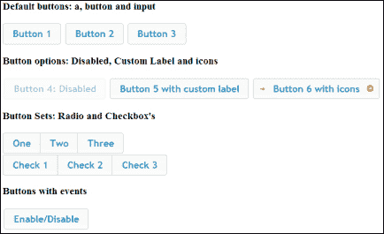
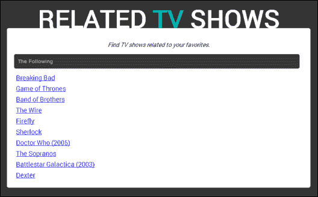

# 九、jQueryUI

在本章中，我们将介绍：

*   创建时尚实用的按钮
*   为用户信息和输入创建对话框
*   在应用程序中实现进度条
*   向输入框快速添加日期选择器接口
*   创建自动完成搜索功能

# 导言

jQueryUI 是一个建立在 jQueryJavaScript 库之上的用户界面库。jQueryUI 提供了许多交互插件、效果和界面元素，开发人员可以在其界面中使用这些插件、效果和界面元素。本章将演示 jQueryUI 最常见的元素，如按钮和日期选择器，并向您展示如何将它们快速添加到您的网站或 web 应用程序中。

在开始本章之前，请确保您已访问过[http://jqueryui.com/](http://jqueryui.com/) 下载了 jQuery UI 库。通过其网站上的**下载生成器**下载图书馆；确保所有默认选项保持选中状态。本章中使用的 jQueryUI 版本是 v1.10.3，但大多数配方都适用于较新版本。他们的网站还提供了丰富的文档和示例，帮助您开始使用 jQueryUI。

从本章中的食谱开始，创建一个名为`chapter9`的易于访问的文件夹，并将 jQuery 库放在其中。创建名为`jquery-ui`的子文件夹，并将 jQuery UI 库中的`css`和`js`文件夹放置在此子文件夹中。

# 打造时尚实用的按钮

使用 CSS3 快速创建时尚按钮相对容易，但添加额外功能通常需要更多的时间投资。jQueryUI 提供了一个按钮 API，可以用于创建范围广泛的按钮控件，这些控件可以轻松添加到 UI 中并与内部 JavaScript 代码交互。此配方向您展示了如何创建常用按钮控件，以便您可以在方便的时候重复使用代码。

## 准备好了吗

在前面创建的文件夹中，创建`recipe-1.html`和`recipe-1.js`。

## 怎么做…

要使用 jQuery UI 库创建一系列不同的按钮控件，请执行以下步骤：

1.  将以下 HTML 代码添加到`recipe-1.html`以添加各种按钮元素，确保在需要时更新对 jQuery 和 jQuery UI 库的引用：

    ```js
    <!DOCTYPE html>
    <html>
    <head>
       <title>Chapter 9 :: Recipe 1</title>
       <script src="jquery.min.js"></script>
       <script src="jquery-ui/js/jquery-ui-1.10.3.custom.min.js"></script>
       <link type="text/css" rel="stylesheet" href="jquery-ui/css/ui-lightness/jquery-ui-1.10.3.custom.min.css" />
       <script src="recipe-1.js"></script>
    </head>
    <body>
       <h3>Default buttons: a, button and input</h3>
       <a href="#">Button 1</a>
       <button>Button 2</button>
       <input type="submit" name="button3" value="Button 3" />
       <h3>Button options: Disabled, Custom Label and icons</h3>
       <button class="button4">Button 4: Disabled</button>
       <button class="button5">Button 5</button>
       <button class="button6">Button 6 with icons</button>
       <h3>Button Sets: Radio and Checkbox's</h3>
       <div class="buttonSet1">
          <button>One</button>
          <button>Two</button>
          <button>Three</button>
       </div>
       <div class="buttonSet2">
          <input type="checkbox" id="check1" /><label for="check1">Check 1</label>
          <input type="checkbox" id="check2" /><label for="check2">Check 2</label>
          <input type="checkbox" id="check3" /><label for="check3">Check 3</label>
       </div>
       <h3>Buttons with events</h3>
       <button class="enableDisable">Enable/Disable</button>
    </body>
    </html>
    ```

2.  在`recipe-1.js`中添加以下 jQuery 代码，以便将 UI 样式和功能应用于按钮元素：

    ```js
    $(function(){
       //Default buttons
       $('a, button, input[type=submit]').button();
       //Button options
       $('#button4').button('option', 'disabled', true);
       $('#button5').button({label: 'Button 5 with custom label'});
       $('#button6').button('option', 'icons', {primary: 'ui-icon-arrowthick-1-e', secondary: 'ui-icon-circle-arrow-e'});
       //Button sets
       $('.buttonSet1').buttonset();
       $('.buttonSet2').buttonset();
       //Button events
       $('.enableDisable').button().click(function(){
          var _button4 = $('.button4');
          if (_button4.button('option', 'disabled')) {
             _button4.button('option', 'disabled', false);
          } else {
             _button4.button('option', 'disabled', true);
          }
       });
    }); 
    ```

3.  Open `recipe-1.html` in a web browser and you will be presented with various button elements styled with the default jQuery UI theme.

    

## 它是如何工作的…

HTML 提供了一系列不同的按钮元素，jQueryUI 按钮 API 可以使用这些元素。通过查看此网页，您将能够看到以下元素是如何工作的，并在您方便的时候重新使用代码：

*   包括`a`、`input`和`button`元素的默认按钮
*   具有自定义标签、图标和禁用选项的默认按钮
*   按钮设置允许复选框和单选按钮功能
*   按钮上的事件

要初始化 jQuery UI 按钮 API，请以典型的 jQuery 方式选择一个按钮或一组按钮元素，并使用`button()`功能，如下所示：

```js
$('a, button, input[type=submit]').button();
```

这将把 jQueryUICSS 和附加功能应用于所选按钮。`button()`功能还采用一系列选项，以便您能够单独操作按钮元件。这是`recipe-1.js`中`Button options`部分所示的。

通过将 HTML 代码中的按钮分组，并使用`buttonset()`功能，您可以创建一组按钮，这些按钮一起工作，形成复选框或单选按钮功能，如下所示：

```js
<div class="buttonSet1">
   <button>One</button>
   <button>Two</button>
   <button>Three</button>
</div>
```

您仍然可以使用普通 jQuery 与 HTML 按钮元素交互，以附加事件并执行操作。使用此配方，标签为**启用/禁用**的按钮附带了一个点击事件处理程序，如下所示：

```js
$('.enableDisable').button().click(function(){
   var _button4 = $('.button4');
   if (_button4.button('option', 'disabled')) {
      _button4.button('option', 'disabled', false);
   } else {
      _button4.button('option', 'disabled', true);
   }
});
```

这使用 jQuery UI 提供的`button('option')`功能检查按钮的禁用状态，然后根据按钮的当前状态将其设置为`true`或`false`。在 web 浏览器中打开`recipe-1.html`后，点击此按钮将在视觉上启用和禁用标有**按钮 4**的按钮。注意，在上面的示例中，为了方便起见，`click()`函数可以链接在`button()`函数之后。

## 还有更多…

jQueryUI 库中提供了更多的按钮类型。前往他们网站上提供的文件（[http://jqueryui.com/button/](http://jqueryui.com/button/) 以获取简单示例和更多详细信息。

## 另见

*   *创建用户信息对话框并输入*

# 创建用户信息和输入对话框

在[第 6 章](06.html "Chapter 6. User Interface")*用户界面*中，向您展示了如何创建自己的模式弹出窗口。jQueryUI 提供了一个易于使用的 API，可以帮助您快速向应用程序添加模态或对话框。这个方法将查看 jQueryUI 对话框的默认行为，并向您展示如何使用它们。同样，这个配方的设计是为了让您能够轻松找到所需的代码，并在方便的时候重新使用它。

## 准备好了吗

在`chapter9`文件夹中，创建`recipe-2.html`和`recipe-2.js`，并将其打开并准备好进行编辑。

## 怎么做…

要了解如何在应用程序中快速添加对话框或模态，请执行以下步骤：

1.  将以下 HTML 添加到`recipe-2.html`中，以创建在 JavaScript 代码中使用的按钮和对话框元素：

    ```js
    <!DOCTYPE html>
    <html>
    <head>
       <title>Chapter 9 :: Recipe 2</title>
       <script src="jquery.min.js"></script>
       <script src="jquery-ui/js/jquery-ui-1.10.3.custom.min.js"></script>
       <link type="text/css" rel="stylesheet" href="jquery-ui/css/ui-lightness/jquery-ui-1.10.3.custom.min.css" />
       <script src="recipe-2.js"></script>
    </head>
    <body>
    <div class="actions">
       <button id="openSecondDialog">Open Second Dialog with Animation</button>
       <button id="openModalDialog">Open Modal Dialog</button>
       <button id="openConfirmationDialog">Open Confirmation Dialog</button>
    </div>
    <div id="default-dialog" title="Default Dialog">
       <p>This is a dialog with default behaviour.</p>
    </div>
    <div id="second-dialog" title="Second Dialog">
       <p>This is a dialog with animation that is opened by a button.</p>
    </div>
    <div id="modal-dialog" title="Modal Dialog">
       <p>This is a modal dialog.</p>
    </div>
    <div id="confirmation-dialog" title="Confirmation Dialog">
       <p>Are you sure you want to close this dialog?</p>
    </div>
    </body>
    </html>
    ```

2.  在`recipe-2.js`中添加以下 JavaScript 代码，以便初始化对话框元素和打开它们的按钮：

    ```js
     $(function(){
       //Set up the dialog elements
       $('#default-dialog').dialog();
       $('#second-dialog').dialog({
          autoOpen: false,
          show: {
             effect: "fade",
             duration: 500
          },
          hide: {
             effect: "explode",
             duration: 1000
          }
       });
       $('#modal-dialog').dialog({
          autoOpen: false,
          modal: true
       });
       $('#confirmation-dialog').dialog({
          autoOpen: false,
          resizable: false,
          buttons: {
             "Yes": function() {
                $(this).dialog("close");
             },
             "No": function() {
                alert("Your dialog will stay open.");
             }
          }
       });
       //Set up button elements
       $('.actions').buttonset();
       $('#openSecondDialog').click(function(){
          $('#second-dialog').dialog("open");
       });
       $('#openModalDialog').click(function(){
          $('#modal-dialog').dialog("open");
       });
       $('#openConfirmationDialog').click(function(){
          $('#confirmation-dialog').dialog("open");
       });
    });
    ```

3.  在 web 浏览器中打开`recipe-2.html`，您将看到默认对话框已打开。使用按钮集内的按钮打开各种其他对话框类型。

## 它是如何工作的…

与前面的方法一样，HTML 代码创建 jQueryUI 库将用于应用所需功能和样式的元素。页面中有四个对话框元素和三个按钮，用于打开其他对话框。

JavaScript 代码初始化每个对话框元素，从而提供不同的选项和设置。第一个对话框元素`#default-dialog`通过使用以下 jQuery UI 代码初始化，没有任何选项：

```js
$('#default-dialog').dialog();
```

这将把`#default-dialog`HTML 元素变成一个 jQuery UI 对话框，并显示在屏幕上。

第二个对话框初始化时，将`autoOpen`选项设置为`false`，因此当用户首次访问页面时，不会自动打开该对话框。要打开此对话框，用户必须单击标有**的按钮，打开带有动画**的第二个对话框。第二个对话框提供了一些动画选项，如下所示：

```js
$('#second-dialog').dialog({
   autoOpen: false,
   show: {
   effect: "fade",
   duration: 500
},
hide: {
   effect: "explode",
    duration: 1000
   }
});
```

这将确保在打开对话框时使用淡入淡出动画，在关闭对话框时使用分解动画。阅读 jQuery UI 对话框文档（[http://api.jqueryui.com/dialog/](http://api.jqueryui.com/dialog/) 来发现您可以使用的可用动画。

第三个对话框是模态对话框。当模式打开时，只需在`dialog()`功能中添加`modal: true`选项，就可以添加一个背景，使页面的其余部分看不到视图。

此配方中的第四个对话框是确认对话框。使用“按钮”选项，可以指定多个按钮和回调来保持按钮操作，如下所示：

```js
$('#confirmation-dialog').dialog({
   autoOpen: false,
   resizable: false,
   buttons: {
   "Yes": function() {
      $(this).dialog("close");
   },
   "No": function() {
      alert("Your dialog will stay open.");
      }
   }
});
```

调整大小选项也设置为`false`，以覆盖允许用户更改对话框大小的默认行为。

## 还有更多…

通过阅读文件（[http://api.jqueryui.com/dialog/](http://api.jqueryui.com/dialog/) ），您将发现更多对话框类型可供您使用。表单对话框对于使用内置验证函数快速检索用户输入特别有用。

## 另见

*   *打造时尚实用的按钮*

# 在应用程序中实现进度条

进度条允许用户拥有有关应用程序正在执行的流程的详细信息。进度条是理想的解决方案，可以向用户更新他们请求的任务的进度，这可能需要很长时间才能完成。此操作可能是文件上载或其他冗长的服务器端过程。此配方将向您展示如何使用 jQuery UI 进度条 API 轻松地向应用程序添加进度条。

## 准备好了吗

在您先前创建的`chapter9`文件夹中创建`recipe-3.html`、`recipe-3.js`和`recipe-3.css`。

## 怎么做…

要了解如何快速将进度条添加到应用程序中，请执行以下步骤：

1.  将以下 HTML 代码添加到`recipe-3.html`中，以创建包含所需进度条 HTML 元素的网页：

    ```js
    <!DOCTYPE html>
    <html>
    <head>
       <title>Chapter 9 :: Recipe 3</title>
       <script src="jquery.min.js"></script>
       <script src="jquery-ui/js/jquery-ui-1.10.3.custom.min.js"></script>
       <link type="text/css" rel="stylesheet" href="jquery-ui/css/ui-lightness/jquery-ui-1.10.3.custom.min.css" />
       <link type="text/css" rel="stylesheet" href="recipe-3.css" />
       <script src="recipe-3.js"></script>
    </head>
    <body>
    <div class="progress-bar"><div class="progress-label">Press "Start Progress" to begin load...</div></div>
    <button class="start-progress">Start Progress</button>
    </body>
    </html>
    ```

2.  在`recipe-3.css`中添加以下 CSS 代码，以便为进度条标签提供一些基本样式：

    ```js
    .progress-bar {
       position: relative;
    }
    .progress-label {
       position: absolute;
       left: 0;
       top: 0;
       right: 0;
       bottom: 0;
       text-align: center;
       line-height: 35px;
    }
    ```

3.  在`recipe-3.js`中添加以下 JavaScript 代码，以初始化进度条并为启动进度按钮提供功能：

    ```js
    $(function(){
       var progressBar = $('.progress-bar');
       var progressLabel = $('.progress-label');
       progressBar.progressbar({
          change: function() {
             progressLabel.text(progressBar.progressbar("value") + "% complete...");
          },
          complete: function() {
             progressLabel.text("Completed!");
          }
       });
       $('.start-progress').button().click(doStuff);
       function doStuff() {
          var progressValue = ((progressBar.progressbar("value") || 0) + 1);
          progressBar.progressbar("value", progressValue);
          if (progressValue < 100) {
             setTimeout(doStuff, 100);
          }
       }
    });
    ```

4.  Open `recipe-3.html` in a web browser and click on the **Start Progress** button. The progress bar will jump to life and begin to show you the progress until it has reached 100 percent.

    

## 它是如何工作的…

HTML 页面创建两个元素，jQuery UI 将使用它们创建进度条和标签：

```js
<div class="progress-bar"><div class="progress-label">Press "Start Progress" to being load...</div></div>
```

默认标签文本将添加到 label 元素中，用户首次访问网页时将显示该元素。网页中还增加了一个**启动进度**按钮，用户可以启动加载动作。

此配方中的加载操作只是一个伪过程。您可以轻松地将此代码与`XmlHttpRequest`一起用于图像上传，例如[第 8 章](08.html "Chapter 8. Understanding Plugin Development")、*理解插件开发*中的*从头开始编写图像裁剪器插件*配方中使用的代码。

要初始化添加到 HTML 页面的`progress-bar`元素中的进度条，使用`progressbar()`函数：

```js
progressBar.progressbar({
   change: function() {
   progressLabel.text(progressBar.progressbar("value") + "% complete...");
   },
   complete: function() {
      progressLabel.text("Completed!");
   }
});
```

此函数提供了一个具有两个属性的对象，用于设置更改并完成事件回调函数。这允许我们在进度值更改和进度完成时执行操作。在此配方中，我们只需更新进度标签，以通知用户完成百分比值。确保您阅读了文档（[http://jqueryui.com/progressbar/](http://jqueryui.com/progressbar/) 以便您了解所有可用选项。

通过使用`progressBar.progressbar("value")`，可以从进度条元素中检索进度值。然后可以使用此值更新进度标签文本。

当用户点击**开始进度**按钮时调用`doStuff()`功能作为进度。它使用`setTimeout()`每 100 毫秒调用一次自身，然后按如下方式递增进度条值：

```js
var progressValue = ((progressBar.progressbar("value") || 0) + 1);
progressBar.progressbar("value", progressValue);
```

## 另见

*   [第 8 章](08.html "Chapter 8. Understanding Plugin Development")*理解插件开发*中的*从头开始编写图像裁剪器插件*配方

# 在输入框中快速添加日期选择器接口

日期选择器为用户提供了一个易于使用的界面，允许用户快速选择所需的日期。jQueryUI 提供了一个可以快速添加到输入字段的日期选择器。日期选择器提供许多配置选项，如日期格式和限制，使开发人员更容易相应地限制用户的输入。此配方将向您展示如何将日期选择器添加到两个输入字段中，更改日期选择器的日期格式，并对每个字段应用日期限制。

## 准备好了吗

与前面的配方一样，在前面创建的`chapter9`文件夹中创建`recipe-4.html`、`recipe-4.js`和`recipe-4.css`。

## 怎么做…

执行以下每个步骤，创建一个带有两个日期选择器和配置选项的简单界面：

1.  在`recipe-4.html`中插入以下 HTML 代码，创建包含日期选择器元素的基本网页和 UI:

    ```js
    <!DOCTYPE html>
    <html>
    <head>
       <title>Chapter 9 :: Recipe 4</title>
       <script src="jquery.min.js"></script>
       <script src="jquery-ui/js/jquery-ui-1.10.3.custom.min.js"></script>
       <link type="text/css" rel="stylesheet" href="jquery-ui/css/ui-lightness/jquery-ui-1.10.3.custom.min.css" />
       <link type="text/css" rel="stylesheet" href="recipe-4.css" />
       <script src="recipe-4.js"></script>
    </head>
    <body>
       <div class="frame">
          <div class="settings">
             <label>Restrict:</label>
             <select class="restrict">
                <option value="1">1 Year</option>
                <option value="2">2 Years</option>
                <option value="3">3 Years</option>
            </select>
            <label>Format:</label>
            <select class="formatDate">
               <option value="dd/mm/yy">English Format</option>
               <option value="mm/dd/yy">American Format</option>
             </select>
          </div>
          <div class="datepickers">
             Start: <input type="text" class="start" />
             End: <input type="text" class="end" />
          </div>
       </div>
    </body>
    </html>
    ```

2.  在`recipe-4.css`中添加以下 CSS，为 UI 提供基本样式和定位：

    ```js
    .frame {
       width: 500px;
       margin: 100px auto auto auto;
       background-color: #494949;
       border-radius: 5px;
       box-shadow: 5px 5px 5px #CCC;
    }
    .frame .settings {
       line-height: 40px;
       text-align: center;
       background-color: #333;
       color: #FFF;
       border-top-left-radius: 5px;
       border-top-right-radius: 5px;
    }
    .frame .datepickers {
       line-height: 100px;
       text-align: center;
       color: #CCC;
    }
    ```

3.  在`recipe-4.js`中添加以下 jQuery 代码，以设置日期选择器元素并为`recipe-4.html`中的其他元素提供功能：

    ```js
    $(function(){
       var _start = $('.start');
       var _end = $('.end');
       var _restrict = $('.restrict');
       var _formatDate = $('.formatDate');
       var _dateFormat = 'dd/mm/yy';
       _start.datepicker({
          dateFormat: _dateFormat,
          minDate: new Date(),
          onClose: function(selectedDate) {
             _end.datepicker("option", "minDate", selectedDate);
             restrictDates();
          }
       });
       _end.datepicker({
          dateFormat: _dateFormat,
          onClose: function(selectedDate) {
             _start.datepicker("option", "maxDate", selectedDate);
          }
       });
       _formatDate.change(function(){
          _dateFormat = _formatDate.val();
          _start.datepicker("option", "dateFormat", _dateFormat);
          _end.datepicker("option", "dateFormat", _dateFormat);
       });
       _restrict.change(function(){
          restrictDates();
       });
       function restrictDates() {
          var maxDate = _start.datepicker("getDate");
          if (maxDate != null) {
          maxDate.setFullYear(maxDate.getFullYear() + parseInt(_restrict.val()));
          _end.datepicker("option", "maxDate", maxDate);
    }
       }
    });
    ```

4.  在 web 浏览器中打开`recipe-4.html`，您将看到一个简单的界面，有两个输入和两个下拉菜单。当您在输入字段内单击时，标有`start`和`end`的两个输入将为您提供一个日期选择器界面。然后，可以使用日期选择器选择要插入关联输入中的日期。通过使用这两个下拉列表，您可以更改日期和日期选择器的行为。格式选项将日期格式更改为英语或美语。“限制”下拉列表将允许您选择结束日期选择器允许用户选择的超过所选开始日期的最大年数。

## 它是如何工作的…

HTML 和 CSS 为我们提供了一个简单的界面，可以与 jQueryUI 一起使用，以演示一些日期选择器功能。在`recipe-4.js`的顶部，有一些变量包含对 jQuery 将使用的不同 HTML 元素的引用，还有一个变量包含英语日期格式。

要向输入元素添加日期选择器，jQuery UI`datepicker()`函数与所需选项一起使用：

```js
_start.datepicker({
   dateFormat: _dateFormat,
   minDate: new Date(),
   onClose: function(selectedDate) {
      _end.datepicker("option", "minDate", selectedDate);
      restrictDates();
   }
});
```

`dateFormat`选项设置所选日期选择器的格式。`minDate`选项设置日期选择器允许用户选择的最小日期；`new Date()`用于将此限制设置为当前日期。为`onClose`指定的功能将在日期选择器关闭时执行。在该功能中，终端输入设置了`minDate`选项。这将确保用户无法选择在所选开始日期之前的结束日期。`restrictDates()`函数也从这里调用。`restrictDates()`功能定义如下：

```js
function restrictDates() {
   var maxDate = _start.datepicker("getDate");
   if (maxDate != null) {
      maxDate.setFullYear(maxDate.getFullYear() + parseInt(_restrict.val()));
      _end.datepicker("option", "maxDate", maxDate);
   }
}
```

此功能对结束日期选择器应用限制，因此用户无法选择比所选开始日期大*n*年的结束日期。这里，*n*是**限制**下拉菜单指定的值。正如设置了`minDate`一样，`maxDate`也是使用选定的开始日期加上指定年份的金额来设置的。当用户更改下拉选择时，也可以使用`change()`函数调用此函数。

当用户选择更改日期格式时，以下代码用于更新每个日期选择器元素的格式：

```js
_formatDate.change(function(){
   _dateFormat = _formatDate.val();
   _start.datepicker("option", "dateFormat", _dateFormat);
   _end.datepicker("option", "dateFormat", _dateFormat);
});
```

作为日期选择器 API 的一部分，有许多选项可用。阅读文档（[http://api.jqueryui.com/datepicker/](http://api.jqueryui.com/datepicker/) 了解其他可用选项。

# 创建自动完成搜索功能

此食谱将向您展示如何在用户键入搜索输入时向用户建议搜索词。这是一项非常受欢迎的功能，对用户非常有帮助，因为它可以让用户在进行搜索之前了解搜索结果的可用性。jQueryUI 提供了可以快速添加到任何输入元素的自动完成功能。

## 准备好了吗

在`chapter9`文件夹中创建`recipe-5.html`、`recipe-5.js`和`recipe-5.css`，保存其他配方文件。

此配方使用 Trakt.tv（[提供的优质 APIhttp://trakt.tv/api-docs/](http://trakt.tv/api-docs/) 。您需要注册（免费）并获得 API 密钥，然后才能开始此配方。注册后，您可以在以下页面找到您的 API 密钥：[http://trakt.tv/api-docs/authentication](http://trakt.tv/api-docs/authentication) 。

### 注

在编写此配方时，Google Chrome 中存在一个已知的错误，如果您试图从本地机器使用 jQuery 中的 AJAX 调用外部源（即，使用`file://`而不是`http(s)://`访问`recipe-5.html`，您可能会收到一个`Access-Control-Allow-Origin`错误。如果您确实遇到此问题，请通过 web 服务器或使用其他浏览器提供您的配方文件。

为了演示如何在现实世界中使用自动完成功能，此配方将使用上面指定的 API 创建相关的电视节目搜索。它将允许用户搜索电视节目（带有来自 autocomplete 的建议），一旦用户选择了一个，将显示与所选节目相关的节目。

## 怎么做…

要添加自动搜索功能，执行以下说明：

1.  将以下 HTML 代码添加到`recipe-5.html`以创建基本网页：

    ```js
    <!DOCTYPE html>
    <html>
    <head>
       <title>Chapter 9 :: Recipe 5</title>
       <script src="jquery.min.js"></script>
       <script src="jquery-ui/js/jquery-ui-1.10.3.custom.min.js"></script>
       <link type="text/css" rel="stylesheet" href="jquery-ui/css/ui-lightness/jquery-ui-1.10.3.custom.min.css" />
       <link type="text/css" rel="stylesheet" href="recipe-5.css" />
       <script src="recipe-5.js"></script>
    </head>
    <body>
    <div class="frame">
       <h1>RELATED <span>TV</span> SHOWS</h1>
       <div class="head">
          <p>Find TV shows related to your favorites.</p>
          <div class="search-input-frame">
             <input type="text" id="searchInput" placeholder="Search for a TV show..." />
       </div>
       </div>
       <div class="results">
          <div class="searching">Searching for related shows...</div>
          <ul id="results-list"></ul>
       </div>
    </div>
    </body>
    </html>
    ```

2.  将下面的 CSS 放在`recipe-5.css`中，将 HTML 代码变成一个漂亮的网页：

    ```js
    @import url(http://fonts.googleapis.com/css?family=Roboto:400,300,100);
    body {
       background-color: #333;
       font-family: 'Roboto', sans-serif;
    }
    .frame {
       width: 800px;
       background-color: #FFF;
       margin: 100px auto auto auto;
       padding: 20px;
       border-radius: 5px;
    }
    .frame h1 {
       margin: -93px 0 0 0;
       color: #FFF;
       font-size: 70px;
       text-align: center;
    }
    .frame h1 span {
       color: #00B5B5;
    }
    .search-input-frame #searchInput {
       width: 780px;
       border: none;
       font-weight: bold;
       color: #999;
       background: #373737;
       font-size: 14px;
       height: 40px;
       padding: 0 0 0 10px;
       margin: 0;
       border-radius: 5px;
       line-height: 40px;
    }
    .frame .head p {
       font-style: italic;
       text-align: center;
    }
    .frame .results ul {
       list-style: none;
       margin: 10px 0 0 5px;
       padding: 0;
    }
    .frame .results ul li {
       line-height: 30px;
       font-size: 18px;
    }
    .frame .results .searching {
       display: none;
       text-align: center;
       font-style: italic;
       font-size: 18px;
       line-height: 100px;
    }
    .frame .results ul li.no-results {
       line-height: 100px;
       text-align: center;
       font-size: 16px;
       font-weight: bold;
    }
    ```

3.  在`recipe-5.js`中添加以下 jQuery，以初始化搜索输入元素上的自动完成功能：

    ```js
    $(function(){
       $('#searchInput').autocomplete({
          minLength: 2,
          source: function(input, response) {            
       },
       select: function (event, ui) { 
       }
       });
    });
    ```

4.  在您刚刚添加的源函数中，插入以下代码，根据用户的输入调用 Trakt.tv API，以提供自动完成功能和要显示的数据。确保用 Trakt.tv API 密钥替换了`[API KEY HERE]`，如下代码所示：

    ```js
    $.ajax({
    type: 'GET',
    url: 'http://api.trakt.tv/search/shows.json/[API KEY HERE]?query=' + input.term + "&limit=10",
    dataType: 'jsonp',
    success: function(data) {
       var results = [];
    for (var i = 0; i < data.length; i++) {
    results.push({
    id: data[i].tvdb_id,
    label: data[i].title,
    value: data[i].title
       });
       }
       response(results);
    }
    });
    ```

5.  要根据用户的“自动完成”部分填充主结果列表，请将以下 jQuery 代码添加到刚才添加的 select 函数中。再一次，记住用 API 键替换`[API KEY HERE]`：

    ```js
    var showId = ui.item.id;
    var _searchingMsg = $('.searching');
    var _resultList = $('#results-list');
    _resultList.empty();
    _searchingMsg.fadeIn();
    $.ajax({
    type: 'GET',
       url: 'http://api.trakt.tv/show/related.json/[API KEY HERE]/' + showId,
       dataType: 'jsonp',
    success: function(data) {
    _searchingMsg.hide();
    for (var i = 0; i < data.length; i++) {
       resultList.append("<li><a target='_blank' href='" + data[i].url + "'>" + data[i].title + "</a></li>");
    }
    }
    });
    ```

6.  Open `recipe-5.html` in a web browser and search for your favorite TV show:

    

## 它是如何工作的…

jQuery UI autocomplete 函数封装了所有的复杂性，因此开发人员只需考虑在选择后向其提供数据和操作（如果有的话）。

此配方中的 HTML 页面创建了一个网页，提供用户可以在其中搜索的输入。然后在 jQuery 代码中选择此输入，`autocomplete()`函数用于初始化所选元素的自动完成功能，如下所示：

```js
$('#searchInput').autocomplete({
   minLength: 2,
   source: function(input, response) {            

},
select: function (event, ui) { 

}
});
```

提供给`autocomplete()`功能的对象上的`source`属性是显示给用户的下拉列表中使用的数据。`source`属性可以是数组、字符串、或函数。当`source`是一个字符串时，它希望该值是一个资源 URL，以预期的格式提供数据。因为我们使用的外部 API 不会以预期的格式提供数据，所以我们使用第三个选项并在函数中执行一些额外的处理。`minLength`属性允许我们控制用户在自动完成功能启动之前必须输入的字符数。

首先，需要从 Trackt.tv 检索数据。为此，使用熟悉的 jQuery`$.ajax()`函数：

```js
$.ajax({
   type: 'GET',
   url: 'http://api.trakt.tv/search/shows.json/[API KEY HERE]?query=' + input.term + "&limit=10",
   dataType: 'jsonp',
   success: function(data) {

}
});
```

`source()`函数有两个参数：`input`（对象）和`response` （函数）。使用`input.term`，我们可以获取用户在搜索输入文本框中输入的值，并将其插入 API URL 以搜索电视节目。limit 查询字符串变量设置为`10`，因此只返回 10 个结果。

注意，在这个配方中的两个 AJAX 请求中，`dataType`属性都被设置为`jsonp`。这是为了防止在使用 API 时出现任何跨域问题。在[上阅读关于 jQuery 的 JSONP 的更多信息 http://www.jquery4u.com/json/jsonp-examples/](http://www.jquery4u.com/json/jsonp-examples/) 。

如果请求成功，我们可以遍历所有结果，并以自动完成功能所需的格式创建一个数组，如下所示：

```js
var results = [];
for (var i = 0; i < data.length; i++) {
   results.push({
      id: data[i].tvdb_id,
      label: data[i].title,
      value: data[i].title
});
}
response(results);
```

调用了`response()`函数，这是`source()`函数的第二个参数；这会将结果发送到自动完成功能进行显示。

当用户从自动完成建议列表中选择一个选项时，这些配方中的下一项功能就会出现。提供给`autocomplete()`函数的对象上的`select`属性接受一个回调函数，该函数在用户进行选择时执行。使用`ui`参数，可以从表示用户选择的对象检索数据。在这种情况下，我们需要 ID，以便将其传回 Trackt.tv API 并检索相关电视节目列表：

```js
var showId = ui.item.id;
```

此变量用作另一个`$.ajax()`请求的一部分。此请求成功后，将循环播放结果，并在每个相关电视节目的结果列表中插入一个列表项。还添加了到 Trakt.tv 网页的链接，其中包含关于每个节目的更多信息，如下所示：

```js
for (var i = 0; i < data.length; i++) {
   resultList.append("<li><a target='_blank' href='" + data[i].url + "'>" + data[i].title + "</a></li>");
}
```

## 另见

*   在[第 3 章](03.html "Chapter 3. Loading and Manipulating Dynamic Content with AJAX and JSON")中*创建自动建议功能*配方*使用 AJAX 和 JSON 加载和操作动态内容*