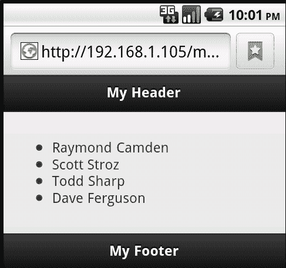
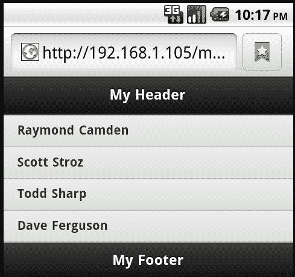
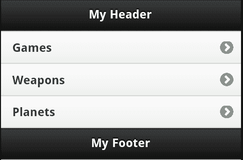
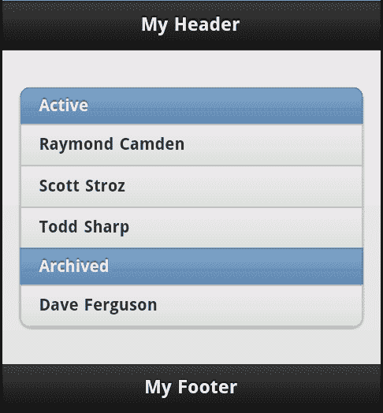
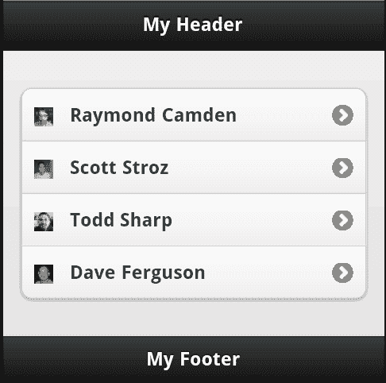

# 四、使用列表

列表是在移动网站上为用户提供菜单的好方法。jQuery Mobile 提供了丰富的列表选项，从简单的列表到带有自定义缩略图和多个用户操作的列表。

在本章中，我们将：

*   讨论如何创建列表
*   如何创建链接和子菜单样式列表
*   如何创建不同样式的列表

# 创建列表

正如您（希望如此！）了解到的，jQuery Mobile 在 UI 方面采取了一种*增强*的方法。使用普通、简单的 HTML，添加一些标记（有时！），jQueryMobile 将完成增强 UI 的繁重任务。同样的过程也适用于清单。我们以前都使用过 HTML 中的简单列表，下面的代码片段就是一个例子：

```js
<ul>
<li>Raymond Camden</li>
<li>Scott Stroz</li>
<li>Todd Sharp</li>
<li>Dave Ferguson</li>
</ul>

```

我们都知道它们是如何显示的（在前面的代码片段中是一个项目符号列表）。让我们把这个列表放到一个简单的 jQueryMobile优化页面中。`Listing 4-1`选择一个典型页面并将其放入我们的列表中：

```js
Listing 4-1: test1.html
<!DOCTYPE html>
<html>
<head>
<title>Unordered List Example</title>
<meta name="viewport" content="width=device-width, initial- scale=1">
<link rel="stylesheet" href="http://code.jquery.com/mobile/ latest/jquery.mobile.min.css" />
<script src="http://code.jquery.com/jquery- 1.7.1.min.js"></script>
<script src="http://code.jquery.com/mobile/ latest/jquery.mobile.min.js"></script>
</head>
<body>
<div data-role="page">
<div data-role="header">
<h1>My Header</h1>
</div>
<div data-role="content">
<ul>
<li>Raymond Camden</li>
<li>Scott Stroz</li>
<li>Todd Sharp</li>
<li>Dave Ferguson</li>
</ul>
</div>
<div data-role="footer">
<h1>My Footer</h1>
</div>
</div>
</body>
</html>

```

有了这个 HTML，jQuery Mobile 马上就给了我们一些好东西，如下面的屏幕截图所示：



我们可以通过一个简单的改变来增强这个列表。从`listing 4-1`中取普通`<ul>`标签，添加`data-role="listview"`属性，如下代码行所示：

```js
<ul data-role="listview">

```

在您从 Github 下载的代码中，您可以在`test2.html`中找到此修改。不过，这一变化相当戏剧性，如以下截图所示：



您可以看到这些项目前面不再有项目符号，但它们更大，更容易阅读。当我们开始在列表中添加链接时，事情变得更加有趣。在下面的代码片段中，我添加了到每个列表项的链接：

```js
<ul data-role="listview">
<li><a href= "ray.html">Raymond Camden</a></li>
<li><a href= "scott.html">Scott Stroz</a></li>
<li><a href= "todd.html">Todd Sharp</a></li>
<li><a href= "dave.html">Dave Ferguson</a></li>
</ul>

```

再次，您可以在之前下载的 ZIP 文件中找到完整的文件。这个可以在`test3.html`中找到。以下屏幕截图显示了此代码的呈现方式：


请注意新的箭头图像。当 jQuery Mobile 在您的列表中检测到链接时，会自动添加此项。现在，您已经将一个相对简单的 HTML 无序列表转换为一个简单的菜单系统。这本身给人留下了深刻的印象，但正如我们将在后面的章节中看到的，jQueryMobile版提供了丰富的呈现选项，让您可以自定义列表。

您可能想知道您可以创建一个多么复杂的菜单系统。由于 HTML 本身支持嵌套列表，jQuery Mobile 也将呈现它们。`Listing 4-2`演示了嵌套列表的示例：

```js
Listing 4-2: Nested List
<!DOCTYPE html>
<html>
<head>
<title>List Example</title>
<meta name="viewport" content="width=device-width, initial- scale=1">
<link rel="stylesheet" href="http://code.jquery.com/mobile/ latest/jquery.mobile.min.css" />
<script src="http://code.jquery.com/jquery- 1.7.1.min.js"></script>
<script src="http://code.jquery.com/mobile/ latest/jquery.mobile.min.js"></script>
</head>
<body>
<div data-role="page">
<div data-role="header">
<h1>My Header</h1>
</div>
<div data-role="content">
<ul data-role="listview">
<li>Games
<ul>
<li>Pong</li>
<li>Breakout</li>
<li>Tron</li>
</ul>
</li>
<li>Weapons
<ul>
<li>Nukes</li>
<li>Swords</li>
<li>Ninja Stars</li>
</ul>
</li>
<li>Planets
<ul>
<li>Earth</li>
<li>Jupiter</li>
<li>Uranus</li>
</ul>
</li>
</ul>
</div>
<div data-role="footer">
<h1>My Footer</h1>
</div>
</div>
</body>
</html>

```

在前面的示例中，嵌套列表中使用的 HTML 在任何方面都不特殊。这是标准的。但是 jquerymobile 将获取内部列表并实际隐藏内容。即使在*上*级 LI 项目中没有链接，也会变成链接：



单击其中一个菜单项可加载内部菜单。如果您在自己的移动设备（或浏览器）中运行此操作，请注意 URL 也会发生更改，它们会在应用中创建一个可书签的视图：


# 使用列表功能

jquerymobile 提供了多种不同样式的列表，以及可以应用于这些列表的不同功能。在本章的下一部分中，我们将介绍一些可用的选项。这些选项没有任何特定的顺序，而是以选项库的形式呈现给您。您可能不会（也不应该！）尝试在一个应用中使用所有这些样式，但最好记住 jQuery Mobile 提供的各种类型的列表样式。

## 创建插入列表

您可以对列表进行的最简单、最巧妙的更改之一就是将它们转换为**插入列表**。这些列表不占用设备的全部宽度。对于我们用`data-role="content"`修改的初始列表，我们可以简单地为下面的代码块（在`test5.html):`中找到）添加另一个属性`data-inset="true"`

```js
<ul data-role="listview" data-inset="true">
<li>Raymond Camden</li>
<li>Scott Stroz</li>
<li>Todd Sharp</li>
<li>Dave Ferguson</li>
</ul>

```

现在的结果与前面的示例非常不同：


## 创建列表分隔符

您可能希望添加到列表中的另一个有趣的 UI 元素是分隔符。这是一个很好的方法，可以将一个长长的列表分成更容易扫描的部分。添加列表分隔符就像添加一个利用`data-role="list-divider"`的`li`标记一样简单。下面的代码片段显示了此元素的一个简单示例：

```js
<ul data-role="listview" data-inset="true">
<li data-role="list-divider">Active</li>
<li>Raymond Camden</li>
<li>Scott Stroz</li>
<li>Todd Sharp</li>
<li data-role="list-divider">Archived</li>
<li>Dave Ferguson</li>
</ul>

```

在前面的代码块中，请注意使用了`list-divider`角色的两个新的`li`标记。在本例中，我使用这些将人员列表分为两组。您可以在`test6.html`中找到完整的模板。下面的屏幕截图显示了如何呈现此内容：



## 创建带有计数气泡的列表

使用 jQueryMobile列表可以执行的另一个有趣的 UI 技巧是*计数气泡*。这是一个 UI 增强功能，在每个列表项的末尾添加一个简单的数字。数字被包裹在一个类似于*气泡*的外观中，这种外观通常用于电子邮件式界面。在以下代码片段中，计数气泡用于表示技术会议上消耗的 cookie 数量：

```js
<ul data-role="listview" data-inset="true">
<li data-role="list-divider">Cookies Eaten</li>
<li>Raymond Camden <span class="ui-li-count">9</span></li>
<li>Scott Stroz <span class="ui-li-count">4</span></li>
<li>Todd Sharp <span class="ui-li-count">13</span></li>
<li>Dave Ferguson <span class="ui-li-count">8</span></li>
</ul>

```

在前面的代码片段中，我们使用了一个类为`ui-list-count`的`span`标记来包装表示每个人吃的饼干数量的数字。一个简单的 HTML 更改，但是考虑它是如何渲染的，如下面的截图所示：


您可以在`test7.html`中找到此功能的完整示例。

## 使用缩略图和图标

列表的另一个常见需求是包含图像。jQuery Mobile 支持在列表控件中显示良好的缩略图（小图像）和图标（甚至更小的图像）。让我们首先看看在列表中包含缩略图。假设您已经有了大小合适的图像（我们的示例都是 160 像素宽 160 像素高），您可以简单地将它们包含在每个`li`元素中，如下面的代码片段所示：

```js
<ul data-role="listview" data-inset="true">
<li><a href="ray.html"> Raymond Camden</a></li>
<li><a href="scott.html"> Scott Stroz</a></li>
<li><a href="todd.html"> Todd Sharp</a></li>
<li><a href="dave.html"> Dave Ferguson</a></li>
</ul>

```

没有对图像执行任何特殊操作，也没有添加任何数据属性或类。jQuery Mobile 将自动左对齐图像，并将项目文本对齐到每个`li`块的顶部：


您可以在`test8.html`中找到前面的演示。那么图标呢？要在代码中包含图标，请将类`ui-li-icon`添加到图像中。（请注意，类的开头是`ui`，而不是`ul.)`，下面的代码片段就是我们相同列表中的示例：

```js
<ul data-role="listview" data-inset="true">
<li><a href="ray.html"> Raymond Camden</a></li>
<li><a href="scott.html"> Scott Stroz</a></li>
<li><a href="todd.html"> Todd Sharp</a></li>
<li><a href="dave.html"> Dave Ferguson</a></li>
</ul>

```

jQuery Mobile 在与此类一起使用时确实会收缩图像，但根据我的经验，在预先调整图像大小时，格式会更好。这样做还可以提高网页的速度，因为较小的图像会加快下载时间。上面的图像都是 16 像素宽和高。结果是。。。



您可以在`test9.html`中找到前面的示例。

## 创建拆分按钮列表

jQueryMobile列表的另一个有趣特性是拆分按钮列表。这只是一个包含多个操作的列表。当用户单击列表项时，会激活一个主操作，而通过列表项末尾的按钮可以执行一个辅助操作。对于这个例子，让我们先从屏幕截图开始，然后展示它是如何完成的：


如您所见，每个列表项在行的末尾都有一个辅助图标。这是拆分项列表的一个示例，通过简单地向列表项添加第二个链接来定义。例如：

```js
<ul data-role="listview" data-inset="true">
<li><a href= ray.html"> Raymond Camden</a><a href="foo.html">Delete</a></li>
<li><a href= scott.html"> Scott Stroz</a><a href="foo.html">Delete</a></li>
<li><a href= todd.html"> Todd Sharp</a><a href="foo.html">Delete</a></li>
<li><a href= dave.html"> Dave Ferguson</a><a href="foo.html">Delete</a></li>
</ul>

```

请注意，第二个链接的文本**Delete**实际上被图标替换。您可以通过将数据属性`split-icon`添加到您的`ul`标记中来指定图标，如下代码行所示：

```js
<ul data-role="listview" data-inset="true" data-split-icon="delete">

```

此示例的完整代码可在`test10.html`中找到。

## 使用搜索过滤器

对于最后一个也是最后一个列表功能，我们将介绍搜索过滤器。到目前为止，我们处理的列表都很短。但较长的列表可能会让用户很难找到他们想要的内容。jquerymobile 提供了一种非常简单的方法，可以将搜索过滤器添加到列表中。通过将`data-filter="true"`添加到任何列表中，jQuery Mobile 将自动在顶部添加一个搜索字段，根据您键入的内容进行过滤：

```js
<ul data-role="listview" data-inset="true" data-filter="true">
<li><a href="ray.html">Raymond Camden</a></li>
<li><a href="scott.html">Scott Stroz</a></li>
<li><a href="todd.html">Todd Sharp</a></li>
<li><a href="dave.html">Dave Ferguson</a></li>
(lots of items....)
</ul>

```

结果类似于以下屏幕截图：


如果您开始在上一个字段中键入，则列表会在您键入时自动过滤出结果：


默认情况下，搜索不区分大小写，并匹配列表项中的任何位置。您可以在`ul`标记中使用`data-placeholder-text="Something"`为搜索表单指定占位符文本。您还可以使用`data-filter-theme`为表单指定特定主题。最后，您可以使用 JavaScript 逐个添加自己的自定义列表过滤逻辑。

# 总结

本章讨论了如何在 jQuery Mobile 中使用列表视图。我们了解了如何将常规 HTML 列表转换为移动优化列表，并演示了该框架提供的多种类型的列表功能。

在下一章中，我们将利用我们已经学到的知识，为一家酒店构建一个真正的（尽管有点简单）移动优化网站。