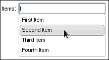
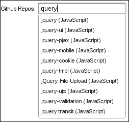
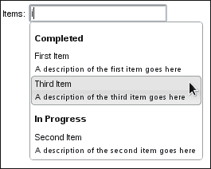

# 第二章，包括自动完成

在本章中，我们将介绍：

*   使用主题设置默认输入的样式
*   使用选择选项构建数据源
*   使用多个数据源
*   远程自动完成过滤
*   自定义数据和类别
*   将效果应用于下拉菜单

# 导言

**自动完成**小部件的主要目的是增强标准 HTML 表单`input`元素的功能。与用户每次都必须键入输入字段的完整值不同，autocomplete 小部件提供了关于值可能是什么的建议。例如，假设您正在添加新产品。产品字段可以是文本输入、选择输入等。在这个场景中，可以使用系统中现有的产品作为自动完成小部件的源。很可能是，正在输入该产品的用户，或者其他用户之前已经输入过该产品。通过自动完成，用户可以保证他们提供了有效的输入。

# 使用主题设置默认输入的样式

默认的自动完成实现不会改变有关输入元素的任何可视信息。从功能上讲，我们不希望更改输入元素。一旦用户开始输入，我们只需要一个下拉组件。但是，让我们看看是否可以继续使用小部件框架和主题框架中的组件来更改自动完成输入元素的虚拟外观。

## 准备好了吗

我们将使用以下标记作为示例，一个简单的`label`元素和一个简单的`input`元素：

```js
<div>
    <label for="autocomplete">Items: </label>
    <input id="autocomplete"/>
</div>
```

## 怎么做。。。

我们将使用下面的代码使用我们希望应用的主题框架中的 CSS 类扩展 autocomplete 小部件。我们在焦点事件方面引入了一个小的行为调整。

```js
( function( $, undefined ) {

$.widget( "ab.autocomplete", $.ui.autocomplete, {

    inputClasses: "ui-widget ui-widget-content ui-corner-all",

    _create: function() {

        this._super( "_create" );
        this._focusable( this.element );
        this.element.addClass( this.inputClasses );

    },

    _destroy: function() {

        this._super( "_destroy" );
        this.element.removeClass( this.inputClasses );

    }

});

})( jQuery );

$( function() {

    var source = [
        'First Item',
        'Second Item',
        'Third Item',
        'Fourth Item'
    ];

    $( "#autocomplete" ).autocomplete( { source: source } );

});
```

我们需要完成 autocomplete 的`input`元素的样式化的最后一件事是一个新的 CSS 样式表，其中包含两个规则。样式表应该包含在定义输入标记的主 HTML 中。

```js
input.ui-autocomplete-input {
    padding: 2px;
}

input.ui-autocomplete-input:focus {
    outline: none;
}
```

下面是我们新设计的无焦点自动完成小部件的外观。


下面是 autocomplete 在具有焦点且下拉菜单已展开时的外观。


## 它是如何工作的。。。

加载文档时，我们使用`#autocomplete`输入元素创建一个简单的自动完成。

您首先会注意到的是`inputClasses`属性。这个字符串表示我们希望应用于小部件的主题框架中的三个类：`ui-widget`、`ui-widget-content`和`ui-corner-all`。`ui-widget`类除了处理字体之外没有做很多工作，将这个类应用于主题元素是一个很好的实践。`ui-widget-content`类为我们修复输入的边框，`ui-corner-all`类为我们应用漂亮的圆角。我们之所以将这个字符串定义为小部件的属性，是因为这些类在两个地方使用，这便于维护。

我们在这里重写的`_create()`方法只调用了 autocomplete 的`_create()`方法的原始实现。完成后，我们将通过调用`_focusable()`使`input`元素可聚焦。这是一个由小部件工厂定义并由所有小部件继承的方便实用方法。当元素被聚焦时，它通过应用主题框架中的`ui-state-focus`CSS 类使元素聚焦。当元素失去焦点时，它还会删除该类。也许，关于`_focusable()`最好的部分是当小部件被销毁时，小部件工厂机器将为我们清理任何焦点事件处理程序。我们定制的`_create()`实现的最后一项工作是将`inputClasses`中的 CSS 类添加到输入元素中。

和往常一样，我们需要确保在完成从 autocomplete 小部件的借用后进行清理。这意味着扩展`_delete()`以确保`inputClasses`属性从输入元素中删除。

我们用来扩展主题框架的小小 CSS 规则有两个作用。第一个修改是在`input`元素中添加一点填充，这纯粹是美学上的，因为我们所做的其他修改使文本在输入中看起来有点紧。第二个变化是在聚焦时删除围绕`input`元素的轮廓。这只适用于某些浏览器，如 Chrome，其中应用了自动大纲。

### 注

通常情况下，不建议删除轮廓，因为这关系到可访问性。但是，我们的更改已经考虑了重点投入，所以这很好。

# 使用选择选项构建数据源

有时，使用数组作为自动完成小部件的数据源并不是最好的选择。例如，如果我们的用户界面中已经有一个`select`元素，那么重用该元素中的选项以生成一个自动完成是有意义的。否则，我们不仅需要设计一些新代码来构建数组数据源，还需要删除现有的`select`元素。

## 准备好了吗

让我们为这个例子准备一些基本的标记。通常，autocomplete 小部件需要一个`input`作为其元素。相反，我们将给它一个`select`元素，并提供一些简单的选项。

```js
<div>
    <label for="autocomplete">Items: </label>
    <select id="autocomplete">
        <option>First Item</option>
        <option>Second Item</option>
        <option>Third Item</option>
        <option>Fourth Item</option>
    </select>
</div>
```

## 怎么做。。。

我们将继续扩展 autocomplete 小部件的功能，以便它知道如何处理`select`元素。之后，我们就可以使用自动完成小部件来定位我们的`select`元素。

```js
( function( $, undefined ) {

$.widget( "ab.autocomplete", $.ui.autocomplete, {

    inputClasses: "ui-widget ui-widget-content ui-corner-all",

    _create: function() {

        if ( this.element.is( "select" ) ) {

            var self = this;
            this.original = this.element.hide();
            this.element = $( "<input/>" ).insertAfter( this.original );

            this.options.source = function( request, response ) {

                var filter = $.ui.autocomplete.filter,
                    options = self.original.find( "option" ),
                    result = options.map( function() {
                        return $( this ).val();
                    });

                response( filter( result, request.term ) );

            };

        }

        this._super( "_create" );

    },

    _destroy: function() {

        this._super( "_destroy" );
        this.element.remove();
        this.original.show();

    }

});

})( jQuery );

$( function() {
    $( "#autocomplete" ).autocomplete();
});
```

现在你应该看到一些东西，看起来像是一个普通的旧自动完成 no`select`元素。此外，如果您尝试使用 autocomplete，您将看到显示的选项与`select`元素的选项中的选项相同。



## 它是如何工作的。。。

在这里，我们需要添加对`select`元素的自动完成小部件的支持；我们在自定义`_create()`实现的开始就这样做了。如果我们处理的是一个`select`元素，我们要做的第一件事就是隐藏它并在`original`属性中存储对它的引用。记住，我们只对`select`元素通过其`options`提供的数据源感兴趣-我们不想实际显示`select`。相反，我们将`select`替换为`input`元素，因为这是用户键入和小部件完成的方式。

autocomplete 小部件的`source`选项是我们如何指定一个自定义函数来返回要使用的源数据。在我们的例子中，我们提供了一个函数，该函数从每个 select`option`中获取值。回想一下，`select`元素先前存储在`original`属性中。我们在这里使用 jQuery`map()`实用程序函数将`select`选项转换为一个数组，autocomplete 可以使用它。应用`filter()`功能，`response()`功能发送到下拉菜单。

当小部件被销毁时，我们希望恢复原始的`select`元素，因为这是我们替换的。原始元素在我们定制的`_delete()`实现中再次显示——这是在调用原始`_delete()`方法执行例行清理任务后发生的。我们创造的`input`元素也在这里被摧毁。

# 使用多个数据源

有时，自动完成小部件不会直接映射到一个数据源。以视频为例。假设用户需要选择一个视频，但这两个数据源是 DVD 和蓝光。如果我们要使用 autocomplete 来选择视频，我们需要一种分配多个数据源的方法。此外，该机制需要具有足够的可扩展性，以支持添加更多的数据源，特别是因为每隔一年就会出现一种新的视频格式。

## 怎么做。。。

autocomplete 小部件的默认实现需要单个数据源—数组或 API 端点字符串。我们将为小部件提供一个新的`sources`选项来允许这种行为。这就是我们将如何扩展 autocomplete 并创建具有两个视频数据源的小部件实例——一个用于 DVD，另一个用于蓝光光盘。

```js
( function( $, undefined ) {

$.widget( "ab.autocomplete", $.ui.autocomplete, {

    options: { 
        sources: []    
    },

    _create: function() {

        var sources = this.options.sources;

        if ( sources.length ) {

            this.options.source = function ( request, response ) {

                var merged = [],
                    filter = $.ui.autocomplete.filter;

                $.each( sources, function ( index, value ) {
                    $.merge( merged, value );
                });

                response( filter( merged, request.term ) );

            };

        }

        this._super( "_create" );

    },

    _destroy: function() {
        this._super( "_destroy" );
    }

});

})( jQuery );

$( function() {
    var s1 = [
            "DVD 1",
            "DVD 2",
            "DVD 3"
        ],
        s2 = [
            "Blu-ray 1",
            "Blu-ray 2",
            "Blu-ray 3"
        ];

    $( "#autocomplete" ).autocomplete({
        sources: [s1, s2]
    });
});
```


如您所见，如果您开始搜索视频`1`，您将从下拉菜单中的每个数据源获得版本。

## 它是如何工作的。。。

我们不是在传递给自动完成之前将两个数据源合并为一个，而是扩展了小部件的功能，以便为我们处理该任务。特别是，我们添加了一个新的`sources`选项，可以接受多个数组。在本例中，我们将 DVD 和蓝光源都传递给我们的小部件。

我们定制的`_create()`版本通过检查`sources`选项的长度来检查是否提供了多个来源。如果有多个数据源，我们使用`merge()`jQuery 实用程序函数创建一个新数组，并对其应用`filter()`函数。这种方法的一个很好的特点是，它不在乎有多少数据源，如果应用程序需要，我们可以在实现过程中再传递一些数据源。这些数据源的合并封装在小部件后面。

# 远程自动完成过滤

自动完成过滤功能不仅限于默认实现，即在数组源中搜索对象。我们可以指定一个自定义的`source()`函数，该函数将仅检索用户正在查找的数据。如果您希望在包含数千项的数据源上使用 autocomplete，这是一种理想的方法。否则，过滤对浏览器的要求太高，需要下载大量数据集，然后在每次击键时进行大量数组搜索。

## 怎么做。。。

我们将使用 GitHub API 作为自动完成小部件的数据源。这是一个很好的示例，因为它太大，无法在浏览器内存中使用。

```js
$( function() {
  $( "#autocomplete" ).autocomplete({
        minLength: 3,
        source: function( request, response ) {
            $.ajax({
                url: "https://api.github.com/legacy/repos/search/:" + request.term,
                dataType: "jsonp",
                success: function( resp ) {
                    var repositories = resp.data.repositories.splice( 0, 10 );
                    var items = $.map( repositories, function ( item ) {
                        return { 
                            label: item.name + " (" + 
                                      item.language + ")",
                            value: item.name
                        };
                    });
                    response( items );
                }
            });
        }
    });
});
```

现在，如果您在浏览器中查看生成的小部件并开始键入，您将在下拉菜单中看到 Github 存储库数据。



## 它是如何工作的。。。

因为我们使用的是一个大数据源，所以我们告诉这个特殊的自动完成小部件，只有在至少有三个字符的情况下才应该执行对项目的搜索。这是使用`minLength`选项完成的。否则，我们将要求服务器根据一个或两个字符进行查询，而这不是我们所要的。

我们示例中的`source`选项指定了我们将要使用的数据源——GithubAPI。我们传递给源代码的函数对 Github API 执行`$.ajax()`调用。我们使用`jsonp`作为格式，这意味着 API 的回调函数将被发回。我们还将一些查询数据传递给 API。

一旦 API 用数据响应，我们的成功回调函数就会执行。然后，我们通过`$.map()`实用程序函数传递这些数据，以生成一个自动完成小部件能够理解的数组。我们的 success 函数对数据执行一个简单的`$.map()`操作，将其转换为自动完成可以使用的对象数组。

## 还有更多。。。

通过在小部件中引入术语缓存，我们可以进一步降低网络通信开销。顾名思义，**术语****缓存**将本地存储执行远程过滤操作的结果。这样，当用户不可避免地对击键执行完全相同的操作时，我们不会使用远程 API 调用执行完全相同的任务，因为我们已经将结果缓存在小部件中。

```js
( function( $, undefined ) {

$.widget( "ab.autocomplete", $.ui.autocomplete, {

    _cache: {},

    _search: function( value ) {

        var response = this._response(),
            cache = this._cache;

    this.pending++;
    this.element.addClass( "ui-autocomplete-loading" );
    this.cancelSearch = false;

        if ( value in cache ) {
            response( cache[value] );
        }
        else {
            this.source( { term: value }, response );
        }

    }

});

})( jQuery );

$( function() {
  $( "#autocomplete" ).autocomplete({
        minLength: 3,
        source: function( request, response ) {
            var self = this;
            $.ajax({
                url: "https://api.github.com/legacy/repos/search/:" + request.term,
                dataType: "jsonp",
                success: function( resp ) {
                    var repositories = resp.data.repositories.splice( 0, 10 );
                    var items = $.map( repositories, function ( item ) {
                        return { 
                            label: item.name + " (" + 
                                      item.language + ")",
                            value: item.name
                        };
                    });
                    self._cache[request.term] = items;
                    response( items );
                }
            });
        }
    });
});
```

您可以看到我们在前面的代码中做了哪些更改，以支持缓存从 HTTP 请求返回的项。现在我们正在扩展小部件以添加新的`_cache`属性。我们还在扩展`_search()`函数，该函数负责检查缓存值。如果找到一个，则使用数据的缓存版本调用呈现响应。`source()`函数负责存储缓存的结果，但这是一个简单的单行程序。

# 自定义数据和类别

分离两类自动完成数据的一种方法可能是使用两个不同的字段，每个字段都有自己的自动完成小部件。另一种方法是在小部件本身中引入类别的概念。当下拉菜单显示为用户建议项目时，他们也会看到该项目所属的类别。要在 autocomplete 小部件中实现这一点，我们需要更改小部件理解源数据的方式以及菜单项的呈现方式。

## 怎么做。。。

我们将扩展自动完成小部件，以更改菜单项的呈现方式。我们还需要考虑将数据传递到 WIGET 中作为源。

```js
( function( $, undefined ) {

$.widget( "ab.autocomplete", $.ui.autocomplete, {

    _renderMenu: function( ul, items ) {

        var that = this,
            currentCategory = "";

        items.sort(function( a, b ) {
            return a.cat > b.cat 
        });

        $.each( items, function( index, item ) {

            if ( item.cat != currentCategory ) {
                that._renderCategory( ul, item );
                currentCategory = item.cat;
            }

            that._renderItemData( ul, item );

        });

    },

    _renderCategory: function( ul, item ) {
        return $( "<li>" ).addClass( "ui-autocomplete-category" )
                          .html( item.cat )                          
                          .appendTo( ul );
    },

    _renderItem: function( ul, item ) {
        return $( "<li>" ).addClass( "ui-autocomplete-item" )
                          .append( $( "<a>" )
                          .append( $( "<span>" ).html( item.label ) )
                          .append( $( "<span>" ).html( item.desc ) ) )
                          .appendTo( ul );
    }

});

})( jQuery );

$( function() {

    var items = [
        {
            value: "First Item",
            label: "First Item",
            desc: "A description of the first item goes here",
            cat: "Completed"
        },
        {
            value: "Second Item",
            label: "Second Item",
            desc: "A description of the second item goes here",
            cat: "In Progress"
        },
        {
            value: "Third Item",
            label: "Third Item",
            desc: "A description of the third item goes here",
            cat: "Completed"
        }
    ];

    $( "#autocomplete" ).autocomplete( {source: items} );

});
```

我们差不多完成了。我们对菜单所做的更改不仅会神奇地生效，我们还需要应用一些样式。页面上应包含以下 CSS 代码：

```js
.ui-autocomplete-category {
    font-weight: bold;
    padding: .2em .4em;
    margin: .8em 0 .2em;
    line-height: 1.5;
}

.ui-autocomplete-item > a > span {
    display: block;
}

.ui-autocomplete-item > a > span + span {
    font-size: .9em;
}
```

现在，如果你开始在自动完成中输入，你会注意到一个下拉菜单与我们习惯的完全不同，因为它包含类别和描述信息。



## 它是如何工作的。。。

此小部件扩展的目标是接受自定义源数据，并在下拉菜单的显示中使用该数据。具体来说，我们正在处理的新数据是类别和描述。类别与项目之间是一对多的关系，因为我们传递给小部件的几个项目可能具有相同的类别字符串。我们的工作是找出哪些项目属于任何给定的类别，并在下拉菜单中表示此结构。此外，项目的描述是一对一的关系，因此此处所需的工作较少，但我们仍希望将描述包含在下拉菜单中。

我们覆盖的原始实现中的第一个方法是`_renderMenu()`。`_renderMenu()`的工作是在每次向用户提出建议时改变底层 HTML 结构。我们通过`currentCategory`跟踪当前类别。然后，我们使用`_renderItem()`呈现每个项目。

`_renderCategory()`函数将类别文本呈现为`<li>`。它还添加了`ui-autocomplete-category`类。同样，我们的`_renderItem()`函数呈现项目文本，在这里我们也使用了`desc`属性。该物品还具有`ui-autocomplete-item`等级。

我们在 UI 中包含的新 CSS 样式是我们创建的新版本 autocomplete 的必要组件。如果没有它们，说明将具有相同的字体大小，并将显示在与项目标签相同的行上。同样，该类别需要新添加的样式作为一个类别突出显示，该类别将其他项目分组，而不仅仅是另一个项目。

## 还有更多。。。

每当我们扩展 autocomplete 小部件使用的数据时，我们都必须告诉小部件如何使用它。这里，我们已经告诉 autocomplete 如何在下拉菜单中显示新数据。或者，我们可以告诉小部件对一些用户在下拉菜单中从未实际看到的数据字段执行过滤。或者我们可以把两者结合起来。

下面是当用户开始键入时，我们将如何在过滤中同时使用类别和描述，这两个非标准字段。

```js
$.ui.autocomplete.filter = function( array, term ) {

    var matcher = new RegExp( $.ui.autocomplete.escapeRegex( term ), "i" );

    return $.grep( array, function( value ) {
        return matcher.test( value.cat ) || 
               matcher.test( value.desc ) ||
               matcher.test( value.label )
    });

};
```

在这里，我们用自己的实现替换 autocomplete 使用的`filter()`函数。两者是相似的，我们只是将`RegExp.test()`调用调整为`desc`和`cat`字段。我们将把这段代码放在 autocomplete 的自定义小部件声明下面。之所以在定制规范外部执行此操作，是因为`autocomplete.filter()`有点像静态方法。其中，对于其他方法，我们将在每个实例的基础上重写。

# 将效果应用于下拉菜单

默认情况下，我们会得到一个相当简单的下拉菜单，其中包含基于我们键入内容的完成建议。菜单显示简单，没有太多麻烦。这很好，它可以可靠地完成工作。但是，另一方面，我们总是可以做一些事情来使 UI 看起来更加完美。它可以像在应用程序中更改 autocomplete 小部件一样简单，在转换到可见状态时使用一些微妙的效果。

## 准备好了吗

因为我们在这里所追求的实际上更多的是小部件的视觉呈现方面，所以我们可能可以安全地使用小部件的任何现有实例。

## 怎么做。。。

让我们在 autocomplete 小部件的默认实现的基础上，为下拉菜单添加一些微妙的动画。

```js
( function( $, undefined ) {

$.widget( "ab.autocomplete", $.ui.autocomplete, {

    _suggest: function( items ) {

        this._resetMenu();
        this._renderMenu( this.menu.element, items );
        this.menu.refresh();

        this._resizeMenu();
        this._positionMenu();

    },

    _resetMenu: function() {

        this.menu.element
                 .empty()
                 .zIndex( this.element.zIndex() + 1 );

    },

    _positionMenu: function() {

        var pos = $.extend( { of: this.element }, this.options.position );
        this.menu.element.position( pos );

    },

    _resizeMenu: function() {

        var menu = this.menu,
            exclude = 0;
            target = Math.max(
                menu.element.width( "" ).outerWidth() + 1,
                this.element.outerWidth()
            ),
            excludeCSS = [
                'borderLeftWidth',
                'borderRightWidth',
                'paddingLeft',
                'paddingRight'
            ];

        if( menu.element.is( ":hidden" ) ) {
            menu.element.css( { display: "block", opacity: 0 } );
        }

        $.each( excludeCSS , function( index, item ) {
            exclude += parseFloat( menu.element.css( item ) );
        });

        if ( menu.element.css( "opacity" ) == 0 ) {
            menu.element.animate({
                width: target - exclude,
                opacity: 1
            }, 300);
        }
        else{
            menu.element.width( target - exclude );
        }

    },

    _close: function( event ) {

        var menu = this.menu;

        if ( menu.element.is( ":visible" ) ) {

            menu.element.fadeOut();
            menu.blur();
            this.isNewMenu = true;
            this._trigger( "close", event );

        }

    }

});

})( jQuery );

$(function() {
    var source = [
        "First Item",
        "Second Item",
        "Third Item",
        "Fourth Item"
    ];
    $( "#autocomplete" ).autocomplete({
        source: source,
    });
});
```

如果您通过输入元素开始使用这个自动完成小部件，您会注意到下拉菜单会平滑地进入视图，而不是突然弹出。此外，当菜单不再需要时，它就会消失。

## 它是如何工作的。。。

autocomplete 在这里进行了扩展，因此我们可以注入定制的动画功能。但这一次，变化更复杂一些，我们不仅仅是用几行代码扩展`_create()`。在自动完成代码中有一些方法需要扩展。我们还在 autocomplete 小部件中引入了一些我们自己的新方法。

我们覆盖的第一个方法是`_suggest()`。当用户键入要执行搜索的最小字符长度时，自动完成小部件将调用`_suggest()`方法。原始方法负责渲染和显示下拉菜单方面需要发生的一切。在我们的方法版本中，我们只是调用小部件的其他方法。`_suggest()`的工作是协调搜索时发生的一切。这里有两个合乎逻辑的步骤。首先，使用新内容呈现菜单。接下来，将显示菜单，调整其大小并定位。后者是动画发生的地方。

由于这些代码片段大部分取自原始实现，因此我们不会深入探讨`_resetMenu()`和`_positionMenu()`方法的细节。它们只是分别清空和定位菜单。

`_resizeMenu()`方法是，当菜单显示时，实际动画发生。这是一个较长的方法，因为我们必须执行一些计算才能传递到`animate()`。`_resizeMenu()`的原始实现使用`outerWidth()`jQuery 函数设置菜单的宽度。这是为了与`input`元件正确对齐。然而，我们希望为`width`变化注入活力。因此，我们必须手动计算内部宽度。外部宽度值位于 exclude 变量中。内部宽度为`target - exclude`。

在实际显示菜单和设置其动画之前，我们检查菜单是否已经显示。如果元素不可见，我们更改`display`CSS 属性，但将`opacity`属性设置为`0`。我们这样做的原因是我们需要元素的长方体模型尺寸来定位它。但是，我们仍然没有将动画效果应用到菜单。在这里，我们检查菜单的`opacity`属性是否位于`0`。如果没有，这意味着菜单已经显示，现在重新设置它的动画是没有意义的。否则，我们将执行宽度和不透明度动画。

最后，`_close()`方法取代了原来的自动完成`_close()`实现。代码与原始代码几乎相同，只是我们在关闭菜单时做了一个基本的`fadeOut()`，而不是仅仅隐藏它。

### 注

自动完成的此扩展未实现将关闭此行为的选项。这没关系，因为扩展只做一件事，将效果应用于下拉菜单。所以，要禁用这些效果，我们可以禁用扩展。小部件的扩展是在调用自身的函数中定义的。当脚本第一次加载时，函数被调用，小部件被扩展为新的行为。我们可以禁用调用自身的函数的行为部分。

```js
(function( $, undefined ) {
    // Code that extends a jQuery UI widget...
}); //( jQuery );
```