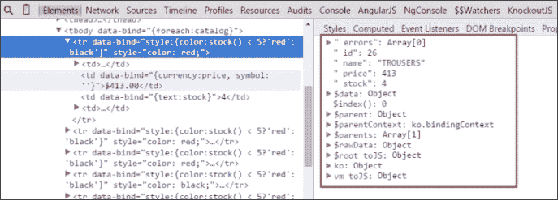
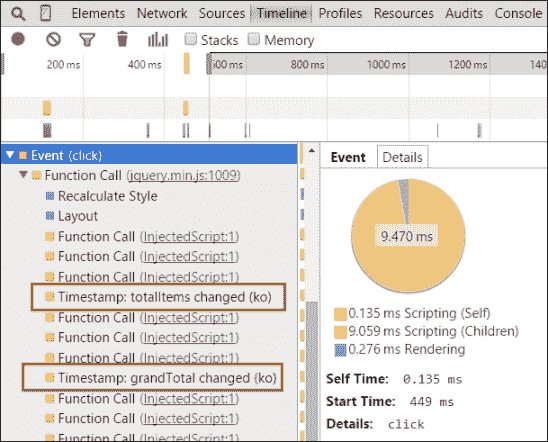
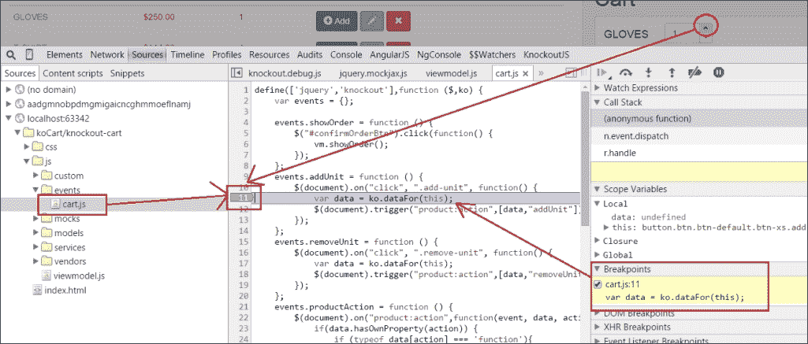

# 六、模块模式——RequireJS

现在我们可以说，我们的应用程序具备了[第 1 章](01.html "Chapter 1. Refreshing the UI Automatically with KnockoutJS")中提到的所有功能，*使用 KnockoutJS*自动刷新 UI。我们在最后四章中所做的是解决小型项目中的代码设计的一种非常好的方法。代码是整洁的，文件夹结构也是内聚的。代码易于阅读和遵循。

然而，当项目开始增长时，这种方法是不够的。您需要保持代码整洁，不仅在文件和文件夹结构中，而且在逻辑上也是如此。

在本章中，我们将对代码进行模块化，以使应用程序的不同部分保持隔离和可重用。我们还将看到如何保持上下文更干净。

现在这个项目看起来更复杂了。了解在发现错误时帮助您调试代码的工具非常重要。在本章的第一部分中，您将了解可以帮助您检查 KnockoutJS 代码的工具。您将使用浏览器插件（Chrome 扩展）来分析代码。

在本章的第二部分中，您将把文件转换为模块。这将帮助您将应用程序的每个部分与其他部分隔离开来。您将使用名为“依赖性注入”的模式来解决模块之间的依赖性。在[了解更多关于此模式的信息 http://en.wikipedia.org/wiki/Dependency_injection](http://en.wikipedia.org/wiki/Dependency_injection) 。

在最后一部分中，您将学习如何按照异步模块定义（AMD）规范创建模块。要按照 AMD 规范创建模块，您将使用一个名为 RequireJS 的库。此库将管理不同模块之间的所有依赖项。有关 AMD 的更多信息，请参阅[http://en.wikipedia.org/wiki/Asynchronous_module_definition](http://en.wikipedia.org/wiki/Asynchronous_module_definition) 。

# 安装淘汰上下文调试器扩展

在前面的章节中，您创建了一个简单的调试器来显示视图模型的状态。这对于快速查看应用程序的状态非常有用。使用调试绑定，您不需要打开扩展工具来检查数据发生了什么。但是您通常只隔离应用程序的一部分，或者查看绑定到 DOM 元素的模型的情况。

在 Google Chrome 中，您有一个非常好的扩展名**KnockoutJS context debugger**，可以从[下载 https://chrome.google.com/webstore/detail/knockoutjs-context-debugg/oddcpmchholgcjgjdnfjmildmlielhof](https://chrome.google.com/webstore/detail/knockoutjs-context-debugg/oddcpmchholgcjgjdnfjmildmlielhof) 。

此扩展允许您查看每个 DOM 节点的绑定，并通过控制台在线跟踪视图模型中的更改。安装并重新启动 Chrome 浏览器。


登记入住 chrome://extensions 是否已安装 KnockoutJS 上下文调试器

要检查绑定到您的模型的上下文，请按*F12*并打开**元素**选项卡，打开**Chrome Developer Tools**。您将看到两个面板。左边的是 DOM 模式。右侧面板有不同的选项卡。默认情况下，**样式**选项卡打开。选择标有**淘汰上下文**的选项卡。在这里，您应该看到添加到根上下文的所有绑定。


如何显示绑定到 DOM 元素的 KnockoutJS 上下文

如果您从目录中选择一个`<tr>`元素，您将导航到更深入的上下文中，并位于目录项范围内。您将无法看到`$root`上下文；您将看到`$data`上下文。您可以通过`$parent`元素向上导航，也可以在DOM 面板中更改该元素。



您可以轻松地检查 foreach 绑定中的项上下文

您还可以看到`ko`对象。这是浏览淘汰 API 的一种好方法。


您可以访问 knockoutapi 并查看方法、绑定、组件等

现在找到**KnockoutJS**选项卡（它与**元素**选项卡位于同一集合中）。按下**启用追踪**按钮。此功能允许您跟踪视图模型中的实时更改。更改在控制台中绘制。


如果启用跟踪，则可以通过控制台捕获视图模型中的更改

此外，您还可以使用**时间线**选项卡测量时间和性能。您可以看到在模型中进行更改时，应用程序用于呈现 DOM 元素的时间。



启用跟踪后，您可以记录事件并获取有用的信息

现在您已经了解了这个插件，我们可以删除（或者保留，这是您的选择）我们以前构建的调试绑定。

# 控制台

**控制台**是开发人员最重要的工具之一。您可以使用它来检查应用程序在使用中的状态。

您可以找到 JavaScript 代码并设置断点来检查特定点上发生的情况。您可以通过在**源**选项卡中定位 JavaScript 文件来实现这一点。只需单击要停止的行。然后，您可以检查变量的值并逐步运行代码。此外，您可以在代码中写入单词`debugger`以在此处停止程序。



您可以在代码中设置断点并检查变量的值

如果您导航到**控制台**选项卡，您将看到控制台本身。在这里，您可以使用`console.log`功能显示信息，或者查看控制台对象文档，查看您在每个时刻可以使用的最佳方法（[https://developer.mozilla.org/en-US/docs/Web/API/Console](https://developer.mozilla.org/en-US/docs/Web/API/Console) ）。

如果您在控制台中写入单词`window`，您将看到全局范围内的所有对象。


通过控制台，您可以访问当前和全局上下文中的变量

您可以编写单词`vm`（视图模型）来查看我们创建的`vm`对象。


所有组件都在全局范围内设置

但你也可以写`Product`或`ProductService`或我们创建的任何东西，你会看到的。当你有很多信息时，让你的所有对象都处于顶层可能会很混乱。定义名称空间并保持层次结构是保持组件隔离的良好实践。您应该只保留应用程序的入口点。

# 模块模式

这个模式允许我们关注代码的哪些部分在类外公开（公共元素），哪些部分对最终用户隐藏（私有元素）。

此模式通常用于 JavaScript 软件开发。它应用于流行的库，如 jQuery、Dojo 和 ExtJS。

这个模式有一个非常清晰的结构，一旦你知道如何使用它，就很容易应用。让我们在应用程序中应用模块模式：

1.  首先，定义模块的名称。如果您在不同的文件中定义了模块，那么应用允许其可扩展的模式来定义和初始化它是很重要的。在初始化中使用`||`运算符表示`ModuleName`值将被分配给自身（如果它有值）。如果它没有值，则表示这是第一次创建它，因此在本例中为它指定一个默认值，即空对象：

    ```js
    var ModuleName;
    ModuleName = ModuleName || {};
    ```

2.  然后，定义模块的每个组件。它可以是函数、变量或其他模块：

    ```js
    ModuleName.CustomComponent = function () {
    };
    ModuleName.CustomProperty = 10;
    ModeleName.ChildModule = OtherModule;
    ```

3.  最后，使用依赖项注入模式插入模块的依赖项。此模式将所有模块依赖项作为参数传递，并立即调用函数：

    ```js
    ModuleName.CustomComponent = (function (dependency){
      //Component code
    })(dependency);
    ```

4.  完整模块的外观如下：

    ```js
    var ModuleName;
    var ModuleName = ModuleName || {};
    ModuleName.CustomComponent = (function(dependency){
      //Component code
    })(dependency);
    ```

5.  要定义组件，请返回`component`对象。定义组件的第一个模式是使用显示模块模式。它包括将一个对象返回到只包含公共接口的函数末尾。这些是单例对象：

    ```js
    ModuleName.CustomComponent = (function(dependency){
      var somePrivateProperty = 1;
      var method1 = function(){
        dependency.methodFromDependency();
      };
      return {
        method1:method1,
        method2:method2
      }
    })(dependency);
    You can also define objects that can be instantiated using the new operator: 
    ModuleName.CustomComponent = (function(dependency){
      var component = function (a,b,c) {
        var somePrivateProperty=1;
        this.someMethod = function(){
          dependency.methodFromDependency()
        }
        this.otherMethod(){
          return a+b*c; 
        }
        return this;
      }    

      return component;
    })(dependency);
    //We can instantiate the component as an object
    //var instance = new ModuleName.CustomComponent(x,y,z);
    ```

# 创建车间模块

为了模块化我们的应用程序，我们将创建一个名为`Shop`的模块，它将包含我们的整个应用程序。此模块将包含其他子模块和组件。这种层次结构将帮助您保持代码的一致性。

第一种方法是按文件和类型对组件进行分组。这意味着模块的每个组件都将位于一个文件中，并且这些文件将在文件夹中按类型分组。例如，有一个名为`services`的文件夹。这意味着所有服务都将在此文件夹中，并且每个服务都将在一个文件中完全定义。按照惯例，组件将与它们所在的文件具有相同的名称，当然没有扩展名。

实际上，这些文件已经按类型分组，所以这是一项不需要再次执行的工作。我们将集中精力将文件转换为模块。

# ViewModel 模块

我们的应用程序中只有一个视图模型。这是一个我们可以应用单例模块方法的组件。

我们将一步一步地仔细创建第一个模块：

1.  打开`viewmodel.js`文件。
2.  定义`Shop`模块，它是我们应用程序的顶级模块：

    ```js
    var Shop;
    ```

3.  应用扩展模式

    ```js
    Shop = Shop || {};
    ```

    初始化`Shop`模块
4.  定义`ViewModel`组件：

    ```js
    Shop.ViewModel = (function(){})();
    ```

5.  设置模块内未建模视图模型版本的代码：

    ```js
    Shop.ViewModel = (function(){
      var debug = ko.observable(false);
      var showDebug = function () {
        debug(true);
      };

      var hideDebug = function () {
        debug(false);
      };
      var visibleCatalog = ko.observable(true);
      // ... the rest of the code
      return {
        debug: debug,
        showDebug:showDebug,
        hideDebug:hideDebug,
        searchTerm: searchTerm,
        catalog: filteredCatalog,
    ....
      };
    })();
    ```

6.  您尚未将其他文件转换为模块，但现在将向模块中添加依赖项：

    ```js
    Shop.ViewModel = (function (ko, Models, Services, Resources){
      //code of the module
    })(ko, Shop.Models, Shop.Services, Shop.Resources);
    ```

7.  在文件末尾，在模块外部，初始化模板、验证和对象：

    ```js
    $(document).ajaxError(function(event,response) {
      console.error(response);
      alert("Error in the communication. Check the console!");
    });

    //ko External Template Settings
    infuser.defaults.templateSuffix = ".html";
    infuser.defaults.templateUrl = "views";

    ko.validation.init({
      registerExtenders: true,
      messagesOnModified: true,
      insertMessages: true,
      parseInputAttributes: true
    });
    var vm = Shop.ViewModel;
    vm.activate();
    ```

您需要更新视图模型中的两个方法：`activate`方法和`allCallbackSuccess`方法。您需要更新这些方法的原因是，在`allCallbackSuccess`方法中，您需要运行`ko.applyBindings`方法，并且`allCallbackSuccess`无法访问此对象，因为它超出了范围。

为了解决这个问题，我们将使用与单击绑定相同的技术来附加更多参数。我们将使用`bind`JavaScript 方法将`allCallbackSuccess`方法绑定到此对象。因此，我们将能够使用 this 对象运行`ko.applyBindings`，如下代码所示：

```js
var allCallbackSuccess = function(response){
  catalog([]);
  response.data.forEach(function(item){
    catalog.push(Product( item.id,item.name,item.price,item.stock));
  });
  filteredCatalog(catalog());
  if (catalog().length) {
    selectedProduct(catalog()[0]);
  }
  ko.applyBindings(this);
};

var activate = function () {
  ProductResource.all()
  .done(allCallbackSuccess.bind(this));
};
```

使用此模式您可以将任何代码段转换为一个独立的可移植模块。下一步是创建`Models`模块、`Services`模块和`Resources`模块。

# 模型模块

正如我们对视图模型所做的一样，我们将把每个模型转换成一个组件，并将其封装在一个名为`Models`的模块中，步骤如下：

1.  打开`models/product.js`文件。
2.  定义我们的顶级模块`Shop`，并初始化它：

    ```js
    var Shop;
    Shop = Shop || {};
    ```

3.  然后创建`Models`名称空间。如果存在，它将是一个对象或它以前的值：

    ```js
    Shop.Models = Shop.Models || {};
    ```

4.  定义产品模型及其依赖项。记住，第一个价值是产品本身。这允许我们扩展模型，以防我们使用许多文件来定义它。因此，我们将产品模型定义如下：

    ```js
    Shop.Models.Product = (function(){
    })()
    ```

5.  传递依赖项。这一次，您只需要使用 Knockout 依赖项来使用可观察项。Knockout 是一个全局对象，不需要将其添加到依赖项中，但按照以下代码进行操作是一个很好的实践：

    ```js
    Shop.Models.Product = (function (ko){
    }(ko)
    ```

6.  最后，设置前面`models/Product.js`文件中的代码：

    ```js
    var Shop;
    Shop = Shop || {};
    Shop.Models = Shop.Models || {};
    Shop.Models.Product  = (function (ko){
      return function (id, name, price, stock) {
        _id = ko.observable(id).extend(...);
        _name = ko.observable(name).extend(...);
        _price = ko.observable(price).extend(...);
        _stock = ko.observable(error).extend(...);
        var errors = ko.validation.group([_name, _price, _stock]);
        return {
          id: _id,
          name: _name,
          price: _price,
          stock: _stock,
          errors: errors
        };
      };
    })(ko);
    ```

按照相同的步骤将`models/CartProduct.js`和`models/Customer.js`文件转换为模块。模型是应用我们用于生成可实例化对象的模式的完美候选者。

保持组件和文件名之间的一致性非常重要。确保您的文件具有其包含的组件的名称，扩展名为`.js`。

下面是转换`models/CartProduct.js`文件的最终结果：

```js
var Shop;
Shop = Shop || {};
Shop.Models = Shop.Models || {};
Shop.Models.CartProduct = (function(ko){

  return function (product,units){
    var
    _product = product,
    _units = ko.observable(units)
    ;

    var subtotal = ko.computed(function(){
      return _product.price() * _units();
    });

    return {
      product: _product,
      units: _units,
      subtotal: subtotal
    };
  }
})(ko);
```

再看一下`models/Customer.js`文件的结果：

```js
var Shop;
Shop = Shop || {};
Shop.Models = Shop.Models || {};
Shop.Models.Customer = (function(ko){
  return function() {
    var firstName = ko.observable("John").extend({
      required: true
    });
    var lastName = ko.observable("Doe").extend({
      required: true,
      minLength: 3
    });
    var fullName = ko.computed(function(){
      return firstName() + " " + lastName();
    });
    var address = ko.observable("Baker Street").extend({
      required: true,
      minLength: 5
    });
    var email = ko.observable("john@doe.com").extend({
      required: true,
      email: true
    });
    var zipCode = ko.observable("12345").extend({
      required: true,
      minLength: 3,
      pattern: {
        message: 'Zip code should have 5 numbers',
        params: '^[0-9]{5}$'
      }
    });
    var country = ko.observable("");
    var fullAddress = ko.computed(function(){
      return address() + " " + zipCode() + ", " + country();
    });
    var errors = ko.validation.group([firstName, lastName, address, email, zipCode]);
    return {
      firstName:firstName,
      lastName: lastName,
      fullName: fullName,
      address: address,
      email: email,
      zipCode: zipCode,
      country: country,
      fullAddress: fullAddress,
      errors: errors
    };
  };
})(ko);
```

# 资源模块

在代码方面，构建一个包含模型的模块和构建一个包含资源的模块并没有太大区别。应用的模块模式是相同的。然而，您不需要创建资源的实例。要将 CRUD 操作应用于模型，您只需要一个处理此职责的对象。因此，资源将是单例的，如下步骤所示：

1.  打开`resources/ProductResource.js`文件。
2.  创建顶层层次模块：

    ```js
    var Shop;
    Shop = Shop || {};
    ```

3.  创建`Resources`名称空间：

    ```js
    Shop.Resources = Shop.Resources || {};
    ```

4.  使用模块模式定义`ProductResource`：

    ```js
    Shop.Resources.ProductResource = (function(){
    })()
    ```

5.  设置依赖项。在本例中，jQuery 是您需要的依赖项。jQuery 是一个全局对象，您不需要将其作为依赖项传递，但这样做是一个很好的实践。

    ```js
    Shop.Resources.ProductResource = (function($){
    }(jQuery);
    ```

6.  最后，在`resources/ProductResource.js`文件中设置以下代码。由于在中，我们的应用程序资源是单例的，因此使用以下代码中使用的方法扩展资源：

    ```js
    var Shop;
    Shop = Shop || {};
    Shop.Resources = Shop.Resources || {};
    Shop.Resources.ProductResource = (function($){
      function all() {
        return $.ajax({
          type: 'GET',
          url: '/products'
        });
      }
      function get(id) {
        return $.ajax({
          type: 'GET',
          url: '/products/'+id
        });
      }
      function create(product) {
        return $.ajax({
          type: 'POST',
          url: '/products',
          data: product
        });
      }
      function save(product) {
        return $.ajax({
          type: 'PUT',
          url: '/products/'+product.id,
          data: product
        });
      }
      function remove(id) {
        return $.ajax({
          type: 'DELETE',
          url: '/products/'+id
        });
      }
      return {
        all:all,
        get: get,
        create: create,
        save: save,
        remove: remove
      };
    }(jQuery);
    ```

现在对`OrderResouce`组件应用相同的步骤。您可以在这段代码中看到最终结果：

```js
var Shop;
Shop = Shop || {};
Shop.Resources = Shop.Resources || {};
Shop.Resources.OrderResource = (function ($) {
  function save(order) {
    return $.ajax({
      type: 'PUT',
      url: '/order',
      data: order
    });
  }
  return {
    save: save
  };
})(jQuery);
```

# 服务模块

服务和资源一样也是单例的，所以遵循与资源模块相同的步骤：

1.  打开`services/ProductService.js`文件。
2.  创建顶层层次模块：

    ```js
    var Shop;
    Shop = Shop || {};
    ```

3.  创建`Resources`名称空间：

    ```js
    Shop.Services = Shop.Services || {};
    ```

4.  定义`ProductService`：

    ```js
    Shop.Services.ProductService = (function(){
    })();
    ```

5.  在这种情况下，服务没有依赖关系。
6.  最后，在`services/ProductService.js`文件中设置以下代码。由于在应用程序中，资源是单例的，因此使用以下代码中使用的方法扩展资源：

    ```js
    var Shop;
    Shop = Shop || {};
    Shop.Services = Shop.Services || {};
    Shop.Services.ProductService = (function(Product) {
      var hasStock = function (product) {
        return product.stock() > 0;
      };

      var decreaseStock = function (product) {
        var s = product.stock();
        if (s > 0) {
          s--;
        }
        product.stock(s);
      };

      var clone = function (product) {
        return Product(product.id(), product.name(), product.price(), product.stock());
      };

      var refresh = function (product,newProduct) {
        product.name(newProduct.name());
        product.stock(newProduct.stock());
        product.price(newProduct.price());
      };

      return {
        hasStock:hasStock,
        decreaseStock:decreaseStock,
        clone:clone,
        refresh: refresh
      };
    })(Shop.Models.Product);
    ```

# 事件、绑定和淘汰组件

我们不会将事件模块化，因为它们特定于此应用程序。隔离不可携带的东西是没有意义的。我们不会模块化绑定或组件，因为它们作为库的一部分注入到敲除对象中，所以它们是足够隔离的，它们不是模块的一部分，而是敲除对象。但是我们需要更新所有这些文件中的依赖项，因为应用程序的不同部分现在在`Shop`模块和子模块中被隔离。

# 更新添加到购物车按钮组件

要使用新名称空间更新组件，请更新（覆盖）对依赖项的引用，如下所示：

```js
ko.components.register('add-to-cart-button', {
  viewModel: function(params) {
    this.item = params.item;
    this.cart = params.cart;
    this.addToCart = function() {
      var CartProduct = Shop.Models.CartProduct;
      var CartProductService = Shop.Services.CartProductService;
      var ProductService = Shop.Services.ProductService;

      var data = this.item;
      var tmpCart = this.cart();
      var n = tmpCart.length;
      var item = null;

      if(data.stock()<1) {
        return;
      }
      while(n--) {
        if (tmpCart[n].product.id() === data.id()) {
          item = tmpCart[n];
        }
      }
      if (item) {
        CartProductService.addUnit(item);
      } else {
        item = CartProduct(data,1);
        tmpCart.push(item);
        ProductService.decreaseStock(item.product);
      }
      this.cart(tmpCart);
    };
  },
  template:
    '<button class="btn btn-primary" data-bind="click:addToCart">
      <i class="glyphicon glyphicon-plus-sign"></i> Add
    </button>'
});
```

# 更新事件

更新那些与新模块有依赖关系的代码行，如下所示：

```js
(function() {
  "use strict";
  $(document).on("click","#confirmOrderBtn", function() {
    vm.showOrder();
  });
  $(document).on("click", ".add-unit", function() {
    var data = ko.dataFor(this);
    $(document).trigger("addUnit",[data]);
  });
  $(document).on("click", ".remove-unit", function() {
    var data = ko.dataFor(this);
    $(document).trigger("removeUnit",[data]);
  });
  $(document).on("addUnit",function(event, data){
    Shop.Services.CartProductService.addUnit(data);
  });
  $(document).on("removeUnit",function(event, data){
    Shop.Services.CartProductService.removeUnit(data);
  });
})();
```

您已经学习了一种非常好的模式，可以在不使用任何外部工具的情况下管理依赖关系。您可以在几乎所有的项目中使用它。如果将所有文件合并为一个文件，效果会更好。

本书不涉及如何连接和缩小文件，以便在生产环境中使用它们。连接和缩小文件可以提高应用程序的性能，因为缩小文件可以减小文件的大小，并且连接文件可以将 HTTP 调用的次数减少到一个。

为此，您可以使用 Node.js（[http://nodejs.org/](http://nodejs.org/) 和Grunt（[等构建模块 http://gruntjs.com/](http://gruntjs.com/) 或大口喝（[http://gulpjs.com/](http://gulpjs.com/) 。如果您有兴趣了解部署实践，如缩小、文件组合等，那么在 Internet 上有大量关于 Node.js 和部署工具的参考书目。

要访问本章这一部分的代码，请访问 GitHub 存储库：

[https://github.com/jorgeferrando/knockout-cart/tree/chapter6Part1](https://github.com/jorgeferrando/knockout-cart/tree/chapter6Part1) 。

# 使用 RequireJS 管理依赖关系

在前面的部分中，您学习了如何隔离代码的不同部分。您还按照类型和组件名称对文件进行分组，它们遵循一致的模式。但是，您还没有解决一个与项目规模成比例增长的重要问题。为了给你一个关于这个问题的线索，让我们看看我们的`index.html`文件。请看`<script>`标签部分：

```js
<script type="text/javascript" src="js/vendors/jquery.min.js"></script>
<script type="text/javascript" src="js/vendors/jquery.mockjax.js"></script>
<script type="text/javascript" src="js/vendors/jquery.mockjson.js"></script>
<script type="text/javascript" src="js/vendors/icheck.js"></script>
<script type="text/javascript" src="js/vendors/bootstrap.min.js"></script>
<script type="text/javascript" src="js/vendors/knockout.debug.js"></script>
...
...
...
<script type="text/javascript" src="js/resources/ProductResource.js"></script>
<script type="text/javascript" src="js/resources/OrderResource.js"></script>
<script type="text/javascript" src="js/viewmodel.js"></script>
<script type="text/javascript" src="js/events/cart.js"></script>
```

您需要手动保持所有这些文件之间的依赖关系。这样做的复杂性随着项目的进行而增加。因此，当您需要了解所有文件的依赖关系时，就会出现问题。这在小项目中很容易处理，但在大项目中工作时，这可能是一场噩梦。此外，如果在开始时加载所有文件，则启动应用程序可能会受到惩罚。

为了解决这个问题，有多个库可以提供帮助。我们将使用 RequireJS（参考[http://requirejs.org/](http://requirejs.org/) 获取更多信息），重点是异步加载脚本和管理依赖项。它遵循 AMD 编写不同的模块。这意味着它使用`define`和`require`语句定义和加载不同的模块。AMD 库专注于应用程序的客户端，并在需要时帮助加载 JavaScript 模块。有关 AMD 的更多信息，请访问以下链接：

[http://en.wikipedia.org/wiki/Asynchronous_module_definition](http://en.wikipedia.org/wiki/Asynchronous_module_definition)

这非常有用，因为它优化了请求的数量。这使应用程序能够更快地启动，并只加载用户需要的模块。

还有另一种模式用于定义异步模块，称为 CommonJS（在[了解更多信息）http://requirejs.org/docs/commonjs.html](http://requirejs.org/docs/commonjs.html) ），Node.js 模块默认使用。您可以在客户端应用程序中使用 Node.js和名为**browserify**的库（在[了解更多信息）来使用此定义 http://browserify.org/](http://browserify.org/) 。

在这本书中，我们将重点介绍RequireJS，因为它不需要 Node.js 或任何编译，并且通常用于客户端应用程序。

# 更新模板引擎

不幸的是，我们目前使用的`ExternalTemplateEngine`与 AMD 不兼容。这就是为什么您应该使用其他解决方案。有一个名为 amd helpers 的 KnockoutJS 扩展。您可以从[下载 https://github.com/rniemeyer/knockout-amd-helpers](https://github.com/rniemeyer/knockout-amd-helpers) 。Ryan Niemeyer 是这个扩展的作者。他是一位非常著名的淘汰赛开发者，在淘汰赛社区拥有大量追随者。他有一个名为 Knockmeout（[的博客 http://knockmeout.net](http://knockmeout.net) 中有大量关于淘汰的文章，以及如何使用 amd helpers 库的好例子。在本书中，我们将使用模板引擎。但是这个扩展还有很多其他特性。

RequireJS 只是本地加载 JavaScript 文件。要异步加载 HTML 文件，请从[下载文本扩展名 https://github.com/requirejs/text](https://github.com/requirejs/text) 并将其添加到`vendors`文件夹中。使用此扩展名，您可以将任何类型的文件作为文本加载。

现在，当我们需要加载文本文件时，我们只需要在文件路径之前添加前缀`text!`。

# 配置需求 JS

要配置RequireJS，请创建一个与`viewmodel.js`文件所在级别相同的文件。您可以将其命名为`main.js`，并遵循以下步骤：

1.  定义基本的`config`方法：

    ```js
    require.config({

    });
    ```

2.  然后，定义脚本的基本 URL。这是 RequireJS 寻找脚本的地方：

    ```js
    Require.config({
    baseUrl:'js'
    });
    ```

3.  现在，在`paths`属性中为供应商库的路径定义别名。这有助于避免在模块依赖项中写入长路径。您不需要定义扩展。RequireJS 为您添加扩展名：

    ```js
    require.config({
      baseUrl:'js',
      paths: {
        bootstrap:'vendors/bootstrap.min',
        icheck: 'vendors/icheck',
        jquery: 'vendors/jquery.min',
        mockjax: 'vendors/jquery.mockjax',
        mockjson: 'vendors/jquery.mockjson',
        knockout  : 'vendors/knockout.debug',
        'ko.validation':'vendors/ko.validation',
        'ko-amd-helpers': 'vendors/knockout-amd-helpers',
        text: 'vendors/require.text'
      }
    });
    ```

4.  另外，在`shim`属性中定义依赖项。这告诉 RequireJS 在加载库之前必须加载哪些文件：

    ```js
    require.config({
      baseUrl:'js',
      paths: {
        ...
      },
      shim: {
        'jquery': {
          exports: '$'
        },
        bootstrap: {
          deps:['jquery']
        },
        mockjax: {
          deps:['jquery']
        },
        mockjson: {
          deps:['jquery']
        },
        knockout: {
          exports: 'ko',
          deps:['jquery']
        },
        'ko.validation':{
          deps:['knockout']
        },
        'ko.templateEngine': {
            deps:['knockout']
        }
      },
    });
    ```

5.  定义配置完成时应调用的文件。在这种情况下，文件为`app.js`。此文件将是应用程序的入口点，并将触发在项目开始时加载的所有依赖项：

    ```js
    //write this inside main.js file
    require.config({
      baseUrl:'js',
      paths: {...},
      shim: {...},
      deps: ['app']
    });
    ```

6.  现在，从`index.html`文件中删除所有`<script>`标记并引用`vendors/require.min.js`文件。此文件使用`data-main`属性引用配置文件（`main.js`。

    ```js
    <script type='text/javascript' src='vendors/require.min.js' data-main='main.js'></script>
    ```

# 在我们的项目中使用 RequireJS

为了将我们的模块转换为与 RequireJS 兼容的模块，我们将使用 AMD 规范定义它们。此规范说明，要定义模块，需要调用`define`函数。此函数接收包含字符串的数组。这些字符串表示每个依赖项（模块中需要的文件）的配置文件中的路径或别名。

`define`函数需要的第二个参数是返回模块的函数。此函数将数组中的依赖项作为参数。这种模式的好处是，`define`函数中的代码在加载所有依赖项之前不会执行。以下是`define`函数的外观：

```js
define(['dependency1','dependendency2'],function(dependency1,depencency2){
  //you can use depencencies here, not outside.
  var Module = //can be a literal object, a function.
  return Module; 
});
```

函数应始终返回模块变量，或模块需要返回的任何内容。如果我们不设置`return`语句，模块将返回一个未定义的值。

# 定义 app.js 文件

当我们定义 RequireJS 配置时，我们说入口点是`app.js`文件。以下是创建`app.js`文件的步骤：

1.  创建`app.js`文件。
2.  设置依赖项数组。将这些依赖项映射为函数中的参数。有些文件只执行代码，返回未定义的值。如果这些文件位于依赖项列表的末尾，则不需要映射它们。

    ```js
    define([
      //LIBRARIES
      'bootstrap',
      'knockout',
      'koAmdHelpers',
      'ko.validation',
      'icheck',

      //VIEWMODEL
      'viewmodel',

      //MOCKS
      'mocks/product',
      'mocks/order',

      //COMPONENTS
      'custom/components',

      //BINDINGS
      'custom/koBindings',

      //EVENTS
      'events/cart'
    ], function(bs, ko, koValidation, koAmdHelpers, 'iCheck', 'ViewModel) {
    });
    ```

3.  现在定义模块的主体。它将初始化全局配置和全局行为。最后返回视图模型：

    ```js
    define([...],function(...){
      //ko External Template Settings
      ko.amdTemplateEngine.defaultPath = "../views";
      ko.amdTemplateEngine.defaultSuffix = ".html";
      ko.amdTemplateEngine.defaultRequireTextPluginName = "text";
      ko.validation.init({
        registerExtenders: true,
        messagesOnModified: true,
        insertMessages: true,
        parseInputAttributes: true
      });

      $( document ).ajaxError(function(event,response) {
        console.error(response);
        alert("Error in the communication. Check the console!");
      });

      vm.activate();

      return vm;
    });
    ```

第一个文件有很多依赖项，我们应该保持有序。首先我们定义了库，然后是视图模型、模拟、组件，最后是事件。每个文件也应定义为模块；调用它们时，将加载依赖项。

注意我们是如何更新模板引擎定义的：`defaultPath`值定义模板的位置，`deffaultSuffix`值定义模板的扩展，以及用于加载模板的库（在我们的案例文本中）。现在，我们应该将此模式应用于其余文件。

# 将普通模块转换为 AMD 模块

要转换正常模块，我们将执行以下步骤。始终对所有模块应用相同的步骤。我们需要将它们包装到`define`函数中，列出依赖项，并返回我们在旧函数中返回的模块。

1.  打开`viewmodel.js`文件。
2.  创建`define`函数：

    ```js
    define([],function(){});
    ```

3.  添加所有依赖项：

    ```js
    define([
      'knockout',
      'models/Product',
      'models/Customer',
      'models/CartProduct',
      'services/ProductService',
      'services/CartProductService',
      'resources/ProductResource',
      'resources/OrderResource'
    ],function (ko, Product, Customer, ProductService, CartProductService, ProductResource, OrderResource) {
    });
    ```

4.  将模块导出到中`define`功能：

    ```js
    define([],function(){
      var debug = ko.observable(false);
      var showDebug = function () {
        debug(true);
      } 
      ...
      var activate = function () {
        ProductResource.all()
          .done(allCallbackSuccess.bind(this));
      };
      return {
        debug: debug,
        showDebug:showDebug,
        hideDebug:hideDebug,
        ...
      };
    });
    ```

当我们将`knockout`作为依赖项写入时，RequireJS 会检查配置以查找别名。如果别名不存在，它将在`baseUrl`属性中设置的路径中查找。

现在，我们应该使用此模式更新所有文件。请注意，应该设置为依赖项的元素与我们使用模块模式设置的元素相同。

# 将 RequireJS 应用于组件

在本章的第二部分中，我们没有模块化我们的绑定和组件。但这并不意味着我们不能。

我们可以使用RequireJS 不仅创建模块，还可以异步加载文件。在我们的例子中，绑定和组件不需要返回对象。加载这些文件时，它们会扩展`ko`对象，并完成它们的工作。类似的情况也发生在事件中。我们初始化事件，工作就完成了。所以这些文件只需要包装到`define`函数中。添加依赖项并将它们加载到`app.js`文件中，就像我们在上一节中所做的那样。

在`add-to-cart-button`组件的情况下，文件中的代码如下：

```js
define([
  'knockout',
  'models/CartProduct',
  'services/CartProductService',
  'services/ProductService'
],function(ko, CartProduct,CartProductService,ProductService){
  ko.components.register('add-to-cart-button', {
    ...
  });
});
```

# 将 RequireJS 应用于模拟

对于mock，我们需要 Mockjax和 Mockjson 库，如下所示：

```js
define([
  'jquery',
  'mockjson',
  'mockjax'
], function ($, mockjson, mockjax) {
  $.mockJSON.data.PRODUCTNAME = [
    'T-SHIRT', 'SHIRT', 'TROUSERS', 'JEANS', 'SHORTS', 'GLOVES', 'TIE'
  ];
  ...
});
```

# 将 RequireJS 应用于绑定

绑定很容易转换。它们只有 jQuery 和敲除依赖项，如下所示：

```js
define(['knockout','jquery'],function(ko, $){
  //toggle binding
  ko.bindingHandlers.toggle = { ... };
  ...
});
```

# 将 RequireJS 应用于事件

最后，我们需要更新`events/cart.js`文件。确认订单事件需要更新视图模型。我们可以要求`viewmodel`作为依赖项并访问其公共接口：

```js
define([
  'jquery','viewmodel','services/CartProductService'
], function(vm, CartProductService) {
  "use strict";
  $(document).on("click","#confirmOrderBtn", function() {
    vm.showOrder();
  });

  $(document).on("click", ".add-unit", function() {
    var data = ko.dataFor(this);
    $(document).trigger("addUnit",[data]);
  });

  $(document).on("click", ".remove-unit", function() {
    var data = ko.dataFor(this);
    $(document).trigger("removeUnit",[data]);
  });

  $(document).on("addUnit",function(event, data){
    CartProductService.addUnit(data);
  });

  $(document).on("removeUnit",function(event, data){
    CartProductService.removeUnit(data);
  });
});
```

# 应用的限制

最后我们有一个模块化的应用程序。然而，它有一些局限性：

*   浏览器的后退和前进按钮的行为是什么？如果我们试图使用它们，我们的应用程序将无法正常工作。
*   如果要将应用程序拆分为多个页面，是否必须始终在同一页面中显示和隐藏模板？

正如你所看到的，有很多工作要做。Knockout 很好，但可能需要与其他库协作来解决其他问题。

在[处有本章开发的代码副本 https://github.com/jorgeferrando/knockout-cart/tree/chapter6RequireJS](https://github.com/jorgeferrando/knockout-cart/tree/chapter6RequireJS) 。

# 总结

在本章中，您学习了如何在项目中构建模块以及如何按需加载文件。

我们讨论了构建模块的模块模式和 AMD 规范。您还学习了如何使用 Chrome 扩展名 Knockout context debugger 调试 KnockoutJS 应用程序。

最后，我们看到，当应用程序变得更大时，它将需要许多库来满足所有需求。RequireJS 是一个帮助我们进行依赖关系管理的库。Knockout 是一个库，它帮助我们以一种简单的方式在项目中应用 MVVM 模式，但大型应用程序需要 Knockout 没有提供的其他功能。

在接下来的两章中，您将了解一个名为 Durandal 的框架。这个框架使用 jQuery、Knockout 和 RequireJS 应用 MVVM 模式。此外，Durandal 还提供了更多模式来解决其他问题，如路由和导航，并支持使用插件和小部件添加新功能。我们可以说 Durandal 是 KnockoutJS 的老大哥。