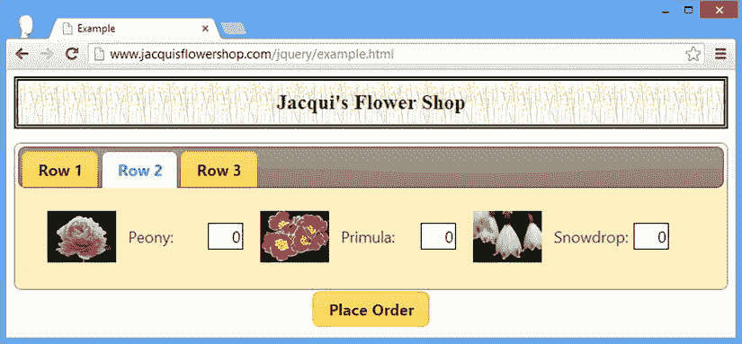
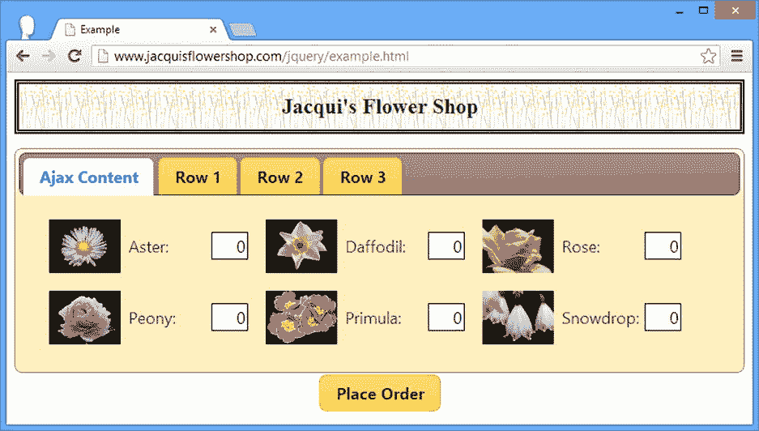
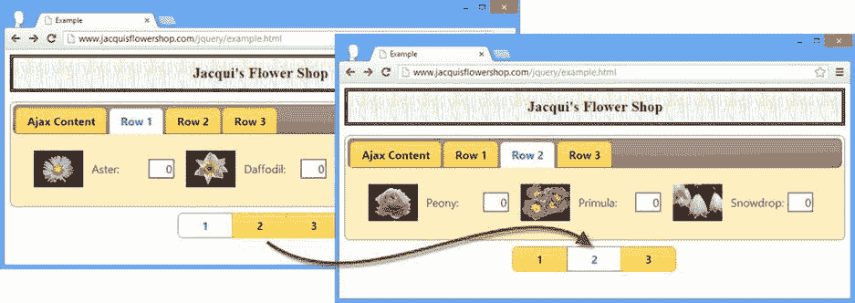
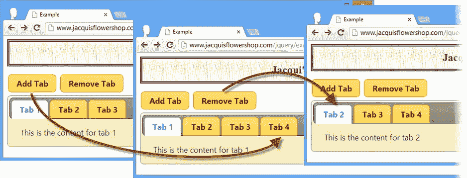
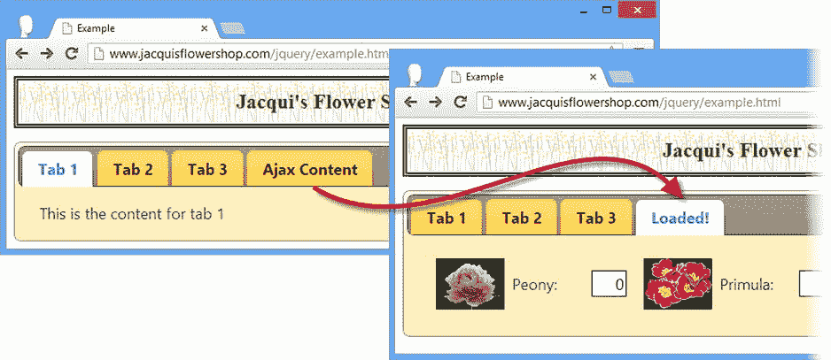
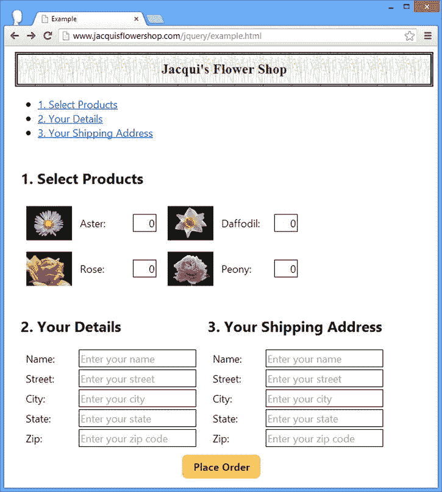
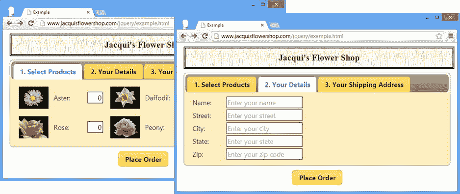
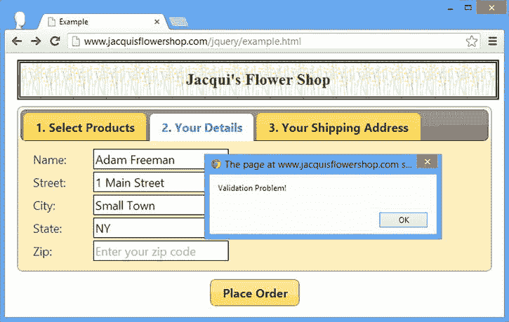

第二十章


使用选项卡小部件

tabs 小部件表面上类似于我在第 19 章中描述的 accordion，但是提供了更多的功能和定制的机会。与前面的小部件章节一样，我从如何创建小部件的细节开始，然后向您展示小部件支持的设置、方法和事件。我用一个例子来结束这一章，这个例子展示了如何使用 tabs 小部件将表单分部分呈现给用户，这是一种处理需要大量数据输入的长表单的有用技术。[表 20-1](#Tab1) 对本章进行了总结。

[表 20-1](#_Tab1) 。章节总结

| 问题 | 解决办法 | 列表 |
| --- | --- | --- |
| 创建选项卡小部件 | 定义一个标签和内容元素结构，并调用`tabs`方法 | one |
| 通过 Ajax 获取标签的内容 | 将选项卡`a`元素的`href`属性设置为应该在内容面板中显示的 HTML 文档 | 2, 3 |
| 获取或设置活动选项卡 | 使用`active`设置 | four |
| 禁用单个选项卡 | 使用`disabled`设置 | five |
| 更改激活选项卡的事件 | 使用`event`设置 | six |
| 允许停用所有选项卡 | 使用`collapsible`设置 | seven |
| 添加或删除选项卡 | 更改底层 HTML 元素，然后调用`refresh`方法 | eight |
| 强制加载远程内容 | 使用`load`方法 | nine |
| 在发出 Ajax 请求之前对其进行配置，并在加载时修改远程内容 | 处理`beforeLoad`和`load`事件 | 10, 11 |
| 跨多个选项卡显示表单 | 使用`div`元素分割表单，添加一个标签结构，并调用`tabs`方法 | 12–14 |
| 验证显示在多个选项卡中的表单内容 | 处理`beforeActivate`和`activate`事件 | Fifteen |

自上一版以来，JQUERY UI 发生了变化

在 jQuery UI 1.10 中，tabs 小部件经历了一次重大的 API 变化。方法和配置选项更少，为了与其他小部件的更改保持一致，在进行更改时，更依赖于直接操作小部件所应用的元素。

删除了以下选项:`fx`、`ajaxOptions`、`cache`、`spinner`、`selected`、`idPrefix`、`tabTemplate`、`panelTemplate`和`cookie`。删除了以下方法:`url`、`abort`、`select`、`add`、`remove`和`length`。tabs 小部件定义的事件集已经被简化。有关新事件的详细信息，请参见“使用选项卡事件”一节。

这些变化可能看起来很剧烈，但结果是一个更简单、更容易使用的小部件。通过使用 jQuery 操作底层 HTML 元素，然后使用新的`refresh`方法更新小部件的状态，方法和选项提供的所有功能仍然可用，如本章中的清单所示。

创建选项卡

使用`tabs`方法创建 jQuery UI 选项卡。和 accordion 小部件一样，tab 小部件需要特定的 HTML 元素结构才能工作，如清单 20-1 所示。

***[清单 20-1](#_list1)*** 。创建 jQuery UI 选项卡

```js
<!DOCTYPE html>
<html>
<head>
    <title>Example</title>
    <script src="jquery-2.0.2.js" type="text/javascript"></script>
    <script src="handlebars.js"></script>
    <script src="handlebars-jquery.js"></script>
    <script src="jquery-ui-1.10.3.custom.js" type="text/javascript"></script>
    <link rel="stylesheet" type="text/css" href="jquery-ui-1.10.3.custom.css"/>
    <link rel="stylesheet" type="text/css" href="styles.css"/>
    <script id="flowerTmpl" type="text/x-jquery-tmpl">
        {{#flowers}}
        <div class="dcell">
            
            <label for="{{product}}">{{name}}:</label>
            <input name="{{product}}" value="0" />
        </div>
        {{/flowers}}
    </script>
    <script type="text/javascript">
        $(document).ready(function () {
            var data = {
                flowers: [{ "name": "Aster", "product": "aster" },
                { "name": "Daffodil", "product": "daffodil" },
                { "name": "Rose", "product": "rose" },
                { "name": "Peony", "product": "peony" },
                { "name": "Primula", "product": "primula" },
                { "name": "Snowdrop", "product": "snowdrop" },
                { "name": "Carnation", "product": "carnation" },
                { "name": "Lily", "product": "lily" },
                { "name": "Orchid", "product": "orchid" }]
            };

            var elems = $("#flowerTmpl").template(data).filter("*");
            elems.slice(0, 3).appendTo("#tab1");
            elems.slice(3, 6).appendTo("#tab2");
            elems.slice(6).appendTo("#tab3");

            $("#tabs").tabs();
            $("button").button();
        });
    </script>
</head>
<body>
    <h1>Jacqui's Flower Shop</h1>
    <form method="post" action="http://node.jacquisflowershop.com/order">
        <div id="tabs">
            <ul>
                <li><a href="#tab1">Row 1</a>
                <li><a href="#tab2">Row 2</a>
                <li><a href="#tab3">Row 3</a>
            </ul>
            <div id="tab1"></div>
            <div id="tab2"></div>
            <div id="tab3"></div>
        </div>
        <div id="buttonDiv"><button type="submit">Place Order</button></div>
    </form>
</body>
</html>
```

应用`tabs`方法的元素必须包含两种元素。第一个是*内容元素*，这些元素的内容应该出现在标签中。第二种元素是*结构元素*，它为 jQuery UI 选项卡小部件提供创建选项卡结构所需的信息。

我使用`div`元素来提供结构。在下面的例子中，我使用了三个`div`元素，每个元素保存一行花卉产品信息，就像前面的例子一样:

```js
...
<div id="tab1"></div>
<div id="tab2"></div>
<div id="tab3"></div>
...
```

重要的是每个内容元素都有一个`id`属性，以便 jQuery UI 选项卡小部件可以找到要显示的正确元素。对于结构，我使用了`li`元素，每个元素包含一个`a`元素，如下:

```js
...
<ul>
    <li><a href="#tab1">Row 1</a>
    <li><a href="#tab2">Row 2</a>
    <li><a href="#tab3">Row 3</a>
</ul>
...
```

`li`项的数量定义了标签的数量。`a`元素的内容被用作选项卡标签，`href`属性指定该选项卡与哪个内容元素相关。

 **提示**我使用数据模板来动态生成选项卡内容，因为它让我更清楚地显示所需的结构。内容可以静态定义，或者像我在下一节中解释的那样，从服务器动态获取。

你可以在[图 20-1](#Fig1) 中看到例子中的结构是如何转换成一组选项卡的。



[图 20-1](#_Fig1) 。创建 jQuery UI 选项卡

标签是一个熟悉的用户界面隐喻。单击一个选项卡会导致 jQuery UI 显示相应的内容元素。与 accordion 一样，tabs 小部件可以让您以相对简洁的方式呈现大量内容，让用户能够专注于对他来说重要的内容。这意味着你必须仔细考虑标签和它们的内容是如何相互关联的。目标应该是将你的内容分组，以减少用户在标签之间切换来找到她想要的内容的次数，同时保留内容元素的自然分组。与任何用户界面一样，这需要对用户正在执行的任务以及她的工作流(而不是你的系统)如何运行有一个坚实的理解。

用 Ajax 获取标签内容

选项卡小部件的一个很好的特性是能够通过 Ajax 获取选项卡内容。为此，您只需指定一个 URL 作为适当的`a`元素的`href`属性。通过 Ajax 获取内容的标签被称为*远程标签*。为了演示这个特性，我创建了一个名为`tabflowers.html`的 HTML 文档，其内容如[清单 20-2](#list2) 所示。

***[清单 20-2](#_list2)*** 。tabflowers.html 文件的内容

```js
<div>
    <div class="dcell">
        <label for="aster">Aster:</label>
        <input name="aster" value="0" />
    </div>
    <div class="dcell">
        <label for="daffodil">Daffodil:</label>
        <input name="daffodil" value="0" />
    </div>
    <div class="dcell">
        <label for="rose">Rose:</label>
        <input name="rose" value="0" />
    </div>
</div>
<div>
    <div class="dcell">
        <label for="peony">Peony:</label>
        <input name="peony" value="0" />
    </div>
    <div class="dcell">
        <label for="primula">Primula:</label>
        <input name="primula" value="0" />
    </div>
    <div class="dcell">
        <label for="snowdrop">Snowdrop:</label>
        <input name="snowdrop" value="0" />
    </div>
</div>
```

为了保持示例简单，我使用了与生成的内容元素相同的结构和内容。清单 20-3 展示了如何使用`tabflowers.html`文件作为标签的内容。

***[清单 20-3](#_list3)*** 。通过 Ajax 获取标签的内容

```js
...
<body>
    <h1>Jacqui's Flower Shop</h1>
    <form method="post" action="http://node.jacquisflowershop.com/order">
        <div id="tabs">
            <ul>
                <li><a href="tabflowers.html">Ajax Content</a>
                <li><a href="#tab1">Row 1</a>
                <li><a href="#tab2">Row 2</a>
                <li><a href="#tab3">Row 3</a>
            </ul>
            <div id="tab1"></div>
            <div id="tab2"></div>
            <div id="tab3"></div>
        </div>
        <div id="buttonDiv"><button type="submit">Place Order</button></div>
    </form>
</body>
...
```

在[清单 20-2](#list2) 中，我添加了一个名为 Ajax Content 的新标签，并指定了应该加载的内容的 URL。你可以在[图 20-2](#Fig2) 中看到效果。



[图 20-2](#_Fig2) 。通过 Ajax 获取标签的内容

 **提示**你不需要为远程标签页创建内容元素。这是由选项卡小部件自动完成的。

配置标签窗口小部件

乍一看，tabs 小部件可能看起来像是我在第 19 章中向您展示的 accordion 小部件的垂直变体。有一些共同的特征，但是当您使用选项卡时，有一组更广泛的配置选项和设置。[表 20-2](#Tab2) 描述了 jQuery UI tabs 小部件支持的设置。在接下来的小节中，我将向您展示如何使用这些设置来配置小部件。

[表 20-2](#_Tab2) 。选项卡设置

| 环境 | 描述 |
| --- | --- |
| `active` | 获取或设置当前显示的选项卡；使用基于零的索引来指定单个面板，并且所有面板都可以通过指定`false`来关闭(但是这仅在`collapsible`被设置为`true`时有效) |
| `collapsible` | 当设置为`true`时，所有选项卡都关闭 |
| `disabled` | 用于启用/禁用单个选项卡 |
| `event` | 用于设置触发选项卡间转换的事件 |
| `heightStyle` | 指定如何确定小工具及其选项卡的高度 |
| `hide` | 指定标签页关闭时的动画——我在第 35 章中描述了 jQuery UI 动画。 |
| `show` | 指定标签页打开时的动画——我在第 35 章中描述了 jQuery UI 动画。 |

 **提示**在 jQuery UI 1.10 版本中，选项卡小部件的配置选项发生了很大的变化。完整的细节请参见本章开头的注释，但是新的选项集——如[表 20-2](#Tab2) 所示——更加简单，并且与其他 jQuery UI 小部件更加一致。

选择活动选项卡

`active`设置支持确定和改变当前显示的标签，如清单 20-4 所示。

***[清单 20-4](#_list4)*** 。使用活动选项获取和设置显示的选项卡

```js
<!DOCTYPE html>
<html>
<head>
    <title>Example</title>
    <script src="jquery-2.0.2.js" type="text/javascript"></script>
    <script src="handlebars.js"></script>
    <script src="handlebars-jquery.js"></script>
    <script src="jquery-ui-1.10.3.custom.js" type="text/javascript"></script>
    <link rel="stylesheet" type="text/css" href="jquery-ui-1.10.3.custom.css"/>
    <link rel="stylesheet" type="text/css" href="styles.css"/>
    <style>
        #radioDiv { text-align: center; margin-top: 10px;}
    </style>
    <script id="flowerTmpl" type="text/x-jquery-tmpl">
        {{#flowers}}
        <div class="dcell">
            
            <label for="{{product}}">{{name}}:</label>
            <input name="{{product}}" value="0" />
        </div>
        {{/flowers}}
    </script>
    <script type="text/javascript">
        $(document).ready(function () {
            var data = {
                flowers: [{ "name": "Aster", "product": "aster" },
                { "name": "Daffodil", "product": "daffodil" },
                { "name": "Rose", "product": "rose" },
                { "name": "Peony", "product": "peony" },
                { "name": "Primula", "product": "primula" },
                { "name": "Snowdrop", "product": "snowdrop" },
                { "name": "Carnation", "product": "carnation" },
                { "name": "Lily", "product": "lily" },
                { "name": "Orchid", "product": "orchid" }]
            };

            var elems = $("#flowerTmpl").template(data).filter("*");
            elems.slice(0, 3).appendTo("#tab1");
            elems.slice(3, 6).appendTo("#tab2");
            elems.slice(6).appendTo("#tab3");

            $("#tabs").tabs();

            $("#radioDiv").buttonset().change(function (e) {
                $("#tabs").tabs("option", "active", e.target.value);
            });
        });
    </script>
</head>
<body>
    <h1>Jacqui's Flower Shop</h1>
    <form method="post" action="http://node.jacquisflowershop.com/order">
        <div id="tabs">
            <ul>
                <li><a href="tabflowers.html">Ajax Content</a>
                <li><a href="#tab1">Row 1</a>
                <li><a href="#tab2">Row 2</a>
                <li><a href="#tab3">Row 3</a>
            </ul>
            <div id="tab1"></div>
            <div id="tab2"></div>
            <div id="tab3"></div>
        </div>
        <div id="radioDiv">
            <input type="radio" name="tabNo" id="one" value="1" />
                <label for="one">1</label>
            <input type="radio" name="tabNo" id="two" value="2"/>
                <label for="two">2</label>
            <input type="radio" name="tabNo" id="three" value="3"/>
                <label for="three">3</label>
        </div>
    </form>
</body>
</html>
```

我在文档中添加了一个 jQuery UI 按钮集，如第 18 章中的[所述。我使用 jQuery `change`方法来注册一个处理函数，当单击按钮集中的一个按钮时，这个函数被调用。handler 函数使用`option`方法设置`active`属性，产生如图 20-3](18.html) 中[所示的效果。](#Fig3)



[图 20-3](#_Fig3) 。使用活动设置更改活动选项卡

禁用单个选项卡

如果您使用`boolean`值，则`disabled`设置会改变选项卡小部件的状态，但是也可以通过使用一组数字来启用和禁用单个选项卡。[清单 20-5](#list5) 演示了。

***[清单 20-5](#_list5)*** 。启用和禁用单个选项卡

```js
<!DOCTYPE html>
<html>
<head>
    <title>Example</title>
    <script src="jquery-2.0.2.js" type="text/javascript"></script>
    <script src="jquery-ui-1.10.3.custom.js" type="text/javascript"></script>
    <link rel="stylesheet" type="text/css" href="jquery-ui-1.10.3.custom.css"/>
    <link rel="stylesheet" type="text/css" href="styles.css"/>
    <style type="text/css">
        #buttonDiv {margin: 5px}
    </style>
    <script type="text/javascript">
        $(document).ready(function () {

            $("#tabs").tabs();

            $("input:checkbox").button().click(function () {
                var disabledPositions = [];
                $("input:checked").each(function (index, elem) {
                    disabledPositions.push(Number(elem.value));
                })

                $("#tabs").tabs("option", "disabled", disabledPositions)
            });
        });
    </script>
</head>
<body>
    <h1>Jacqui's Flower Shop</h1>
    <form method="post" action="http://node.jacquisflowershop.com/order">
        <div id="tabs">
            <ul>
                <li><a href="#tab1">Tab 1</a>
                <li><a href="#tab2">Tab 2</a>
                <li><a href="#tab3">Tab 3</a>
            </ul>
            <div id="tab1">This is the content for tab 1</div>
            <div id="tab2">This is the content for tab 2</div>
            <div id="tab3">This is the content for tab 3</div>
        </div>
        <div id="buttonDiv">
            <label for="cb0">Tab 1</label><input type="checkbox" id="cb0" value=0>
            <label for="cb1">Tab 2</label><input type="checkbox" id="cb1" value="1">
            <label for="cb2">Tab 3</label><input type="checkbox" id="cb2" value="2">
        </div>
    </form>
</body>
</html>
```

我创建了一个包含静态内容的 tabs 小部件，并添加了一组复选框，我将它们转换成了 jQuery UI 切换按钮。当点击其中一个按钮时，对应的选项卡被启用或禁用，如图[图 20-4](#Fig4) 所示。


[图 20-4](#_Fig4) 。禁用和启用选项卡以响应按钮点击

更改事件触发器

默认情况下，tabs 小部件响应`click`事件，这意味着用户必须单击一个选项卡来激活它。您可以使用`event`设置来指定要响应的不同事件。这对于响应鼠标事件非常有用，如[清单 20-6](#list6) 所示。

***[清单 20-6](#_list6)*** 。更改激活选项卡的事件

```js
<!DOCTYPE html>
<html>
<head>
    <title>Example</title>
    <script src="jquery-2.0.2.js" type="text/javascript"></script>
    <script src="jquery-ui-1.10.3.custom.js" type="text/javascript"></script>
    <link rel="stylesheet" type="text/css" href="styles.css"/>
    <link rel="stylesheet" type="text/css" href="jquery-ui-1.10.3.custom.css"/>
    <style type="text/css"> #buttonDiv {margin: 5px}</style>
    <script type="text/javascript">
        $(document).ready(function() {

            $("#tabs").tabs({
                event: "mouseover"
            });
        });
    </script>
</head>
<body>
    <h1>Jacqui's Flower Shop</h1>
    <form method="post" action="http://node.jacquisflowershop.com/order">
        <div id="tabs">
            <ul>
                <li><a href="#tab1">Tab 1</a>
                <li><a href="#tab2">Tab 2</a>
                <li><a href="#tab3">Tab 3</a>
            </ul>
            <div id="tab1">This is the content for tab 1</div>
            <div id="tab2">This is the content for tab 2</div>
            <div id="tab3">This is the content for tab 3</div>
        </div>
    </form>
</body>
</html>
```

我在清单中指定了`mouseover`事件，这意味着当鼠标在选项卡标签上移动时，选项卡小部件将在选项卡之间切换。

 **提示**我建议谨慎使用这种方法，就像我对 accordion 小部件的相同设置所做的那样。这在视觉上很吸引人，但是会产生一种令人讨厌的效果，迫使用户注意不要将鼠标从他想要交互的标签上移开。

使用可折叠标签

你可以通过使用`collapsible`设置来创建一种标签和折叠的混合体，如[清单 20-7](#list7) 所示。

***[清单 20-7](#_list7)*** 。使用可折叠设置

```js
...
<script type="text/javascript">
    $(document).ready(function() {
        $("#tabs").tabs({
            collapsible: true
        });
    });
</script>
...
```

当`collapsible`设置为`true`时，单击活动选项卡就像折叠内容元素一样折叠它。你可以在[图 20-5](#Fig5) 中看到这个过渡。


[图 20-5](#_Fig5) 。折叠活动选项卡

 **提示**为了完整起见，我已经包括了这个设置，但是我从来没有在我自己的项目中使用过它，因为它的结果会让用户感到困惑。

使用选项卡方法

表 20-3 显示了 jQuery UI tabs 小部件支持的方法。

[表 20-3](#_Tab3) 。选项卡方法

| 方法 | 描述 |
| --- | --- |
| `tabs("destroy")` | 从基础 HTML 元素中移除选项卡小部件 |
| `tabs("disable")` | 禁用整个小部件或单个选项卡(有关使用相应设置的示例，请参见“使用可折叠选项卡”一节) |
| `tabs("enable")` | 启用整个小部件或单个选项卡 |
| `tabs("option")` | 更改一个或多个设置(有关配置 jQuery UI 小部件的详细信息，请参见第 18 章中的“配置按钮”一节) |
| `tabs("load")` | 使用 Ajax 请求显式加载选项卡的内容 |
| `tabs("refresh")` | 更新小部件以反映底层 HTML 元素的变化 |

 **提示**tabs 小部件支持的方法集在 1.10 版本中发生了变化。删除了以下方法:`add`、`remove`、`select`、`url`、`length`和`abort`。`add`和`remove`方法已经被一个叫做`refresh`的新方法所取代；通过`active`设置可以使用`select`方法的功能；您可以使用新的`beforeActivate`事件实现功能性`abort`方法。`length`方法没有替代功能。

添加和删除选项卡

我使用 jQuery UI tabs 小部件来定义用于操作显示给用户的选项卡集的`add`和`remove`方法。这些方法在 jQuery UI 1.10 中被删除了，取而代之的是`refresh`方法，它根据小部件所应用到的底层 HTML 元素的变化来更新选项卡。在清单 20-8 中，你可以看到如何使用刷新方法。

***[清单 20-8](#_list8)*** 。使用 refresh 方法更新选项卡小部件

```js
<!DOCTYPE html>
<html>
<head>
    <title>Example</title>
    <script src="jquery-2.0.2.js" type="text/javascript"></script>
    <script src="jquery-ui-1.10.3.custom.js" type="text/javascript"></script>
    <link rel="stylesheet" type="text/css" href="jquery-ui-1.10.3.custom.css"/>
    <link rel="stylesheet" type="text/css" href="styles.css"/>
    <style type="text/css">
        #buttons {margin: 5px 0}
    </style>
    <script type="text/javascript">
        $(document).ready(function () {

            $("#tabs").tabs();

            $("button").button().click(function (e) {
                var tabsElem = $("#tabs");
                if (this.id == "add") {
                    var tabID = tabsElem.children("div").length + 1;
                    tabsElem.children("ul").append($("<li>").append($("<a>")
                        .attr("href", "#tab" + tabID).text("Tab " + tabID)));
                    $("<div>").attr("id", "tab" + tabID)
                        .text("This is the content for tab " + tabID).appendTo(tabsElem);
                } else {
                    tabsElem.find("li").first().remove();
                    tabsElem.children("div").first().remove();
                }
                tabsElem.tabs("refresh");
            })
        });
    </script>
</head>
<body>
    <h1>Jacqui's Flower Shop</h1>
    <div id="buttons" class="ui-widget">
        <button id="add">Add Tab</button>
        <button id="remove">Remove Tab</button>
    </div>
    <div id="tabs">
        <ul>
            <li><a href="#tab1">Tab 1</a>
            <li><a href="#tab2">Tab 2</a>
            <li><a href="#tab3">Tab 3</a>
        </ul>
        <div id="tab1">This is the content for tab 1</div>
        <div id="tab2">This is the content for tab 2</div>
        <div id="tab3">This is the content for tab 3</div>
    </div>
</body>
</html>
```

我添加了一对`button`元素，用于添加和删除选项卡小部件使用的`li`和`div`元素。当点击`Add Tab`按钮时，我会生成新元素，并将它们添加到文档对象模型(DOM)中。当点击`Remove Tab`按钮时，我移除我能找到的第一个`li`和`div`元素。

在做了这些更改后，我调用了`refresh`方法，通知 tabs 小部件它应该自我更新以反映我所做的更改，创建了如图 20-6 所示的效果。



[图 20-6](#_Fig6) 。添加和删除选项卡

触发选项卡 Ajax 请求

默认情况下，当用户打开包含远程内容的选项卡时，tabs 小部件只会对该选项卡发出 Ajax 请求。这种方法可以防止请求可能永远不会显示的内容，但是会导致用户打开标签时的延迟。您可以告诉 tabs 小部件使用`load`方法显式加载远程标签的内容，如[清单 20-9](#list9) 所示。

***[清单 20-9](#_list9)*** 。使用 load 方法显式获取远程内容

```js
<!DOCTYPE html>
<html>
<head>
    <title>Example</title>
    <script src="jquery-2.0.2.js" type="text/javascript"></script>
    <script src="jquery-ui-1.10.3.custom.js" type="text/javascript"></script>
    <link rel="stylesheet" type="text/css" href="jquery-ui-1.10.3.custom.css"/>
    <link rel="stylesheet" type="text/css" href="styles.css"/>
    <style type="text/css">
        #buttons {margin: 5px 0}
    </style>
    <script type="text/javascript">
        $(document).ready(function () {

            $("#tabs").tabs();

            $("#load").button().click(function (e) {
                var tabsElem = $("#tabs");

                tabsElem.find("a").each(function (index, elem) {
                    if (elem.href.indexOf("example.html") == -1) {
                        tabsElem.tabs("load", index);
                    }
                });
            });
        });
    </script>
</head>
<body>
    <h1>Jacqui's Flower Shop</h1>

    <div id="buttons" class="ui-widget">
        <button id="load">Load</button>
    </div>

    <div id="tabs">
        <ul>
            <li><a href="#tab1">Tab 1</a>
            <li><a href="#tab2">Tab 2</a>
            <li><a href="#tab3">Tab 3</a>
            <li><a href="tabflowers.html">Ajax Content</a>
        </ul>
        <div id="tab1">This is the content for tab 1</div>
        <div id="tab2">This is the content for tab 2</div>
        <div id="tab3">This is the content for tab 3</div>
    </div>
</body>
</html>
```

`load`方法的参数是您想要加载内容的远程标签的索引。在这种情况下，我使用了`load`方法来响应被点击的按钮。

使用选项卡事件

jQuery UI tabs 小部件支持的事件集在[表 20-4](#Tab4) 中描述，我将在接下来的章节中描述它们。

[表 20-4](#_Tab4) 。标签事件

| 事件 | 描述 |
| --- | --- |
| `create` | 当 tabs 小部件应用于底层 HTML 元素时触发 |
| `beforeActivate` | 在选项卡面板显示给用户之前触发 |
| `activate` | 向用户显示选项卡面板后触发 |
| `beforeLoad` | 当远程选项卡的内容即将被加载时触发 |
| `load` | 当远程选项卡的内容已加载时触发 |

 **提示**jQuery UI 1.10 版本改变了 tabs 小部件支持的事件集，删除了`select`、`show`、`add`、`remove`、`enable`和`disable`事件，增加了`beforeActivate`、`activate`和`beforeLoad`事件。被移除的事件是没有意义的，因为 tabs 小部件现在依赖于底层 HTML 元素的状态(和`refresh`方法),或者因为可以使用新事件重新创建功能。

拦截 Ajax 请求

在请求远程标签的内容之前，触发`beforeLoad`事件。处理函数被传递一个 jQuery 事件对象和一个附加对象——通常在处理函数中被赋予名称`ui`——它定义了[表 20-5](#Tab5) 中所示的属性。

[表 20-5](#_Tab5) 。传递给 beforeLoad 事件处理函数的附加对象的属性

| 名字 | 描述 |
| --- | --- |
| `tab` | 返回一个包含远程选项卡的选项卡元素的`jQuery`对象 |
| `panel` | 返回一个包含远程选项卡面板元素的`jQuery`对象 |
| `jqXHR` | 返回将用于发出 Ajax 请求的`jqXHR`对象 |
| `ajaxSettings` | 返回一个地图对象，该对象将被传递给发出请求的`$.ajax`方法 |

这些属性揭示了 jQuery UI 和 jQuery 之间的紧密集成，通过构建我在第 14 章和第 15 章中描述的 jQuery Ajax 功能。在清单 20-10 中，您可以看到我如何处理`beforeLoad`事件来调整 Ajax 请求的设置。

***[清单 20-10](#_list10)*** 。处理加载前事件

```js
<!DOCTYPE html>
<html>
<head>
    <title>Example</title>
    <script src="jquery-2.0.2.js" type="text/javascript"></script>
    <script src="jquery-ui-1.10.3.custom.js" type="text/javascript"></script>
    <link rel="stylesheet" type="text/css" href="jquery-ui-1.10.3.custom.css"/>
    <link rel="stylesheet" type="text/css" href="styles.css"/>
    <script type="text/javascript">
        $(document).ready(function () {
            $("#tabs").tabs({
                beforeLoad: function (e, ui) {
                    ui.ajaxSettings.url = "flowers.html";
                }
            });
        });
    </script>
</head>
<body>
    <h1>Jacqui's Flower Shop</h1>
    <div id="tabs">
        <ul>
            <li><a href="#tab1">Tab 1</a>
            <li><a href="#tab2">Tab 2</a>
            <li><a href="#tab3">Tab 3</a>
            <li><a href="tabflowers.html">Ajax Content</a>
        </ul>
        <div id="tab1">This is the content for tab 1</div>
        <div id="tab2">This is the content for tab 2</div>
        <div id="tab3">This is the content for tab 3</div>
    </div>
</body>
</html>
```

我为`beforeLoad`事件注册的处理函数设置了`ui.ajaxSettings`对象的`url`属性，以改变远程选项卡将显示的内容的来源。代替 HTML 元素指定的`tabflowers.html`文件，将加载`flowers.html`文件。

操纵远程标签数据

当一个远程标签的数据已经从服务器加载，并且可以用来在内容显示给用户之前操作内容时，触发`load`事件。处理函数传递了一个 jQuery 事件对象和一个额外的`ui`对象，该对象定义了[表 20-6](#Tab6) 中显示的属性。

[表 20-6](#_Tab6) 。传递给加载事件处理函数的附加对象的属性

| 名字 | 描述 |
| --- | --- |
| `tab` | 返回一个包含已加载选项卡元素的`jQuery`对象 |
| `panel` | 返回一个`jQuery`对象，该对象包含内容被加载到的元素 |

注意，`ui`对象返回的属性都没有直接引用从服务器加载的内容。相反，处理函数可以访问选项卡小部件用于选项卡标题和内容面板的元素。在[清单 20-11](#list11) 中，您可以看到我如何使用这些元素来改变标签的标题并操作从服务器加载的内容。

***[清单 20-11](#_list11)*** 。处理选项卡加载事件

```js
...
<script type="text/javascript">
    $(document).ready(function () {
        $("#tabs").tabs({
            load: function (e, ui) {
                ui.tab.find("a").text("Loaded!");
                ui.panel.children().first().remove();
            }
        });
    });
</script>
...
```

我使用`ui.tab`属性来定位用于选项卡的`a`元素，并调用 jQuery text 方法来更改标题。我使用`ui.panel`属性定位从服务器加载的第一个子内容元素，并将其从 DOM 中移除。你可以在[图 20-7](#Fig7) 中看到效果。



[图 20-7](#_Fig7) 。处理加载事件

 **提示**注意，我不必调用`refresh`方法，尽管我正在修改 tabs 小部件所依赖的 DOM 元素。触发加载事件后，会自动应用刷新。

使用选项卡显示表单

这是一种非常有用的技术，可以让长表单更容易理解，同时让用户感觉到她在表单中前进了多远。首先，[清单 20-12](#list12) 显示了包含我将使用的表单的文档。

***[清单 20-12](#_list12)*** 。包含表单的文档

```js
<!DOCTYPE html>
<html>
<head>
    <title>Example</title>
    <script src="jquery-2.0.2.js" type="text/javascript"></script>
    <script src="handlebars.js"></script>
    <script src="handlebars-jquery.js"></script>
    <script src="jquery-ui-1.10.3.custom.js" type="text/javascript"></script>
    <link rel="stylesheet" type="text/css" href="styles.css"/>
    <link rel="stylesheet" type="text/css" href="jquery-ui-1.10.3.custom.css"/>
    <style type="text/css">
        #tab2 input, #tab3 input {width: 200px; text-align: left}
        #tab1, #tab2, #tab3 {padding: 10px}
        .fl {float: left}
        #buttonDiv {clear: both}
        #tabs, h1 {margin: 10px}
        .regLabel {width: auto}
    </style>
    <script id="flowerTmpl" type="text/x-jquery-tmpl">
        {{#flowers}}
            <div class="dcell ui-widget">
                
                <label for="{{product}}">{{name}}:</label>
                <input name="{{product}}" value="0"/>
            </div>
        {{/flowers}}
    </script>
    <script id="detailsTmpl" type="text/x-jquery-tmpl">
        {{#details}}
            <div class="ui-widget">
                <label for="{{name}}">{{name}}:</label>
                <input name="{{name}}" placeholder="{{hint}}"/>
            </div>
        {{/details}}
    </script>
    <script type="text/javascript">
        $(document).ready(function () {

            var data = [{ "name": "Aster", "product": "aster" },
                        { "name": "Daffodil", "product": "daffodil" },
                        { "name": "Rose", "product": "rose" },
                        { "name": "Peony", "product": "peony" }];

            var elems = $("#flowerTmpl").template({ flowers: data }).filter("*");
            elems.slice(0, 2).appendTo("#row1");
            elems.slice(2, 4).appendTo("#row2");

            var detailsData = [{ name: "Name", hint: "Enter your name" },
                    { name: "Street", hint: "Enter your street" },
                    { name: "City", hint: "Enter your city" },
                    { name: "State", hint: "Enter your state" },
                    { name: "Zip", hint: "Enter your zip code" }];

            $("#detailsTmpl").template({ details: detailsData }).filter("*")
                .appendTo("#tab2").clone().appendTo("#tab3")

            $("button").button();
        });
    </script>
</head>
<body>
    <h1>Jacqui's Flower Shop</h1>
    <form method="post" action="http://node.jacquisflowershop.com/order">
        <div id="tabs" class="ui-widget">
            <ul>
                <li><a href="#tab1">1\. Select Products</a>
                <li><a href="#tab2">2\. Your Details</a>
                <li><a href="#tab3">3\. Your Shipping Address</a>
            </ul>
            <div id="tab1">
                <h2>1\. Select Products</h2>
                <div id="row1"></div>
                <div id="row2"></div>
            </div>
            <div id="tab2" class="fl">
                <h2>2\. Your Details</h2>
            </div>
            <div id="tab3" class="fl">
               <h2>3\. Your Shipping Address</h2>
            </div>
        </div>
        <div id="buttonDiv"><button type="submit">Place Order</button></div>
    </form>
</body>
</html>
```

我在文档中添加了一些额外的内容和结构，以充实早期的示例。花卉产品较少，但是我在文档中添加了一些区域来捕获用户的个人和运输细节。你可以在[图 20-8](#Fig8) 中看到基本形式。



[图 20-8](#_Fig8) 。用于选项卡小部件的多部分表单

该表单没有什么特别之处，只是非常适合与 jQuery UI tabs 小部件一起使用，因为它被整齐地划分为不同的区域，每个区域都可以显示在一个选项卡中。

我已经使用数据模板以编程方式添加了大部分内容，您可以看到我如何使用在前面章节中演示的 jQuery 功能从数据中生成元素，根据需要克隆它们，然后将结果添加到文档中。这并不是使用选项卡显示表单的必要条件，但是在一本关于 jQuery 的书中，我喜欢尽可能多地使用核心特性。

您还可以在图中看到`ul`元素以及它包含的指向内容元素的链接。我通常会隐藏这个元素，但是我想向您展示 tabs 小部件用于标签的结构的一个很好的副作用。创建一个列表，其中每个列表项都包含一个链接，这意味着单击该链接将跳转到文档的该部分，如果该链接指向另一个文件，则浏览器将导航到该文档。这将帮助我从选项卡标题中获得我想要的行为。

应用选项卡

我准备将 tabs 小部件应用到示例中。[清单 20-13](#list13) 显示了`script`元素中需要的变化。文档中的任何其他地方都不需要更改。

***[清单 20-13](#_list13)*** 。创建选项卡小部件

```js
...
<script type="text/javascript">

    $(document).ready(function () {

        var data = [{ "name": "Aster", "product": "aster" },
                    { "name": "Daffodil", "product": "daffodil" },
                    { "name": "Rose", "product": "rose" },
                    { "name": "Peony", "product": "peony" }];

        var elems = $("#flowerTmpl").template({ flowers: data }).filter("*");
        elems.slice(0, 2).appendTo("#row1");
        elems.slice(2, 4).appendTo("#row2");

        var detailsData = [{ name: "Name", hint: "Enter your name" },
                { name: "Street", hint: "Enter your street" },
                { name: "City", hint: "Enter your city" },
                { name: "State", hint: "Enter your state" },
                { name: "Zip", hint: "Enter your zip code" }];

        $("#detailsTmpl").template({ details: detailsData }).filter("*")
            .appendTo("#tab2").clone().appendTo("#tab3")

        $(".fl").removeClass("fl");
        $("#tabs").tabs().find("h2").remove();

        $("button").button();
    });
</script>
...
```

我删除了用于定位详细信息和送货地址区域内容的`fl`类，并删除了用于部分标题的`h2`元素。然后我调用`tabs`方法，它使用内容元素作为标签的基础，正如你在[图 20-9](#Fig9) 中看到的。



[图 20-9](#_Fig9) 。将选项卡应用于表单

处理按钮按压

为了使表单更容易使用选项卡填写，我为`button`元素的`click`事件注册了一个处理程序。在这个处理程序中，我取消了事件的默认操作，并移动到序列中的下一个选项卡，直到到达最后一个选项卡。此时，单击`button`将表单提交给服务器。[清单 20-14](#list14) 显示了我对`script`元素添加的内容。

***[清单 20-14](#_list14)*** 。使用提交按钮在表单中前进

```js
...
<script type="text/javascript">

    $(document).ready(function () {

        var data = [{ "name": "Aster", "product": "aster" },
                    { "name": "Daffodil", "product": "daffodil" },
                    { "name": "Rose", "product": "rose" },
                    { "name": "Peony", "product": "peony" }];

        var elems = $("#flowerTmpl").template({ flowers: data }).filter("*");
        elems.slice(0, 2).appendTo("#row1");
        elems.slice(2, 4).appendTo("#row2");

        var detailsData = [{ name: "Name", hint: "Enter your name" },
                { name: "Street", hint: "Enter your street" },
                { name: "City", hint: "Enter your city" },
                { name: "State", hint: "Enter your state" },
                { name: "Zip", hint: "Enter your zip code" }];

        $("#detailsTmpl").template({ details: detailsData }).filter("*")
            .appendTo("#tab2").clone().appendTo("#tab3")

        $(".fl").removeClass("fl");
        $("#tabs").tabs().find("h2").remove();

        $("button").button().click(function (e) {
            var tabsElem = $("#tabs");
            var activeTab = tabsElem.tabs("option", "active");
            if (activeTab < tabsElem.find("ul > li").length -1) {
                tabsElem.tabs("option", "active", activeTab + 1)
                e.preventDefault();
            }
        });
    });
</script>
...
```

我使用`active`选项来获取活动选项卡的索引，并使用 jQuery 选择器来获取选项卡标题元素的集合，并计算出有多少个。如果用户没有到达最后一个选项卡，那么我设置`active`选项来前进到序列中的下一个选项卡。只有当用户不在最后一个选项卡上时，我才调用`preventDefault`方法，这允许表单在选项卡序列的末尾提交。

执行验证

目前，用户可以直接跳到最后一页并提交表单。为了防止这种情况，我将应用一些基本的表单验证。为了使这个例子简单，我将手动处理验证，但是对于真实的项目，我推荐使用验证插件和我在第 13 章中描述的技术。[清单 20-15](#list15) 展示了对`script`元素的修改，以实现一些基本的验证，并防止用户过早跳到 tab 序列的末尾。

***[清单 20-15](#_list15)*** 。防止用户跳过带有一些基本验证的选项卡

```js
...
<script type="text/javascript">

    $(document).ready(function () {

        var data = [{ "name": "Aster", "product": "aster" },
                    { "name": "Daffodil", "product": "daffodil" },
                    { "name": "Rose", "product": "rose" },
                    { "name": "Peony", "product": "peony" }];

        var elems = $("#flowerTmpl").template({ flowers: data }).filter("*");
        elems.slice(0, 2).appendTo("#row1");
        elems.slice(2, 4).appendTo("#row2");

        var detailsData = [{ name: "Name", hint: "Enter your name" },
                { name: "Street", hint: "Enter your street" },
                { name: "City", hint: "Enter your city" },
                { name: "State", hint: "Enter your state" },
                { name: "Zip", hint: "Enter your zip code" }];

        $("#detailsTmpl").template({ details: detailsData }).filter("*")
            .appendTo("#tab2").clone().appendTo("#tab3")

        var activePanel;

        $(".fl").removeClass("fl");
        $("#tabs").tabs({
            beforeActivate: function (e, ui) {
                validatePanel(e, ui.oldPanel);
            },
            activate: function (e, ui) {
                activePanel = ui.newPanel;
            }
        }).find("h2").remove();

        function validatePanel(e, panelElem) {
            var inputElems = panelElem.find("input");
            if (panelElem.attr("id") == "tab1" ?
                sumInputElems(inputElems) : countEmptyOrZeroValues(inputElems)) {
                alert("Validation Problem!");
                e.preventDefault();
            }
        }

        function sumInputElems(inputs) {
            var total = 0;
            inputs.each(function (index, elem) {
                total+= Number($(elem).val());
            });
            return total == 0;
        }

        function countEmptyOrZeroValues(inputs) {
            var count = 0;
            inputs.each(function (index, elem) {
                if (elem.value == null || elem.value == "") {
                    count++;
                }
            });
            return count > 0;
        }

        $("button").button().click(function (e) {
            var tabsElem = $("#tabs");
            var activeTab = tabsElem.tabs("option", "active");
            if (activeTab < tabsElem.find("ul > li").length - 1) {
                tabsElem.tabs("option", "active", activeTab + 1)
                e.preventDefault();
            } else {
                validatePanel(e, activePanel);
            }
        });
    });
</script>
...
```

我使用了两个选项卡事件来获得我想要的效果。当用户从一个选项卡导航到下一个选项卡时，`beforeActivated`事件很有用，因为它为我提供了一个对即将关闭的选项卡的内容面板的引用，我通过传递给我的处理函数的第二个参数的属性来访问它，该函数是`ui`对象，如[表 20-7](#Tab7) 中所述。

[表 20-7](#_Tab7) 。传递给 beforeActivate 和 Activate 事件处理程序的附加对象的属性

| 名字 | 描述 |
| --- | --- |
| `newHeader` | 新活动选项卡的标题元素 |
| `oldHeader` | 先前活动选项卡的标题元素 |
| `newPanel` | 新活动的内容面板 |
| `oldPanel` | 先前活动的内容面板 |

我使用`oldPanel`引用来执行验证，并通过调用事件对象上的`preventDefaultAction`方法来停止向另一个选项卡的转换(如[第 9 章](09.html)所述)。

这种方法有一个问题，即当用户在完成最后一个选项卡后单击`button`元素时，不会触发`beforeActivate`事件，因为表单被提交给了服务器。出于这个原因，我还处理了`activate`事件，并存储了一个对显示的新选项卡的引用(我通过`ui`对象的`newPanel`属性访问它，该属性还定义了[表 20-7](#Tab7) 中显示的属性)。在允许表单提交给服务器之前，我使用这个引用来执行验证。

我告诉用户验证错误的方法是调用`alert`函数并在对话框中显示一条消息，如图 20-10 中的[所示。显然，在一个真实的项目中，你可以使用验证插件的概要特性，正如我在第十三章](#Fig10)中所描述的。



[图 20-10](#_Fig10) 。为响应验证错误而显示的警告框

摘要

在本章中，我向您展示了 jQuery UI tabs 小部件。这个小部件提供了丰富而复杂的功能，可以在多种情况下使用。我发现自己经常使用这个小工具。它是灵活的，完全可定制的，用户通常熟悉有选择地显示包含在单个选项卡中的内容的想法，而其他小部件(如 accordion)并不总是这样。在第 21 章中，我向你展示了 datepicker 小部件。