# 八、jQuery Mobile API

所有编写良好的框架都允许开发人员扩展和覆盖默认的配置设置。此外，它们提供了方便的方法来帮助简化您的代码。jQuery Mobile 包括一个相当广泛的 API，它公开了这些便利的特性。首先，我们将看看如何配置 jQuery Mobile。我们将回顾 jQuery Mobile 中的每个可配置特性，突出显示其默认设置，并展示 API 如何允许您配置每个选项。然后，我们将探索 jQuery Mobile 公开的最流行的方法、页面事件和属性。当您需要以编程方式更新移动 Web 应用时，这些 API 特性非常有用。最后，我们将查看一个列出所有 jQuery Mobile数据属性的排序表。对于每个属性，我们将包括其增强组件的简短描述、示例和图表。

### 配置 jQuery Mobile

当 jQuery Mobile 初始化时，它会在`document`对象上触发一个`mobileinit`事件。您可以绑定到`mobileinit`事件，并将覆盖应用到 jQuery Mobile 的(`$.mobile`)默认配置设置。此外，您可以用附加的行为和属性来扩展 jQuery Mobile。例如，有两种配置 jQuery Mobile 的方法，如下例所示。您可以通过 jQuery 的`extend`方法或者单独覆盖这些属性。

**例子:**

`// Configure properties via jQuery's extend method
$( document ).bind( "mobileinit", function(){
  $.extend( $.mobile, {
    // Override loading message
    loadingMessage: "Loading...",

    // Override default transition from “slide” to “pop”
    defaultTransition: "pop"
  });
});` `**// Configure properties individually**
$( document ).bind( "mobileinit", function(){
  $.mobile.loadingMessage = "Initializing";
  $.mobile.defaultTransition = "slideup";
});`

#### 自定义脚本放置

由于执行 jQuery Mobile 时会立即触发`mobileinit`,所以您需要将您的定制脚本放在 jQuery Mobile JavaScript 文件之前。

**举例:**

`<head>
    
    
    
</head>`

#### 可配置的 jQuery Mobile选项

以下是可配置的`$.mobile`选项，您可以在自定义 JavaScript 中覆盖这些选项。

*   **activeBtnClass**(string, default: "ui-btnactive")

    这个 CSS 类用来标识“活动”按钮并设置其样式。这个 CSS 属性通常用于设计和识别标签栏中的活动按钮。

*   **activePageClass**(string, default: “ui-page-active”)

    分配给当前可见且活动的页面或对话框的 CSS 类。例如，当 DOM 中加载了多个页面时，活动页面将应用这个 CSS 属性。

*   **ajaxEnabled**(boolean, default: true)

    尽可能通过 Ajax 动态加载页面。默认情况下，除了外部 URL 或标记有`rel="external"`或`target="_blank"`属性的链接之外，所有页面都启用 Ajax 加载。如果 Ajax 被禁用，页面链接将加载常规的 HTTP 请求，而没有 CSS 转换。

*   **allowCrossDomainPages**(boolean, default: false)

    使用 PhoneGap 开发时，建议将此配置选项设置为 true。这允许 jQuery Mobile 在 PhoneGap 中管理跨域请求的页面加载逻辑。

*   **autoInitializePage**(boolean, default: true)

    对于希望完全控制页面初始化顺序的高级开发人员，您可以将此配置选项设置为`false`，这将禁用所有页面组件的自动初始化。这允许开发人员根据需要手动增强每个控件。

*   **defaultDialogTransition**(string, default: "pop")

    转换到对话框时使用的默认转换。您可以将过渡设置为“`none`”，不进行过渡。

*   **defaultPageTransition**(string, default: “slide”)

    转换到页面时使用的默认转换。您可以将过渡设置为“`none`”，不进行过渡。

*   **gradeA**(function that returns a boolean, default: browser must support media queries or support IE 7+);

    jQuery Mobile 将调用这个方法来确定框架是否会应用动态 CSS 页面增强。默认情况下，该方法将对所有支持媒体查询的浏览器应用增强功能；然而，jQuery Mobile 只会增强 A 级浏览器的页面。IE 7 及以上版本被列为 A 级浏览器，它们的显示也将得到增强，例如，这是`$.mobile.gradeA`的当前功能:

    `$.mobile.gradeA: function(){
      return $.support.mediaquery ||
             $.mobile.browser.ie && $.mobile.browser.ie >= 7;
    }`
*   **hashListeningEnabled**(boolean, default: true)

    基于`location.hash`自动加载并显示页面。jQuery Mobile 监听`location.hash`的变化以加载 DOM 中的内部页面。您可以禁用此选项并手动处理哈希更改，或者禁用此选项以深度链接的形式访问锚的书签。

*   **loadingMessage**(string, default: “loading”)

    设置在基于 Ajax 的请求期间出现的加载消息。此外，您可以指定一个`false`(布尔值)来禁用该消息。此外，如果您想在运行时逐页更新加载消息，您可以在页面内更新它。

    **例如:**

    `// Update loading message
    $.mobile.loadingMessage = "My custom message!";

    // Show loading message
    $.mobile.showPageLoadingMsg();`
*   **minScrollBack**(string, default: 250)

    设置返回页面时记忆的最小滚动距离。当返回页面时，当链接的滚动位置超出`minScrollBack`设置时，框架将自动滚动到启动过渡的位置或链接。默认情况下，滚动阈值为 250 像素。如果您想取消最小设置，使框架总是滚动，而不管滚动位置如何，请将该值设置为`"0"`。如果您想禁用该功能，请将该值设置为`"infinity"`。

*   **nonHistorySelectors**(string, default: “dialog”)

    您可以指定从浏览器的历史堆栈中排除哪些页面组件。默认情况下，任何带有`data-rel="dialog"`的链接或者任何带有`data-role="dialog"`的页面都不会出现在历史中。此外，这些非历史选择器组件在导航到它们的页面时不会更新它们的 URL，因此它们将不能被加书签。

*   **ns**(string, default: "")

    jQuery Mobile 中自定义 data-*属性的名称空间。数据属性是 HTML5 中的新特性。例如，“`data-role`”是`role`属性的默认名称空间。如果你想全局覆盖默认名称空间，你可以覆盖`$.mobile.ns`选项。

    **举例:**

    `// Set a custom namespace
    $.mobile.ns = "jqm-";`

    因此，所有 jQuery Mobile data-*属性都需要前缀“`data-jqm-`”。例如，“T1”属性现在变成了“T2”。

    **重要提示:**如果您更新默认名称空间，您将需要更新 jQuery Mobile CSS 文件中的一个 CSS 选择器:

    `// Original CSS for default namespace:
    .ui-mobile [data-role=page],
    .ui-mobile [data-role=dialog],
    .ui-page {..}

    // Updated CSS for the new namespace "jqm-":
    .ui-mobile [data-jqm-role=page],
    .ui-mobile [data-jqm-role=dialog],
    .ui-page {..}`

    为什么要覆盖默认名称空间？

    首先，如果您正在设计一个包含 HTML5 data-*属性的 JavaScript 框架，W3C 建议您包含一个钩子，允许开发人员定制名称空间，以避免与第三方框架冲突。每当您遇到与另一个第三方框架的名称空间冲突时，您将需要更改您的默认名称空间。

*   **page.prototype.options.addBackBtn**(boolean, default: false)”

    如果您希望后退按钮出现在整个应用中，请将此选项设置为`true`。jQuery Mobile 中的后退按钮是一个智能小部件。只有当历史堆栈中有页面可供返回时，它才会出现。

    **举例:**

    `$.mobile.page.prototype.options.addBackBtn = true;`
*   **page.prototype.options.keepNative(string, default:**

    :jqmData(role='none ')，:jqmData(role='nojs ')"

    如果您想防止自动初始化而不将`data-role="none"`添加到您的标记中，您可以定制用于防止自动初始化的`keepNative`选择器。例如，为了防止框架初始化所有的选择和输入元素，我们可以更新这个选择器。

    **举例:**

    `$.mobile.page.prototype.options.keepNative = "select, input";`
*   **pageLoadErrorMessage**(string, default: “Error Loading Page”)

    Ajax 页面请求加载失败时出现的错误响应消息。

*   **subPageUrlKey**(string, default: “ui-page”)

    用于引用小部件生成的子页的 URL 参数。子页面 URL 的一个例子是“*nested-list.html&ui-page = Movies-3*”。嵌套列表视图是一个特殊的小部件，它将每个列表分割成单独的子页面。例如，前面显示的 URL 有一个“Movies”子列表，jQuery Mobile 将其转换为自己的子页面，以容纳深层链接引用。如果需要重命名这个 URL 参数，可以用`$.mobile.subPageUrlKey`来更改。

*   **touchOverflowEnabled**(boolean, default: false)

    为了实现具有本地动量滚动的真正的固定工具栏，浏览器需要支持位置:固定或溢出:自动。幸运的是，WebKit (iOS5)的新版本开始支持这种行为。默认情况下，很可能会启用该选项。在此之前，我们可以通过将此配置选项设置为 true 来启用此行为。

### 方法

jQuery Mobile 提供了一套方法，当您需要以编程方式更新移动 Web 应用时，这些方法非常有用。

*   **$.mobile.changePage()**

    changePage 函数处理从一个页面转换到另一个页面的所有细节。

    用法

    `$.mobile.changePage( toPage, [options] )`

    **自变量**

    *   `toPage` (sting 或 jQuery 集合)。要转换到的页面。
    *   `toPage`(字符串)。文件 URL(“contact . html”)或内部元素的 ID(“contact”)。
    *   `toPage`(对象)。一个 jQuery 集合对象，包含一个页面元素作为其第一个参数:$("#contactPage ")

    `options`(对象)。配置 changePage 请求的一组键/值对。所有设置都是可选的。

    *   `allowSamePageTransition`(布尔型，默认值:false)。changePage 方法将忽略转换到同一页面的请求。将此选项设置为`true`以允许同页转换。
    *   `changeHash`(布尔，默认:`true`)。当页面更改完成时，将散列更新为 toPage 的 URL。
    *   `data`(字符串或对象，默认:`undefined`)。发送到 Ajax 页面请求的数据。
    *   `dataUrl`(字符串，默认:`toPage` URL)。设置要在浏览器的位置字段中显示的 URL。
    *   `fromHashChange`(布尔型，默认值:false)。指示 changePage 是否来自 hashchange 事件。
    *   `fromPage`(字符串，默认:`$.mobile.activePage`)。指定“从”页。
    *   `pageContainer` (jQuery 集合，默认:`$.mobile.pageContainer`)。指定页面加载后应包含的元素。
    *   `reloadPage`(布尔型，默认:`false`)。强制重新加载页面，即使它已经在页面容器的 DOM 中。
    *   `reverse`(布尔型，默认:`false`)。以指示过渡应该向前还是向后。默认转换是向前。
    *   `role`(字符串，默认:`page`)。显示页面时要使用的数据角色值。对于对话框，使用“对话框”。
    *   `showLoadMsg`(布尔型，默认:`true`)。请求页面时显示加载消息。
    *   `transition`(字符串，默认:$.mobile.defaultTransition)。申请变更页面的过渡。默认过渡是`slide`。
    *   `type`(字符串，默认:`get`)。指定方法("`get`或"`post”) to use when making a page request.`)

    **例#1:**

    `//Transition to the "contact.html" page.
    $.mobile.changePage( "contact.html" );

    <!-- Markup equivalent when link clicked -->
    <a href="contact.html">Contact Us</a>`

    **例 2:**

    `// Transition to the internal "#contact" page with a reverse "pop" transition.
    $.mobile.changePage( ”#contact”, { transition: "pop", reverse: true } );

    <!-- Markup equivalent when link clicked -->
    <a href="contact.html" data-transition="pop" data-direction="reverse">Contact</a>`

    **例三:**

    `/* Dynamically create a new page and open it */

    // Create page markup
    var newPage = $("

        <h1>Hi</h1>

Hello Again!

");

    // Add page to page container
    newPage.appendTo( $.mobile.pageContainer );

    // Enhance and open new page
    $.mobile.changePage( newPage );`
*   **$.mobile.hidePageLoadingMsg()**

    移除或隐藏页面加载信息(`$.mobile.loadingMessage`)。默认加载消息是“正在加载”，这也是可配置的。要显示加载信息，请参见`$.mobile.showPageLoadingMsg().`

    **举例:**

    `// Remove the loading message
    $.mobile.hidePageLoadingMsg();`
*   **$.mobile.loadPage()**

    loadPage 函数将页面加载到当前页面的 DOM 中并增强它。该方法也作为数据属性公开，可以附加到链接或按钮上(参见“数据属性”一节中的“数据预取”)。

    用法

    `$.mobile.loadPage( url, [options] )`

    **自变量**

    `url`(蛰)。要加载的页面。

    *   `url`(字符串)。文件 URL(“contact . html”)。

    `options`(对象)。配置 changePage 请求的一组键/值对。所有设置都是可选的。

    *   `data`(字符串或对象，默认:未定义)。发送到 Ajax 页面请求的数据。
    *   `loadMsgDelay`(数字(毫秒)，默认为 50)。在显示加载消息之前添加手动延迟。这种延迟允许框架在没有加载消息的情况下加载缓存的页面。
    *   `PageContainer` (jQuery 集合，默认:
        $.mobile.pageContainer)。加载后应包含页面的元素。
    *   `reloadPage`(布尔型，默认:false)。强制重新加载页面，即使它已经在页面容器的 DOM 中。
    *   `role`(字符串，默认:@data-role 属性)。用于加载页面的数据角色。默认值是在元素上定义的@data-role 属性。
    *   `showLoadMsg`(布尔型，默认为:真)。请求页面时显示加载消息。
    *   `type`(字符串，默认:“get”)。指定发出页面请求时使用的方法`(“get"`或`"post"`。

    **例子:**

    `// Dynamically load a page and transition to it.
    $.mobile.loadPage("page1.html" );

    $.mobile.changePage("#page1" ); // data-url value`
*   **$.mobile.showPageLoadingMsg()**

    显示页面加载信息(`$.mobile.loadingMessage`)。

    **举例:**

    `// Show the page loading message
    $.mobile.showPageLoadingMsg();`
*   **$.mobile.silentScroll(number)**

    垂直滚动页面。在这个框架中，每当页面被恢复时，`silentScroll`就会被调用。例如，当你点击后退按钮时，`silentScroll`方法在显示前一页之前被触发，并将恢复前一页的滚动位置。重点将放在触发初始转换的组件上。在`silentScroll`期间`scrollstart`和`scrollstop`事件不会被触发。

    **举例:**

    `// Hide the iOS address bar
    $.mobile.silentScroll(0);

    // Scroll down 400 pixels
    $.mobile.silentScroll(400);`
*   **$.jqmData()**

    这是 jQuery `.data()`方法的移动版本。 [1](#CHP-8-FN-1) 该方法提供了`$.data()`中的所有功能，并确保使用 jQuery Mobile 的数据命名空间(`$.mobile.ns`)设置和检索所有数据。

    **例子:**

    `// Find all pages (data-role="page") in the DOM via a selector.
    var $pages = $( ":**jqmData**(role='page')" );

    // Find the theme (data-theme) for the first page
    var firstPage = $pages.first();
    var theme = **$.jqmData**( firstPage, "theme" );`
*   **$.jqmHasData()**

    这是 jQuery `.hasData()`方法的移动版本。 [2](#CHP-8-FN-2) 该方法提供了`$.hasData()`中的所有功能，并确保使用 jQuery Mobile 的数据命名空间(`$.mobile.ns`)检索所有数据。

    **例子:**

    `// Does a theme exist for the first page
    var hasTheme = $.jqmHasData( firstPage, "theme" );`
*   **$.jqmRemoveData()**

    这是 jQuery `.removeData()`方法的移动版本。 [3](#CHP-8-FN-3) 该方法提供了`$.removeData()`中的所有功能，并确保使用 jQuery Mobile 的数据命名空间(`$.mobile.ns`)删除所有数据。

    **例子:**

    `// Set data on the first page
    $.jqmData(firstPage, "testData", "testValue");

    // Remove the data from the first page
    $.jqmRemoveData( firstPage, "testData" );`

_________________

`1 [http://api.jquery.com/jQuery.data/](http://api.jquery.com/jQuery.data/)`

`2 [http://api.jquery.com/jQuery.hasData/](http://api.jquery.com/jQuery.hasData/)`

`3 [http://api.jquery.com/jQuery.removeData/](http://api.jquery.com/jQuery.removeData/)`

### 事件

jQuery Mobile 还公开了几个事件，当您需要在移动 Web 应用中的页面更改期间以编程方式应用预处理或后处理时，这些事件会很有帮助。在这一节中，我们将回顾您可以在自己的代码中绑定的 jQuery Mobile page 事件的完整列表。对于 jQuery Mobile events 的介绍，让我们从一个图表开始([图 8-1](#fig_8_1) )。该图显示了 jQuery Mobile 中发生的主要页面事件，并有助于描述页面更改生命周期中每个事件的顺序。

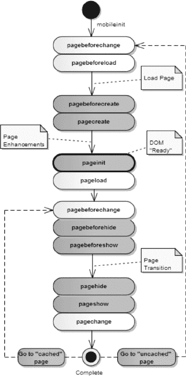

**图 8-1。** *jQuery 手机页面事件*

现在我们已经看到了页面变更生命周期中页面事件的触发顺序，让我们来看看每个特定事件的详细信息。

#### 事件概述

*   **mobileinit**

    当 jQuery Mobile 初始化时，它会在`document`对象上触发一个`mobileinit`事件。您可以绑定到`mobileinit`事件，并将覆盖应用到 jQuery Mobile 的默认配置设置。关于绑定到`mobileinit`事件的例子，请参考“配置 jQuery Mobile”一节。

##### 页面变更事件

当您导航到另一个页面时，文档上会自动触发页面更改事件。在内部，当调用`$.mobile.changePage`方法时，这些事件被触发。在此过程中，将触发两个事件。第一个触发的事件是`pagebeforechange.`。下一个触发的事件取决于页面更改的状态。当页面更改成功时，将触发 page change 事件，如果页面更改失败，将触发`pagechangefailed`事件。

*   **pagebeforechange**

    这是页面更改期间触发的第一个事件。向该事件的回调传递两个参数。第一个参数是事件，第二个参数是数据对象。您可以通过调用事件上的`preventDefault`来取消页面更改。此外，您可以通过检查和更新数据对象来覆盖页面更改。作为第二个参数传递的数据对象包含以下属性:

    *   `toPage`(字符串)。文件 URL 或 jQuery 集合对象。这与传递给`$.mobile.changePage().`的参数相同
    *   `options`(对象)。这些是通过`to $.mobile.changePage`的相同选项。

    **举例:**

    `$( document ).bind( "pagebeforechange", function( e, data ) {
        console.log(“Change page starting...”);

        // Get the page
        var toPage = data.toPage;

        // Get the page options
        var options = data.options;

        // Inspect toPage or override options (redirect)…

        // Prevent a page change
        e.preventDefault();
    });`
*   **pagechange**

    这是页面更改成功后触发的最后一个事件。向该事件的回调传递两个参数。第一个参数是事件，第二个参数是数据对象。作为第二个参数传递的数据对象包含以下属性:

    *   `toPage`(字符串)。文件 URL 或 jQuery 集合对象。这与传递给`$.mobile.changePage()`的参数相同。
    *   `options` (object). These are the same options that were passed to `$.mobile.changePage.`

        **举例:**

        `$( document ).bind( "pagechange", function( e, data ){
            console.log(“Change page successfully completed...”);
            var toPage = data.toPage;
            var options = data.options;
        });`
*   **pagechangefailed**

    如果页面更改失败，将触发此事件。这个事件的回调传递了两个参数。第一个参数是事件，第二个参数是数据对象。作为第二个参数传递的数据对象包含以下属性:

    *   `toPage`(字符串)。文件 URL 或 jQuery 集合对象。这与传递给`$.mobile.changePage().`的参数相同
    *   `options` (object). These are the same options that were passed to `$.mobile.changePage`.

        **举例:**

        `$( document ).bind( "pagechangefailed", function( e, data ){
            console.log(“Page change failed...”);
        });`

##### 页面加载事件

当框架将页面加载到 DOM 中时，页面加载事件在文档上被触发。以编程方式，当调用`$.mobile.loadPage`时，该事件被触发。在这个过程中，loadPage()将触发两个事件。第一个是`pagebeforeload`，第二个事件是成功(`pageload`)或失败(`pageloadfailed`)事件。

*   **pagebeforeload**

    这是页面加载期间触发的第一个事件。向该事件的回调传递两个参数。第一个参数是事件，第二个参数是数据对象。如果您愿意，可以手动处理加载逻辑。为此，您必须在事件上调用`preventDefault()`，并在数据对象中包含的延迟对象引用上调用`resolve()`或`reject()`。作为第二个参数传递的数据对象包含以下属性:

    *   `url`(字符串)。发送给`$.mobile.loadPage()`的相对 URL。
    *   `absUrl`(字符串)。URL 的绝对引用。
    *   `dataUrl`(字符串)。实际存储在页面的 data-url 属性中的 URL 版本。此 URL 显示在浏览器的位置字段中。
    *   `deferred`(对象)。调用`preventDefault()`来手动处理页面加载的回调函数必须调用这个对象上的`resolve()`或`reject()`，这样`changePage()`请求才能继续处理。
    *   `options` (object). This is the same options argument that was passed to `$.mobile.loadPage()`.

        **举例:**

        `$( document ).bind( "pagebeforeload", function( e, data ){
            console.log("Page load starting…");

            // Let the framework know we're manually loading the page
            e.preventDefault();

            // Manually load the document and insert it into the DOM
            var response = manuallyLoadPage();

            if (response.status = "success") {
              // Call resolve passing in the url, options, and jQuery
              // collection object containing the DOM element for the page
              data.deferred.resolve( data.absUrl, data.options, response.page);
            } else {
              // The load failed, call reject
              data.deferred.reject( data.absUrl, data.options );
            }
        });`
*   **pageload**

    该事件在页面成功加载到 DOM 后触发。向该事件的回调传递两个参数。第一个是事件，第二个是数据对象。作为第二个参数传递的数据对象包含以下属性:

    *   `url`(弦)。发送给`$.mobile.loadPage`的相对 URL。
    *   `absUrl`(字符串)。URL 的绝对引用。
    *   `dataUrl`(字符串)。实际存储在页面的 data-url 属性中的 URL 版本。此 URL 显示在浏览器的位置字段中。
    *   `options` (object). This is the same options argument that was passed to `$.mobile.loadPage()`.

        **举例:**

        `$( document ).bind( "pageload", function( e, data ){
          console.log("Page successfully loaded into DOM...");
        });`
*   **页面加载失败**
*   This event is triggered if the page load fails. During this process, the framework will display a page failed message and call `reject()` on the deferred object. Callbacks can prevent this default behavior from executing by calling `preventDefault()` on the event.

    **举例:**

    `$( document ).bind( "pageloadfailed", function( e, data ){
      console.log("Page load failed...");
    });`

##### 页面初始化事件

在 jQuery Mobile 增强页面之前和之后，页面初始化事件都会在页面上触发。您可以绑定到这些事件，在框架增强页面之前预解析标记，或者在之后设置 DOM ready 事件处理程序。这些事件在页面的生命周期中只触发一次。

*   **pagebeforecreate**

    在页面更改期间初始化页面时触发。此事件发生在页面容器插入 DOM 之后，但在页面增强之前。这是在框架增强页面之前预解析标记的首选位置。例如，在这种情况下，您可以动态地创建和添加新的页面小部件，或者修改现有的数据属性。

    **举例:**

    `$( "#to-page-id" ).live( "pagebeforecreate", function(){
    console.log( "Pre-parse the markup before the framework enhances the widgets" );
    });`
*   **pagecreate**

    在页面更改期间正在初始化的页面上触发。这是框架初始化所有页面插件时触发的事件。如果您创建自定义页面插件，这是初始化它们的首选位置。

    **举例:**

    `$( "#to-page-id" ).live( "pagecreate", function(){
        console.log("Page plugins are being initialized...");

        // Initialize custom plugins
        (":jqmData(role='my-plugin')" ).myPlugin();
    });`
*   **pageinit**

    在增强完成后正在初始化的页面上触发。页面现在处于 DOM 就绪状态。

    **举例:**

    `$( "#to-page-id" ).live( "pageinit", function(){
        console.log(“The page has been enhanced...”);
        // Attach event handlers or run other jQuery code...
    });`

##### 页面过渡事件

在页面转换期间，页面转换事件在“从”和“到”页面上触发。您可以绑定到这些事件来观察页面何时显示或从视图中移除。

*   **pagebeforehide**

    过渡开始时在“从”页面触发。该事件发生在`pagebeforeshow`事件之前。仅当页面更改请求有关联的“发件人”页面时，才会触发此事件。向该事件的回调传递两个参数。第一个参数是事件，第二个参数是数据对象。作为第二个参数传递的数据对象包含以下属性:

    *   `nextPage`(对象)。一个 jQuery 集合对象，包含我们要转换到的页面元素。

    **举例:**

    `$( "#from-page-id" ).live( "pagebeforehide", function( e, data ){
      console.log( "The page transition is just starting..." );
    });`
*   **pagebeforeshow**

    在页面增强之后，页面转换开始之前，在“到”页面上触发。向该事件的回调传递两个参数。第一个参数是事件，第二个参数是数据对象。作为第二个参数传递的数据对象包含以下属性:

    *   `prevPage` (object). A jQuery collection object containing the page element we are transitioning from.

        **举例:**

        `$( "#to-page-id" ).live( "pagebeforeshow", function( e, data ){
          console.log( "The page transition is just starting..." );
        });`
*   **pagehide**

    在转换完成之后和`pageshow`事件之前，在“from”页面上触发。仅当页面更改请求有关联的“发件人”页面时，才会触发此事件。向该事件的回调传递两个参数。第一个参数是事件，第二个参数是数据对象。作为第二个参数传递的数据对象包含以下属性:

    *   `nextPage` (object). A jQuery collection object containing the page element we are transitioning to.

        **举例:**

        `$( "#from-page-id" ).live( "pagehide", function( e, data ){
          console.log( "The page transition is complete!" );
        });`
*   **pageshow**

    在转换完成和隐藏“从”页面后，在“到”页面上触发。向该事件的回调传递两个参数。第一个参数是事件，第二个参数是数据对象。作为第二个参数传递的数据对象包含以下属性:

    *   `prevPage` (object). A jQuery collection object containing the page element we are transitioning from.

        **举例:**

        `$( "#to-page-id" ).live( "pageshow", function( e, data ){
          console.log( "The page transition is complete!" );
        });`

**提示:**jQuery Mobile 团队已经创建了一个有用的书签小程序，允许您从浏览器控制台查看页面事件历史(参见[图 8-2](#fig_8_2) )。当您浏览 jQuery Mobile 应用时，您将能够通过页面、URL 和时间戳查看事件的历史。要安装，请转到 jQuery Mobile event logger 页面 [4](#CHP-8-FN-4) 并按照它们的说明安装书签。

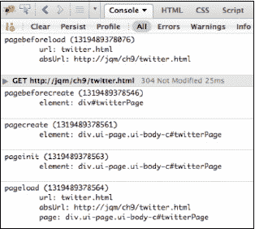

**图 8-2。** *页面事件记录器控制台*

#### 触发事件

在构建动态页面时，触发 jQuery Mobile页面事件会很有帮助。例如，如果您向页面添加几个新组件，您可以调用 create 事件来一次增强页面上的所有新部件。

*   **trigger(“create”)**

    我们可以触发这个事件来自动增强页面上的所有新元素。该事件在页面容器上触发。

    **举例:**

    `// Add two new buttons to the page
    $( '<button id="b2">Button2</button>' ).insertAfter( "#b1" );
    $( '<button id="b3">Button3</button>' ).insertAfter( "#b2" );

    // Enhance the new buttons on the page
    $.mobile.pageContainer.trigger( "create" );`

4 见`[http://jquerymobile.com/test/tools/log-page-events.html](http://jquerymobile.com/test/tools/log-page-events.html).`

### 属性

jQuery Mobile 还公开了一组公共可用的属性，因此您不必编写自己的 jQuery 选择器来访问公共组件。

*   **$.mobile.activePage**

    获取当前活动或可见的页面或对话框元素。活动页面被分配了由`$.mobile.activePageClass`指定的 CSS 类。

*   **$.mobile.firstPage**

    这是页面容器(`$.mobile.pageContainer`)中定义的第一个页面。例如，当不存在`location.hash`值或`$.mobile.hashListeningEnabled`被禁用时，将显示`$.mobile.firstPage`。例如，在多页文档中，默认情况下最初会显示`$.mobile.firstPage`。

*   **$.mobile.pageContainer**

    所有页面所在的 HTML 容器。在 jQuery Mobile 中，`body`元素是包含所有页面的容器。所有 Ajax 加载的页面和多页面文档的所有内部页面都将存在于页面容器中。

### 数据属性

jQuery Mobile 的数据属性提供了用简单的 HTML 标记增强和配置移动应用的能力。所有数据属性的完整列表，按字母顺序排列，说明和示例如下(见[表 8-1](#tab_8_1) )。

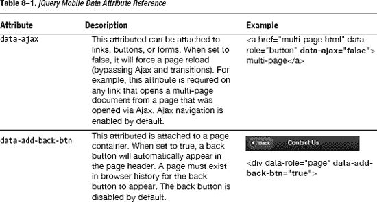

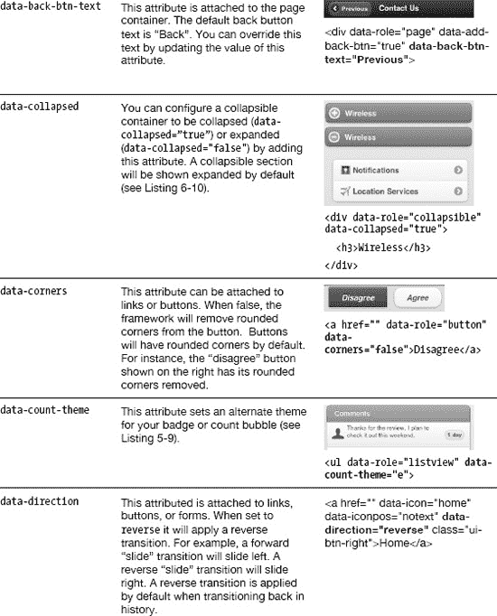

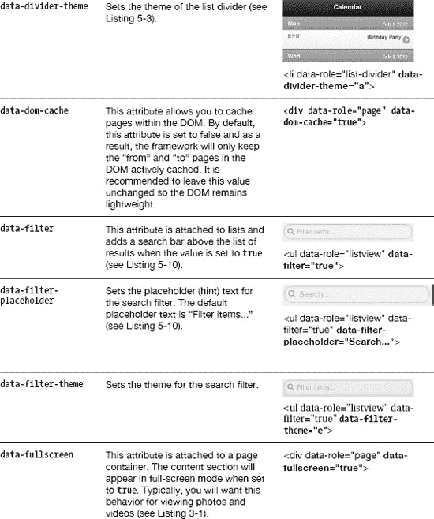

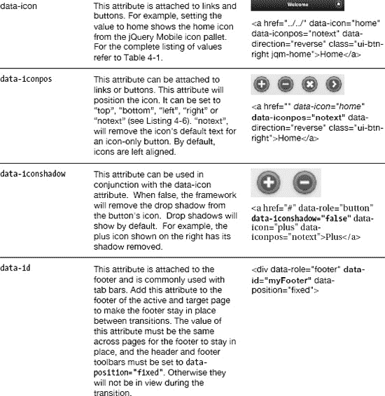

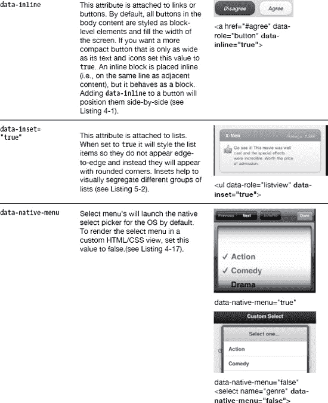

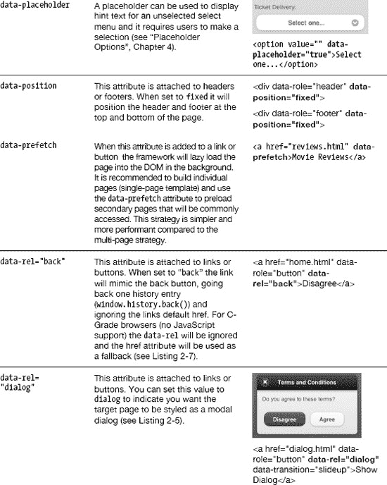

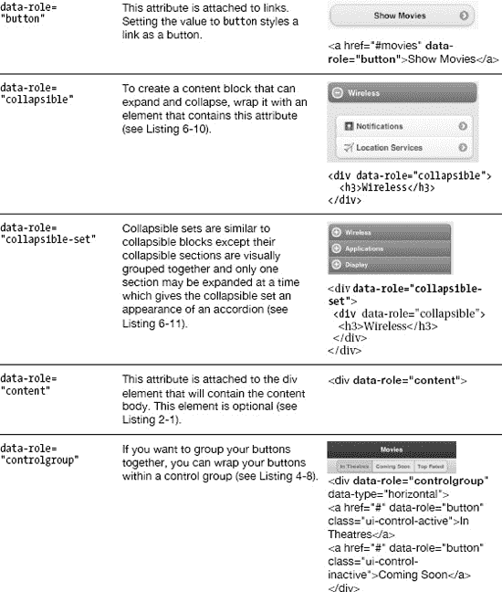

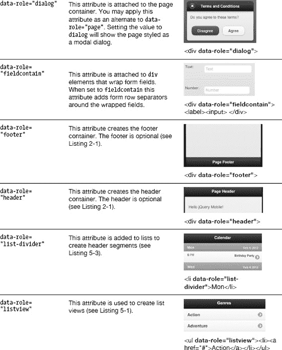

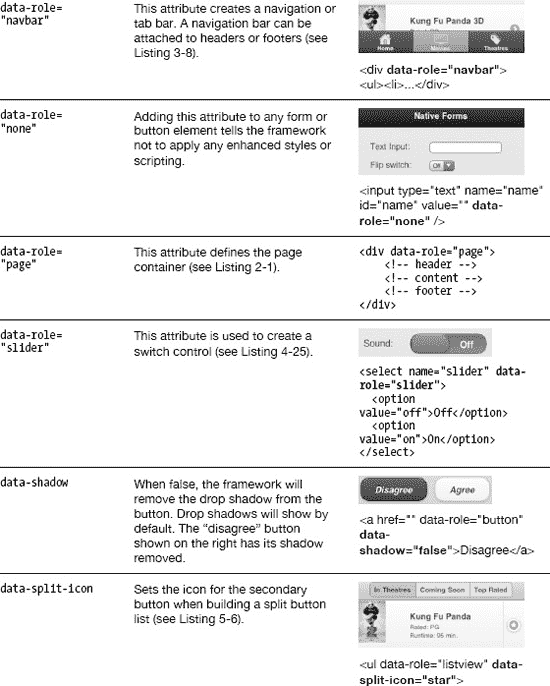

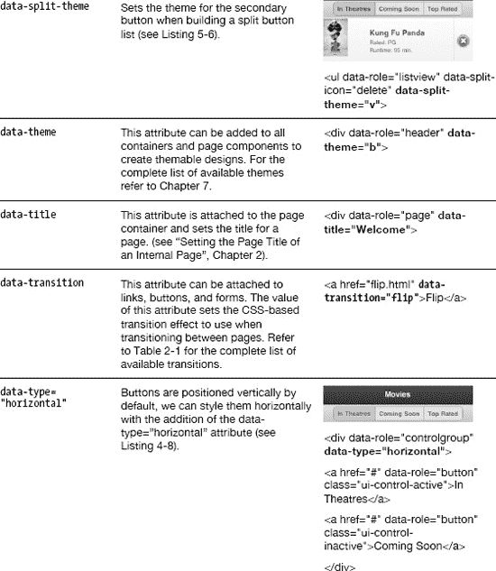

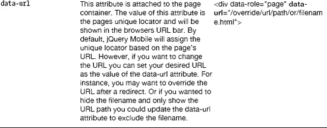

### 总结

在本章中，我们看到了如何配置 jQuery Mobile，并回顾了许多可用于构建更多动态页面的常见 API 特性。无论您是需要全局更改默认转换，还是希望在所有页面上显示后退按钮，jQuery Mobile 都允许我们重新配置许多常见设置。我们还回顾了 jQuery Mobile 公开发布的许多流行的方法、事件和属性。当您需要以编程方式更新移动 Web 应用时，这些 API 特性非常有用。最后，我们看到了所有 jQuery Mobile数据属性的完整列表。希望这个列表可以为您在快节奏的 jQuery Mobile项目中工作提供一个快速的参考。每个属性包括一个简短的描述，例子和数字。

在下一章中，我们将深入探讨如何有效地使用服务。我们将看到如何将 jQuery Mobile页面与客户端和服务器端集成解决方案集成。