# 第六章 WordPress 和 jQuery 的用户界面

我们现在准备看一看 jQuery 最流行的插件：UI。UI 当然代表**用户界面**。jQueryUI 插件接受了许多开发人员已经通过 jQuery 简化的最流行的任务，并且使它们更加简单。我知道，很难想象它会变得更容易，但这正是这个插件所做的。最重要的是，虽然增强的效果很好，但 UI 插件提供了界面小部件和一种简单的方式来设置它们的样式或“主题”，而无需编写特定的界面元素，如选项卡、对话框等。

在本章中，我们将：

*   看看 UI 插件以及如何快速入门
*   了解如何将 jQueryUI 小部件应用到我们的 WordPress 站点，使其更直观、更容易理解内容，并鼓励用户采取行动
*   了解如何使用常见的 WordPress 功能实现流行的 UI 功能和小部件

让我们开始吧。

# 了解 jQuery 的 UI 插件

您可以前往[浏览 jQuery UI 插件 http://www.jqueryui.com](http://www.jqueryui.com) 。

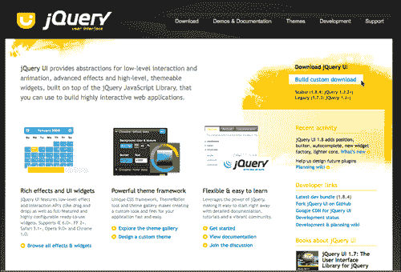

UI 插件提供了一组标准化的小部件、交互和效果。让我们仔细看看每一种产品。

## 小部件

jQuery 中的“widget”一词与 WordPress widget 有点不同，后者是一个小插件，设计用于很好地放置在主题的侧栏中。在 jQuery 的 UI 插件中，小部件描述了一组功能齐全的用户界面控件，这些控件通常是项目中需要的，由 jQuery 开发人员创建。UI 小部件节省了 jQuery 开发人员编写 jQuery 语句和将函数链接在一起以创建相同的界面和效果的大量时间。以下是界面小部件的 jQuery UI 提供的信息：

*   **手风琴：**此小部件通过单击每个部分的标题来扩展和折叠分解为逻辑部分的内容。在任何给定时间只能打开一个分区。
*   **自动完成**（1.8+）：这是版本 1.8 中提供的新功能。**自动完成**小部件在您输入字段时提供建议。建议源作为基本 JavaScript 数组提供。
*   **按钮**（1.8+）：1.8 新增了**按钮**小部件。这使您可以使用不同类型的标记，并将 UI 的按钮样式和功能应用于它。
*   **日期选择器：**可以将**日期选择器**小部件应用于标准表单输入字段。聚焦于输入字段在一个小覆盖中打开一个交互式日历。
*   **对话框：**此小部件是位于页面内的覆盖。它有一个标题栏和一个内容区域，默认情况下，可以使用“x”图标或通过传递给它的其他按钮参数来移动、调整大小和关闭它。
*   **Progressbar:**该**Progressbar**小部件旨在简单地显示通过值参数传递给它的进程的当前完成百分比。默认情况下，它会缩放以适合其父容器。
*   **滑块：**jQuery UI**滑块**小部件将空的`div`标记等对象转换为滑块。有多种选项，例如多个句柄和范围，可以传递给其他对象和函数。可以使用鼠标或箭头键更改滑块的位置。
*   **制表符：**使用**制表符**小部件将内容分成多个部分，通过单击制表符标题可以交换内容，以节省空间，就像手风琴一样。

## 相互作用

jQuery UI 交互收集了开发人员需要创建的更为常见的复杂 jQuery 行为（通常用于项目），并将其打包成方便易用的函数，如下所示：

*   **可拖动：**此交互使所选元素可通过鼠标拖动。
*   **可拖放：**此交互与可拖放元素一起工作，并使所选元素可拖放（意味着它们接受可拖放元素的拖放）。
*   **可调整大小：**此交互通过向对象添加可视“句柄”来调整选定元素的大小。可以指定一个或多个控制柄以及最小和最大宽度和高度。
*   **可选：**此交互允许通过在元素上拖动“套索”或框来选择元素。
*   **可排序：**通过鼠标拖动，可对所选元素进行排序。

## 效果

主要功能是`.effect()`功能，但 jQuery 中可用的标准动画功能和快捷方式通过 jQuery UI 插件的“效果核心”得到了增强。这个核心还包括色彩，动画的能力，还包括额外的放松选项；因此，如果你把它包含到你的项目中，你就不需要我们以前使用过的颜色或轻松的插件。jQuery 效应包括：

*   **效果：**此功能允许您将一组 15 的效果分配给任何对象。
*   **显示：**此增强显示方法可选择接受 jQuery UI 高级效果。
*   **隐藏：**此增强的隐藏方法可以选择接受 jQuery UI 高级效果。
*   **切换：**此增强切换方法可选择接受 jQuery UI 高级效果。
*   **彩色动画：**我们在[第 5 章](05.html "Chapter 5. jQuery Animation within WordPress")中学习的彩色插件，WordPress 中的*jQuery 动画，包含在 jQuery UI 特效核心中。同样，它只是简单地扩展了`animate`函数，以便能够为颜色设置动画。*
*   **添加类：**将指定类添加到每个匹配元素集中，并在状态之间进行可选转换。
*   **移除类：**从每个匹配元素集中移除所有或指定的类，并在状态之间进行可选转换。
*   **切换类：**如果指定的类不存在，则添加该类；如果指定的类存在，则使用可选转换删除该类。
*   **开关类：**使用可选转换，从第一个参数中定义的类切换到第二个参数中定义的类。

## 捆绑在 WordPress 中的 jQuery UI 插件版本

大多数 jQueryUI 插件的主要**小部件**和**交互**核心都可以捆绑到 WordPress 安装中。如果您使用的是 WordPress 2.9.2，那么您已经绑定了 jQuery 1.3.2，UI 插件核心是 1.7.1，您还可以使用以下 jQuery UI 小部件和交互：**对话框、可拖动、可拖放、可调整大小、可选择、可排序**和**选项卡**。

如果您使用的是 WordPress 3.0+，那么您已经将 jQuery 1.4.2 与安装捆绑在一起，并将 UI core 1.7.3 捆绑在一起。同样，这与上一段中提到的小部件和交互相同。

如果您想利用 UI 插件的*效果*，或者，如果您使用的是 jQuery 1.4.2，并且希望利用 UI 插件的 1.8+功能，那么您需要通过自己从 jQuery 的 UI 站点或 Google 的 CDN 下载，单独包含 UI 插件版本 1.8+的副本。

## 从 jQuery 的 UI 站点进行挑选

从 jQuery 的 UI 站点下载的好处是，您可以只挑选项目所需的内容。如果您进入[的下载页面 http://www.jqueryui.com/download](http://www.jqueryui.com/download) 右侧，您可以选择**1.7.3**或**1.8.4**版本，点击**下载**按钮；这会给你一切。


出于开发目的，您可以下载整个内容。ZIP 文件超过 4MB，但其中包括一个开发包目录，里面装满了示例和文档；所有这些都不会加载到您的项目中。

选择所有选项后，您将加载到 WordPress 项目中的实际 UI 插件的`.js`文件约为 200 KB，您可以根据您从网站选择的内容或自己的滚动方式，为 CSS 主题向项目中再添加约 100 KB。如果您确切地知道您正在使用的功能，那么只需选择您想要使用的功能，就可以减少一些 KB。

下载页面非常棒，因为它不允许您取消选择任何依赖于您选择的另一个功能以及您希望使用的功能的内容。这是用于选择所需内容的警报的屏幕截图：

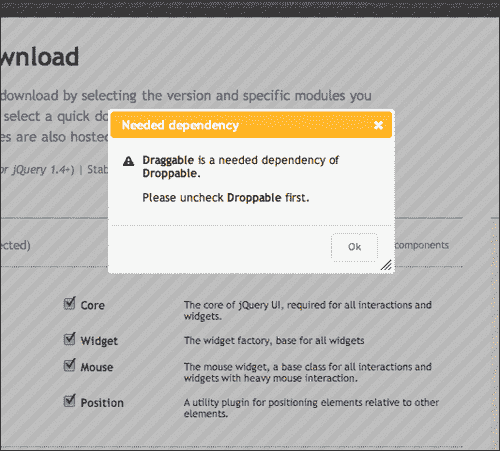

### 提示

**确保为您的 jQuery 版本下载正确的 UI 插件版本！**

如果您的项目使用的是 WordPress 2.9.2，那么捆绑版本是 jQuery 1.3.2，因此您需要确保下载 UI 插件版本 1.7.3。如果您使用的是 Google CDN 或您自己的 jQuery 下载版本 1.4+，则可以下载并使用 jQuery UI 插件版本 1.8+。

## 让它看起来正确：简单的 UI 主题化

无论您从何处获取 UI 插件、您自己的下载、Google CDN 或 WordPress 捆绑 UI 选项，您都需要为其提供自己的风格。你可以在你的项目中包含许多伟大主题中的一个，也可以轻松地“滚动”你自己的主题，以最好地匹配你的网站设计。

在 jQuery 的 UI 站点上，从导航栏中选择**主题**，或转到：[http://jqueryui.com/themeroller/](http://jqueryui.com/themeroller/) 。

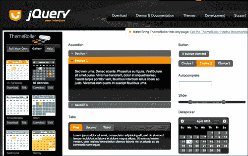

您可以直接调整结果主题的 CSS 样式表，或者只需在 WordPress 样式表的之前加载 jQueryUI 样式表*。在 Firefox 中使用 WebDeveloper 的**工具栏**或**Firebug**，很容易看到用户界面正在生成什么样式，并在主 WordPress 样式表中覆盖它们。*

## 将 jQueryUI 插件功能添加到 WordPress 站点

到目前为止，您应该已经非常熟悉将 jQuery 插件包含到 WordPress 站点中。因为 UI 插件的*特定组件*可以在 WordPress 中捆绑使用，我们将以几种不同的方式将它们引入到您的项目中。

### 从 WordPress 的捆绑包中包括 jQuery 的 UI

捆绑到 WordPress 中的 jQuery 的 UI 插件被分离成单独的`.js`文件。您必须首先在项目中注册 UI 核心文件，以及希望包含在项目中的每个小部件或特定交互。同样，唯一可用的小部件和交互是：**对话框、可拖动、可拖放、可调整大小、可选择、可排序**和**选项卡**。

要在 WordPress 主题中注册 core，请执行以下操作：

```js
...
<?php
if (!is_admin()) {//checking for is_admin makes sure that the UI doesn't load in admin
//adding array('jquery') means the ui-core requires jquery
wp_enqueue_script("jquery-ui-core", array('jquery'));
}//end of is_admin
?>
...

```

然后，注册所需的特定小部件：

```js
...
<?php
if (!is_admin()) {//checking for is_admin makes sure that the UI doesn't load in admin
//requires jquery AND the ui-core
wp_enqueue_script("jquery-ui-dialog",
array('jquery','jquery-ui-core'));
}//end of is_admin()
?>
...

```

对于其他小部件，只需重复上述代码即可。小部件`.js`文件名如下：

```js
jquery-ui-tabs
jquery-ui-sortable
jquery-ui-draggable
jquery-ui-droppable
jquery-ui-selectable
jquery-ui-resizable
jquery-ui-dialog

```

### 注

同样，WordPress 捆绑 Java 脚本的完整列表可以在 codex 中找到：[http://codex.wordpress.org/Function_Reference/wp_enqueue_script](http://codex.wordpress.org/Function_Reference/wp_enqueue_script) 。

### 包括来自谷歌 CDN 的内容

您可以包含 jQuery 的 UI 插件，这与通过 Google CDN 包含 jQuery 非常相似。UI 插件路径为：[http://ajax.googleapis.com/ajax/libs/jqueryui/1.8.0/jquery-ui.min.js](http://ajax.googleapis.com/ajax/libs/jqueryui/1.8.0/jquery-ui.min.js) 。请注意此处的粗体版本号。您可以将其更改为所需的 UI 插件版本。如果您使用的是 jQuery 版本 1.3.2，请确保以 1.7.2 为目标。如果您使用的是 1.4.2，那么您可以将目标定为 1.8.0。

让我们重新介绍一下如何使用`wp_register_script`从谷歌 CDN 的捆绑包中调用脚本：

```js
...
if (!is_admin()) {//checking for is_admin makes sure that UI doesn't load in admin
wp_deregister_script( 'jquery-ui-core' );
wp_register_script( 'jquery-ui-core', 'http://ajax.googleapis.com/ajax/libs/jqueryui/1.8.0/jquery-ui.min.js');
/*this brings over the entire 1.8 core and all widgets, interactions and effects from the Google CDN*/
}//end of is_admin
...

```

您应该注意，尽管我们正在注销捆绑的`jquery-ui-core`文件，但我们从 Google CDN 加载的是*完整的*jQuery UI 插件，可以访问其所有小部件、交互和效果。在您的代码中添加注释可能是明智的，这样其他开发人员就知道他们不需要将包中的单个小部件和交互注册到项目中。

### 从您的主题或插件目录加载您自己的自定义下载

如果您已将 UI 包含到主题或插件目录中，您将再次使用`wp_enqueue_script`，使用以下方法加载它：

包括来自主题的 UI 插件的本地副本：

```js
...
if (!is_admin()) {//checking for is_admin() makes sure that UI doesn't load in admin
wp_enqueue_script('jquery-ui-1.8.custom.min', get_bloginfo('stylesheet_directory') . '/js/jquery-ui-1.8.custom.min.js', array('jquery'), '20100410' );
}//end of is_admin()
...

```

同样，通过在脚本末尾添加`array('jquery')`，这让 WordPress 知道 jQuery 是必需的，以防它尚未注册。

要包含来自 WordPress 插件的 UI 插件的本地副本，请使用如下的`wp_register_script`功能：

```js
...
function myPluginFunction(){
if (!is_admin()) {//checking for is_admin makes sure that the UI doesn't load in admin
wp_register_script('jquery-ui-1.8.custom.min',
WP_PLUGIN_URL . '/js/jquery-ui-1.8.custom.min.js');
}//end of is_admin
}//end of myPluginFunction()
add_action('wp_head', 'myPluginFunction');
...

```

### 别忘了你的风格！

无论您从哪里获取 UI 插件，WordPress、Google 的 CDN 或您自己的下载，您都需要为 UI 插件包含 CSS 样式。如果你之前没有玩过主题滚轴，现在就回去玩吧。选择一个主题，或者使用主题滚动条修改其中一个主题，或者从头开始滚动自己的主题，以创建与站点现有设计非常匹配的小部件。

完成后，您可以将选定的主题或自定义滚动主题放入主题或插件目录中。确保包含主题附带的图像目录。然后，您可以使用直接链接将其包含到您的`header.php`主题文件中，或者使用我们之前使用的`wp_enque_style`功能通过`functions.php`页面将其包含到插件或您的主题中：

要在 WordPress 主题中直接包含 UI 主题，请使用以下链接：

```js
...
<link rel="stylesheet" href="<?php bloginfo('stylesheet_directory'); ?>/js/smoothness/jquery-ui-1.8.custom.css" type="text/css" media="screen" />
...

```

使用`wp_enqueue_style:`从主题的`functions.php`页面将 UI 主题包含到 WordPress 主题中

```js
...
<?php
function addUIstyles(){
wp_enqueue_style('ui-theme', bloginfo('stylesheet_directory')
'/js/smoothness/jquery-ui-1.8.custom.css', array('style'), '1.0', 'screen');
}
add_action('init', 'addUIstyles');
?>
...

```

使用`wp_enqueue_style`将 UI 主题包含到 WordPress 插件中，类似于上面的示例，但一定要使用`WP_PLUGIN_DIR`来定位插件目录。

```js
...
wp_enqueue_style('ui-theme', WP_PLUGIN_DIR .
.'/js/smoothness/jquery-ui-1.8.custom.css',
array('style'), '1.0', 'screen');
...

```

# 使用 jQuery UI 增强效果

你可能会认为，在花时间选择一个主题或推出我们自己的主题后，我们会开始使用小部件。我们将！但首先，尽管我们对[第 5 章](05.html "Chapter 5. jQuery Animation within WordPress")、*WordPress*中的 jQuery 动画（尽管，如果您跳过了，请不要担心）中的动画和交互仍然记忆犹新，但您会有兴趣了解到，设置这些动画和效果与设置大多数动画和效果一样简单，使用 UI 插件可以使事情变得更加时髦。

首先，在撰写本文时，这些效果*并未与 WordPress*捆绑在一起。因此，为了使用这些 UI 效果，您需要通过自己的下载或从 Google CDN 中包含 UI 插件。

## 效果变得简单

UI 插件所做的是添加一个名为`.effect()`的新功能，提供 15 种左右的新的、流畅的动画效果。最值得注意的是，`blind`，它像盲人一样卷起东西；`shake`，增加了一点震动；还有`explode`，它成功地将物体“打碎”，并向多个方向喷射出碎片。

当我们将鼠标移到标题上时，让我们将`shake`效果应用到我们帖子中的标题上。除了在我们的 WordPress 项目中注册和/或包含必要的 jQuery 和 jQuery UI 插件文件外，您还应该在主题中包含一个`custom-jquery.js`文件。完成此操作后，请包含以下代码：

```js
jQuery(function(){
jQuery(".post h2").hover(function(){
jQuery(this).effect('shake', 200);
}, function(){
jQuery(this).effect('shake', 200);
});
});

```

您可以（某种程度上）在以下屏幕截图中看到这种效果：


## 放松也同样容易

在`.effects`功能之外，UI 插件*扩展了*jQuery 已有的`.animate`功能以及`.hide, .show, .toggle, .addClass, .removeClass`、`.toggleClass`等快捷功能。通过*Robert Penner*引入的大放松插件，我们在[第 5 章](05.html "Chapter 5. jQuery Animation within WordPress")中看到了使用 WordPress 制作的*jQuery 动画。因此，如果您正在使用 jQueryUI 插件，并且已经在下载中包含了 effects 核心，那么就没有必要在项目中单独包含 Easing 插件。*

## 带 jQuery UI 的彩色动画

除了包含的 Easing 插件外，jqueryui 还内置了彩色动画插件。在[第 5 章](05.html "Chapter 5. jQuery Animation within WordPress")中，WordPress 中的*jQuery 动画中，我们使用了与 WordPress 安装捆绑在一起的颜色插件。然而，如果你打算使用下载版本或谷歌 CDN 版本的 UI 插件，就像使用 Easing 插件一样，你只需将其单独使用或从 WordPress 捆绑包中注册即可。*

为了在我们的项目中测试它，该项目没有注册颜色插件，但引用了我们下载的 UI 插件版本 1.8，让我们使用应用的`easeOutBounce`放松选项设置标题文本的颜色动画：

```js
...
jQuery(".post h2").hover(function(){
jQuery(this).animate({'backgroundColor':'#ccccff'}, 2000,
'easeOutBack');
}, function(){
jQuery(this).animate({'backgroundColor': '#999999'}, 2000,
'easeOutBack');
});
...

```

然后，它将动画设置为浅蓝色，如下一个屏幕截图所示：


然后，回到灰色：


您已经注意到，在 jQueryUI 插件的 effects 核心中使用彩色动画和放松功能与将其用作单独的彩色动画或放松插件没有什么不同。同样，除了哪个版本（独立插件或 UI 插件）对 WordPress 项目更方便、更有用之外，应该没有任何区别。

# 增强 WordPress 网站的用户界面

我们可以看到 jQueryUI.com 上的 UI 演示看起来确实很酷，但是现在我们已经将 UI 插件加载到了我们的项目中，我们如何真正将这些功能应用到 WordPress 项目中呢？不同类型的界面可以帮助我们更容易地组织和关联各种类型的信息，并减少混淆。WordPress 的主题 API 允许在站点设计中以逻辑块的形式显示各种类型的信息，主要是帖子和列表。让我们看看是否可以通过 UI 功能增强这些信息。

我们已经看到 UI 插件提供了：手风琴、选项卡、对话框、日期选择器，以及实现拖放和排序的简单方法。此外，如果您使用的是最新版本，1.8 或更高版本（如本章中的示例），则有一些很酷的小部件，如**自动完成**和**按钮**。让我们拿起另一个假设的客户端，看看一些小的界面增强如何帮助他们的站点。

## 项目：将帖子变成标签

你可能已经看到最近标签在网站上被越来越多地使用。在站点中使用选项卡的主要原因是，它允许用户轻松查看一组相关内容，一次一块（这就是为什么“选项卡式”站点导航也很流行的原因）。作为设计师，它还允许您将内容包含到一个方便的模块中，从而节省宝贵的屏幕空间。

在我们的[第 5 章](05.html "Chapter 5. jQuery Animation within WordPress")、*jQuery 动画和 WordPress*中，我们学习了如何堆叠粘性帖子，使其以幻灯片放映的方式旋转。虽然动画帖子可以很好地处理您希望确保的无关内容，但每个人都可以看到，将内容加载到选项卡意味着内容在某种程度上是相关的，是的，您还希望节省空间，也许可以在折叠上方获取信息，以便用户更容易接受。

你最新的假设客户有三条与了解他们公司相关的信息。这些内容变化不大，但他希望该网站的用户能够获得信息的概览，并可以选择提前下载白皮书，而无需滚动。

客户端的站点上已经有此内容。这些职位被分配到一个独特的类别，称为**我们的结构**。这些帖子到现在已经很老了，甚至没有出现在网站的主页上，因此客户端已经手动链接到网站其他页面的帖子的 perma 链接。

首先，我们决定利用 WordPress 主题的一点帮助对我们有利。

### 在 WordPress 主题中设置自定义循环

让我们从进入客户主题开始，设置一个循环，只从**我们的结构**类别中提取。然后，使用 jQueryUI，我们将在一组选项卡中显示这些帖子，这些选项卡大部分是“在折叠上方”可查看的，以确保网站访问者提前获得组织最重要信息的概述，一般帖子项目将在下方流动。

首先，在`index.php`页面中，我们将在现有`loop.php`包含的上方创建一个新循环，该循环仅显示**我们的结构**类别。在我们这样做之前，我们将前往 jQueryUI 站点，看看选项卡如何设置的演示：[http://jqueryui.com/demos/tabs/](http://jqueryui.com/demos/tabs/) 。

基本上，我们看到演示选项卡有一个列出标题的`ul`，包装在指向内容`div`的`id`锚的`href`调用中。这意味着我们的主题实际上需要*两个*自定义 WordPress 循环来容纳这个小部件。

我们将在我们的`index.php`模板文件中设置它们，就在我们的主要内容`loop.php`的正上方，包括中我们正在使用的主题的`#content`div，这是默认主题。第一个循环将使用`ul`标题列表设置我们的自定义`#ourStructure`div：

```js
...
<div id="ourStructure">
<ul>
<?php//start custom loop
//get posts in the proper category
$postList = get_posts('category=4');
foreach($postList as $post):
setup_postdata($post);
?>
//set up a list item with a unique anchor link
<li>
<a href="#post-<?php the_ID(); ?>">
<?php the_title(); ?></a>
</li>
<?php endforeach; ?>
</ul>
<!--//second loop goes here-->
</div><!--//end of ourStructure-->
...

```

接下来，在前面的循环中，但仍然在`#ourStructure`div 中，我们将再次运行循环，现在将重点放在文章的标题和内容上，如下所示：

```js
...
<!--//second loop goes here-->
<?php
//again, call correct category
$postContent = get_posts('category=4');
foreach($postContent as $post):
setup_postdata($post);
?>
//assign a unique ID to div
<div id="post-<?php the_ID(); ?>">
<h2><?php the_title(); ?></h2>
//add content:
<div class="entry">
<?php the_content('Read the rest of this entry &raquo;'); ?>
</div>
</div>
<?php endforeach; ?>
</div><!--//end of ourStructure-->
...

```

这给了我们一个看起来像下一个截图的结果。虽然不是非常漂亮，但它是功能性的，而且它肯定会获得重要的信息，并允许用户链接到`id`实例的锚名称。

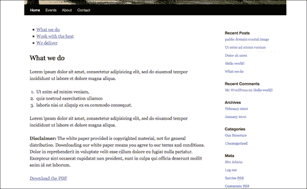

然后，我们将使用 jQuery 的 UI 选项卡来增强该标记，例如，通过针对`#ourStructure`div，我们在`custom.js`文件中设置了以下 jQuery 语句：

```js
...
jQuery("#ourStructure").tabs();
...

```

对很难相信，但由于 WordPress 的灵活性和我们为主题所做的工作，这就是我们所需要的 jQuery！


不错！现在使用我们选择的 jQueryUI 主题“平滑度”将内容放在最上面，以最好地补充我们的 WordPress 主题（同样，我们使用的是本书编写时 3.0 附带的默认 WordPress 主题）。让我们看看 UI 插件的其他一些用途。

### 完全用 jQuery 实现选项卡

我们通过调整 WordPress 主题，在 HTML 中包含一个`ul`标题列表，然后在下面的 div 标记中包含帖子内容，从而实现了上述选项卡场景。它生成了一个`ul`列表，其中包含指向锚定名称的`href`链接，这些锚定名称仍将显示内容，并在非 JavaScript 浏览器中正常工作。

但是，对于 WordPress 已经呈现您需要的内容的其他情况（例如，`h2`或`h3`标题和内容的列表已经隐藏在*单个*帖子或页面中），或者您只是无法编辑主题，生成 UI`.tab`所需的 DOM 对象可能更容易通过预先应用一点 jQuery 来实现特性。

对于添加到单个页面或 WordPress 帖子中的`h3`标题和`p`段落标记列表，我们仍然可以在 UI 选项卡小部件中包装该内容。

下一个截图描绘了**关于**的页面，该页面已经包含了所有内容；我们只需要“按摩”它，以最好地满足 jQuery UI 选项卡的要求：

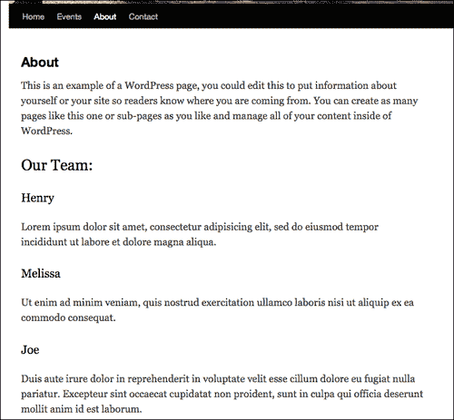

首先，我们将针对特定页面。WordPress 可以向页面输出唯一的 ID 以及大量类名；您必须在 WordPress 主题到浏览器的 HTML 输出上**查看源代码**，并查看主题是否利用了此功能（大多数好的 WordPress 主题都会）。这种能力可以帮助我们只针对我们想要影响的内容。例如，如果我们只想增强我们的**关于**的页面，我们可以查看源代码，看到帖子的唯一 ID 是`#post-104`。这使我们能够通过首先预先设置一个`ul`标题列表，来定位要添加标签的帖子。

一旦我们有了`ul`列表，我们需要将所有内容包装在一个新的可选 div 中，该 div 的 ID 为`#aboutUs`。然后，我们将循环遍历每个`h3`项，创建带有锚链接的单个`li`列表项，并用一个名为`id`div 的锚将下面的`h3`和`p`标记包装起来。

请阅读代码中的粗体注释，以便进行后续操作：

```js
...
//add in a ul list on the About page only, before the first h3
jQuery("#post-104 h3:first").before("<ul></ul>");
//select the ul, the h3's AND the h3's p tags
//and wrap them in a new div
//use the .add() function to make sure everything is selected
jQuery("#post-104 ul").add("#post-104 h3")
.add("#post-104 h3+p").wrapAll("<div id='aboutUs'></div>");
//for EACH h3 item:
jQuery("#post-104 h3").each(function(i){
//add text to the ul list w/ anchor links
var titleTxt = jQuery(this).text();
var htmlTxt = "<li>
<a href='#name-"+i+"'>"+titleTxt+"</a></li>";
jQuery("#post-104 ul").append(htmlTxt);
//wrap each h3 AND p in a div with anchor names
//this time, use .andSelf to make sure everything is selected
jQuery(this).next("p").andSelf()
.wrapAll("<div id='name-"+i+"'></div>");
});
//remove .entry class so list items don't have right quotes
//this is a list style in the default theme
jQuery("#post-104 .entry").removeClass('entry');
//Last, create the tabs widget
jQuery("#post-104 #aboutUs").tabs();
...

```

现在刷新页面将显示以下内容：

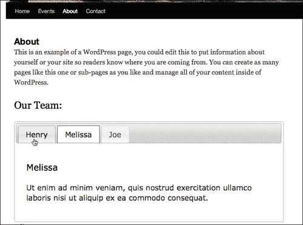

同样，您对 WordPress 主题和 jQuery 了解得越多，您就越有能力决定哪条路线更快或更好，以决定是否操纵主题来帮助您增强 jQuery，或者是否最好只使用纯 jQuery。

## 项目：侧边栏手风琴化

手风琴几乎具有与标签相同的功能。大多数情况下，它们只是垂直的，而不是水平的。与选项卡一样，您希望使用它们将类似的信息“分组”到一个更整洁的空间中，从而允许站点用户以逻辑块的形式接收信息，而不必在站点中漫游或滚动。

在我们一直使用的默认主题中，侧边栏上的页面导航包含一些信息，我们希望人们能够一目了然地看到这些信息，而不是将标题向下推过折叠处，以免错过它们。通过将部分分组到手风琴中，下拉并显示其他信息和链接，我们节省了一些空间，并确保当页面加载时，用户至少可以看到重要的组织标题，并知道他们可能想要扩展和查看更多信息。

手风琴小部件可以很好地处理列表，这就是侧边栏。小部件也是如此，正如您可以从[处的示例代码看出的那样 http://jQueryUI.com/demos/accordion](http://jQueryUI.com/demos/accordion) ，识别并使用标题和段落或`div`标记，以一致的层次顺序设置。您还可以使用各种选项将特定的 DOM 对象设置为标题和导航元素。

我们默认主题的 WordPress 边栏是一个大的`ul`列表，在`div`中。非常适合于手风琴小部件，但由于我们设置了一些自定义 CSS，使页面列表显示得更像导航按钮，因此我们希望针对页面导航列表项下方的列表*中的下两个列表。不用担心，很容易找到并选择以下列表项，并按如下方式对其应用 accordion 小部件：*

```js
...
//select the proper li level and exclude the inner ul lists then wrap in a targetable div
jQuery(".xoxo ul li:gt(10)").not(".xoxo ul li ul li")
.wrapAll('<div id="sideAccordion"></div>');
//select the new target and assign the widget
jQuery('.xoxo').accordion().css({'marginTop':'30px'});
...

```

小部件的默认状态是显示打开的顶部手风琴。客户希望它完全关闭。为了实现这一点，我们将向小部件添加一些参数，包括`active: -1`，它通常用于选择要打开的栏，但通过将其设置为`-1`，它们将全部关闭：

```js
...
jQuery('.xoxo')
//options for the accordion
.accordion({header: 'h2', collapsible: true, active: -1})
.css({'marginTop':'30px'});
//last, some extra styles to the headers and ul lists
//to line them up
jQuery(".xoxo h3")
.css({'padding':'5px 0 5px 25px', 'height':'15px'});
jQuery(".xoxo ul").css({'height': 'auto', 'margin': '0px',
'paddingLeft': '25px', 'paddingTop': '5px',
'paddingBottom': '5px'});
...

```

我们的页面导航下的侧边栏现在以一种很好的样式进行了手风琴化，与页面的选项卡相匹配。

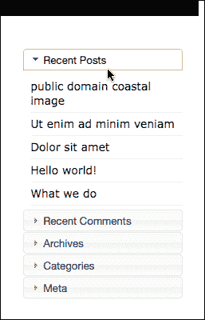

当页面加载时，这些手风琴式标题会关闭，这样网站用户就可以轻松地选择要浏览的标题。

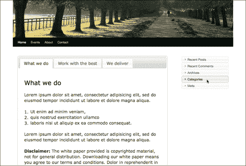

现在让我们继续做我们客户的最后一个增强。

## 项目：在带有图标的下载按钮上添加对话框

对话框是提醒和引导人们注意真正重要信息的好方法，确保他们了解下一步需要采取的步骤，以及确认行动。

我们的客户对主页上的标签信息和压缩的手风琴侧栏非常满意。他们只需要再加强一次。主页上的第一个选项卡提供了白皮书的 PDF 下载，其中包含有关其方法、产品及其各种用途的信息。正如您在下一个屏幕截图中所看到的，客户希望用户理解他们正在下载受版权保护的信息，并且文档不能自由分发。

正如您在下面的屏幕截图中所看到的，他们在 PDF 文件的下载链接之前放置了一些免责声明语言：


总的来说，这就是他们的法律部门所需要的，但他们希望它更清楚一点。我们可以通过使用 button 小部件使下载链接更加突出，并将之前的**免责声明**文本转换为对话框，进一步增强下载过程。然后，用户必须在对话框中选择**我同意**才能继续下载 PDF，客户端可以放心，大多数通过支持 JavaScript 的浏览器下载白皮书的用户肯定知道免责声明。

首先，让我们将**免责声明**文本设置为进入对话框。我们将以段落为目标，应用对话框小部件，如下所示：

```js
...
//select p that contains the disclaimer text
jQuery("#post-98 p:contains(Disclaimer:)")
.wrapAll("<div id='disclaimer'></div>");
//create the disclaimer dialog widget
jQuery("#disclaimer").dialog();
...

```

如果重新加载页面，您将看到对话框中出现**免责声明**文本，如下所示：

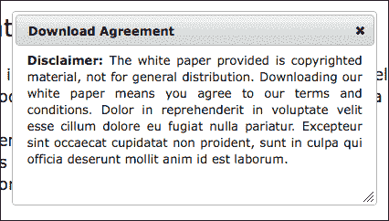

该对话框的默认设置是将文本“居中”对齐。这对于一行文本来说非常好，但是我们的段落看起来有点奇怪，所以我们在`.wrapAll`HTML 中添加了一个样式，如下所示：

```js
...wrapAll("<div id='disclaimer' style='text-align:justify'></div>");...

```

接下来，我们确实不希望对话框立即出现，因此我们将其选项`autoOpen`设置为`false`。我们还希望出现确认按钮，以及 dailog 顶部栏中的标题。对话框小部件还可以容纳按钮，因此我们将添加这些按钮及其功能，如下所示：

```js
...
//create the disclaimer dialog widget
jQuery("#disclaimer").dialog({
//set the dialog to close
autoOpen: false,
//set the title
title: 'Download Agreement',
// set up two buttons
buttons: {
//activates the URL placed in the a href
"I Agree": function() {
//get the URL of the PDF
var pdfFile = jQuery("#post-98 a").attr('href');
//direct the browser to that URL
window.location.href = pdfFile;
},
//close the dialog box
"Close" : function() {
jQuery(this).dialog("close");
}
},
});
...

```

上述方法非常有效，至少我们认为有效。现在对话框的`autoOpen`选项设置为`false`，我们无法判断！我们需要**下载 PDF**链接来启动对话框，同时我们需要确保链接的`href`不会启动 PDF 下载。

如果您已经注意到了，那么您可能已经准备好使用`.removeAttr()`函数从链接中删除`href`属性并使其无效。这是个好主意；但是，在前面的代码片段中，我们引用了链接的`href`属性。该引用直到框出现之后才开始，这将是我们从对象中移除它之后的*，这意味着我们的`window.location.href`JavaScript 将不知道要去哪里。*

我们最好的办法是使用另一个名为`preventDefault()`的强大功能，它将保持链接的所有属性不变，但防止其表现为点击链接。让我们添加此新链接功能：

```js
...
jQuery("#post-98 a")
//set up a click function on the link
.click(function(event){
//open the dialog box
jQuery("#disclaimer").dialog("open");
//ensures that the link to the href is disabled
event.preventDefault();
});
...

```

最后，在刷新页面并浏览之前，让我们继续，让 PDF 下载链接看起来更“可点击”。因为我们使用的是来自 GoogleCDN 的 jQuery 版本 1.4.2 和 jQuery UI 插件的 1.8 版本，所以我们可以通过选择链接并向其中添加按钮小部件来实现这一点。

### 注

如果您没有使用 1.8 版的 UI 插件，则此步骤是可选的。您可以简单地使用 CSS 样式或`.css()`函数根据自己的喜好设置链接样式。

我们将在功能`.click()`之后，简单地**将**小部件功能链接到我们现有的链接选择上*，如下所示：*

```js
...
jQuery("#post-98 a")
//set up a click function on the link
.click(function(event){
//open the dialog box
jQuery("#disclaimer").dialog("open");
//ensures that the link to the href is disabled
event.preventDefault();
})
//add the button widget
.button();
...

```

您可以刷新页面并签出“新建”按钮，如下一个屏幕截图所示：

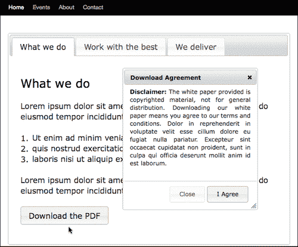

尽管按钮化的链接看起来很棒，但只需再进一步添加几个图标，就可以清楚地知道点击按钮会让人们得到什么，并鼓励他们采取行动。

jQuery UI 插件主题附带大量的**框架图标**。如果您包含了与 jQueryUI 样式表相关的`image`目录，那么您可以访问它们。

按钮小部件允许将图标放置在“主要”和“次要”位置。主位置在按钮的左侧，次位置在任何按钮文本之后的右侧。让我们将“圆形箭头-s”图标和“文档”图标添加到按钮中，如下所示：

```js
...
jQuery("#post-98 a")
//set up a click function on the link
.click(function(event){
//open the dialog box
jQuery("#disclaimer").dialog("open");
//ensures that the link to the href is disabled
event.preventDefault();
})
//add the button widget
.button({
//add the icons
icons: {primary:'ui-icon-circle-arrow-s',
secondary:'ui-icon-document'}
});
...

```

这是我们的“标志性”按钮和对话框，当人们按下按钮时：


### 提示

想知道哪些图标可用于小部件吗？查看主题滚轴：[http://jqueryui.com/themeroller/](http://jqueryui.com/themeroller/) 。在页面底部，您将看到所有框架图标。滚动它们将显示它们的`title`标记信息，其中包含要放在 jQuery 语句中引用它们的名称。


使用此增强功能进行的最后一项测试是，单击**我同意**开始下载，正如您在下面的屏幕截图中所看到的，下载是有效的！

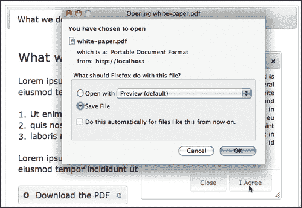

这实际上是一个令人印象深刻的互动添加到一个网站，但在同一时间，它降级和工作刚刚好的方式，它没有 JavaScript。这是 jQuery 和 jQueryUI 插件的一个非常好的使用。

# 总结

这就是我们对 jQueryUI 插件的看法，以及它对 WordPress 站点真正有益的一些方法。有几十个，可能数百个，甚至更多，这取决于你的网站或项目及其需求。

记住，jQuery 在客户端浏览器中运行，WordPress 将完成的 HTML 页面提供给浏览器。这意味着您不仅可以增强 WordPress 内容，还可以通过 jQuery 和 jQueryUI 插件轻松增强大多数 WordPress 插件，如 cforms II，以及大多数边栏小部件。

在本章中，我们了解了：

*   用户界面插件和各种方法，包括它，并开始与它在 WordPress
*   了解如何将 UI 元素应用到我们的 WordPress 站点，使其更直观、更容易理解，并鼓励用户采取行动
*   使用常用 WordPress 功能实现流行 UI 功能的常用方法

现在让我们进入下一章，看看如何使用 jQuery 帮助我们创建 AJAX 交互。